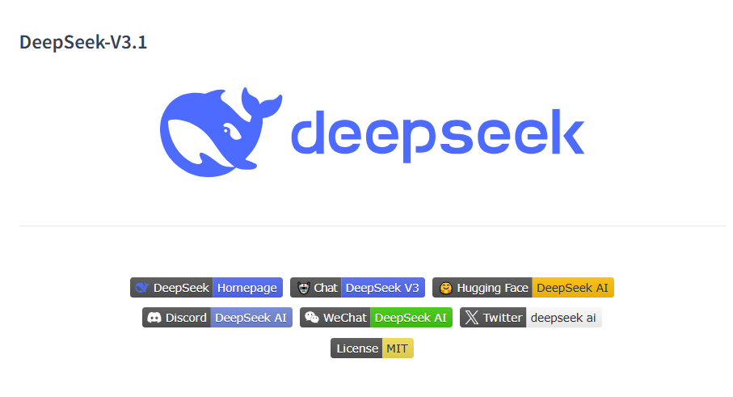
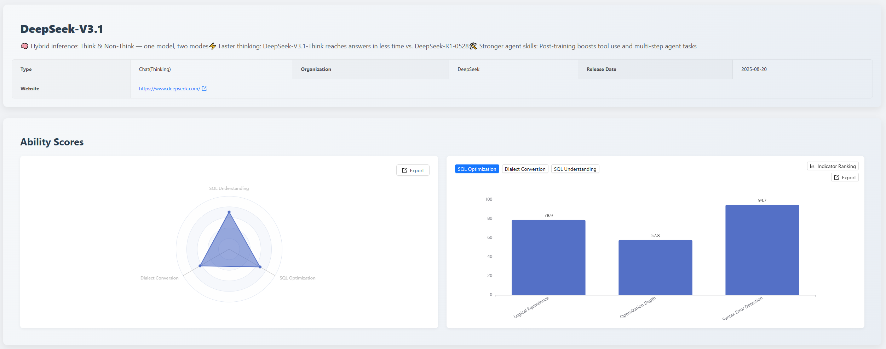
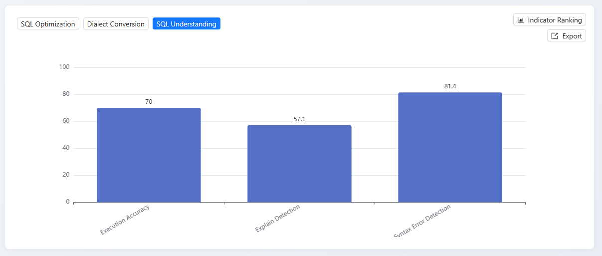
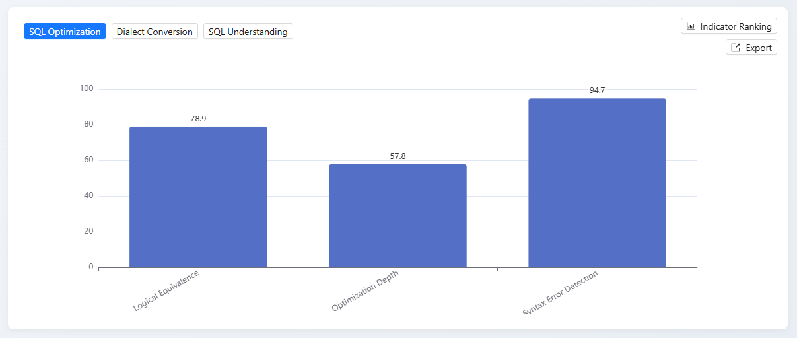
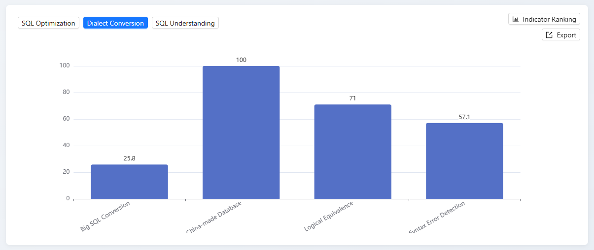

## 1. Executive Summary

In August 2025, following the inclusion of the **GPT-5 family**, the [SCALE](https://sql-llm-leaderboard.com/ranking/2025-08) evaluation benchmark immediately incorporated the latest model released by **DeepSeek** on August 21st - **DeepSeek-V3.1**.

> This report aims to objectively evaluate the model's comprehensive capabilities in professional-level database SQL tasks through our standardized test sets, and reveal its performance in real enterprise scenarios.

Evaluation results show that DeepSeek-V3.1 demonstrates relatively balanced strength across the three aspects of "understanding, optimization, and conversion." It performs relatively prominently in the **SQL Optimization** dimension, scoring **67.3**, providing strong support for scenarios requiring deep code analysis and system maintenance.

## 2. Evaluation Benchmark Description

To ensure longitudinal comparability and result stability of the evaluation, this month's assessment dimensions continue to focus on three core areas: **SQL Understanding**, **SQL Optimization**, and **SQL Dialect Conversion**, ensuring fair and in-depth evaluation of all participating models.

## 3. In-depth Analysis of the New Model

Below is a detailed analysis of DeepSeek-V3.1's first evaluation performance.

### 3.1 SQL Understanding Capability (Overall Score: 70.2)

| Detailed Metric          | Score |
| :----------------------- | :---- |
| Syntax Error Detection   | 81.4  |
| Execution Accuracy       | 70    |
| Execution Plan Detection | 57.1  |

#### 3.1.1 Model Performance Analysis

- **Strengths**: The model performs steadily in "Syntax Error Detection," achieving the highest score, proving it possesses reliable basic code review capabilities.
- **Weaknesses**: Lowest score in "Execution Plan Detection," indicating its understanding of deep SQL performance and execution logic is a短板.

#### 3.1.2 Horizontal Comparison

DeepSeek-V3.1 ranks 12th in this dimension, showing a certain gap compared to first-tier models.

For example, the top-ranked Gemini 2.5 Flash scores 82.3, 12.1 points higher. The core reason lies in execution accuracy capability. This metric essentially reflects the final implementation result of the model's understanding of deep SQL semantics and complex logic. DeepSeek-V3.1 scores only 70 in this metric, significantly lower than Gemini 2.5 Flash's 90, indicating substantial room for improvement in deep semantic parsing and complex logical understanding of SQL.

### 3.2 SQL Optimization Capability (Overall Score: 67.3)

| Detailed Metric        | Score |
| :--------------------- | :---- |
| Syntax Error Detection | 94.7  |
| Logical Equivalence    | 78.9  |
| Optimization Depth     | 57.8  |

#### 3.2.1 Model Performance Analysis

- **Strengths**: Highly reliable.
  The model excels in syntax compliance (94.7 points) and maintains logical consistency before and after optimization relatively well (78.9 points), ensuring the safety and usability of solutions.
- **Weaknesses**: Lack of innovation and depth.
  Its "Optimization Depth" score (57.8 points) is the main weakness, indicating the model tends towards conservative optimization and lacks the ability to generate advanced, complex optimization strategies.

#### 3.2.2 Horizontal Comparison

DeepSeek-V3.1 ranks 9th with 67.3 points, showing a gap compared to specialized tools like [SQLFlash](https://sqlflash.ai/) (88.5 points) and top-tier general models like DeepSeek-R1 (71.6 points).

This gap is mainly reflected in the depth and complexity of optimization strategies. Its "Optimization Depth" score (57.8 points) is not only its own weakness but also far behind top models, revealing the model's capability bottleneck in deep analysis and complex strategy generation. Meanwhile, although its "Logical Equivalence" performance (78.9 points) is good, there is still room for improvement compared to the rigor of top models, indicating a need to strengthen **logical consistency verification**.

### 3.3 SQL Dialect Conversion Capability (Overall Score: 63.2)

| Detailed Metric              | Score |
| :--------------------------- | :---- |
| Domestic Database Conversion | 100   |
| Logical Equivalence          | 71    |
| Syntax Error Detection       | 57.1  |
| Large SQL Conversion         | 25.8  |

#### 3.3.1 Model Performance Analysis

- **Strengths**: Excellent performance in specific knowledge domains and scenario-based applications.

  DeepSeek-V3.1 achieved a perfect score in the "Domestic Database Conversion" task, highlighting its powerful specific domain knowledge base and efficient scenario adaptation capability. It can accurately understand and apply specific, clear rule systems, demonstrating perfect execution in knowledge-intensive professional tasks with clear boundaries.

- **Weaknesses**: Significant shortcomings in handling long contexts and complex logic.

  DeepSeek-V3.1 scored extremely low in the "Large SQL Conversion" item, directly revealing its core weakness in processing ultra-long, complex contexts. When faced with tasks involving lengthy information, complex logical chains, and requiring global understanding and reasoning, the model risks logical omissions or processing failures, which is a key bottleneck in its general capabilities.

#### 3.3.2 Horizontal Comparison

In the SQL Dialect Conversion dimension, DeepSeek-V3.1 ranks 13th with 63.2 points, significantly behind top models like GPT-5 mini (79.6 points) and o4-mini (77.4 points).

The fundamental reason lies in the imbalance of capability distribution: the model performs perfectly in specific scenarios like "Domestic Database Conversion" (100 points), but exposes obvious weaknesses in areas testing more general foundational capabilities. For example, its "Large SQL Conversion" score (25.8 points) is far lower than GPT-5 mini's (58.1 points), reflecting its deficiency in long-context processing; simultaneously, the "Syntax Error Detection" score (57.1 points) also lags significantly behind the precision of top models (92.9 points). This lack of general capability is the main reason for its lower comprehensive ranking.

## 4. Summary and Outlook

The addition of DeepSeek-V3.1 provides us with another important data slice. This evaluation result clearly indicates that current general large models exhibit characteristics of "each having its own strengths and weaknesses" in SQL tasks. For example, DeepSeek-V3.1 performs excellently in handling specific scenarios (Domestic Database Conversion) but has obvious deficiencies in long-text processing (Large SQL Conversion) and deep optimization. This reaffirms our view: **Ranking model capabilities without considering specific scenarios is incomplete.**

## 5. Future Outlook

The SCALE evaluation system will continue to track the latest model developments and iteration progress from major vendors. We are committed to promoting deeper application and practice of large language models in the database field through fair and transparent evaluation data, together with the community.

**Explore the professional capabilities of the new generation of models now!** You are welcome to log in to the official SCALE platform to view the complete latest leaderboard and detailed model comparisons, and jointly grasp the pulse of cutting-edge AI technology.

> View the complete leaderboard and contact us to submit your product for evaluation. [https://sql-llm-leaderboard.com/](https://sql-llm-leaderboard.com/)

**SCALE: Choose the Professional AI Model for Professional SQL Tasks.**
