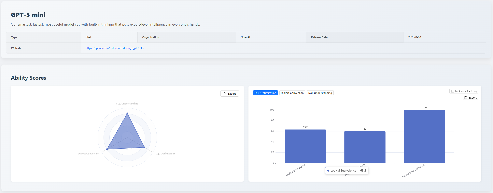
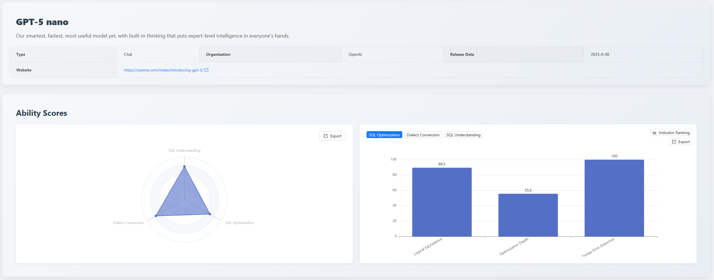
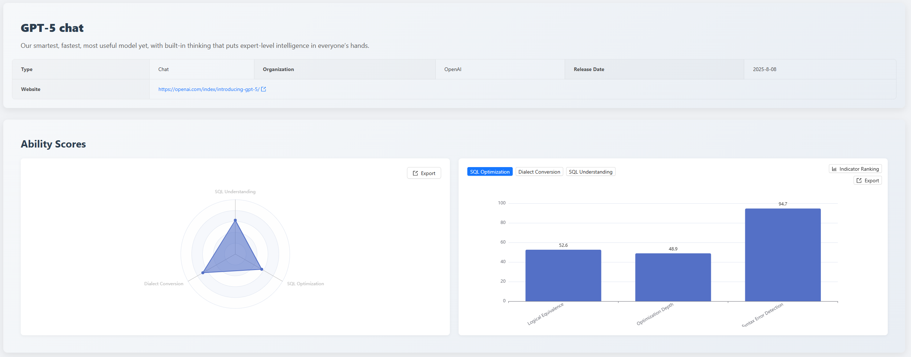

## 1. Executive Summary

August 2025 marks another milestone in AI development history - the official release of the [GPT-5 family](https://chat.chatbot.app/gpt5).

While the entire tech community discusses its leap in general capabilities, the [SCALE](https://github.com/actiontech/sql-llm-benchmark) platform focuses on SQL capabilities: **How does GPT-5 actually perform in SQL processing?**

This edition is a special evaluation report specifically for the **GPT-5** family, aiming to conduct a comprehensive benchmark test of its SQL-related capabilities.

**Key Highlights of This Edition**

- **Flagship Model Performance Analysis**: Evaluation results for **gpt-5-chat** reveal specific weaknesses, while the **mini** version demonstrates more balanced comprehensive performance in this test.
- **Comprehensive Capability Assessment**: Through multi-dimensional, multi-metric use case evaluations, we analyze the actual performance of **GPT-5** in different scenarios, revealing the gap between its theoretical capabilities and practical applications.
- **Data-Driven Model Selection**: Evaluation data indicates that different model versions have distinct strengths in handling **SQL capabilities**. This report will discuss scenario-based selection based on data.

## 2. Evaluation Benchmark Description

To ensure the fairness and depth of this special evaluation, we continue to use the mature three-dimensional evaluation system.

- **SQL Understanding**: Examines whether the model accurately parses complex query logic and user intent.
- **SQL Optimization**: Examines the model's awareness of improving query efficiency and performance.
- **Dialect Conversion**: Examines the model's ability to perform syntax migration between mainstream databases.

Next, we will reveal the detailed results of this evaluation.

## 3. Monthly Leaderboard and Focus Analysis

The evaluation results of the **GPT-5** family in the SQL domain do not show a simple performance gradient; different versions exhibit significant capability divergence, highlighting the importance of scenario-based selection.

### 3.1 gpt-5-mini: Balanced Comprehensive Capabilities

**gpt-5-mini** leads in comprehensive performance in this evaluation, demonstrating balanced and outstanding capabilities across all three dimensions.

#### 3.1.1 Performance Scores by Dimension

| Capability         | Score | Detailed Breakdown                                                                                                            |
| :----------------- | :---- | :---------------------------------------------------------------------------------------------------------------------------- |
| SQL Understanding  | 80.8  | Execution Accuracy: 87.1  Execution Plan Detection: 57.1  Syntax Error Detection: 74.3                                  |
| Dialect Conversion | 75.6  | Large SQL Conversion: 54.8  China made Database: 92.1  Logical Equivalence: 74.2   Syntax Error Detection: 85.7   |
| SQL Optimization   | 68.4  | Logical Equivalence: 63.2  Optimization Depth: 64.4  Syntax Error Detection: 94.7                                       |

#### 3.1.2 Strengths and Weaknesses

- **Strengths**: High execution accuracy and strong reliability; excels in advanced, complex optimization tasks.
- **Weaknesses**: Conventional optimization capability is not top-tier; limited ability when handling large, complex SQL conversions.

#### 3.1.3 Comprehensive Evaluation

- Overall, **gpt-5-mini** shows balanced performance in accuracy, reliability, and complex task handling, making it suitable for enterprise-level applications pursuing stable output and comprehensive performance.
- In horizontal comparison, **gpt-5-mini** ranks 3rd in the **SQL Understanding dimension** and within the top 5 in the **Dialect Conversion** dimension, placing its comprehensive strength among the top performers.

### 3.2 gpt-5-nano: High-Precision Code Generator

**gpt-5-nano** demonstrates solid and balanced capabilities, with very close scores across the three dimensions.

#### 3.2.1 Performance Scores by Dimension

| Capability         | Score | Detailed Breakdown                                                                                                        |
| :----------------- | :---- | :------------------------------------------------------------------------------------------------------------------------ |
| SQL Understanding  | 77.1  | Execution Accuracy: 85.7  Execution Plan Detection: 35.7  Syntax Error Detection: 75.7                              |
| Dialect Conversion | 66.4  | Large SQL Conversion: 19.4  China made Database: 100  Logical Equivalence: 80.6  Syntax Error Detection: 69   |
| SQL Optimization   | 68.7  | Logical Equivalence: 89.5  Optimization Depth: 55.6  Syntax Error Detection: 100                                    |

#### 3.2.2 Strengths and Weaknesses

- **Strengths**: Extremely high syntactic correctness of generated SQL, reliable results; solid logical conversion capability.
- **Weaknesses**: Lacks deep understanding of SQL execution efficiency; struggles with complex, lengthy query migrations.

#### 3.2.3 Comprehensive Evaluation

- **gpt-5-nano is an excellent "SQL code generator"**, suitable for embedding into automated workflows to handle standardized "**Text-to-SQL**" and simple dialect conversion tasks. However, it is not suited for scenarios requiring deep optimization and understanding of complex queries.
- In horizontal comparison in this evaluation, **gpt-5-nano** entered the top five of the leaderboard based on its SQL optimization capability, but did not show significant advantages in other dimensions.

### 3.3 gpt-5-chat: Divergent Capability Characteristics

The comprehensive performance of **gpt-5-chat** is below expectations, showing significant "specialization" in its capabilities.

#### 3.3.1 Performance Scores by Dimension

| Capability         | Score | Detailed Breakdown                                                                                                           |
| :----------------- | :---- | :--------------------------------------------------------------------------------------------------------------------------- |
| SQL Understanding  | 62.3  | Execution Accuracy: 57.1  Execution Plan Detection: 60.7  Syntax Error Detection: 84.3                                 |
| Dialect Conversion | 55.4  | Large SQL Conversion: 3.2  China made Database: 86.8  Logical Equivalence: 71.0   Syntax Error Detection: 66.7   |
| SQL Optimization   | 56.0  | Logical Equivalence: 52.6  Optimization Depth: 48.9  Syntax Error Detection: 94.7                                      |

#### 3.3.2 Strengths and Weaknesses

- **Strengths**: Profound theoretical understanding of complex optimization strategies and logical reasoning.
- **Weaknesses**: Worrisome accuracy in basic execution, generated SQL has a high probability of errors; incapable of handling complex, large query migrations.

#### 3.3.3 Comprehensive Evaluation

- **gpt-5-chat** excels in advanced theoretical knowledge but has deficiencies in the accuracy of basic execution. This capability divergence indicates that model evaluation should not rely solely on general capabilities but requires professional, segmented scenario evaluations to determine suitability in specific domains.
- Horizontally, **gpt-5-chat** did not rank at the top in any dimension leaderboard, positioning it at a mid-level overall.

## 4. Summary

This special evaluation clearly demonstrates that the release of **GPT-5** is not just a numerical improvement but brings profound changes in the **specialization** and **scenario-specific application** of AI in the SQL field.

- **Scenario Defines the Model**: Evaluation results indicate that when selecting models, enterprises should focus more on specific application scenarios (complex analysis, data migration, etc.) rather than relying solely on the model's "reputation" or general capability rankings. The success of **gpt-5-mini** is the best embodiment of "scenario defines value."

- **Specialization Trend**: The absolute advantage of https://sqlflash.ai/ in the optimization domain, combined with the internal capability divergence within the **GPT-5 family**, jointly reveals the future trend of AI development - general-purpose large models and domain-specific models will coexist and complement each other in the long term.

> View the complete leaderboard and contact us to submit your product for evaluation. [https://sql-llm-leaderboard.com/](https://sql-llm-leaderboard.com/)

**SCALE: Choose the Professional AI Model for Professional SQL Tasks.**
