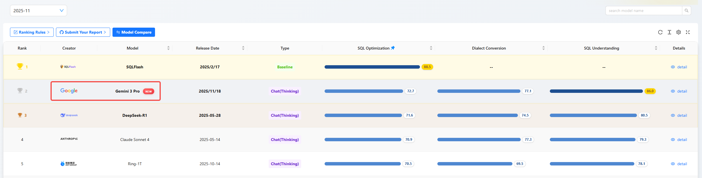
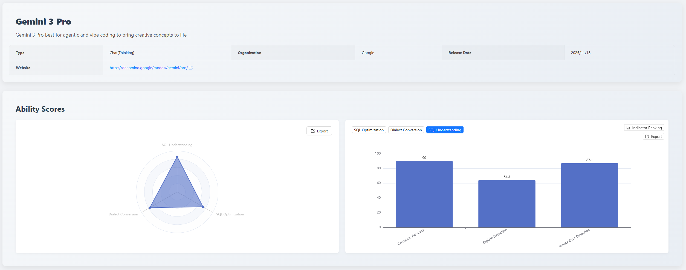
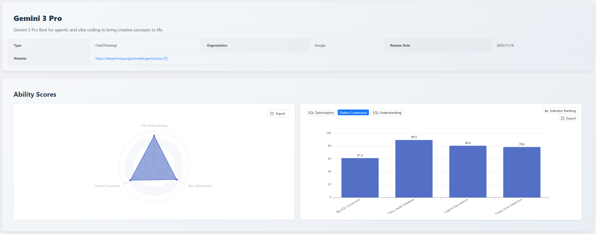

## 1. Executive Summary

The Gemini 3 Pro model was included in this month's  [SCALE](https://sql-llm-leaderboard.com/ ) evaluation for the first time, and its performance fully validates its strength as a new-generation professional-grade large language model. Evaluation results show that Gemini 3 Pro achieved significant breakthroughs in the **SQL Understanding** dimension, ranking first on the leaderboard, while also demonstrating highly balanced and robust comprehensive performance in SQL optimization and dialect conversion dimensions.

Among current mainstream models, **Gemini 3 Pro ranks among the top in comprehensive SQL capability evaluation.**

**Key Highlights:**

- **SQL Understanding: No.1**
    
    High execution accuracy, excellent performance in complex query result prediction, achieving the highest historical score in this dimension.
    
- **SQL Optimization: No.2**
    
    Perfect syntax correctness rate for optimized SQL, providing "out-of-the-box" quality assurance for generated optimized code in production environments.
    
- **Dialect Conversion: No.6**
    
    High score in large SQL conversion, indicating strong global logical comprehension capability when handling scripts containing complex control flow and ultra-long contexts.

## 2. Evaluation Purpose and Methodology

We continue to use the three core dimensions and unified evaluation dataset maintained since the inception of the SCALE framework, ensuring all data is evaluated under equally strict standards to guarantee fairness and reproducibility of results:

- SQL Optimization: Examines the model's awareness and capability to improve query efficiency and performance.
- Dialect Conversion: Examines the accuracy of the model's syntax migration between mainstream databases.
- SQL Understanding: Examines the model's ability to accurately parse complex query logic and user intent.

All newly added models this month are evaluated under this standard system.

## 3. Evaluation Results Display and In-depth Analysis

Gemini 3 Pro's comprehensive performance across the three dimensions exhibits characteristics of "**understanding first, comprehensive balance**", particularly setting new industry benchmarks in deep parsing of SQL code.

### 3.1 SQL Understanding Capability

Dimension Total Score: 86.0 (No.1)

- Execution Accuracy: 90 (Tied for No.1)
- Execution Plan Detection: 64.3 (Tied for No.1)
- Syntax Error Detection: 87.1 (Tied for No.1)

- **Execution Accuracy**: Core strength. This score indicates the model can precisely understand complex query semantics and accurately predict query results, confirming its high reliability in data query and report generation scenarios.
- **Execution Plan Detection**: Room for improvement. While possessing basic execution logic analysis capabilities, the model's deep understanding and predictive ability of underlying database execution mechanisms and indexing strategies still need strengthening relative to its top-tier accuracy score.
- **Syntax Error Detection**: Excellent performance. The model can effectively identify normative errors and syntax defects in SQL code, suitable for improving efficiency and quality in code review processes.

Gemini 3 Pro's performance in the **SQL Understanding** dimension reflects its deep parsing capability of code logic. The execution accuracy score confirms the model's high reliability in complex data analysis and production environment troubleshooting scenarios.

It also ranks No.1 in both syntax error detection and execution plan detection, demonstrating outstanding comprehensive capabilities. However, two common error patterns were identified in execution plan prediction evaluations:

1. Insufficient adherence to structured output format specifications: Incorrectly outputting JSON's `null` value as the string `"NULL"`, confusing the SQL semantic NULL with JSON data type specifications;
2. Insufficient understanding of execution plan semantics for database write operations: Failed to recognize the MySQL optimizer's behavior of using primary key indexes for row positioning in write operations, judging access methods solely based on columns in WHERE conditions. This led to misclassifying UPDATE operations that should use index scans as full table scans (`type: "ALL"`), reflecting deficiencies in adhering to structured data output specifications and understanding database execution engine behaviors.

### 3.2 SQL Optimization Capability

Dimension Total Score: 72.7 (No.2)

- Logical Equivalence: 73.7 (No.11)
- Optimization Depth: 66.7 (Tied for No.2)
- Syntax Error Detection: 100 (Tied for No.1)

- **Logical Equivalence**: Reliable performance. The model effectively ensures logical consistency between reconstructed SQL and original queries during optimization, serving as the foundation for guaranteeing correct business results.
- **Optimization Depth**: Steady performance. The model can apply conventional optimization rules (such as subquery flattening, JOIN order adjustment, etc.), possessing significant performance improvement potential. There's still room for enhancement in extremely complex optimization tasks requiring deep restructuring.
- **Syntax Error Detection**: Top-tier performance! This is a key indicator for ensuring code quality, meaning the optimized SQL generated by the model contains no syntax errors and can be safely deployed in testing environments for performance validation.

**Gemini 3 Pro's SQL Optimization capability ranks second on the leaderboard.**

Its biggest highlight is its perfect syntax error detection score, providing production-level quality assurance for generated optimized code. Meanwhile, the 66.7 optimization depth score, while possessing leading advantages among current mainstream models, still has room for improvement.

In SQL optimization depth task evaluations, the model can较好地 identify and apply basic optimization rules (such as predicate pushdown, projection pushdown, HAVING condition pushdown), but shows obvious deficiencies in optimization scenarios requiring deep semantic understanding and pattern recognition: failed to recognize that LIKE prefix queries can be rewritten as range queries to leverage index ordering; failed to identify that redundant ORDER BY in subqueries without LIMIT can be eliminated; failed to detect implicit type conversion issues in DATE field comparisons with strings.

These defects reflect the model's shortcomings in pattern recognition capability (such as recognizing LIKE prefix patterns, identifying implicit type conversion patterns) and fine-grained semantic analysis capability (such as distinguishing semantic differences of ORDER BY in subqueries with and without LIMIT). The model is better at applying structured rules but performs weaker in scenarios requiring deep understanding of database optimizer behaviors.

**Additionally, its logical equivalence ranking remains within the reliable range, making it a trustworthy tool for database administrators (DBAs) and senior developers to improve the quality and performance of existing code.**

### 3.3 Dialect Conversion Capability

Dimension Total Score: 77.1 (No.6)
- China-made Database Conversion: 89.5 (Tied for No.16)
- Logical Equivalence: 80.6 (Tied for No.2)
- Large SQL Conversion: 61.3 (Tied for No.2)
- Syntax Error Detection: 78.6 (Tied for No.8)

- **China-made Database Conversion**: Core value. The model shows good adaptability to key migration paths like Oracle to OceanBase and other china made databases, with high conversion accuracy, particularly suitable for domestic enterprises' IT innovation replacement scenarios, possessing commercial value.
- **Logical Equivalence**: Excellent performance. In cross-dialect conversion, the model effectively maintains the business logic and semantic consistency of code, helping reduce potential risks in migration projects.
- **Large SQL Conversion**: Key challenge. When handling "large SQL" with hundreds of lines containing complex stored procedures, cursors, or exception handling logic, conversion difficulty increases significantly. The model's precise grasp of ultra-long contexts and control flow needs further improvement.
- **Syntax Error Detection**: Steady. The converted code shows good standardization, but given subtle syntax differences between different target databases, manual review is still recommended.

The total score (77.1) indicates this model is a reliable dialect conversion assistant tool. Its outstanding performance in logical equivalence and large SQL conversion demonstrates leading advantages in global logical comprehension of complex code.

However, its ranking in china made database conversion is relatively low. In conversion evaluations, when handling Oracle's `CAST ({ expr | MULTISET (subquery) } AS type_name )` syntax, the model assumed that the target OceanBase (Oracle mode) does not support the `MULTISET` operator, incorrectly replacing it with the `COLLECT` aggregate function. However, the opposite is true: OceanBase (Oracle mode) supports `MULTISET` but does not support `COLLECT`, reflecting that the model tends toward mechanical conversion rather than semantic equivalence judgment based on target environment characteristics for china made databases, lacking knowledge about china made databases.

## 5. Summary

The Gemini 3 Pro model has established its leading position in the professional SQL processing field in this evaluation, with its capability distribution showing significant characteristics of "deep understanding, high-quality optimization, balanced conversion".

- **Deep Understanding**: With its execution accuracy, the model demonstrates industry-leading reliability in understanding complex query logic and predicting execution results, making it the preferred model for SQL review logical verification.

- **High-Quality Optimization**: The syntactic correctness of optimized SQL is its core competitive advantage, ensuring production-level usability of optimized code. Meanwhile, the 66.7 optimization depth score indicates its ability to transform performance potential into actual efficiency.

- **Balanced Conversion**: In the dialect conversion dimension, the model's excellent performance in large SQL conversion and logical equivalence sub-items proves its strong capability in handling long complex scripts and maintaining cross-platform logical fidelity. This makes it a reliable assistant in database migration projects, especially those involving complex business logic conversion.

Overall, Gemini 3 Pro can not only "write" correct SQL but also "understand" its execution mechanisms and "optimize" its performance, making it an **ideal AI assistant for enterprise-level database tasks requiring high reliability.**

### Application Recommendations

- **Data Analysis & Engineering**: Prioritize using Gemini 3 Pro for logical verification of complex queries and accuracy prediction of results to ensure reliability of data insights.

- **Database Administration & Development**: Trust its SQL optimization capability to safely and quickly standardize and perform preliminary performance tuning on existing SQL.

- **Enterprise Technical Decision-Making**: Consider Gemini 3 Pro as an important auxiliary tool when planning database migration to improve project efficiency and reduce labor costs.

## 6. Future Outlook

The SCALE evaluation framework will continue to track the iterative progress of cutting-edge models like Gemini 3 Pro. We look forward to seeing breakthroughs in the next stage of models in high-difficulty dimensions closer to actual production environments, such as "execution plan detection" and "large SQL conversion". We are committed to promoting deeper application and practice of large language models in the database field through fair and transparent evaluation data, together with the community.

**Explore the professional capabilities of the new generation of models now!** You are welcome to log in to the official SCALE platform to view the complete latest leaderboard and detailed model comparisons, and jointly grasp the pulse of cutting-edge AI technology.

> View the complete leaderboard and contact us to submit your product for evaluation. *https://sql-llm-leaderboard.com/*

**SCALE: Choose the Professional AI Model for Professional SQL Tasks.**
