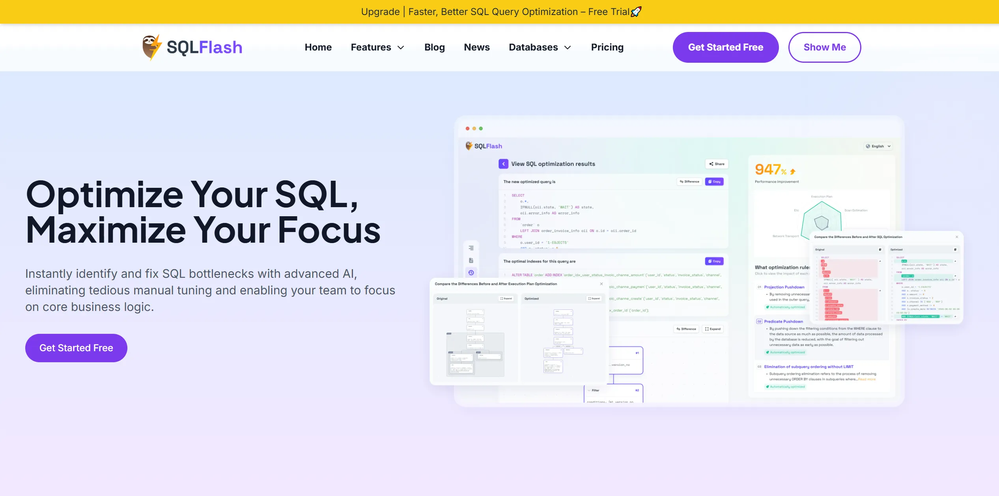
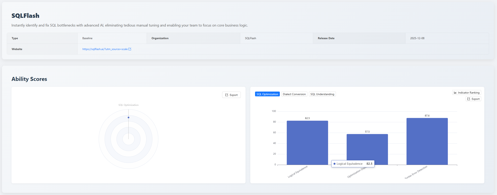

## 1. Executive Summary

This [SCALE](https://sql-llm-leaderboard.com/) evaluation focuses on the professional AI application [SQLFlash](https://sqlflash.ai/). **The evaluation dataset difficulty has been upgraded** to reflect the robustness of models or professional applications when handling **near production-level** problematic SQL tuning.

**Core Conclusion**: Facing new challenges, although various metrics of SQLFlash show fluctuations, it still demonstrates its professional capability as a specialized tuning tool. Particularly, **Syntax and Best Practices Compliance** maintains a high score (**87.6**), ensuring high usability of the output SQL.

| Core Metric | Score | Professional Value System |
| :--- | :--- | :--- |
| **Syntax and Best Practices Compliance** | 87.6 | Even with high-complexity SQL input, it ensures **standardization and high syntax accuracy** of output SQL, which is crucial for engineering reliability. |
| **Logical Equivalence** | 82.5 | Ensures optimized SQL maintains **business semantic consistency**. Maintains high logical fidelity even when facing complex refactoring. |
| **Optimization Depth** | 57.5 | Quantifies application effectiveness of complex optimization strategies - whether rewritten SQL follows expected tuning strategies, reflecting performance improvement of problematic SQL after optimization. |

## 2. Evaluation Description

### 2.1 Evaluation Background and Purpose

This evaluation aims to test whether SQLFlash possesses the performance optimization awareness of database experts (DBAs) when facing **performance tuning challenges in real production environments**, and whether it can rewrite **better-performing** versions while ensuring **logical equivalence and syntactic correctness**.

### 2.2 Evaluation Methodology and Dimension Focus

This evaluation follows the SCALE framework, focusing only on the **SQL Optimization Capability Evaluation** dimension. Assessment methods cover: **syntactic correctness, logical equivalence, optimization depth**.

### 2.3 Evaluation Dataset Upgrade

To more deeply simulate production environment challenges, this specialized evaluation uses an **upgraded SQL optimization dataset**.
- **Dataset Upgrade Impact**: The new dataset's complexity and volume have significantly increased, with **SQL statements being more complex and closer to production-level**, incorporating syntax features from multiple databases. This more realistically reflects capability boundaries when handling actual production complex scenarios.
- **Full Disclosure**: **Complete details, construction methodology, and key cases** of this evaluation dataset will be **officially released in this month's SCALE evaluation leaderboard release**.

## 3. SQLFlash In-depth Evaluation Report

### 3.1 High-Complexity Reliability Benchmark
SQLFlash achieved **87.6** points in the **Syntax Error Detection** metric.
- **Data Interpretation**: The 87.6 score proves SQLFlash's output optimized SQL maintains high reliability in syntactic structure and standardization under high-complexity SQL input.
- **Professional Value**: In AI-generated code, high-standard syntax compliance is the primary prerequisite for engineering deployment. This data strongly evidences SQLFlash's capability to **assist developers in code standardization validation**.

### 3.2 Key Metric for Semantic Consistency
The model achieved **82.5** points in the **Logical Equivalence** metric.
- **Data Interpretation**: Logical equivalence is a **mandatory constraint** for SQL code refactoring and optimization. The 82.5 score proves SQLFlash can accurately understand and maintain original SQL's business semantics in most test scenarios, avoiding business logic errors from performance optimization.
- **Professional Value**: This reflects SQLFlash's strict maintenance of **data integrity and business logic consistency** while achieving performance optimization.

### 3.3 Severe Challenges from New Dataset
SQLFlash's latest score in **Optimization Depth** is **57.5** points.
- **Data Interpretation**: This metric reflects the significant challenge production-level complex SQL poses to SQLFlash's optimization strategies. When facing performance bottlenecks in highly business-specific SQL with complex execution plans and index structures, SQLFlash achieves about 60% coverage of industry-consensus tuning strategies, leaving room for future improvement.
- **Professional Value**: This provides clear targets for model iteration - improving deep optimization capabilities in production-level complex query scenarios is key for next-stage enterprise system performance empowerment.

## 4. Advantage Analysis
Through evaluation report analysis, SQLFlash demonstrates relatively comprehensive coverage of industry-consensus SQL optimization strategies, with clear analysis of problematic SQL column lineage and dependencies. SQLFlash can stably produce high-hit-rate, low-overhead rewrites in complex business scenarios like multi-source `JOIN`, window/aggregation, label permissions, and inventory chains, providing directly reusable paradigms for future rule expansion and automated judgment.

### 4.1 Multi-Rule Collaborative Application
In manual reading scenarios (aggregation + multi-table joins), it simultaneously implements projection pruning, predicate pushdown, useless sorting removal, and time condition explicitization - four strategies applied at once, significantly reducing intermediate table size and avoiding implicit time conversion risks.

### 4.2 Efficient Pruning for Large Tables with Multiple JOINs
In vehicle inventory/sales chain queries, it first pushes main table filters down to derived tables, then prunes subqueries to retain only necessary fields, reducing data volume for subsequent dozens of JOINs, demonstrating replicable optimization paths in wide-table scenarios.

### 4.3 Semi-Join and Branch Merge Reduction
In label filtering and permission verification combinations, it uses `EXISTS` to replace non-output `JOIN`, and merges mutually exclusive branches into `OR`, avoiding repeated scans of `document_template` and `user`, reducing I/O and temporary table materialization costs.

### 4.4 OR Decomposition for Single-Column Index Utilization
In document retrieval, it splits `OR` conditions for pdfKey/fileKey into `UNION`, enabling both single-column indexes, balancing readability and execution efficiency.

Window/Group Scenario Projection and Pre-filtering: In medical diagnosis and log analysis scenarios, it applies date filtering first, then removes unused columns before window/aggregation, reducing input scale for sorting and aggregation.

### 4.5 Redundant Operation Elimination in Complex Business Flows
In workflow/approval flow queries, it prunes `SELECT` to minimal projection, pre-filters status, and removes unnecessary `GROUP BY` inside `EXISTS`, reducing sorting/aggregation overhead while maintaining semantic equivalence.

## 5. Challenges and Future Improvement Directions
Recommend incorporating long SQL examples from this evaluation into regression and rule unit tests to ensure rewrite strategies are reusable and verifiable under real loads.

### 5.1 Insufficient Time Condition Format and Predicate Order Optimization
In production queries containing `P.WORK_DATE = DATE '2025-08-04'` and `P.DEL_FLAG = 0`, SQLFlash made no rewrites. The expected rule was to place high-selectivity condition `P.DEL_FLAG = 0` first, date condition in the middle, and complex subqueries last, utilizing short-circuit evaluation to reduce invalid computation (expected 6%-35% performance improvement). However, the rewrite didn't adjust `WHERE` clause order or explicitly format time conditions to avoid implicit conversion, indicating "predicate priority rearrangement" and "time implicit conversion elimination" rules need more proactive triggering.

### 5.2 Insufficient Function Wrapping and Implicit Conversion Recognition
In queries using `CONCAT("id_", student_id)` on filter keys or integer/string mixing (e.g., `BETWEEN 192 AND 171` comparing string columns), rewrites didn't remove function wrapping or supplement type-consistent explicit conditions, indicating "implicit conversion avoidance" and "function unwrapping for index usage" need stronger detection and automatic rewriting.

## 6. Application Recommendations and Summary Outlook
1. **Automated Quality Gate**: Recommend integrating https://sqlflash.ai/ into CI/CD pipelines or pre-commit hooks as an automated quality gate for database code quality, enabling performance baseline scanning and mandatory standardization checks for new or modified SQL.
2. **Reliability Assurance**: Due to its maintained high scores in syntax and logic, it can assist DBAs in medium-complexity tuning tasks.

**Experience SQLFlash's professional tuning capabilities immediately, and look forward to our next-phase deep optimization iterations targeting the new dataset. Follow the SCALE official platform for more LLM professional capability evaluation data.**

*Data cutoff date: December 16, 2025*

> View the complete leaderboard and contact us to submit your product for evaluation. [https://sql-llm-leaderboard.com/](https://sql-llm-leaderboard.com/)

**SCALE: Choose the Professional AI Model for Professional SQL Tasks.**
