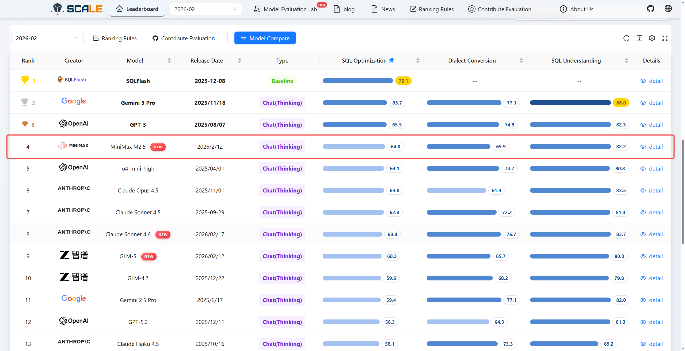
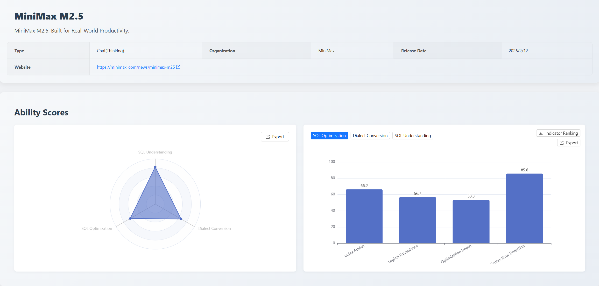
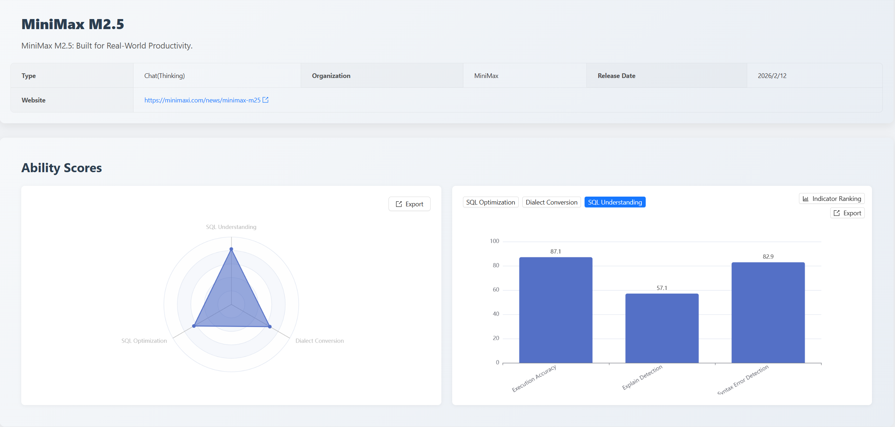
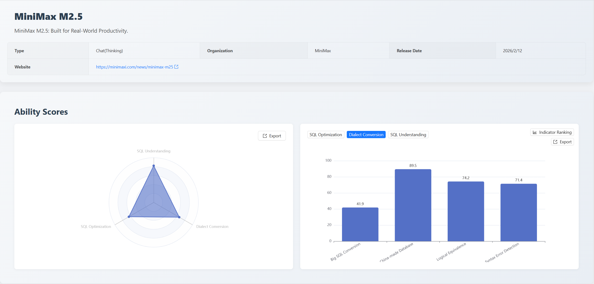

## 1. Evaluation Summary & Key Takeaways

On February 12, 2026, [MiniMax M2.5](https://www.minimax.io/models/text) was officially released. [SCALE](https://sql-llm-leaderboard.com/) immediately evaluated the model—marking the first time a MiniMax-series model appeared on the SCALE leaderboard. The goal was to systematically assess its SQL capabilities in enterprise-grade database scenarios and provide actionable insights for developers and technical decision-makers.

**Precise Understanding, Robust Optimization, Leading Domestic Performance**  
MiniMax M2.5 demonstrates solid foundational understanding of SQL semantics and syntax, achieving industry-leading results particularly in execution accuracy and syntax error correction. In SQL optimization, it ranked **2nd** in “Optimization Depth,” highlighting strong potential. Notably, its performance in converting between domestic Chinese database dialects stands out, offering a compelling solution for enterprises undergoing “Xinchuang” (China’s tech self-reliance initiative) migrations. As a well-balanced model, MiniMax M2.5 delivers consistent performance across most core competencies, making it highly practical for real-world use.

Under SCALE’s three core evaluation dimensions, MiniMax M2.5 ranks among the top performers among mainstream models. According to SCALE’s standardized scoring system:

- **SQL Optimization**: **64.0** (Rank #4)
- **SQL Understanding**: **82.2** (Rank #5)
- **Dialect Conversion**: **65.9** (Rank #11)

---

## 2. Detailed Model Performance & Insights

### SQL Understanding: High Scores, Exceptional Comprehension

The model scored **82.2** in SQL Understanding—reflecting excellent overall performance.

| Evaluation Metric        | Score | Rank        |
| ------------------------ | ----- | ----------- |
| Execution Accuracy       | 87.1  | Tied for #2 |
| Execution Plan Reasoning | 57.1  | Tied for #4 |
| Syntax Error Detection   | 82.9  | Tied for #6 |

**Strengths**  
MiniMax M2.5 excels in two critical sub-metrics:

- **Execution Accuracy (87.1)**: Tested across three difficulty tiers—from basic DML to complex scenarios involving multi-table joins, correlated subqueries, `EXISTS/IN` nesting, and cross-table `UPDATE/DELETE`. The model must mentally “execute” the query and precisely reconstruct column names, data types, and row order.
- **Syntax Error Detection (82.9)**: Evaluated on highly deceptive edge cases, including CTE misuse, transaction control errors, `CREATE VIEW` issues, incorrect `HAVING` clause placement, and missing parentheses.

The model shows deep semantic understanding—it accurately predicts aggregation results, filter logic, and join outcomes, while reliably catching subtle syntactic pitfalls. This indicates strong professional-grade competence in both SQL semantics and grammar.

**Areas for Improvement**  
In **Execution Plan Reasoning**, it scored **57.1**. Specific weaknesses include:

- Misinterpreting `EXPLAIN` output formats for `INSERT/REPLACE` statements (e.g., non-standard values in the `type` field).
- Confusing actual row match ratios with optimizer statistical estimates in `filtered` values.

These issues stem from gaps in understanding low-level database engine mechanics—suggesting room for improvement in internal execution model fidelity.

---

### SQL Optimization: Strong Error Correction, Industry-Leading Optimization Depth

The model scored **64.0** in SQL Optimization, delivering standout results across multiple metrics.

| Evaluation Metric      | Score | Rank         |
| ---------------------- | ----- | ------------ |
| Logical Equivalence    | 56.7  | Tied for #10 |
| Optimization Depth     | 53.3  | Tied for #2  |
| Syntax Error Detection | 85.6  | Tied for #5  |
| Index Recommendation   | 66.2  | Tied for #6  |

**Strengths**  
Evaluated across MySQL, Oracle, PostgreSQL, and more—with queries ranging from beginner to expert level—the test suite included advanced optimization patterns like:

- Predicate pushdown
- Projection pushdown
- `LIKE` prefix rewriting
- `HAVING` clause pushdown
- Subquery-to-window-function conversion
- Outer join elimination
- `UNION` simplification

Real-world examples came from finance and healthcare systems. For index recommendations, models had to interpret real `EXPLAIN` outputs and column selectivity stats.

MiniMax M2.5 shined:

- **85.6** in syntax error detection
- **53.3** in optimization depth (#2 overall)
- **66.2** in index suggestions

This reflects a solid grasp of SQL optimization theory, broad dialect compatibility, and strong engineering judgment in query rewriting and plan analysis.

**Areas for Improvement**  
In **Logical Equivalence (56.7)**, occasional semantic drift occurred during rewrites:

- Over-simplifying `LIKE` patterns (e.g., `'Dr. %'` → `'Dr.%'`, losing a critical space)
- Incorrectly adding join columns in Oracle rewrites, unintentionally narrowing join scope

These suggest the model sometimes over-optimizes or misjudges equivalence boundaries in complex transformations.

---

### Dialect Conversion: Outstanding Support for Domestic Chinese Databases

The model scored **65.9** in Dialect Conversion, with a clear competitive edge in China-specific scenarios.

| Evaluation Metric         | Score | Rank        |
| ------------------------- | ----- | ----------- |
| Large SQL Conversion      | 41.9  | Tied for #9 |
| Domestic Database Support | 88.5  | Tied for #5 |
| Logical Equivalence       | 74.2  | Tied for #5 |
| Syntax Error Detection    | 71.4  | Tied for #8 |

**Strengths**  
The test suite covered everything from simple DDL to enterprise-grade stored procedures, including:

- Cursor loops
- Dynamic SQL
- Exception handling
- Hierarchical queries (`CONNECT BY`)
- Autonomous transactions (`PRAGMA AUTONOMOUS_TRANSACTION`)
- Materialized views
- Package bodies
- `PIVOT` operations
- Advanced window functions

Crucially, the “Domestic Database” track required deep knowledge of Chinese DBMS quirks (e.g., OceanBase, GaussDB).

MiniMax M2.5 delivered:

- **88.5** in domestic dialect conversion
- **74.2** in logical equivalence
- **71.4** in syntax correctness

This makes it a powerful tool for organizations migrating legacy systems to homegrown databases under China’s Xinchuang policy.

**Areas for Improvement**  
In **Large SQL Conversion (41.9)**, challenges emerged with complex procedural logic:

- Misinterpreting `SYSDATE` usage nuances in OceanBase
- Overlooking PL/pgSQL restrictions on transaction control inside exception-handling functions
- Errors in `GET DIAGNOSTICS` accumulation logic and `RECORD` field access syntax

These reflect gaps in fine-grained procedural language semantics—especially when converting very long, multi-block scripts.

---

## 3. Practical Recommendations & Value Proposition

Based on this analysis, we offer the following guidance:

### **Developer Assistance & SQL Debugging**

**Recommendation**: ⭐⭐⭐⭐  
With top-tier performance in syntax validation and execution simulation, MiniMax M2.5 is ideal for integration into IDEs or CI pipelines—providing real-time, high-confidence SQL linting and semantic verification.

### **Migration to Domestic Chinese Databases**

**Recommendation**: ⭐⭐⭐  
Its **88.5** score in domestic dialect conversion is a key differentiator. For teams migrating to OceanBase, GaussDB, or similar platforms, this model can significantly reduce effort and risk. _Note_: Always pair with manual review for mission-critical, large-scale scripts.

### **SQL Performance Tuning**

**Recommendation**: ⭐⭐⭐⭐  
Ranked among the top in optimization depth, MiniMax M2.5 can effectively assist DBAs and engineers in identifying rewrite opportunities and validating syntactic correctness of optimized queries—making it a valuable co-pilot in performance workflows.

---

## 4. Evaluation Methodology

Since its inception, SCALE has maintained rigorous, consistent standards across all evaluations to ensure fairness and reproducibility.

- **SQL Understanding**: Measures a model’s ability to deeply analyze existing SQL—covering execution accuracy, execution plan reasoning, and syntax error detection.
- **SQL Optimization**: Evaluates the model’s capacity to rewrite inefficient queries into faster equivalents _without_ altering logic, plus its ability to recommend practical, cost-effective indexes. Metrics include logical equivalence, optimization depth, syntax correctness, and index quality.
- **Dialect Conversion**: Tests accurate, reliable translation of SQL and procedural logic across database dialects—including complex constructs like cursors, dynamic SQL, and exception blocks. Metrics cover large-script conversion, domestic DB support, logical equivalence, and syntax fidelity.

For the full leaderboard, benchmark details, or to submit your model for evaluation, visit:  
👉 [https://sql-llm-leaderboard.com/](https://sql-llm-leaderboard.com/)

**SCALE: Choose the right AI model for professional SQL tasks.**

_Data as of March 2, 2026_
