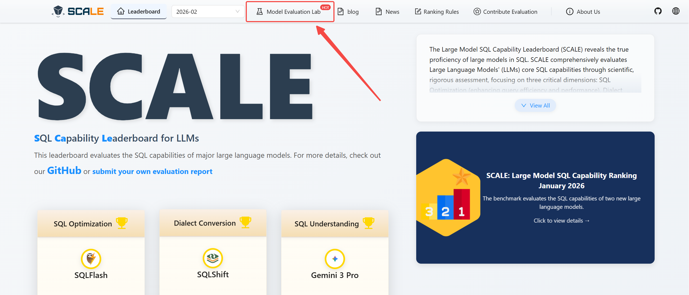
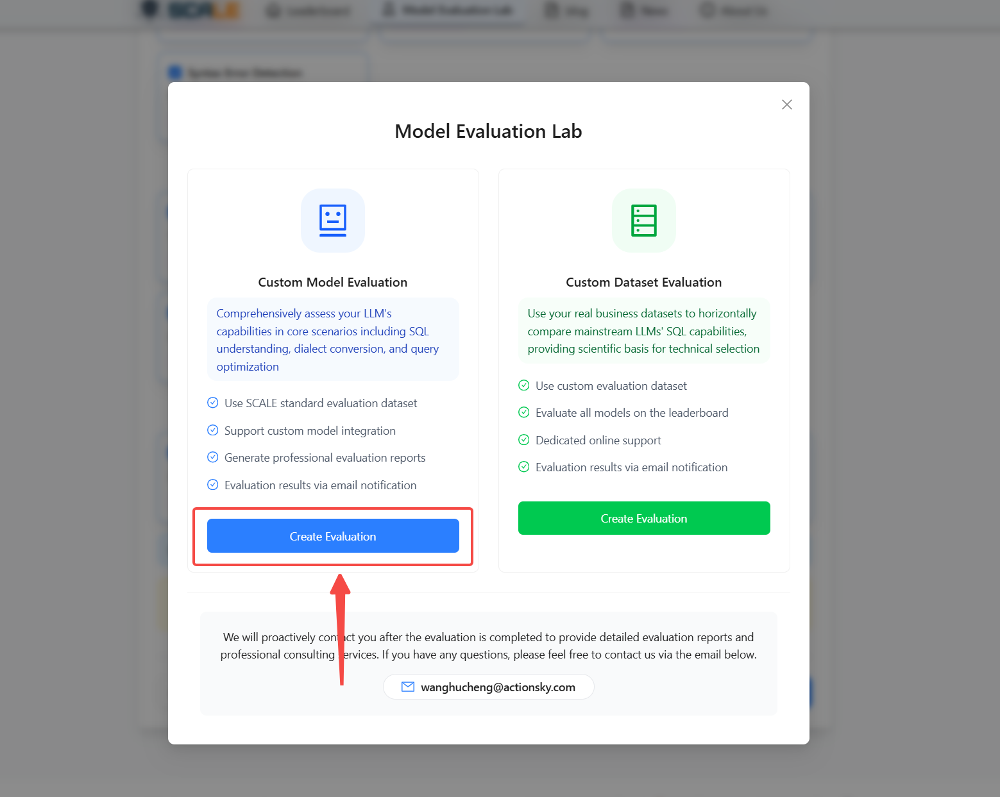
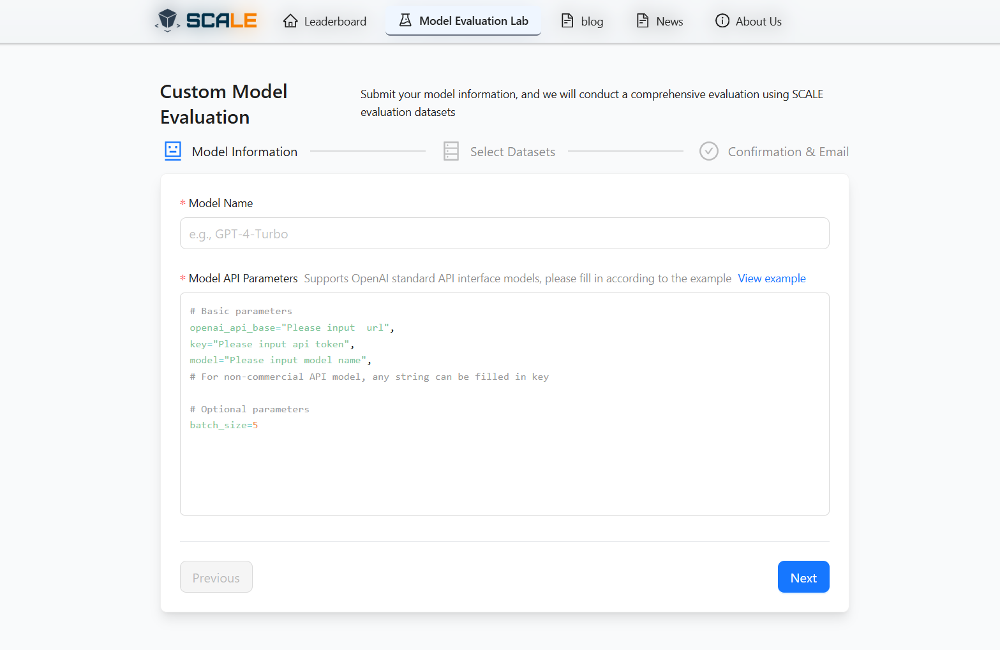
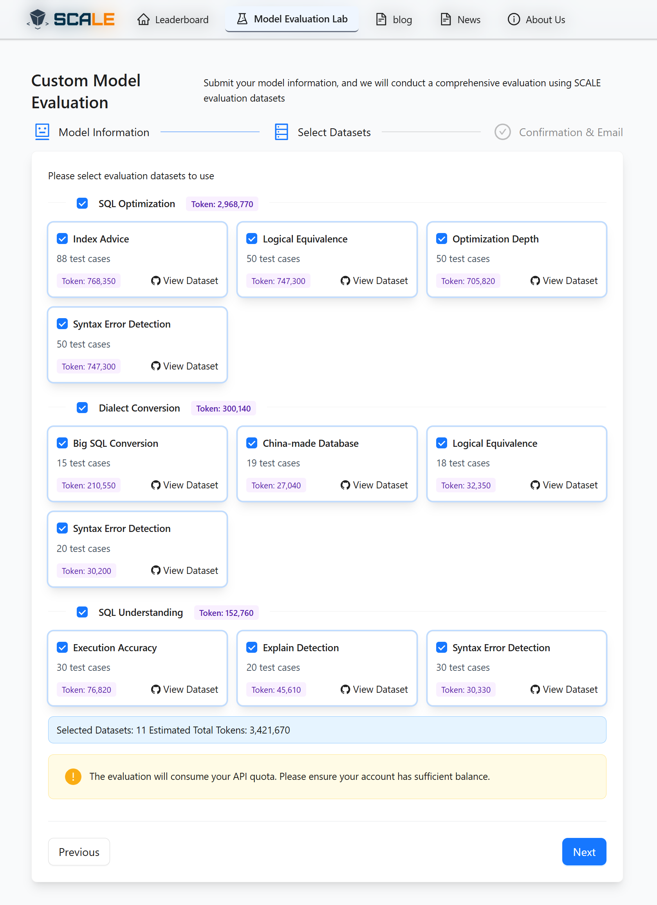
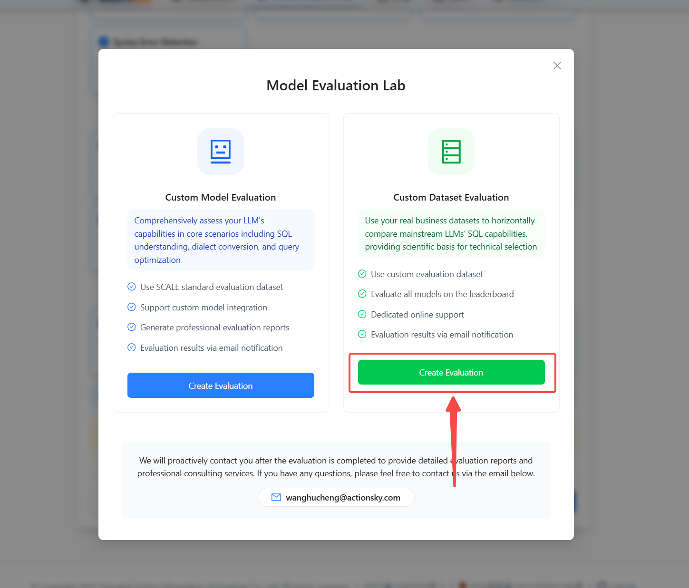
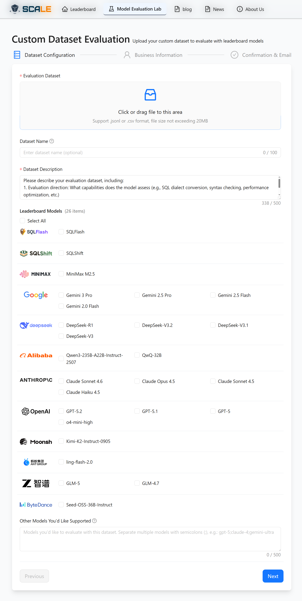

# New Feature: Model Evaluation Lab

## 👋 Voices from the SCALE Community

Through ongoing dialogue with our community and users, we’ve identified two critical high-frequency needs that have remained underserved.

> **Need 1**: "I want to know the SQL proficiency of models that aren't on public leaderboards—perhaps a model our team fine-tuned or deployed privately. We lack standardized benchmarks and tools to measure them."

> **Need 2**: "There are plenty of models on the leaderboards, but our business scenarios are unique. General scores don't directly guide our selection; we need to run them against our own data to feel confident."

Today, SCALE officially launches the **Model Evaluation Lab** to directly address these two core requirements.

- **Custom Model Evaluation**: Plug in your model API and select your evaluation dimensions to receive a capability report that aligns with SCALE’s rigorous leaderboard standards.
- **Custom Dataset Evaluation**: Upload your own business datasets and select candidate models to get performance comparisons tailored to your real-world scenarios.

In short — **you define "what to test" and "who to test,"** and SCALE provides professional, credible answers.

---

## 👉 You Decide the Model

In the **Custom Model Evaluation** section of the _Model Evaluation Lab_ interface, click "Create Evaluation." Users can verify the true standing of their proprietary models in the SQL domain in just three steps.

### Step 1: Connect Your Model

Enter the model name and API parameters. We support the OpenAI standard interface format. For any compatible model, simply provide the `openai_api_base`, `key`, and `model` name to complete the integration.

### Step 2: Select Evaluation Dimensions

You don't need to run every test. Based on your specific focus, freely toggle the dimensions and sub-dimensions you need. For example:

- **Focusing on query performance tuning?**
  Select only the sub-dimensions under _SQL Optimization_.
- **Concerned about cross-database migration?**
  Select only _Dialect Conversion_.
- **Need a full health check?**
  Select all dimensions.

Upon selection, the page displays an estimated Token consumption in real-time, allowing for upfront cost assessment. You can also view dataset details for each sub-dimension to understand the "exam questions" before starting the evaluation.

### Step 3: Confirm and Await Your Report

After verifying model parameters and the evaluation scope, enter your recipient email and submit. Once the evaluation is complete, the _Evaluation Report_ will be delivered directly to your inbox.

### Use Cases

- **Enterprise Tech Selection**: Evaluating whether a model not yet on the leaderboards can handle internal SQL tasks, requiring an objective capability report.
- **Model R&D Teams**: Verifying the proficiency level of fine-tuned or trained SQL-centric models to identify weaknesses and direction for improvement.
- **Model Providers**: Gaining insights into how your model performs under SCALE standards to support product iteration and market positioning.

### Value Added

By connecting your model API, you gain a professional evaluation report using the same datasets, dimensions, and standards as the SCALE leaderboard. This allows for **horizontal benchmarking** of your proprietary model against mainstream giants like GPT, Claude, Gemini, DeepSeek, and MiniMax, clearly defining your capability tier.

---

## 👉 You Decide the Data

In the **Custom Dataset Evaluation** section of the _Model Evaluation Lab_ interface, click "Create Evaluation." Test and discover which model is truly the best fit for your specific business data.

### Step 1: Upload Dataset & Select Candidates

Upload your evaluation dataset (supporting `.jsonl` or `.csv` formats) and describe your evaluation objectives and criteria. Then, **select the models you want to compare** from the SCALE leaderboard. You can pick 2-3 finalists for precision comparison or a wider range for a comprehensive baseline—it’s entirely up to you.

Our current model coverage includes major global and domestic providers. If a model you're interested in isn't listed, you can submit an extension request.

### Step 2: Provide Contact Information

Leave your name, phone number, and company name so we can contact you to deliver the report once the evaluation is finished. All business information is kept strictly confidential.

### Use Cases

- **Tech Decision Makers**: Choosing a Large Language Model (LLM) for a SQL-related project where business-specific data is the ultimate tie-breaker.
- **DBA/Data Engineering Teams**: Testing a batch of typical business SQL (slow queries, migration scripts, complex reports) to see how different models handle them in practice.
- **Product Managers/Architects**: Providing management with a model comparison report based on real-world scenarios to support procurement or integration decisions.

### Value Added

Once your business data is uploaded, SCALE runs the evaluation across your selected models to generate a **Scenario-Based Model Comparison Report**. Unlike generic leaderboard scores, this report directly answers: **"Which model is best for your specific business?"**

---

## 🤔 Which Evaluation Mode is Right for You?

### To verify the SQL proficiency of a proprietary model:

- **Recommended Mode**: Custom Model Evaluation
- **Prerequisites**: Model API parameters
- **Deliverable**: _Model SQL Capability Assessment Report_

### To compare model performance using business data:

- **Recommended Mode**: Custom Dataset Evaluation
- **Prerequisites**: Business dataset (jsonl/csv)
- **Deliverable**: _Scenario-Based Model Comparison Report_ & Professional Consultation

---

## 🤔 Why Launch This Feature?

The core mission of the **Model Evaluation Lab** is to **bring evaluation back to real-world needs.**

Every team uses different models, operates in different business contexts, and has different priorities. While general rankings are a vital reference, they cannot replace targeted assessments. The _Model Evaluation Lab_ was built for this: you decide the dimensions and the subjects, and SCALE ensures the professionalism of the process and the credibility of the results.

Visit the official SCALE platform and enter the **Model Evaluation Lab** to start your exclusive assessment. We will reach out upon completion to provide your detailed report and professional consulting services. If you have any questions, feel free to contact us at any time.

---

Would you like me to help you draft a social media announcement or a technical summary to accompany this article for your IT audience?
