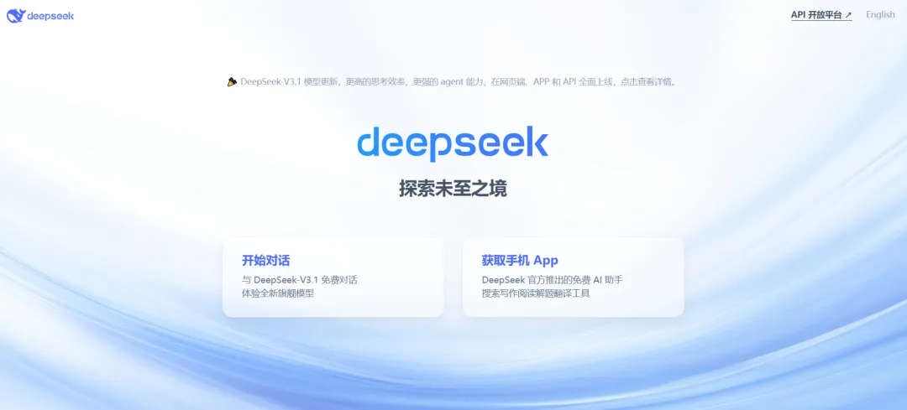
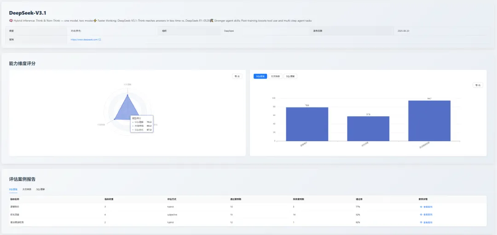
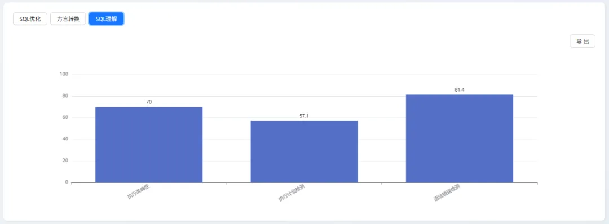
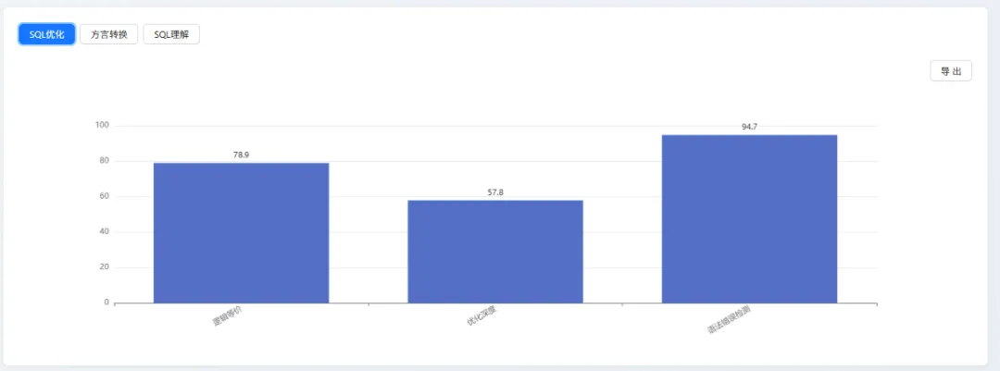
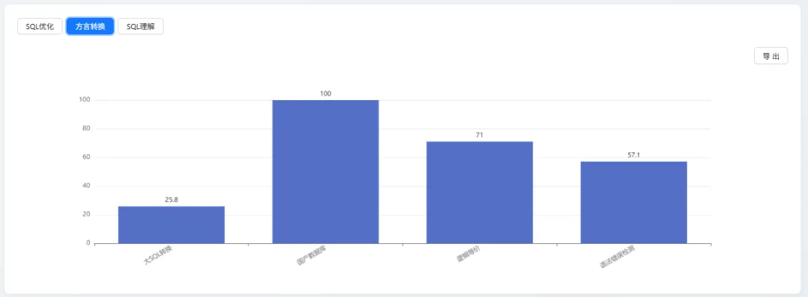

## 1. 摘要
2025 年 8 月，[SCALE](https://sql-llm-leaderboard.com/ranking/2025-08) 评测基准在纳入 GPT-5 家族 后，又马上纳入了 深度求索 公司于 8 月 21 日发布的最新模型 —— DeepSeek-V3.1。

> 本报告旨在通过我们标准化的测试集，客观评估该模型在专业级数据库 SQL 任务中的综合能力，并揭示其在企业真实场景下的表现。

评测结果显示，DeepSeek-V3.1 在 “理解、优化、转换” 三方面表现出较为均衡的实力。其在 SQL 优化 维度上表现相对突出，获得了 67.3 分，为需要进行深度代码分析与系统维护的场景提供了有力的支持。

## 2. 评测基准说明

为保证评测的纵向可比性与结果的稳定性，本月测评维度依旧围绕三大维度进行测评：SQL 理解、SQL 优化 与 SQL 方言转换，以确保对所有参评模型进行公平且深入的评估。

## 3. 新增模型深度分析

以下是对 DeepSeek-V3.1 的首次评测表现进行详细剖析。

### 3.1 SQL 理解能力（综合得分：70.2）

| 细分指标| 分数| 
|:--|:--|
|语法错误检测|81.4|
|执行准确性|70|
|执行计划检测|57.1|

#### 3.1.1 模型表现分析
- 优势：模型在 “语法错误检测” 上表现稳健，得分最高，证明其具备可靠的代码审查基础能力。
- 不足：在 “执行计划检测” 上得分最低，表明其对 SQL 深层性能、执行逻辑的理解能力是短板。

#### 3.1.2 横向对比
DeepSeek-V3.1 在该维度位列第 12 名，与第一梯队的模型存在一定差距。

例如，排名首位的 Gemini 2.5 Flash 得分为 82.3，高出 12.1 分。考察其核心原因，主要在于执行准确性能力。这一指标本质是模型对 SQL 深层语义与复杂逻辑理解的最终落地结果，而 DeepSeek-V3.1 该指标仅 70 分，显著低于 Gemini 2.5 Flash 的 90 分，这直接导致其在 SQL 的深层语义解析与复杂逻辑理解层面，仍有较大追赶空间。

### 3.2 SQL 优化能力（综合得分：67.3）

|细分指标|分数|
|:---|:---|
|语法错误检测|94.7|
|逻辑等价|78.9|
|优化深度|57.8|

#### 3.2.1 模型表现分析
- 优势：高度可靠。
	
	模型在语法遵循上表现优异（94.7分），并能较好地维持优化前后逻辑的一致性（78.9分），确保了方案的安全性与可用性。
- 不足：创新性与深度不足。
	
	其 “优化深度” 得分（57.8分）是主要短板，表明模型倾向于保守优化，缺乏生成高级、复杂优化策略的能力。

#### 3.2.2 横向对比

DeepSeek-V3.1 以 67.3 分位居第 9，与专用工具 [SQLFlash](https://sqlflash.ai/)（88.5分）及同类通用模型 DeepSeek-R1（71.6分）等头部产品存在差距。

这一差距主要体现在优化策略的深度与复杂性上。其 “优化深度” 得分（57.8分）不仅是自身弱项，更与头部模型相去甚远，这揭示了模型在深度分析和复杂策略生成上的能力瓶颈。同时，其 “逻辑等价” 表现（78.9分）虽属良好，但与头部模型的严谨性相比仍有提升空间，说明其在 逻辑一致性校验 方面需进一步加强。

### 3.3 SQL 方言转换能力（综合得分：63.2）

|细分指标|分数|
|:--|:--|
|国产数据库转换|100|
|逻辑等价|71|
|语法错误检测|57.1|
|大SQL转换|25.8|

#### 3.3.1 模型表现分析
- 优势：在特定知识领域与场景化应用中表现卓越。

	DeepSeek-V3.1 在 “国产数据库转换” 任务中获得满分，这突出表明其具备强大的特定领域知识库和高效的场景化适应能力。它能够精准理解并应用特定、明确的规则体系，在知识密集型且边界清晰的专业任务中展现出完美的执行力。

- 不足：在处理长上下文和复杂逻辑时能力存在显著短板。

	DeepSeek-V3.1 在 “大 SQL 转换” 项目上得分极低，这直接揭示了其在处理超长、复杂上下文时的核心弱点。当面临信息冗长、逻辑链条复杂、需要全局理解和推理的任务时，模型存在逻辑遗漏或处理失败的风险，这是其通用能力上的关键瓶颈。

#### 3.3.2 横向对比

在 SQL 方言转换维度，DeepSeek-V3.1 以 63.2 分排名第 13 位，显著落后于 GPT-5 mini（79.6 分）、o4-mini（77.4 分）等头部模型。

其根本原因在于能力分布的不均衡：模型在 “国产数据库转换” 等特定场景下表现完美（100 分），但在更考验通用基础能力的环节却暴露了明显短板。例如，其 “大 SQL 转换” 得分（25.8 分）远低于 GPT-5 mini（58.1 分），这反映了其长上下文处理能力的不足；同时，“语法错误检测” 得分（57.1分）也大幅落后于头部模型的精准度（92.9分）。这种通用能力的缺失，是其综合排名靠后的主要原因。

## 4. 总结与展望
DeepSeek-V3.1 的加入为我们提供了又一个重要的数据切片。本次评测结果清晰地表明，当前通用大模型在 SQL 任务上呈现出 “各有所长，亦各有所短” 的特点。例如，DeepSeek-V3.1 在处理特定场景（国产数据库转换）时表现优异，但在长文本处理（大 SQL 转换）和深度优化上则有明显不足。这再次印证了我们的观点：**脱离具体场景对模型能力进行排名是不全面的。**

## 5. 未来展望
SCALE 评测体系将持续跟踪各大厂商的最新模型动态和迭代进展。我们致力于通过公正、透明的评测数据，与社区共同推动大语言模型在数据库领域的应用和实践走向更深层次。

**即刻探索新一代模型的专业能力！** 欢迎您登陆 SCALE 官方平台，查看完整的最新榜单和模型对比详情，共同把握 AI 技术的前沿脉搏。

> 查看完整榜单并联系我们提交您的产品进行测评。*https://sql-llm-leaderboard.com/* 

**SCALE：为专业 SQL 任务，选专业 AI 模型。**
