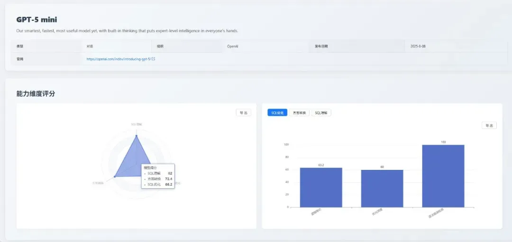
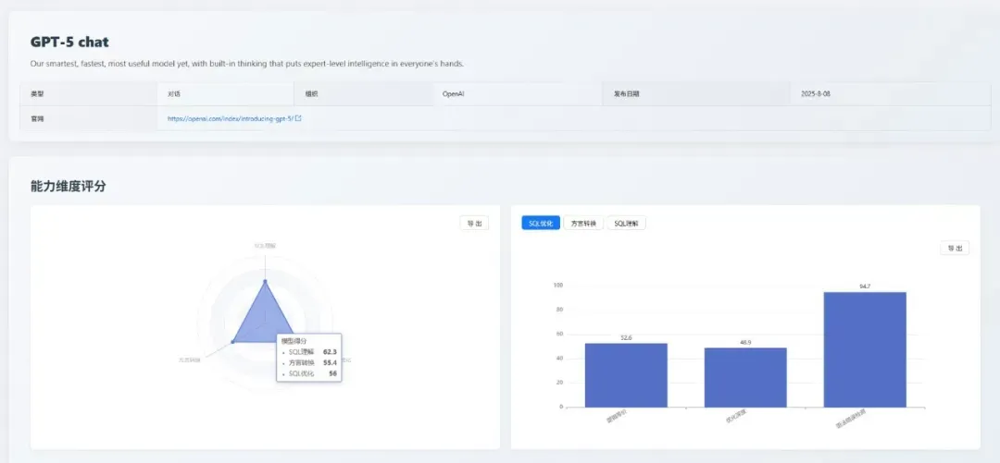

## 1. 摘要

2025 年 8 月，**我们迎来了 AI 发展史上的又一个里程碑 —— [GPT-5](https://openai.com/zh-Hans-CN/gpt-5/ "GPT-5") 家族的正式发布。**

当整个科技界都在讨论其通用能力的飞跃时，[SCALE](https://github.com/actiontech/sql-llm-benchmark "SCALE") 平台将目光聚焦于 SQL 能力：**GPT-5 在 SQL 处理上的表现究竟如何？**

本期评测为针对 **GPT-5** 家族的评测特别版，旨在对其 SQL 相关能力进行一次全面的基准测试。

**本期核心看点**
- **旗舰模型表现分析**：**gpt-5-chat** 的评测结果显示其能力存在特定短板，而 **mini** 版本在本次测试的综合表现中更为均衡。
- **全方位的能力评估**：通过多维度多指标的用例评估，分析了 **GPT-5** 在不同场景下的实际性能，揭示了其理论能力与实践应用的差异。
- **数据驱动的模型选型**：评测数据表明，不同版本的模型在处理 **SQL 能力** 上各有千秋。本报告将基于数据，探讨如何进行场景化选型。

## 2. 评测基准说明
为确保本次特别评测的公正性与深度，我们沿用了成熟的三维评测体系。

- **SQL 理解**：考察模型是否精准解析复杂查询逻辑与用户意图。
- **SQL 优化**：考察模型提升查询效率与性能的意识。
- **方言转换**：考察模型在主流数据库之间进行语法迁移的能力。

接下来，我们将揭晓本次评测的详细结果。

## 3. 本月榜单与焦点分析
**GPT-5** 家族在 SQL 领域的评测结果并非简单的性能递减，不同版本间表现出显著的能力分化，这凸显了场景化选型的重要性。

### 3.1 gpt-5-mini：综合能力均衡
**gpt-5-mini** 在本次评测中综合表现领先，其在三个维度上展现了均衡且突出的能力。

#### 3.1.1 各维度表现得分

|能力|得分|详细说明|
|:--|:--|:--|
|SQL 理解 | 80.8 |执行准确性：87.1  执行计划检测：57.1  语法错误检测：74.3|
|方言转换| 75.6 |大 SQL 转换：54.8  国产数据库：92.1  逻辑等价：74.2   语法错误检测：85.7   |
| SQL 优化 | 68.4|逻辑等价：63.2  优化深度：64.4  语法错误检测：94.7  |

#### 3.1.2 亮点与不足
- **亮点**：执行准确性高，可靠性强；在高级、复杂的优化任务中表现出色。
- **不足**：常规优化能力并非顶级，处理大型、复杂 SQL 转换时能力有限。

#### 3.1.3 综合评价
- 综合来看，**gpt-5-mini** 在准确性、可靠性和复杂任务处理上表现均衡，适合追求稳定输出和综合性能的企业级应用。
- 横向对比来看，**gpt-5-mini** 在 **SQL 理解维度** 位列第三，**方言转换** 维度位列前五，综合实力在参评模型中名列前茅。

### 3.2 gpt-5-nano：高精度代码生成器
**gpt-5-nano** 表现出扎实和均衡的能力，其在三个维度上的得分非常接近。

#### 3.2.1 各维度表现得分

|能力|得分|详细说明|
|:--|:--|:--|
|SQL 理解 | 77.1 | 执行准确性：85.7  执行计划检测：35.7  语法错误检测 75.7|
|方言转换| 66.4 |大 SQL 转换：19.4  国产数据库：100  逻辑等价：80.6 语法错误检测：69   |
| SQL 优化 | 68.7|逻辑等价：89.5  优化深度：55.6  语法错误检测：100 |

#### 3.2.2 亮点与不足
- **亮点**：生成的 SQL 语法正确性极高，结果可靠；逻辑转换能力扎实。
- **不足**：缺乏对 SQL 执行效率的深层理解；难以应对复杂、冗长的查询迁移。

#### 3.2.3 综合评价
- **gpt-5-nano 是一个出色的“SQL 代码生成器”**，适合嵌入自动化工作流，处理标准化的 “**文本到 SQL**” 和简单方言转换任务。但对于需要深度优化和理解复杂查询的场景，则非其所长。
- 在本次评测的横向对比中，**gpt-5-nano** 凭借其 SQL 优化能力进入榜单前五，但在其他维度的竞争中未显现出明显优势。

### 3.3 gpt-5-chat：能力特点分化
**gpt-5-chat** 的综合表现不如预期，其能力存在显著的“偏科”现象。

#### 3.3.1 各维度表现得分

|能力|得分|详细说明|
|:--|:--|:--|
|SQL 理解 | 62.3 | 执行准确性：57.1  执行计划检测：60.7  语法错误检测 84.3|
|方言转换| 55.4 |大 SQL 转换：3.2  国产数据库：86.8  逻辑等价：71.0   语法错误检测：66.7   |
| SQL 优化 | 56.0|逻辑等价：52.6  优化深度：48.9  语法错误检测：94.7 |

#### 3.3.2 亮点与不足
- **亮点**：对复杂的优化策略和逻辑推理有深刻的理论理解。
- **不足**：基础执行的准确性堪忧，生成的 SQL 有较大概率出错；无法处理复杂、大型的查询迁移。

#### 3.3.3 综合评价
- **gpt-5-chat** 在高级理论知识上表现出色，但在基础执行的准确性上存在不足。这种能力分化表明，对模型的评估不应仅依据其通用能力，而需通过专业、细分的场景评测来确定其在特定领域的适用性。
- 横向来看，**gpt-5-chat** 在各维度的榜单排名中均未进入前列，其综合定位处于中游水平。

## 4. 总结
本次特别评测清晰地表明，**GPT-5** 的发布不仅是数字上的提升，更带来了 AI 在 SQL 领域 **专业化** 和 **场景化** 的深刻变革。

- **场景定义模型**：评测结果表明，企业在选择模型时，应更多地从具体应用场景出发（复杂分析、数据迁移等），而非仅仅依据模型的“名号”或通用能力排名。**gpt-5-mini** 的胜出，是“场景定义价值”的最佳体现。

- **专业化趋势**：[SQLFlash](https://sqlflash.ai/) 在优化领域的绝对优势，与 **GPT-5 家族** 内部的能力分化，共同揭示了未来AI发展的趋势——通用大模型与领域专用模型将长期共存，互为补充。

## 5. 未来展望
SCALE 评测体系将持续跟踪各大厂商的最新模型动态和迭代进展。我们致力于通过公正、透明的评测数据，与社区共同推动大语言模型在数据库领域的应用和实践走向更深层次。

**即刻探索新一代模型的专业能力！** 欢迎您登陆 SCALE 官方平台，查看完整的最新榜单和模型对比详情，共同把握 AI 技术的前沿脉搏。

> 查看完整榜单并联系我们提交您的产品进行测评。*https://sql-llm-leaderboard.com/* 

**SCALE：为专业 SQL 任务，选专业 AI 模型。**
