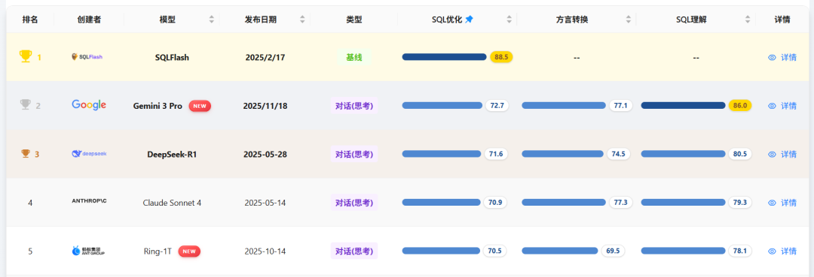
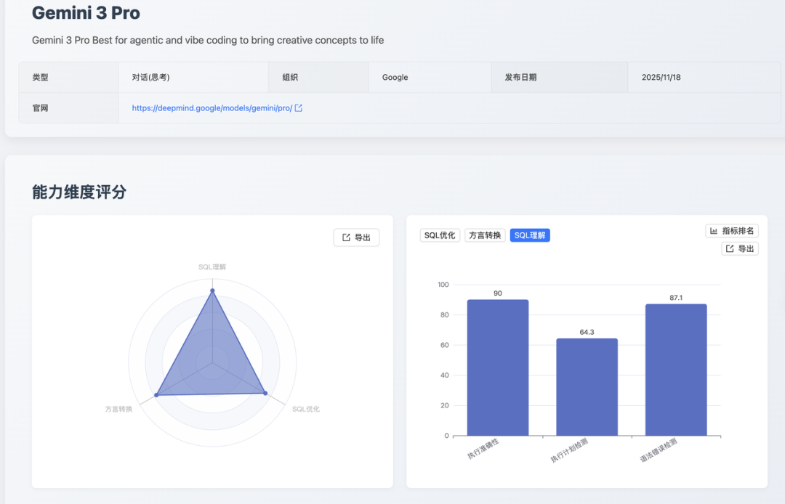
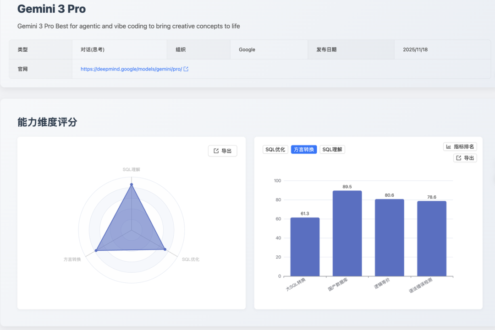

## 1. 摘要

Gemini 3 Pro 模型在本期 [SCALE](https://sql-llm-leaderboard.com/) 评测中首次纳入评估，其表现充分验证了其作为新一代专业级大语言模型的强大实力。评测结果显示，Gemini 3 Pro 在 SQL 理解能力 维度取得了显著突破，位居榜单首位，并在 SQL 优化和方言转换维度展现出高度均衡和稳健的综合性能。

在当前主流模型中，**Gemini 3 Pro 在 SQL 综合能力测评中位居前列。**

核心看点速览：

- **SQL 理解：No.1**

    执行准确性高，在复杂查询结果预测上表现优秀，实现该维度历史最高分。
    
- **SQL 优化：No.2**

    优化后 SQL 的语法正确率达到满分，为生成的优化代码提供了生产环境“开箱即用”的质量保障。
    
- **方言转换：No.6**

    大 SQL 转换得分靠前，表明其在处理包含复杂控制流和超长上下文的脚本时，具有较强的全局逻辑把握能力。

## 2. 评测目的与方法论

我们沿用 SCALE 框架自创立以来一直秉持的三大核心维度和统一的评测数据集，确保所有数据均在同等严格的标准下进行评估，以保障评测结果的公正性和可复现性：

- SQL 优化：考察模型提升查询效率与性能的意识和能力。
- 方言转换：考察模型在主流数据库之间进行语法迁移的准确性。
- SQL 理解：考察模型是否能精准解析复杂的查询逻辑与用户意图的能力。

本月所有新增模型均在此标准体系下进行评估。

## 3. 测评结果数据展示与深度分析

Gemini 3 Pro 在三大维度的综合表现呈现出 “**理解先行，全面均衡**” 的特点，特别是在对 SQL 代码的深度解析方面，树立了新的行业标杆。

### 3.1 SQL 理解能力

维度总分：86.0（No.1）

- 执行准确性：90（No.1 并列）
- 执行计划检测：64.3（No.1 并列）
- 语法错误检测：87.1（No.1 并列）

- **执行准确性**：核心优势。该分数表明模型能够精确理解复杂查询的语义，并准确预测查询结果，证实了该模型在数据查询和报表生成场景中具备高度可靠性。
- **执行计划检测**：尚有提升空间。虽然具备基础的执行逻辑分析能力，但相对于其顶尖的准确性分数，模型对数据库底层执行机制和索引策略的深度理解和预测能力仍需加强。
- **语法错误检测**：表现优异。模型能够有效识别 SQL 代码中的规范性错误和语法缺陷，适用于提升代码审查环节的效率与质量。

Gemini 3 Pro 在 SQL 理解 维度上的表现，体现出其对代码逻辑的深层解析能力。执行准确性得分证实了该模型在复杂数据分析和生产环境故障排查场景中的高度可靠性。

其在语法错误检测和执行计划检测上也均位列榜单 No.1，综合能力表现突出，但在执行计划预测的测评中发现该模型存在两处易错问题：

1. 对结构化输出格式规范的遵循不严格：将 JSON 的 `null` 值错误输出为字符串 `"NULL"`，混淆了 SQL 语义中的 NULL 与 JSON 数据类型规范；
2. 对数据库写操作的执行计划语义理解不足：未能识别 MySQL 优化器在写操作中会使用主键索引进行行定位的优化行为，仅基于 WHERE 条件中的列判断访问方式，导致将应使用索引扫描的 UPDATE 操作误判为全表扫描（`type: "ALL"`），反映了模型在结构化数据输出规范遵循和数据库执行引擎行为理解两个维度的能力不足。

### 3.2 SQL 优化能力

维度总分：72.7（No.2）

- 逻辑等价：73.7（No.11）
- 优化深度：66.7（No.2 并列）
- 语法错误检测：100（No.1 并列）

- **逻辑等价**：表现可靠。模型在优化过程中能有效保证重构后的 SQL 与原查询的逻辑一致性，是保障业务结果正确的基石。
- **优化深度**：稳健。模型能应用常规的优化规则（如子查询扁平化、JOIN 顺序调整等），具备显著的性能提升潜力。在极端复杂和需要深度重构的优化任务中，仍有提升空间。
- **语法错误检测**：顶尖表现！ 这是保障代码质量的关键指标，意味着模型优化后的 SQL 不存在语法错误，可安全地投入测试环境进行性能验证。

**Gemini 3 Pro 的 SQL 优化能力位列榜单第二。**

其最大的亮点在于其语法错误检测得分，为生成的优化代码提供了生产级质量保障。同时，66.7 分的优化深度虽在当前主流模型中具备领先优势，但还有一定提升空间。

模型在 SQL 优化深度任务测评中，能较好地识别并应用基础优化规则（如谓词下推、投影下推、`HAVING` 条件下推），但在需要深度语义理解和模式识别的优化场景中存在明显不足：未能识别 LIKE 前缀查询可改写为范围查询以利用索引有序性；未能识别无 LIMIT 子查询的冗余 ORDER BY 可消除；未能识别DATE字段与字符串比较的隐式类型转换问题。

这些缺陷反映了模型在模式识别能力（如识别 LIKE 前缀模式、识别隐式类型转换模式）和细粒度语义分析能力（如区分有 `LIMIT` 和无 `LIMIT` 子查询中 `ORDER BY` 的语义差异）方面的不足，模型更擅长结构化的规则应用，但在需要深入理解数据库优化器行为的场景中表现较弱。

**此外，逻辑等价性的排名仍处于可靠区间，使其成为数据库管理员 (DBA) 和资深开发者提升存量代码质量和性能的可靠工具。**

### 3.3 方言转换能力

维度总分：77.1（No.6）
- 国产数据库转换：89.5（No.16 并列）
- 逻辑等价：80.6（No.2 并列）
- 大 SQL 转换：61.3（No.2 并列）
- 语法错误检测：78.6（No.8 并列）

- **国产数据库转换**：核心价值。模型对 Oracle 到 OceanBase 等国产数据库的关键迁移路径适配性良好，转换准确率高，尤其适用于国内企业的信创替换场景，具备商业价值。

- **逻辑等价**：表现优秀。 在跨方言转换中，模型能有效地保持代码的业务逻辑和语义一致性，有利于降低迁移项目中的潜在风险。

- **大 SQL 转换**：重点挑战。在处理行数超百行、包含复杂存储过程、游标或异常处理逻辑的 “大 SQL” 时，转换难度显著，模型对超长上下文和控制流的精准把握能力有待进一步提升。

- **语法错误检测**：稳健。转换后的代码规范性较好，但鉴于不同目标数据库的细微语法差异，仍建议人工进行复核。

总分（77.1）可见该模型是一个可靠的方言转换辅助工具。其在逻辑等价和大 SQL 转换上均表现亮眼，表明其在复杂代码的全局逻辑把握能力上具备领先优势。

但在国产数据库转换的排名相对靠后，在转换测评中，模型在处理 Oracle 的 `CAST ({ expr | MULTISET (subquery) } AS type_name )` 语法时，大多数模型会想当然地认为目标端 OceanBase（Oracle 模式）不支持 `MULTISET` 运算符，从而错误地将其替换为 `COLLECT` 聚合函数。但事实恰恰相反：OceanBase（Oracle 模式）支持 `MULTISET`，却不支持 `COLLECT`，反应出模型对于国产数据库更倾向于机械转换而非基于目标环境特性进行语义等价性判断，缺乏对于国产数据库的知识。

## 5. 总结

Gemini 3 Pro 模型在本期评测中确立了其在专业 SQL 处理领域的领先地位，其能力分布呈现出 “深度理解、高质优化、均衡转换” 的显著特征。

- **深度理解**：凭借其执行准确性，该模型在理解复杂查询逻辑和预测执行结果方面表现出业内较高的可靠性，可以作为 SQL 审查逻辑验证优先选择的模型。

- **高质优化**: 优化后 SQL 的语法正确性是其核心竞争力，确保了优化代码的生产级可用性。同时，66.7 分的优化深度表明其具备将性能潜力转化为实际效率的能力。

- **均衡转换**: 在方言转换维度，模型在大 SQL 转换和逻辑等价子项上的优异表现，证明了其在处理长篇复杂脚本和保持跨平台逻辑保真度上的强大能力。这使其成为数据库迁移项目中，特别是涉及复杂业务逻辑转换时的可靠辅助。

综合来看，Gemini 3 Pro 不仅能 “写出” 正确的 SQL，更能 “理解” 其执行机制和 “优化” 其性能，是 **面向企业级、高可靠性要求的数据库任务的理想 AI 助手。**

### 应用建议

- **数据分析与工程**：建议优先利用 Gemini 3 Pro 进行复杂查询的逻辑验证和结果准确性预测，确保数据洞察的可靠性。

- **数据库管理与开发**：可信赖其 SQL 优化能力，安全快速地对存量 SQL 进行规范化和初步性能调优。

- **企业技术决策**：在规划数据库迁移和国产化替代项目时，可将 Gemini 3 Pro 视为重要辅助工具，利用其国产数据库转换能力，以提高项目效率并降低人工成本。

## 6. 未来展望

SCALE 评测框架将持续追踪 Gemini 3 Pro 等业界前沿模型的迭代进展。我们期待看到下一阶段的模型在提升 “执行计划检测” 和 “大 SQL 转换” 等高难度、贴近实际生产环境的维度上取得突破。我们致力于通过公正、透明的评测数据，与社区共同推动大语言模型在数据库领域的应用和实践走向更深层次。

我们致力于通过公正、透明的评测数据，与社区共同推动大语言模型在数据库领域的应用和实践走向更深层次。

**即刻探索新一代模型的专业能力！** 欢迎您登陆 SCALE 官方平台，查看完整的最新榜单和模型对比详情，共同把握 AI 技术的前沿脉搏。

> 查看完整榜单并联系我们提交您的产品进行测评。*https://sql-llm-leaderboard.com/* 

**SCALE：为专业 SQL 任务，选专业 AI 模型。**
