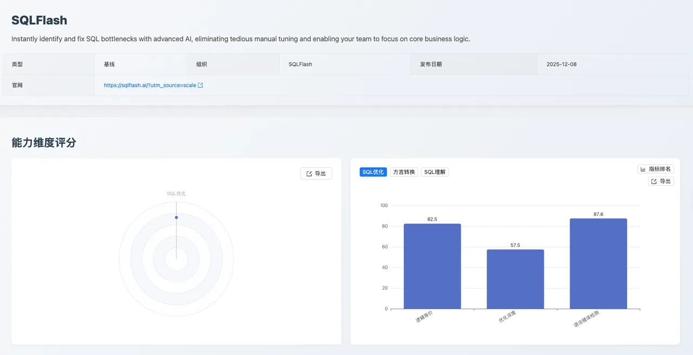

## 1. 摘要

本次 [SCALE](https://sql-llm-leaderboard.com/ 'SCALE') 评测针对专业级 AI 应用 [SQLFlash](https://sqlflash.ai/ 'SQLFlash') 进行。**测评数据集难度升级**，旨在反映模型或专业应用在处理 **接近生产级** 问题 SQL 调优时的稳健性。

**核心结论**：面对全新挑战，SQLFlash 的各项指标虽有波动，但仍展现出其作为专项调优工具的专业能力。特别是 **语法及最佳实践遵循** 仍保持高分（**87.6**），确保了输出 SQL 的高可用性。

| 核心指标               | 得分 | 专业价值体系                                                                                         |
| :--------------------- | :--- | :--------------------------------------------------------------------------------------------------- |
| **语法及最佳实践遵循** | 87.6 | 在较高复杂度 SQL 中，仍能保障输出 SQL 的 **规范性与语法高准确率**，是工程可靠性的重要保障。          |
| **逻辑等价**           | 82.5 | 确保优化后的 SQL，**业务语义一致**。面对复杂重构，仍保持了较高的逻辑保真度。                         |
| **优化深度**           | 57.5 | 量化复杂优化策略的应用效能，改写 SQL 是否能按预期调优策略进行，反映出问题 SQL 优化后的性能提升情况。 |

## 2. 评测说明

### 2.1 测评背景与目的

本次测评的目的是检验 SQLFlash 在面对 **真实生产环境的性能调优难题** 时，是否具备数据库专家（DBA）的性能优化意识，以及能否在保证 **逻辑等价和语法正确** 的前提下，改写出 **性能更优** 的版本。

### 2.2 测评方法论与维度聚焦

本次测评依据 SCALE 评测框架，仅启用 **SQL 优化能力测评** 维度。评估方法涵盖：**语法正确性、逻辑等价性、优化深度**。

### 2.3 测评数据集升级

为更深度地模拟生产环境的挑战，本次专项测评采用了 **已升级的 SQL 优化数据集**。

- **数据集升级影响**：新数据集的复杂性和体量显著增加，**SQL 语句更复杂，更接近生产级**，且融入了多种数据库的语法特征。更真实地反映了模型在处理实际生产复杂场景时的能力边界。
- **完整公布**：有关本次评测数据集的 **完整细节、构造方法论以及关键案例**，我们将在 **本月末的 SCALE 评测榜单发版中正式公布**，敬请期待。

## 3. SQLFlash 深度评测报告

### 3.1 高复杂度的可靠性基准

SQLFlash 在 **语法错误检测** 指标上达到了 **87.6** 分。

- **数据解读**：87.6 分的成绩证明 SQLFlash 在高复杂度 SQL 输入下，其输出优化改写后的 SQL 在语法结构和规范性上具备较高的可靠性。
- **专业价值**：在 AI 生成代码领域，高标准的语法遵循是工程化部署的首要前提。此项数据有力佐证了 SQLFlash 具备 **辅助开发人员进行代码规范性校验** 的能力。

### 3.2 语义一致性的关键指标

模型在 **逻辑等价** 指标上取得了 **82.5** 分的成绩。

- **数据解读**：逻辑等价性是 SQL 代码重构与优化的 **强制性约束**。82.5 分的成绩证明了 SQLFlash 在绝大多数测试场景中，能够精准理解并维持原始 SQL 的业务语义，避免了因性能优化而产生的业务逻辑错误。
- **专业价值**： 该数据反映了 SQLFlash 在实现性能优化的同时，对 **数据完整性和业务逻辑一致性** 的严格维护。

### 3.3 新数据集带来的严峻挑战

SQLFlash 在 **优化深度** 上的最新得分为 **57.5** 分。

- **数据解读**：该指标反映出生产级复杂 SQL 对 SQLFlash 优化策略的巨大挑战。在面对业务性极强、执行计划复杂、索引结构复杂 SQL 的性能瓶颈时，SQLFlash 对于业界共识的调优策略有近 60% 的覆盖率 ，对于此结果未来还有一定的提升空间。
- **专业价值**：该数据为模型迭代提供了明确的靶向目标——提升在生产级复杂查询场景中的深度优化能力，是下一阶段赋能企业系统性能效益的关键。

## 4. 优势分析

通过分析测评报告，SQLFlash 对于业界共识的 SQL 优化策略覆盖相对全面、分析问题 SQL 列血缘与依赖关系清晰，SQLFlash 能在多源 `JOIN`、窗口/聚合、标签权限、库存链路等复杂业务场景里稳定产出高命中、低开销的改写，为后续规则扩展和自动化判定提供了可直接复用的范式。

### 4.1 多规则协同命中

在手册读取场景（聚合+多表关联）中，同时落实投影裁剪、谓词下推、无用排序移除与时间条件显式化，四条策略一次到位，显著压缩中间表规模并规避时间隐式转换风险。

### 4.2 大表多 JOIN 的高效裁剪

车辆库存/销售链路查询中，先把主表过滤下推到派生表，再裁剪子查询仅保留必要字段，减少后续十余个 JOIN 的数据量，展示了在宽表场景下的可复制优化路径。

### 4.3 半连接与分支合并减载：

标签筛选与权限校验组合中，利用 `EXISTS` 替代无输出 `JOIN`，并将互斥分支合并为 `OR`，避免重复扫描 `document_template` 与 `user`，降低 I/O 与临时表物化成本。

### 4.4 OR 拆解命中单列索引：

文档检索里将 pdfKey/fileKey 的 `OR` 拆成 `UNION`，使两个单列索引都可用，兼顾可读性与执行效率。

窗口/分组 场景的投影与前置过滤：医疗诊断与日志分析场景下，先前置日期过滤，再在窗口/聚合前移除未用列，减少排序与聚合的输入规模。

### 4.5 复杂业务流的冗余操作消除：

在作业流/审批流查询中，将 `SELECT` 裁剪为最小投影、提前过滤状态，并移除 `EXISTS` 内无必要的 `GROUP BY`，保持语义等价的同时降低排序/聚合开销。

## 5. 挑战与未来提升方向

建议未来将本次测评中的长 SQL 样例纳入回归与规则单测，确保改写策略在真实负载上可复用、可验证。

### 5.1 时间条件格式与谓词顺序优化不足

在包含 `P.WORK_DATE = DATE '2025-08-04'` 和 `P.DEL_FLAG = 0` 的生产查询中，SQLFlash 未做任何改写。规则期望将高选择性条件 `P.DEL_FLAG = 0` 前置、日期条件居中、复杂子查询后置，以利用短路求值减少无效计算（预期性能提升 6%-35%），但改写未调整 `WHERE` 子句顺序，也未对时间条件做显式格式补全以避免隐式转换，说明“谓词优先级重排”和“时间隐式转换消除”规则需要更主动触发。

### 5.2 函数包裹与隐式转换识别不足

在过滤键上使用 `CONCAT("id_", student_id)` 或整数/字符串混用（如 `BETWEEN 192 AND 171` 比较字符串列）的查询中，改写未去除函数包裹或补齐类型一致的显式条件，说明“隐式转换规避”与“函数去包裹走索引”需要更强的检测与自动改写。

## 6. 应用建议与总结展望

1. **自动化质量门禁**：推荐将 [SQLFlash](https://sqlflash.ai/) 集成至 CI/CD 流程或代码预提交钩子中，作为数据库代码质量的自动化门禁，实现对新增或修改 SQL 的性能基线扫描和规范性强制校验。
2. **可靠性保障**：由于其在语法和逻辑上仍保持高位，可用于辅助 DBA 进行中等复杂度的调优任务。

**立即体验 SQLFlash 的专业调优能力，并期待我们下一阶段针对新数据集的深度优化迭代。欢迎关注 SCALE 官方平台，获取更多 LLM 专业能力测评数据。**

_数据截止日期：2025 年 12 月 16 日_

> 查看完整榜单并联系我们提交您的产品进行测评。*https://sql-llm-leaderboard.com/*

**SCALE：为专业 SQL 任务，选专业 AI 模型。**
