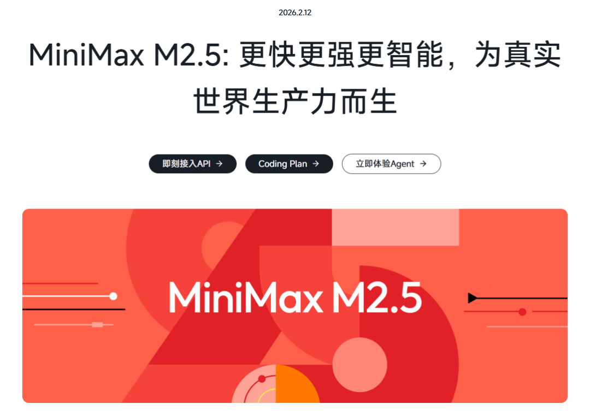
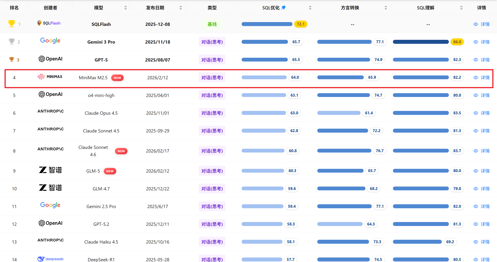
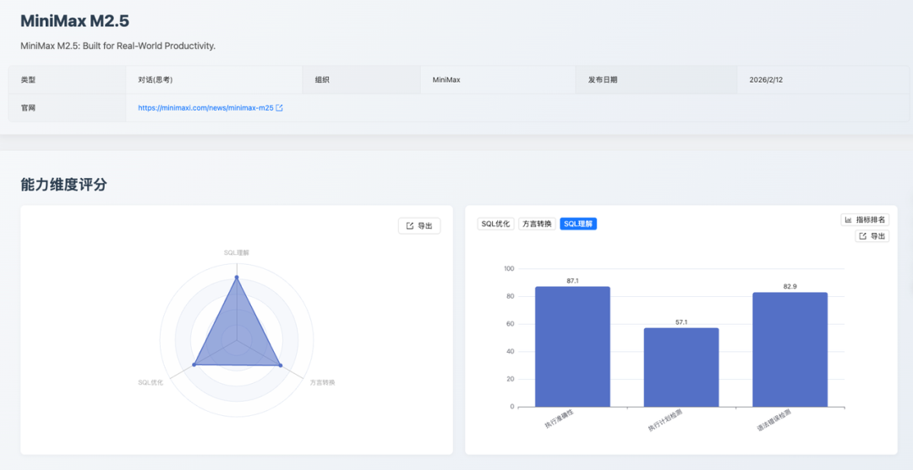
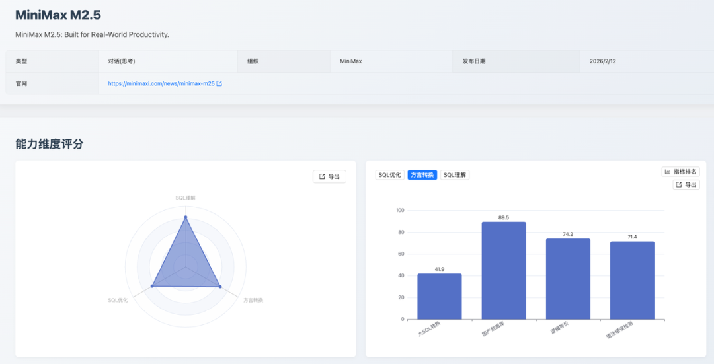

## 1. 评测摘要与核心结论

2026 年 2 月 12 日，[MiniMax M2.5](https://www.minimaxi.com/news/minimax-m25) 发布。[SCALE](https://sql-llm-leaderboard.com/) 即刻对该模型进行了评测，也是 SCALE 榜单首次引入 **MiniMax 系列模型**，旨在系统评估其在企业级数据库场景下的 SQL 综合能力，为用户和企业技术选型提供参考依据。

### 精准理解、稳健优化、国产领先

**MiniMax M2.5** 在 SQL 语义和语法层面展现出扎实的理解功底，尤其在执行准确性和语法纠错方面达到业界先进水平。在 SQL 优化维度，模型优化深度指标测评以第 2 名的成绩展现了可观的潜力，同时在国产数据库方言转换上的突出表现，为信创迁移场景提供了极具竞争力的解决方案。

**作为一款均衡型选手，MiniMax M2.5 在多数核心能力上表现稳定，具备较高的实用价值。**

在 SCALE 三大核心维度测评下，**MiniMax M2.5** 多项指标在当前榜单主流模型中处于领先地位，经过 SCALE 标准评价体系计算后，**MiniMax M2.5** 在 _SQL 优化_ 和 _SQL 理解_ 维度分别以 **64.0** 分和 **82.2** 分位居榜单第 4 和 第 5，_方言转换_ 维度 **65.9** 分排名第 11 名。

## 二、模型详细表现与数据洞察

### SQL 理解：高分领跑，理解力出众

模型在 _SQL 理解_ 维度获得 82.2 分，**整体表现优秀**。

| 测评指标项       | 得分 | 排名        |
| ---------------- | ---- | ----------- |
| 执行准确性       | 87.1 | 并列第 2 名 |
| 执行计划推理检测 | 57.1 | 并列第 4 名 |
| 语法错误检测     | 82.9 | 并列第 6 名 |

#### 优势

在 _SQL 理解_ 维度的两项核心指标测评中，**MiniMax M2.5** 均取得了优异表现，在执行准确性上斩获 87.1 分和语法错误检测的 82.9 分。

测评集覆盖三个难度层级，执行准确性涵盖从基础 DML 到多表关联子查询、相关子查询、`EXISTS/IN` 嵌套、跨表 `UPDATE/DELETE` 等复杂场景，要求模型在脑中完整"运行" SQL 并还原精确的列名、数据类型与行顺序；语法错误检测则包含 CTE、事务控制、`CREATE VIEW`、`HAVING` 子句顺序错误、括号缺失等高度迷惑性的边界用例。

**MiniMax M2.5** **在这两项测试中均展现出扎实的 SQL 语义理解能力** —— 不仅能准确推断聚合计算、条件过滤与多表连接的执行结果，还能精准捕捉隐蔽的语法陷阱，体现出其在结构化查询语言的语义理解与语法认知上具备相当深度的专业能力。

#### 待提升

在执行计划推理测评中，**MiniMax M2.5** 获得了 57.1 分，在指标项测评案例中，该模型部分边界场景下存在一定偏差：对 `INSERT/REPLACE` 语句的 `EXPLAIN` 输出格式理解不够精准，`type` 字段出现非标准值；此外在 `filtered` 值的计算上，将实际匹配比例与优化器统计估算值混淆。这些偏差主要集中在数据库执行引擎的底层细节层面，反映出模型在引擎内部机制的精细化认知上仍有提升空间。

### SQL 优化：纠错能力突出，优化深度领先

模型在 _SQL 优化_ 维度得分 64.0 分，在多项指标测评上展现出亮眼表现。

| 测评指标项   | 得分 | 排名         |
| ------------ | ---- | ------------ |
| 逻辑等价     | 56.7 | 并列第 10 名 |
| 优化深度     | 53.3 | 并列第 2 名  |
| 语法错误检测 | 85.6 | 并列第 5 名  |
| 索引建议     | 66.2 | 并列第 6 名  |

#### 优势

在 _SQL 优化_ 维度的三项测评中，**MiniMax M2.5 整体表现亮眼**。测评集涵盖 MySQL、Oracle、PostgreSQL 等多种数据库方言，难度横跨初级到专家级，优化场景囊括谓词下推、投影下推、`LIKE` 前缀改写、`HAVING` 条件下推、子查询聚合转窗口函数、外连接消除、`UNION` 消除等十余类专业优化规则，甚至包含来自金融、医疗等真实业务系统的复杂 SQL；索引建议测评还需结合真实 `EXPLAIN` 输出与列选择度进行综合分析。

面对如此高门槛的测评体系，**MiniMax M2.5** 在语法错误检测中斩获 85.6 分，在优化深度上以 53.3 分在榜单中并列第 2 名，在索引建议中也取得 66.2 分，**充分体现了其对 SQL 优化理论的扎实掌握、对多数据库方言的广泛适配能力，以及在复杂查询改写与执行计划分析上的良好工程实践素养**。

#### 待提升

在逻辑等价性测评中，**MiniMax M2.5** 获得了 56.7 分，用中偶发出现了优化改写时语义保真度不足的问题，如在 `LIKE` 模式简化中丢失了关键空格（'Dr. %' → 'Dr.%'）、在 Oracle 的 SQL 优化中误添加关联列至 `JOIN` 条件，收窄了原本更宽松的关联范围。这些问题反映出模型在复杂优化改写时对等价变换边界的把握尚不够精准，存在一定的细节疏漏和过度优化倾向。

### 方言转换：国产数据库适配能力亮眼

模型在 _方言转换_ 维度得分 65.9 分，呈现出鲜明的差异化优势。

| 测评指标项   | 得分 | 排名        |
| ------------ | ---- | ----------- |
| 大 SQL 转换  | 41.9 | 并列第 9 名 |
| 国产数据库   | 88.5 | 并列第 5 名 |
| 逻辑等价     | 74.2 | 并列第 5 名 |
| 语法错误检测 | 71.4 | 并列第 8 名 |

#### 优势

在 _SQL 方言_ 转换维度的测评中，**MiniMax M2.5** 整体表现突出。测评集覆盖 SQL 类型横跨简单 DDL 到企业级复杂存储过程，涵盖游标操作、动态 SQL、异常处理、层次查询 `CONNECT BY`、自治事务 `PRAGMA AUTONOMOUS_TRANSACTION`、物化视图、Package Body、PIVOT 以及各类窗口函数等高难度构造，其中国产数据库方向还要求对中国国内数据库的方言特性有专项认知。

面对如此高门槛的多方言转换场景，**MiniMax M2.5** 在国产数据库转换指标中斩获 88.5 分的优异成绩，逻辑等价性达到 74.2 分，语法正确性也取得 71.4 分，充分体现了其在多数据库方言迁移、复杂过程语言转换以及国产数据库适配方面的扎实能力，对于有信创迁移需求的企业场景具有较强的实用参考价值。

#### 待提升

在 _大 SQL 转换_ 测评中，**MiniMax M2.5** 获得了 41.9 分，面对包含游标循环、动态 SQL、批量操作和异常处理的大型存储过程，**MiniMax-M2.5** 在部分细节上存在一定偏差，如 OceanBase 中 SYSDATE 函数的特殊用法、PL/pgSQL 中事务控制语句在含异常块的函数内受到限制、`GET DIAGNOSTICS` 的累加逻辑和 `RECORD` 变量字段访问的语法边界等。这些问题主要集中在多方言过程语言的细粒度规范层面，反映出模型在处理超长复杂存储过程转换时，对目标方言版本限制和过程语言语义细节的把握尚有提升空间。

## 三、应用建议与价值体现

基于 **MiniMax M2.5** 的能力剖析，我们提供以下应用建议：

### 开发辅助与 SQL 纠错

推荐指数：⭐⭐⭐⭐

模型在语法错误检测和执行准确性上的亮眼表现，使其成为集成在 IDE 或开发流程中的理想选择，能够为开发者提供高质量的实时 SQL 语法校验和执行语义验证服务。

### 国产数据库生态迁移

推荐指数：⭐⭐⭐

国产数据库方言转换是 **MiniMax M2.5** 具有差异化价值的关键竞争力。在信创政策持续推进的背景下，该模型能够高效赋能 OceanBase、GaussDB 等国产数据库的迁移工作，显著降低迁移成本和技术风险。对于超长复杂脚本建议搭配人工审核以确保万无一失。

### SQL 性能优化辅助

推荐指数：⭐⭐⭐⭐

模型在优化深度上 **MiniMax M2.5** 在榜单中排名属于头部梯队，具备较强的深层优化分析能力。结合语法错误检测的高可靠性，可作为性能优化工作流中的有力辅助工具，帮助团队快速定位优化方向并验证改写方案的语法正确性。

## 四、评测方法论

SCALE 测评自创立以来一直秉持的三大核心维度和统一的评测数据集，确保所有数据均在同等严格的标准下进行评估，以保障评测结果的公正性和可复现性。

1. **SQL 理解**：评估模型对现有 SQL 代码的逻辑、意图和执行计划的深度分析能力，测评指标包括执行准确性、执行计划推理、语法错误检查。
2. **SQL 优化**：评估模型在保证逻辑等价和语法正确的前提下，将低效 SQL 改写为性能更优查询的策略应用和效果，以及对 SQL 推荐索引的能力，保障可落地、性价比合理、风险可控的优化方案。测评指标包括逻辑等价性检测、优化深度、语法错误检测、索引建议。
3. **方言转换**：评估模型在不同数据库方言之间进行语法迁移和复杂过程化逻辑重构的准确性和可靠性。测评的指标包括大 SQL 转换、国产数据库、逻辑等价性检测、语法错误检测。

欢迎访问 SCALE 官方网站，查看完整的最新榜单和模型对比详情，共同把握 AI 技术的前沿脉搏。

_数据截止时间：2026/3/2_

> 查看完整榜单并联系我们提交您的产品进行测评。*https://sql-llm-leaderboard.com/*

**SCALE：为专业 SQL 任务，选专业 AI 模型。**
