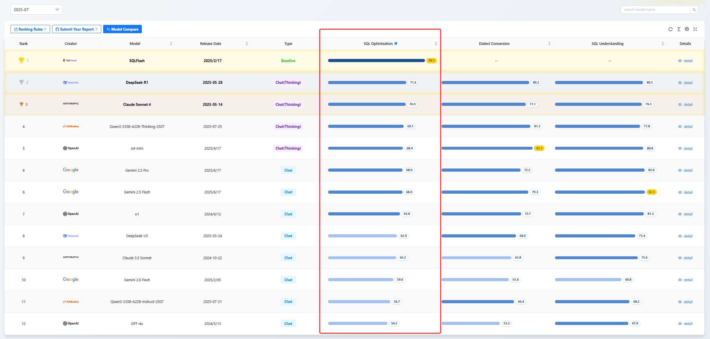
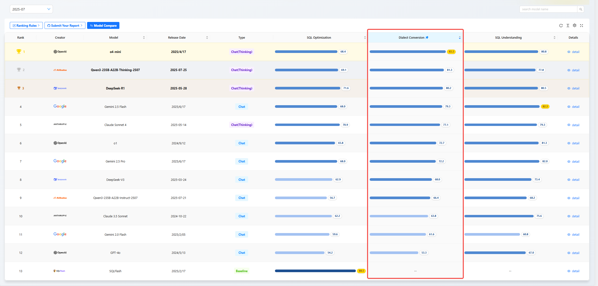
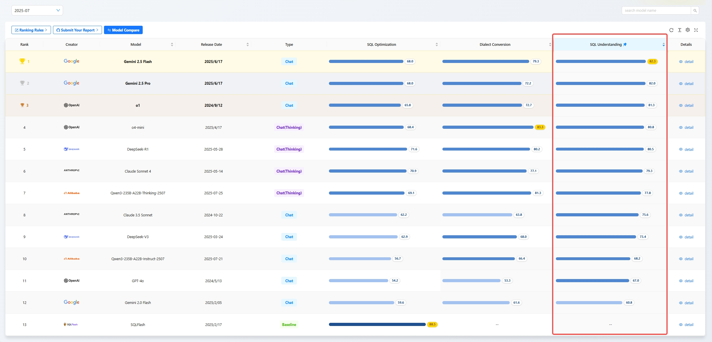
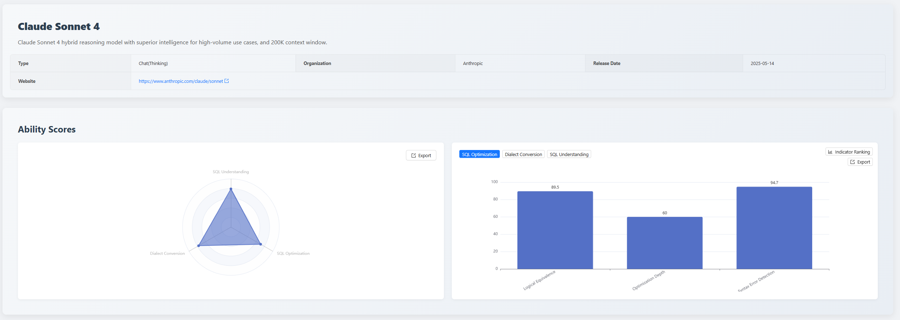
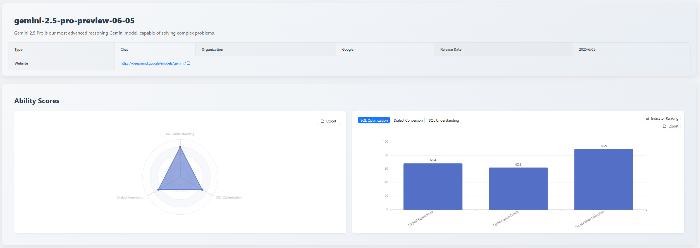
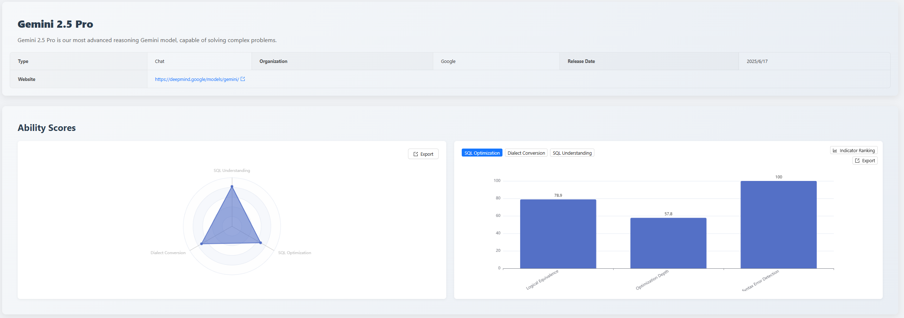
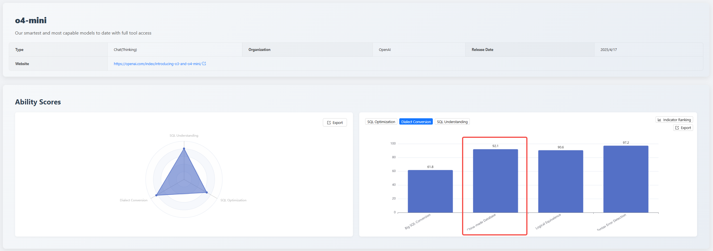

## 1. Executive Summary

In July 2025, competition in the field of AI large models for code generation and understanding, particularly in database SQL capabilities, is intensifying.

This edition of the [SCALE](https://sql-llm-leaderboard.com/ranking/2025-07) evaluation welcomes the highly anticipated first participation of **Claude 3.5 Sonnet** and **Claude Sonnet 4**, while the **Gemini 2.5** series also officially enters its stable version. More importantly, addressing the real pain points of database modernization migration, we have made significant upgrades to the evaluation benchmark, aiming to more deeply test the models' SQL processing capabilities in complex, real-world scenarios.

**Key Highlights of This Edition:**

- **A New Champion or a Strong Contender?**

  How does the new participant **Claude 3.5 Sonnet** perform comprehensively across the three core dimensions of SQL Optimization, Dialect Conversion, and Understanding in its first evaluation? Can it challenge the existing top-tier landscape?

- **Dialect Conversion Benchmark Upgrade**

  We have introduced two new evaluation metrics for the first time: **Large SQL Conversion** and **Domestic Database Conversion**, comprehensively testing the models' abilities when handling advanced database objects like ultra-long, complex logic, stored procedures, and functions.

- **Stable Version Performance Verification**

  **Gemini 2.5 Pro** and **Gemini 2.5 Flash** have reached their stable versions. Compared to the preview versions, have their performance and stability been fully improved?

## 2. Evaluation Benchmark and Updates

To more accurately assess the practicality of AI models in enterprise-level complex database scenarios, this month we have expanded and deepened the evaluation dataset for the **SQL Dialect Conversion** dimension.

### 2.1 New Metric: Large SQL Conversion

In actual database migration projects, handling legacy **Large SQL** (typically referring to single SQL statements exceeding hundreds of lines with complex logic) is a common and challenging problem. We found that many models struggle with context loss, logical errors, and syntax issues when facing such long-text, high-complexity conversion tasks.

**Evaluation Purpose**: To test the model's conversion accuracy and logic preservation capability when processing ultra-long SQL scripts containing multi-level nested queries, complex JOINs, and temporary tables.

### 2.2 New Metric: Domestic Database Conversion

Core enterprise business systems are accelerating migration from traditional commercial databases to domestic databases. In this process, the accuracy and efficiency of migrating complex applications deeply reliant on database procedural programming capabilities (like stored procedures and functions) become a key bottleneck.

**Evaluation Purpose**: To evaluate the model's ability to automatically convert traditional commercial databases to domestic databases. This involves not just SQL translation but also the cross-dialect migration of programming logic like variable declaration, flow control, and exception handling.

### 2.3 Supported Conversion Paths This Edition

From Oracle to OceanBase (Oracle mode) 4.2.5.

Based on the updated evaluation benchmark above, this month's leaderboard shows some noteworthy new changes. Next, let's reveal the detailed evaluation results and in-depth analysis for this edition.

## 3. Monthly Leaderboard and Focus Analysis

### 3.1 Dimensional Capability Rankings

**Top 5 in SQL Optimization Capability**

1. SQLFlash: 88.5
2. DeepSeek-R1: 71.6
3. Claude Sonnet 4: 70.9
4. Qwen3-235B-A22B: 69.1
5. GPT-o4-mini: 68.4

**Top 5 in SQL Dialect Conversion**

1. GPT-o4-mini: 83.3
2. Qwen3-235B-A22B: 81.3
3. DeepSeek-R1: 80.2
4. Gemini 2.5 Flash: 79.3
5. Claude Sonnet 4: 77.1

**Top 5 in SQL Understanding Capability**

1. Gemini 2.5 Flash: 82.3
2. Gemini 2.5 Pro: 82.0
3. GPT-o1: 81.3
4. GPT-o4-mini: 80.8
5. DeepSeek-R1: 80.5

### 3.2 Focus 1: Claude Sonnet 4 Debut Evaluation

As Anthropic's latest offering, **Claude Sonnet 4** demonstrated balanced but not yet top-tier strength in this month's evaluation. Its scores in the three dimensions of SQL Optimization, Dialect Conversion, and SQL Understanding are 70.9, 77.1, and 79.3 respectively, placing it in the upper-middle range of the overall leaderboard.

- **SQL Optimization Capability Analysis**: Total score 70.9, rank 3. Its strengths lie in its excellent "Logical Equivalence" guarantee (89.5 points) and adherence to syntax and best practices (94.7 points), enabling it to generate high-quality, standardized SQL. However, it scored only 60 in "Optimization Depth", indicating significant room for improvement in providing deeper SQL optimization.

- **Dialect Conversion and SQL Understanding Performance**: Ranked 5th and 6th with 77.1 and 79.3 points respectively. Among the dialect conversion sub-items, its **Domestic Database Conversion capability** (97.4 points) is outstanding, nearly reaching the top level. But in **Large SQL Conversion**, it scored only 41.2 points, exposing a clear weakness in handling ultra-long contexts. In SQL Understanding, its Execution Accuracy (87.1 points) and Syntax & Best Practices (74.3 points) are steady, but its Execution Plan Analysis score is only 46.4 points, suggesting its understanding of the underlying SQL execution logic needs strengthening.

Overall, **Claude Sonnet 4** is a well-rounded performer, excellent in SQL code standardization and correctness, but there remains a gap compared to top-tier models in the depth of performance optimization and the ability to handle extremely complex problems.

### 3.3 Focus 2: Gemini 2.5 Stable vs. Preview Version

In this evaluation, the stable version of Gemini 2.5 Pro showed comprehensive capability improvement compared to its 06-05 preview version, with the model's comprehensive score increasing from 80 to 82 points. This indicates effective optimization in both stability and comprehensive SQL processing capability. Specifically:

- **Significantly Enhanced Syntax Error Detection**: Improved from 89.5 to 100 points. This means the stable version model not only generates more efficient SQL but also better conforms to standard development norms.
- **Stable and Improved Dialect Conversion Capability**: The score increased from 67.1 to 72.2, maintaining a stable conversion level.

Overall, the **Gemini 2.5 Pro stable version** has delivered on its promise from preview to stable, achieving breakthrough progress especially in the depth and standardization of SQL optimization, making it a more reliable and efficient database development assistant tool.

### 3.4 Focus 3: Revealing Domestic Database Conversion Capabilities

On the critical migration path from Oracle to OceanBase (Oracle mode) 4.2.5, the performance of various models diverged significantly. The evaluation revealed the core challenges AI currently faces in handling real-world complex migration scenarios:

- **Challenge**: Weak understanding of complex function syntax, prone to "factual hallucinations".
- **Evaluation Performance**: In a key complex function conversion test, the overall correct rate for the question was only 25%, with only three models—DeepSeek-R1, Claude Sonnet 4, and Gemini 2.5 Flash—providing the correct answer.
- **Root Cause**: When performing dialect conversion, models are prone to "hallucinations" about the compatibility of certain operators. For example, when processing Oracle's `CAST ({ expr | MULTISET (subquery) } AS type_name )` syntax, most models incorrectly assume that the target OceanBase (Oracle mode) does not support the MULTISET operator, and thus wrongly replace it with the COLLECT aggregate function. But the fact is the opposite: OceanBase's Oracle mode supports MULTISET but does not support COLLECT, https://www.oceanbase.com/docs/common-oceanbase-database-cn-1000000001504555 "OceanBase MULTISET Support Details".

**This kind of reasoning based on inaccurate "knowledge" leads to fundamental errors in conversion logic, which is an obstacle that must be overcome for AI-assisted code migration to become production-ready.**

## 4. Evaluation Model Change Log This Edition

To ensure the timeliness and cutting-edge nature of the SCALE evaluation, we have added and upgraded the following models this month:

### 4.1 Newly Evaluated Models

| Model Name               | Remarks                                         |
| :----------------------- | :---------------------------------------------- |
| Claude 3.5 Sonnet        | Latest model released by Anthropic in June 2024 |
| Claude Sonnet 4 thinking | Latest model released by Anthropic in May 2025  |

### 4.2 Upgraded Evaluation Models

| Model Name               | Old Version                  | New Version (Used in this Evaluation) |
| :----------------------- | :--------------------------- | :------------------------------------ | --- |
| Qwen3-235B-A22B-Thinking | 2024-04-29                   | Qwen3-235B-A22B-Thinking-2507         |
| Qwen3-235B-A22B-Instruct | 2024-04-29                   | Qwen3-235B-A22B-Instruct-2507         |
| Gemini 2.5 Pro           | gemini-2.5-pro-preview-06-05 | gemini-2.5-pro (Stable Version)       |     |
| Gemini 2.5 Flash         | gemini-2.5-pro-preview-06-05 | gemini-2.5-flash (Stable Version)     |

## 5. Summary

This month's evaluation results show that as the evaluation dimensions deepen, the capability differences between models are further amplified. Especially in the newly added **Large SQL Conversion** evaluation, only a few top models could handle the task well, pointing out a key direction for future model iterations. The addition of **Claude Sonnet 4** has brought new vitality to the market, and the performance of the **Gemini 2.5 series (Stable Version)** also validates the results of its continuous optimization.

_Data cutoff date: December 2, 2025_

> View the complete leaderboard and contact us to submit your product for evaluation. *https://sql-llm-leaderboard.com/*

**SCALE: Choose the Professional AI Model for Professional SQL Tasks.**
