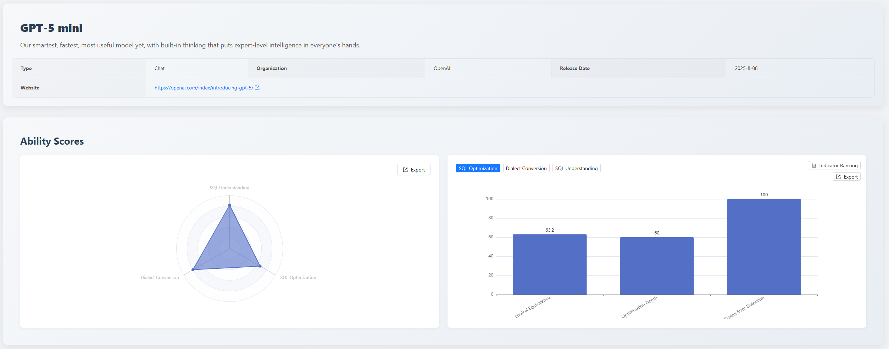
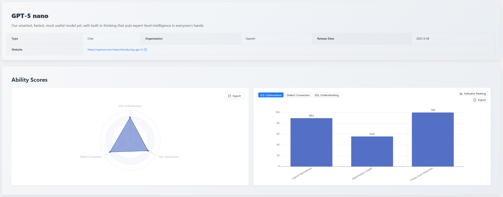
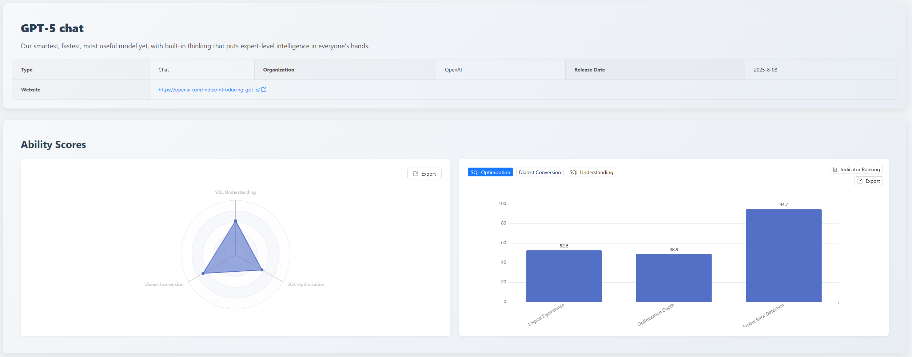
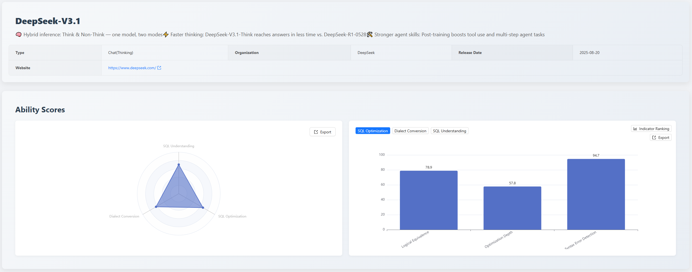
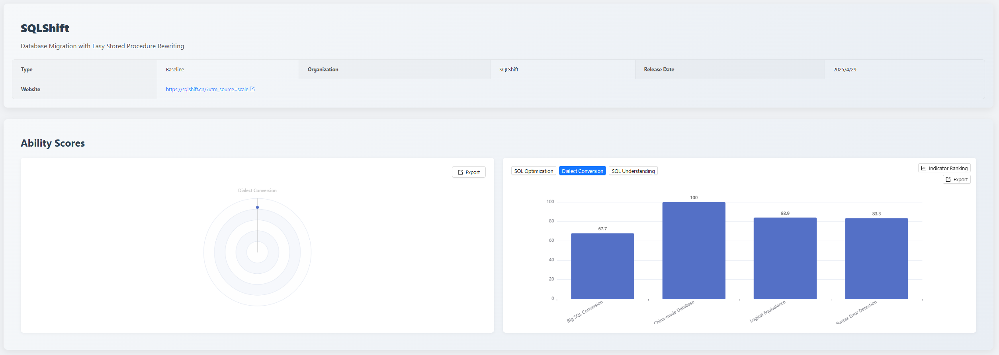
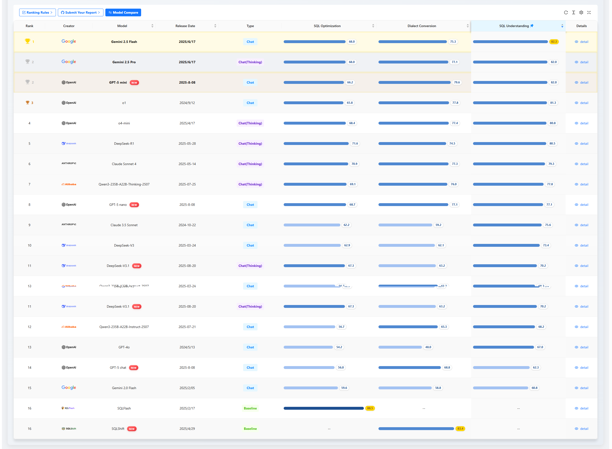
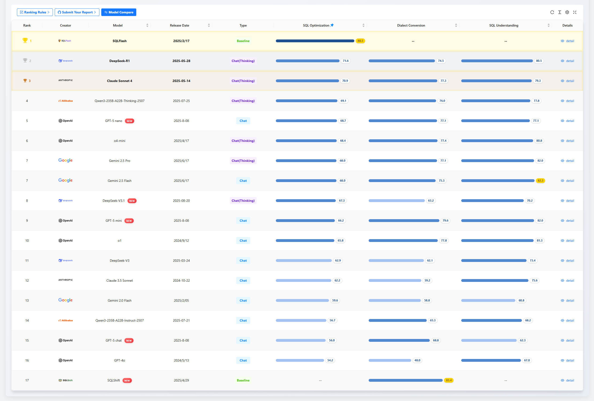
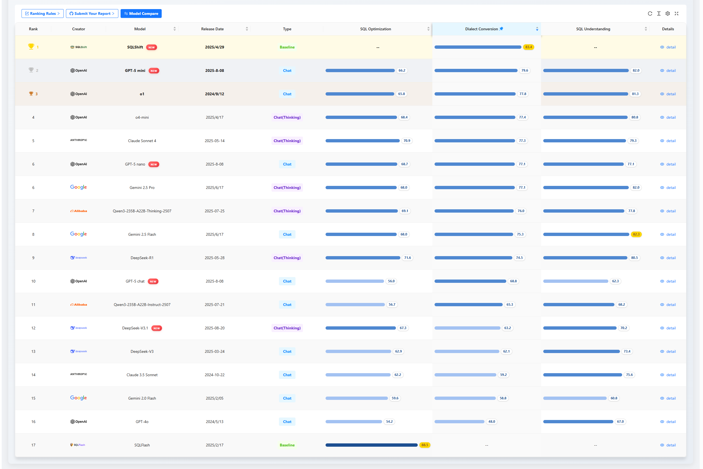

## 1. Executive Summary
In August 2025, the [SCALE](https://sql-llm-leaderboard.com/ranking/2025-08) evaluation benchmark continues to track the cutting edge of AI technology. This month, we welcome several highly anticipated new models and, for the first time, include the professional dialect conversion application — [SQLShift](https://sqlshift.cn/) — as a baseline in our evaluation scope. This aims to provide developers and decision-makers with more comprehensive and practically instructive references.

**Key Highlights of This Edition:**

- **Significant Capability Divergence Within the GPT-5 Series**
  
  The new-generation **GPT-5 family** exhibits distinct characteristics internally. **gpt-5-mini** shows balanced performance in accuracy, reliability, and complex task handling, leading in comprehensive strength; **gpt-5-nano**, with its extremely high syntactic correctness, becomes a reliable "code generator"; while the flagship model **gpt-5-chat** is rich in theoretical knowledge but has significant shortcomings in the accuracy of basic execution. The evaluation results once again confirm the core view that "**scenario defines model value**."
  
- **Balanced Performance from New Domestic Contender**

  **DeepSeek-V3.1** demonstrates relatively balanced strength across the three core dimensions of *SQL Understanding*, *Optimization*, and *Dialect Conversion*, achieving perfect performance in specific scenarios like *Domestic Database Conversion*, but still has room for improvement in handling ultra-long complex queries and deep optimization.
  
- **First Evaluation of a Professional Tool**
  
  This month marks the first time we have evaluated a dedicated "Dialect Conversion Application," https://sqlshift.cn/. It demonstrates powerful performance in its core domain, initiating a performance comparison between general-purpose large models and specialized tools in specific scenarios.

## 2. Evaluation Benchmark
To ensure the fairness, depth, and reproducibility of this evaluation, we continue to use and hereby clarify SCALE's three-dimensional evaluation system. All models and tools are tested in a standardized environment to ensure fair and comparable results.

- **SQL Understanding**: Examines whether the model can accurately parse complex query logic and user intent.
- **SQL Optimization**: Examines the model's awareness and capability to improve query efficiency and performance.
- **Dialect Conversion**: Examines the accuracy of the model's syntax migration between mainstream databases.

## 3. Newly Evaluated Models and Applications This Month
To ensure the timeliness and cutting-edge nature of the evaluation, we have added the following models and applications this month:

| Name/Version      | Producer    | Release Date |
|----------------|------------|------------|
| GPT-5 chat     | OpenAI     | 2025/8/8   |
| GPT-5 mini     | OpenAI     | 2025/8/8   |
| GPT-5 nano     | OpenAI     | 2025/8/8   |
| DeepSeek-V3.1  | DeepSeek   | 2025/8/20  |
| SQLShift       | SQLShift   | 2025/2/28  |

## 4. Focus Analysis

### 4.1 Focus 1: First Evaluation of the GPT-5 Series Models
As a long-awaited new generation of models in the industry, the GPT-5 series demonstrates its initial performance in SQL processing capabilities in this month's evaluation.

#### 4.1.1 GPT-5 mini: The Balanced Leader with Comprehensive Capabilities

- **Comprehensive Evaluation**: **gpt-5-mini** **leads in comprehensive performance** in this evaluation, with balanced and outstanding capabilities across dimensions, making it the preferred choice for enterprise-level applications pursuing stable output and overall performance.
- **Strengths**: High execution accuracy and strong reliability (82.0 points in the *SQL Understanding* dimension); solid foundational capabilities (92.9 points in Syntax Error Detection within *Dialect Conversion*).
- **Weaknesses**: Conventional optimization capability is not top-tier (66.2 points in *SQL Optimization*); limited long-text processing capability (58.1 points in *Large SQL Conversion*). During conversion from Oracle to Postgresql-9.2, logical inequivalence issues arose in the exception handling of stored procedures, even losing the error handling mechanism. It can be seen that **gpt-5-mini** lacks a deep understanding of "programming paradigms" in certain scenarios.

#### 4.1.2 GPT-5 nano: The High-Precision Code Generator

- **Comprehensive Evaluation**: **gpt-5-nano** is an excellent "SQL code generator," suitable for embedding into automated workflows to handle standardized "Text-to-SQL" and simple dialect conversion tasks.
- **Strengths**: Extremely high syntactic correctness (achieved a perfect score of 100 in all *Syntax Error Detection* sub-items); solid logical conversion capability.
- **Weaknesses**: Lacks deep understanding of SQL execution efficiency (35.7 points in *Execution Plan Detection*). Analysis of **gpt-5-nano**'s execution plan evaluation reveals: the model relies too heavily on pattern matching and probabilistic prediction, has an inaccurate understanding of UPDATE statement execution plans, and an incomplete understanding of the meaning of EXPLAIN result fields, particularly `type`, `key`, and `filtered`, confusing the filtering rate of WHERE conditions with the actual processing logic of UPDATE operations. Simultaneously, the model also struggles with complex, lengthy query migrations (58.1 points in *Large SQL Conversion*).

#### 4.1.3 GPT-5 chat: Divergent Capability Characteristics

- **Comprehensive Evaluation**: The comprehensive performance of **gpt-5-chat** is below expectations. It excels in advanced theoretical knowledge but has significant shortcomings in the accuracy of basic execution.
- **Strengths**: Rich theoretical knowledge reserve (94.7 points in *Syntax Error Detection* within *SQL Optimization*).
- **Weaknesses**:
  - Worrisome accuracy in basic execution (only 57.1 points in *Execution Accuracy* within *SQL Understanding*). During the *Execution Accuracy* dataset evaluation, **gpt-5-chat** could not accurately determine the return result type, failing to correctly identify whether the SQL statement's return type was `select` or `table_state`.
  - Additionally, it is also weak in handling complex, large query migrations (only 51.6 points in *Large SQL Conversion*). The target SQL was logically inequivalent to the original SQL, and it failed to accurately identify syntax version compatibility issues. For example, `ON CONFLICT` is only available in Postgresql-9.5 and above, but **gpt-5-chat** generated this syntax for Postgresql-9.2.

### 4.2 Focus 2: DeepSeek-V3.1 Evaluation Analysis

- **Comprehensive Evaluation**: **DeepSeek-V3.1** demonstrates relatively balanced comprehensive strength, with no obvious weaknesses across the three dimensions, but there is still room for improvement in performance.
- **Strengths**: The model performs steadily in *Syntax Error Detection* and adhering to *Syntax & Best Practices*, ensuring the basic usability of generated code. It also performs accurately in specific scenarios like *Domestic Database Conversion*.
- **Weaknesses**: Its core shortcoming lies in the risk of logical omissions when handling ultra-long, **complex *Large SQL Conversions*** (25.8 points). Simultaneously, in terms of deep understanding of **SQL performance and execution logic** (i.e., *Execution Plan Detection*), and *Optimization Depth*, it tends to provide general-purpose solutions, lacking deep insights.

### 4.3 Focus 3: First Evaluation of Dialect Conversion Application SQLShift
This month, we expanded our evaluation to include specialized tools. **SQLShift**, as an application focused on SQL dialect conversion, aims to provide decision-making basis for teams with high-precision, high-complexity database migration needs through its evaluation results.

- **Evaluation Dimension**: This evaluation focuses on its core **Dialect Conversion capability**.
- **Evaluation Performance Analysis**: As a professional tool, **SQLShift** demonstrates powerful performance in its core domain.
  - **Domestic Database Conversion**: **SQLShift** achieved a perfect score of 100 in this item, demonstrating high adaptation and deep understanding of the domestic database ecosystem.
  - **Large SQL Conversion**: In the complex SQL conversion task where general-purpose large models generally perform poorly, **SQLShift** achieved a high score of 67.7, higher than the second-placed **o4-mini** (61.3 points). It is currently the first tool that can ensure high logical consistency and accuracy in this scenario.

## 5. Monthly Leaderboard Review
With the addition of new models, the top rankings in each dimensional capability leaderboard have changed significantly this month, highlighting the trend towards specialization and scenario-specific development of AI in the SQL field.

### 5.1 SQL Understanding

**Brief Commentary:** This month, the top position in this dimension is occupied by Google's **Gemini series** models, with **Gemini 2.5 Flash** ranking first with 82.3 points. The newly released **GPT-5 mini** performed excellently, entering the top three with 82.0 points, showing strong comprehensive strength, particularly with high scores in the execution accuracy sub-item.

### 5.2 SQL Optimization

**Brief Commentary:** The specialized optimization model **SQLFlash** continues to hold the top position in this dimension with a significantly high score of 88.5 points, creating a large gap with other models. Among the new models, **gpt-5-nano** entered the top five with its high scores in syntactic reliability. The evaluation results show that general-purpose large models still have a significant gap compared to specialized models in deep optimization capabilities.

#### 5.3 Dialect Conversion

**Brief Commentary:** The specialized application https://sqlshift.cn/, evaluated for the first time this month, ranks first with 83.4 points, showing outstanding performance especially in sub-items like *Large SQL Conversion*. This reflects the advantage of professional tools in specific domains. Among general models, **gpt-5-mini** ranks second with 72.4 points, demonstrating its strong capability in syntactic migration.

## 6. Summary
This month's evaluation introduced **new GPT-5 series models**, **Deepseek-V3.1**, and the professional-grade application https://sqlshift.cn/, further enriching the depth and breadth of the SCALE leaderboard. The evaluation results once again indicate that in professional-grade SQL tasks, different models and tools show significant capability divergence. General-purpose large models are continuously improving, demonstrating powerful general problem-solving abilities. However, **this evaluation also clearly reveals that when facing specific scenarios such as high-demand database dialect conversion, the core advantages of professional tools (like https://sqlshift.cn/) are irreplaceable. Through deep domain knowledge optimization, precise handling of complex edge cases, and more stable and reliable output, they demonstrate accuracy and adaptability surpassing that of general models.** This once again verifies that for enterprise-level applications pursuing performance and reliability, choosing professional tools adapted to specific scenarios remains the optimal strategy.

*Data cutoff date: December 2, 2025*

> View the complete leaderboard and contact us to submit your product for evaluation. [https://sql-llm-leaderboard.com/](https://sql-llm-leaderboard.com/)

**SCALE: Choose the Professional AI Model for Professional SQL Tasks.**
