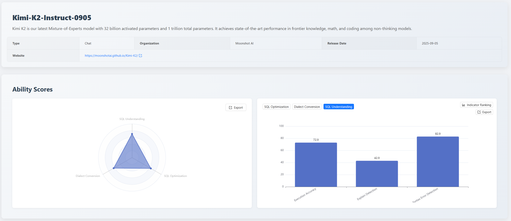
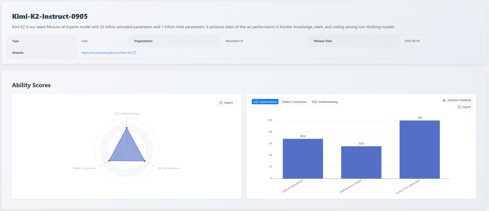
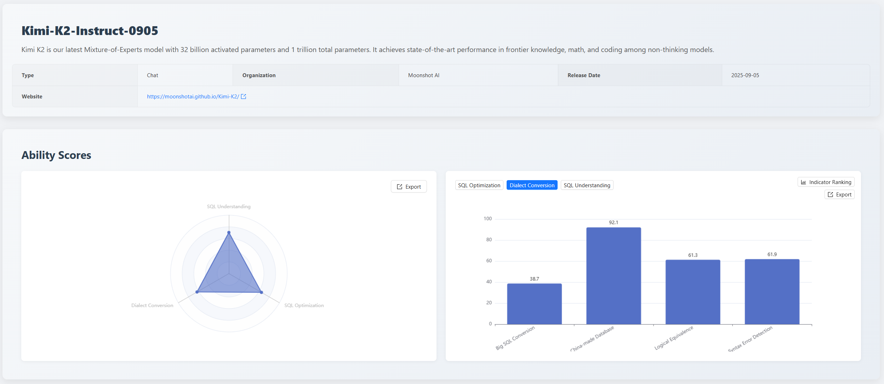
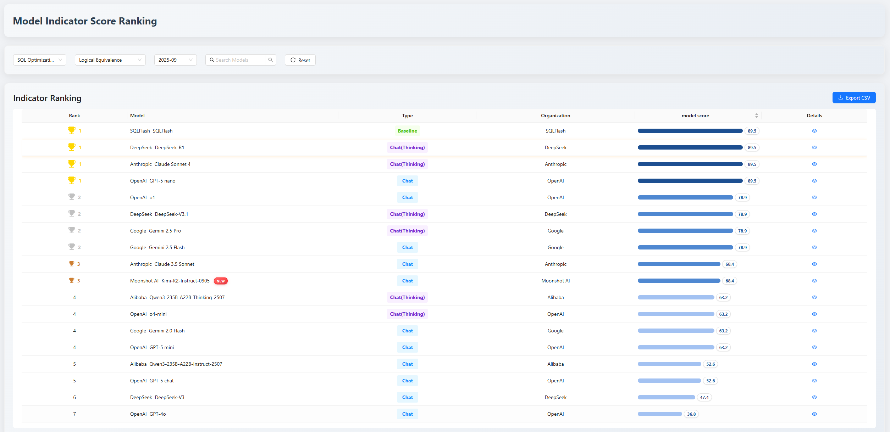
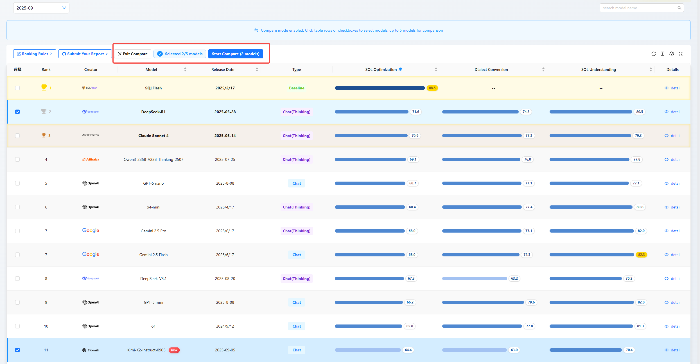
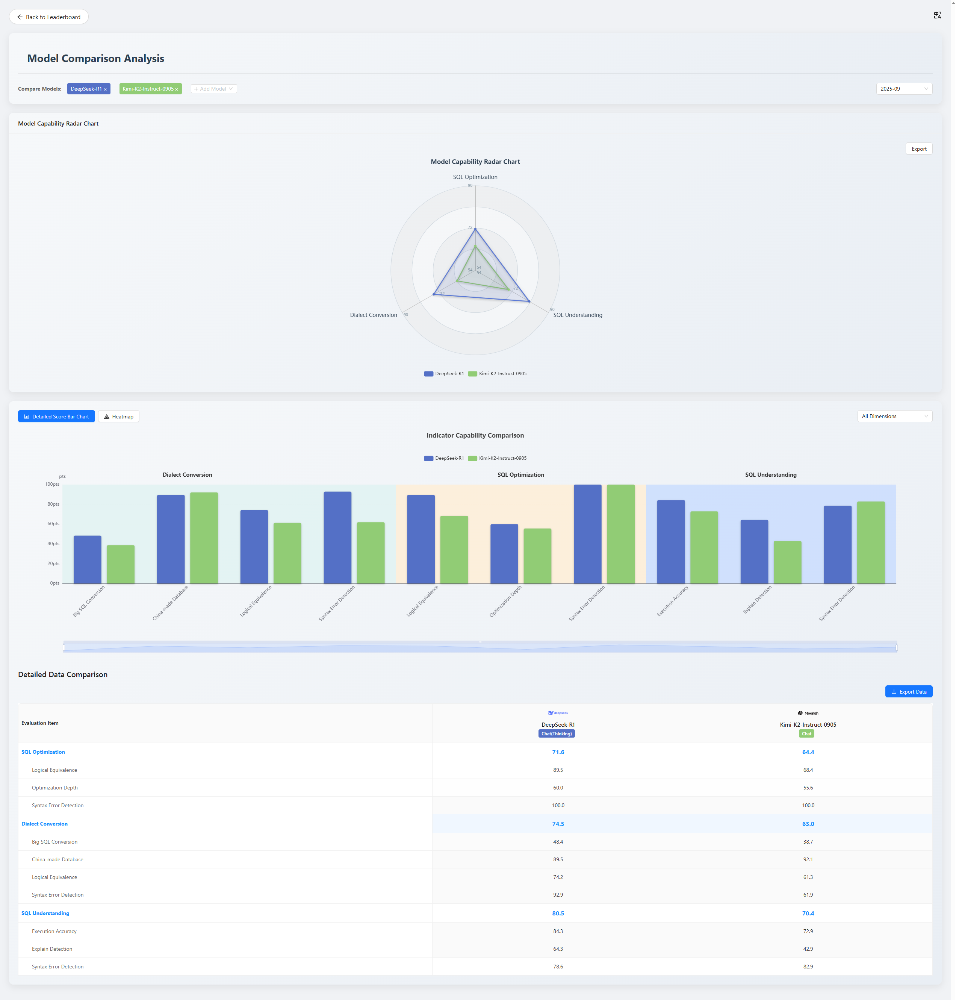

## 1. Executive Summary

In September 2025, the  [SCALE](https://sql-llm-leaderboard.com/ranking/2025-09) evaluation benchmark continues to focus on the cutting-edge applications of AI in the SQL domain.

This month, the leaderboard welcomes the latest model from [Moonshot AI](https://www.moonshot.cn/) - **Kimi-K2-Instruct-0905**. Additionally, platform features have been upgraded, aiming to provide developers, researchers, and enterprise decision-makers with more detailed and insightful technical references.

**Key Highlights of This Edition:**

- **New Model Evaluation**: The newly added Kimi K2 model scored 70.4 in the "**SQL Understanding**" dimension, 64.4 in the "**SQL Optimization**" dimension, and 63.0 in the "**Dialect Conversion**" dimension. Evaluation results show that **this model performs exceptionally well in adapting to Chinese domestic databases and handling basic syntax**, but there is a gap compared to leading models when dealing with ultra-long complex queries and deep optimization.
- **Platform Feature Upgrade**: Added **Detailed Metric Rankings for Models** and **Model Comparison** features. Users can now view model rankings in specific capabilities like "**Logical Equivalence**" and "**Execution Accuracy**", and support multi-dimensional visual comparative analysis of multiple models, further enhancing the transparency and practicality of evaluation data.

## 2. Evaluation Benchmark

To ensure the long-term comparability and authority of evaluation results, our core evaluation benchmarks and algorithms remain unchanged this month. We continue to use the three-dimensional evaluation system established since SCALE's inception, ensuring all models and tools are evaluated under a unified, standardized testing environment to provide fair and reproducible evaluation results.

- **SQL Understanding**: Examines whether the model can accurately parse complex query logic and user intent.
- **SQL Optimization**: Examines the model's awareness and capability to improve query efficiency and performance.
- **Dialect Conversion**: Examines the accuracy of the model's syntax migration between mainstream databases.

We believe that a stable evaluation system is the cornerstone for tracking model capability evolution and gaining insights into technological development trends.

## 3. Focus Analysis

### 3.1 Focus: First Evaluation of Chinese Domestic Model Kimi K2

As the newly added focal model this month, Kimi K2 received the following scores in its first evaluation:
- **SQL Understanding**: 70.4
- **SQL Optimization**: 64.4
- **Dialect Conversion**: 63.0

These scores reveal the specific capability distribution of this general-purpose large model in the SQL domain.

#### 3.1.1 SQL Understanding Capability: 70.4
This is a solid score, indicating **Kimi K2 possesses reliable Text-to-SQL foundational capabilities.**

This score is primarily attributed to its good performance in "**Execution Accuracy**" (72.9) and "**Syntax Error Detection**" (82.9). However, its score in the "**Execution Plan Detection**" sub-item is only 42.9. This reflects that the model can accurately generate SQL code that aligns with user intent, but the evaluation found that Kimi K2 misidentified SQL statement types as execution plan access types, filling in access types with INSERT, UPDATE, etc. This demonstrates a problem of over-reliance on surface syntactic features rather than deep semantic understanding. **Kimi K2's ability to understand SQL execution plans still needs strengthening.**

#### 3.1.2 SQL Optimization Capability: 64.4
This score reflects the model's characteristic capabilities in **SQL Optimization**: **Focusing on ensuring syntactic correctness, but lacking in deep optimization.**

Specifically, it achieved a perfect score of 100 in "**Syntax Error Detection**", ensuring the usability of optimized code; "**Logical Equivalence**" (68.4) performance is acceptable. However, its core weakness lies in "**Optimization Depth**" (55.6), with this item ranking only 14th. This indicates its optimization strategies tend to be conservative and general-purpose, performing poorly in projection pushdown and LIKE prefix optimization evaluations. **Kimi K2 failed to utilize these query optimization techniques, lacking the ability to perform deep restructuring of complex queries to enhance performance.**

#### 3.1.3 Dialect Conversion Capability: 63.0

The scores in this dimension show a typical capability divergence. The model's strength lies in its adaptability to the domestic database ecosystem, with its "**Chinese Domestic Database**" conversion sub-item scoring as high as 92.1. However, it struggles significantly when handling "**Large SQL Conversion**", scoring only 38.7, which is one of its main weaknesses.

This indicates that Kimi K2 performs excellently in handling standardized migration tasks with clear domestic requirements, but encountered logical inequivalence issues during large SQL conversion from SQL Server to GaussDB. For example, in the original SQL `WHERE ProductID = @ProductID`, Kimi K2 incorrectly rewrote it as `WHERE ProductID = ProductID`. The original SQL uses parameter variables, while the rewritten version uses self-comparison, which is always true. This would lead to updating the entire Products table, not just the row pointed to by the current cursor. This demonstrates **Kimi K2's difficulty in coping with heterogeneous database migration scenarios involving ultra-long, complex logic.**

## 4. Platform Upgrade: Deeper, More Intuitive Comparative Analysis

To help users translate evaluation data into actual selection decisions, the SCALE platform officially launched two core features this month. Their core value lies in shifting users from macro-level browsing of "**looking at total score rankings**" to deep analysis of "**finding the optimal solution for specific scenarios**".

### 4.1 Detailed Metric Rankings for Models
*Go beyond total scores to understand a model's specialized characteristics.*

This feature allows users to drill down into 12 detailed metrics to view model rankings on specific sub-tasks, assessing whether a model meets specific scenario requirements.

**Application Example**: Taking Kimi K2 as an example, its total "**SQL Optimization**" rank is 12th. Looking only at the total score might cause it to be overlooked in preliminary screening. But through detailed metric rankings, we find its "**Syntax Error Detection**" ranks 9th, and "**Logical Equivalence**" ranks 10th. This reveals that the model is reliable in ensuring basic code usability, but has shortcomings in deep optimization. For teams prioritizing code correctness over ultimate performance, Kimi K2 would be a better option.

### 4.2 Model Comparative Analysis
*Move beyond blind selection; intuitively identify the optimal solution for your scenario.*

This feature allows users to select multiple models for multi-dimensional visual comparison, facilitating intuitive selection trade-offs.

**Application Example**: Suppose a team needs to choose between the capabilities of "**supporting Chinese domestic databases**" and "**handling complex query migration**". Using the model comparison feature to compare Kimi K2 with DeepSeek-R1 side-by-side, the data clearly shows: Kimi K2 has a significant advantage in "**Chinese Domestic Database**" conversion but is far inferior to DeepSeek-R1 in "**Large SQL Conversion**". This visual result makes the decision path clear: if the core task is adapting to domestic databases, Kimi K2 is the better choice; otherwise, the latter should be chosen. This feature transforms complex selection evaluation into intuitive data comparison, greatly improving decision-making efficiency and accuracy.

## 5. Summary

With the addition of new models like Kimi K2, the SCALE evaluation leaderboard has now accumulated over 19 mainstream AI models and professional tools from the industry. This month's feature upgrades are an important step in enhancing the platform's value. More transparent and user-friendly data will help the community make prudent technical selections.

## 6. Future Outlook
The SCALE evaluation system will continue to track the latest model developments and iteration progress from major vendors. We are committed to promoting deeper application and practice of large language models in the database field through fair and transparent evaluation data, together with the community.

**Explore the professional capabilities of the new generation of models now!** You are welcome to log in to the official SCALE platform to view the complete latest leaderboard and detailed model comparisons, and jointly grasp the pulse of cutting-edge AI technology.

*Data cutoff date: October 10, 2025*

> View the complete leaderboard and contact us to submit your product for evaluation. [https://sql-llm-leaderboard.com/](https://sql-llm-leaderboard.com/)

**SCALE: Choose the Professional AI Model for Professional SQL Tasks.**
