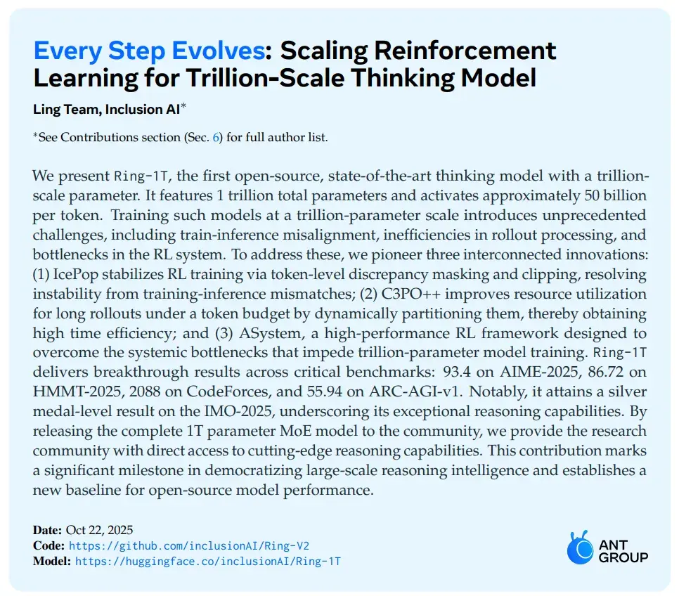
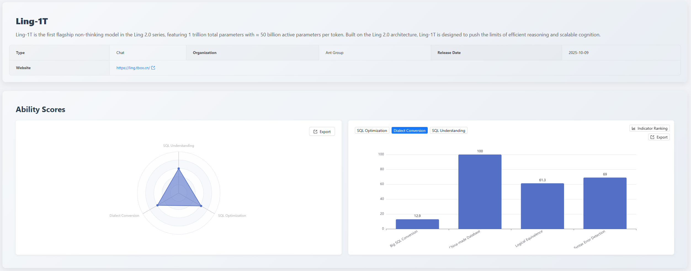
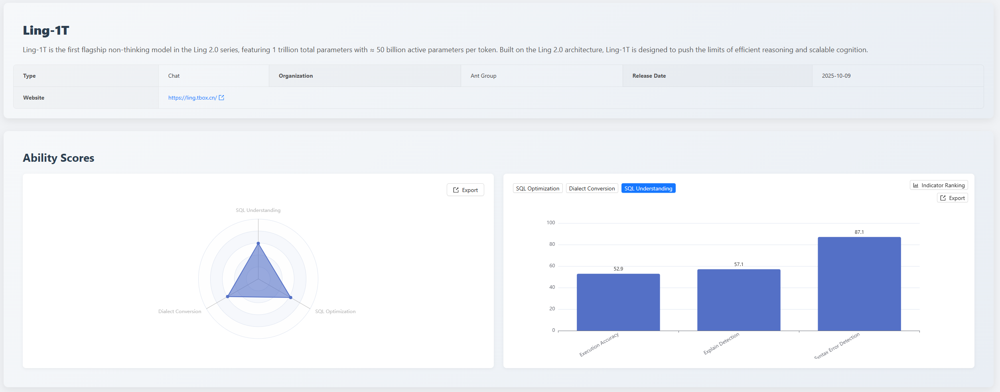
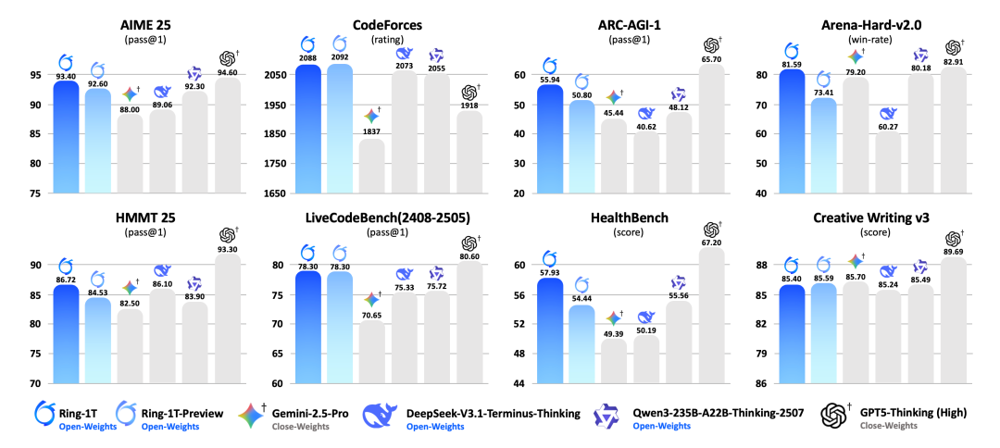
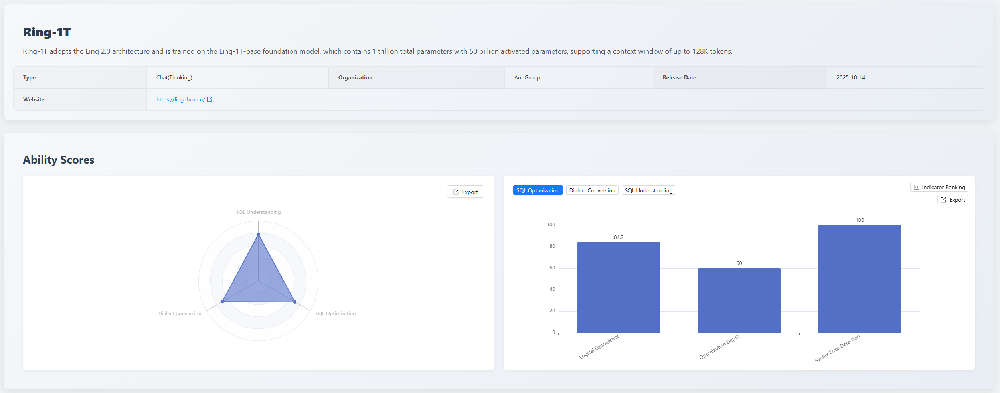
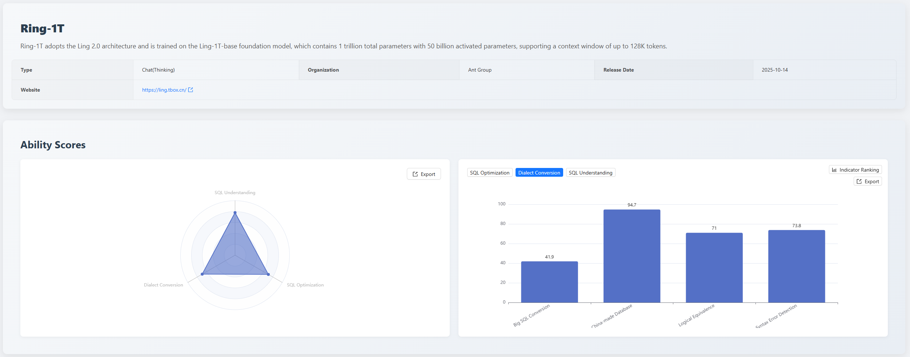

## 1. Executive Summary

In October 2025, the [SCALE](https://sql-llm-leaderboard.com/ranking/2025-10) evaluation benchmark continues to track the latest advancements of AI in the professional SQL domain.

This month, the leaderboard welcomes two new trillion-parameter models released by Ant Group's Bailing large model team: [Ling-1T](https://huggingface.co/inclusionAI/Ling-1T) and [Ring-1T](https://huggingface.co/inclusionAI/Ring-1T).

* **Ling-1T**: The first flagship model of Ant Group Bailing's **Ling 2.0** series.
* **Ring-1T**: A reasoning model based on the **Ling 2.0** architecture, also the world's first open-source trillion-parameter reasoning model.

**Key Highlights of This Edition:**

* **New Model Evaluations**: First-time introduction of Ant's *Ling-1T* and *Ring-1T* models. Evaluation data shows a clear differentiation in their capabilities:
  * Ling-1T performs exceptionally well in "**Domestic Database**" conversion scenarios, achieving a perfect score!
  * Ring-1T demonstrates **more balanced and robust comprehensive capabilities** in both the "**SQL Optimization**" and "**SQL Understanding**" dimensions, with total scores placing it in the upper tier of the leaderboard.

## 2. Evaluation Benchmark

To ensure long-term comparability and authority of the evaluation results, our core evaluation benchmark and algorithms remain unchanged this month. We continue to use the three-dimensional evaluation system established since the inception of **SCALE**, ensuring all models and tools are assessed under a unified, standardized testing environment to provide fair and reproducible evaluation results.

* **SQL Optimization**: Examines the model's awareness and capability to improve query efficiency and performance.
* **Dialect Conversion**: Examines the accuracy of the model's syntax migration between mainstream databases.
* **SQL Understanding**: Examines the model's ability to accurately parse complex query logic and user intent.

All newly added models this month are evaluated under this standard system.

## 3. Focus Analysis

### 3.1 Focus 1: First Evaluation of Ling-1T

*Ling-1T*, as the first flagship non-reasoning model of the **Ling 2.0** series, participated in the evaluation for the first time this month. Its total scores across dimensions are:

* **SQL Optimization**: 62.5
* **Dialect Conversion**: 59.2
* **SQL Understanding**: 59.4

The evaluation results indicate that this model has distinct characteristics, excelling in specific scenarios but showing clear shortcomings in handling complex tasks.

#### 3.1.1 SQL Optimization Capability: 62.5

*Ling-1T* scored 62.5 in the **SQL Optimization** dimension. According to detailed metrics, the model performed excellently in "**Logical Equivalence**", ranking 5th with a score of 84.2.

However, its performance in "**Optimization Depth**" was insufficient, scoring only 51.1 (ranked 17th). Simultaneously, its score in "**Syntax Error Detection**" was also relatively low (84.2, ranked 18th). Analysis of the evaluation report shows that the model misjudged a `GROUP BY` query compliant with MySQL's loose mode as a syntax error; it also inaccurately understood the syntax rules for `ORDER BY/LIMIT` in `UNION` queries.

**Core Defect**: The model lacks contextual awareness of database-specific modes (like MySQL's `ONLY_FULL_GROUP_BY`) and **SQL standard/dialect differences**. It over-relies on dogmatic syntax rules and cannot flexibly judge syntactic correctness based on database configurations, leading to misjudgments in edge cases. This series of scores indicates that the model possesses the ability to ensure logical consistency but still has significant room for improvement in applying deep optimization strategies and ensuring syntactic standardization.

#### 3.1.2 Dialect Conversion Capability: 59.2

The scores in this dimension show a significant capability divergence (Total score 59.2, rank 17). **Its biggest highlight is its adaptability to the domestic database ecosystem**; its "**China-made Database**" conversion sub-item achieved a perfect score of 100 (tying with https://sqlshift.cn/), demonstrating its exceptional capability in this specific scenario.

However, the model struggled with complex migration tasks. Its score for "**Large SQL Conversion**" was only 12.9 (ranked 20th). The evaluation report shows that in complex SQL dialect conversions, the model misused incompatible syntax (e.g., retaining `SET NOCOUNT ON`, mixing `DBMS_OUTPUT`, etc.), and demonstrated insufficient semantic understanding of structures like control flow, cursors, and exception handling, leading to post-conversion syntax incompatibility or logical inequivalence. This reflects that the model's global comprehension of complex structured code and its precise grasp of multi-dialect semantic differences need improvement. Meanwhile, its scores for "**Logical Equivalence**" (61.3) and "**Syntax Error Detection**" (69.0) are moderate, indicating difficulty in ensuring code standardization when handling complex conversions for non-china-made databases.

#### 3.1.3 SQL Understanding Capability: 59.4

This score indicates that *Ling-1T* possesses basic SQL parsing capabilities. Detailed data shows it excels in "**Syntax Error Detection**", achieving a score of 87.1, tying for first place in this metric with *Claude 3.5 Sonnet*.

However, its performance in "**Execution Accuracy**" was poor, scoring only 52.9 (ranked 19th). Analysis of the evaluation report reveals that the model is prone to errors in date condition assessments. For example, in a query for `due_date < '2025-06-07'`, it returned records with `due_date='2025-06-10'`, clearly violating the condition. Such errors reflect the model's insufficient semantic understanding and rigor regarding date comparisons when executing SQL queries. This is one of its main weaknesses.

Furthermore, its score for "**Execution Plan Detection**" is 57.1. When predicting execution plans, the model incorrectly predicted `key` and `possible_keys` for fields not defined with indexes in the DDL. For instance, in a query for `WHERE fruit_name = 'Banana'`, the model predicted `key: "fruit_name"` and `possible_keys: "fruit_name"`, but the `fruit_name` field had no index in the DDL. This reflects that the model tends to speculate based on query patterns, leading to misjudgments, and there is still significant room for improvement in constraint validation capabilities and structured parsing and reasoning.

### 3.2 Focus 2: First Evaluation of Ring-1T

*Ring-1T*, as a trillion-parameter reasoning model based on the **Ling 2.0** architecture, demonstrates stronger comprehensive capabilities compared to *Ling-1T*. Its total scores across dimensions are:

* **SQL Optimization**: 70.5
* **Dialect Conversion**: 69.5
* **SQL Understanding**: 78.1

Its performance is more balanced.

#### 3.2.1 SQL Optimization Capability: 70.5

This score reflects the model's balanced ability in SQL optimization. It achieved a perfect score of 100 in "**Syntax Error Detection**" (tying with https://sqlflash.ai/), ensuring the standardization and usability of the optimized code. Its score for "**Logical Equivalence**" is 84.2 (ranked 6th), indicating excellent performance. The score for "**Optimization Depth**" is 60.0 (ranked 4th), showing that the model can apply conventional optimization strategies, but there is still room for progress in handling complex queries and performing deep refactoring for ultimate performance.

#### 3.2.2 Dialect Conversion Capability: 69.5

*Ring-1T* scored 69.5 in the Dialect Conversion dimension (ranked 11th). Detailed data shows robust performance in "**China-made Database**" conversion (94.7), "**Syntax Error Detection**" (73.8, ranked 9th), and "**Logical Equivalence**" (71.0).

Its shortcoming lies in "**Large SQL Conversion**", scoring only 41.9 (ranked 12th). The model encountered issues when handling complex structures like cross-database access (e.g., SQL Server's `[server].database.schema.table`), control flow (e.g., GOTO label jumps), error handling mechanisms (e.g., `@@ERROR` checks, `BEGIN TRY/CATCH`), dynamic SQL execution (e.g., `sp_executesql` parameter binding), leading to problems such as syntax mixing, semantic inequivalence, and incomplete structural conversion.

**Core Defect**: Lacks global comprehension of complex structured code and precise mapping ability for multi-dialect semantic differences, resulting in defects in the syntactic correctness or logical equivalence of the converted SQL. Compared to *Ling-1T*'s score of 12.9, this score shows significant improvement, indicating a stronger ability in handling "**Large SQL Conversion**" and ensuring code standardization, making it a more reliable database migration tool.

#### 3.2.3 SQL Understanding Capability: 78.1

A score of 78.1 represents a solid performance. It showed stability in "**Execution Accuracy**" (84.3). However, its scores for "**Execution Plan Detection**" (60.7) and "**Syntax Error Detection**" (67.1) were relatively low.

The model confused standard SQL syntax with database-specific rules, misjudging correct standard syntax as errors (e.g., using alias `category_prefix` in GROUP BY, `INSERT` subquery `INSERT INTO table (SELECT ...)`, using `HAVING` in `CREATE VIEW`, etc.). Concurrently, its inaccurate understanding of complex structures led to a combination of misjudgments and missed judgments, reflecting the model's insufficient accurate understanding of standard SQL specifications and the mechanical nature of its syntax rule judgments.

## 4. Summary

With the addition of Ant Group's two new models, *Ling-1T* and *Ring-1T*, the **SCALE** evaluation leaderboard has now accumulated over 20 mainstream AI models and professional tools from the industry. This month's evaluation clearly demonstrates the characteristics of the two **Ling 2.0** series models:

* **Ling-1T** excels in china-made database adaptation but has shortcomings in handling complex tasks.
* **Ring-1T** demonstrates more balanced and powerful comprehensive SQL processing capabilities, particularly showing robustness in SQL understanding and optimization.

## 5. Future Outlook
The SCALE evaluation system will continue to track the latest model developments and iteration progress from major vendors. We are committed to promoting deeper application and practice of large language models in the database field through fair and transparent evaluation data, together with the community.

**Explore the professional capabilities of the new generation of models now!** You are welcome to log in to the official SCALE platform to view the complete latest leaderboard and detailed model comparisons, and jointly grasp the pulse of cutting-edge AI technology.

*Data cutoff date: November 15, 2025*

> View the complete leaderboard and contact us to submit your product for evaluation. *https://sql-llm-leaderboard.com/*

**SCALE: Choose the Professional AI Model for Professional SQL Tasks.**
