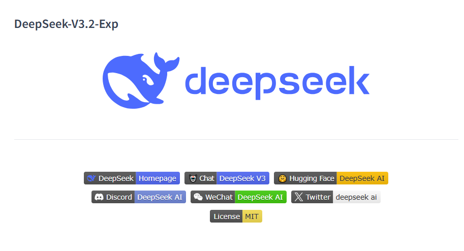
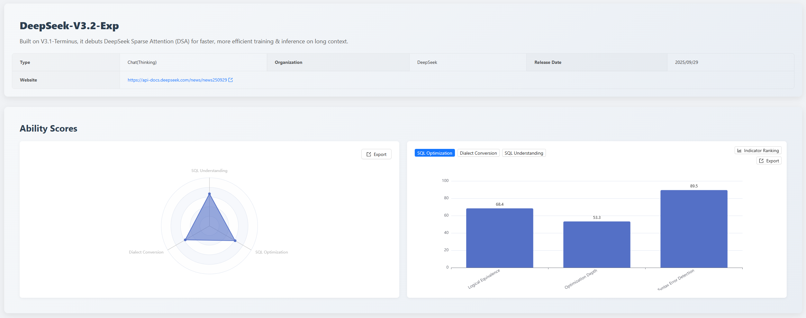

## 1. Executive Summary
This edition of the  [SCALE](https://sql-llm-leaderboard.com/) evaluation focuses on the performance boundaries of the new generation of professional-grade large language models in the database SQL domain.

This month's content features the first **"In-Depth Evaluation Report"** for two top-tier models,  [Gemini 3 Pro](https://deepmind.google/models/gemini/) and [DeepSeek-V3.2-Exp](https://huggingface.co/deepseek-ai/DeepSeek-V3.2-Exp), aiming to provide users with the most advanced and reliable technical reference for model selection.

**Key Highlights:**

1.  **New Benchmark for Reliability**: The **Gemini 3 Pro** model participated for the first time, leading the leaderboard in the "**SQL Understanding**" capability dimension with a high score of **86.0**, establishing its industry-leading position in complex logic parsing.
2.  **Promising China-made Contender**: The **DeepSeek-V3.2-Exp** model debuted on the leaderboard, showing strong potential in "**China-made Database Conversion**" (**92.1**), providing a new high-performance option for domestic substitution scenarios.

## 2. Evaluation Benchmark
This evaluation aims to systematically assess the practicality of the two models in enterprise-level complex database scenarios. We strictly adhere to the three core dimensions and the unified evaluation dataset established since the inception of the SCALE framework, ensuring fairness and reproducibility of the results.

| Evaluation Dimension | Assessment Goal | Core Application Scenarios |
| :--- | :--- | :--- |
| **SQL Understanding** | Deep analysis capability of the logic, intent, and execution plan of existing SQL code. | Data analysis, production environment troubleshooting, code review. |
| **SQL Optimization** | The strategy application and effectiveness of rewriting inefficient SQL into higher-performance queries while guaranteeing logical equivalence. | Database performance tuning, legacy code refactoring. |
| **Dialect Conversion** | The accuracy and reliability of syntactic migration and complex procedural logic reconstruction between different database dialects. | Database migration, cross-platform data mid-platform construction. |

## 3. Gemini 3 Pro In-Depth Evaluation Report

### 3.1 Core Conclusions at a Glance
The capability distribution of **Gemini 3 Pro** exhibits significant characteristics of *deep understanding, high-quality optimization, and balanced conversion*. Its "**SQL Understanding**" capability ranks first on the leaderboard (**86.0 points**), and the syntactic correctness of its optimized SQL reaches **100 points**, making it an ideal AI assistant for enterprise-level database tasks requiring high reliability.

### 3.2 Detailed Dimension Performance and Data Insights

#### SQL Understanding
- **Dimension Total Score: 86**
  - Execution Accuracy: 90.0
  - Execution Plan Detection: 64.3
  - Syntax & Best Practices: 87.1
- **Key Strength**: **Leading execution accuracy (90.0)**, high logical fidelity, making it the preferred choice for handling complex business logic.
- **Area for Improvement**: **Relatively low execution plan detection score (64.3)**, understanding deviations in write operation execution plans, insufficient standardization of structured output.

#### SQL Optimization
- **Dimension Total Score: 72.7**
  - Logical Equivalence: 73.7
  - Optimization Depth: 66.7
  - Syntax Error Detection: 100.0
- **Key Strength**: **Production-level safety of optimization results**: Perfect score (100.0) in syntax error detection ensures optimized code can be deployed directly; high logical equivalence (73.7).
- **Area for Improvement**: **Room for improvement in optimization depth score (66.7)**, insufficient depth in applying complex optimization strategies (e.g., redundancy elimination) and pattern recognition.

#### Dialect Conversion
- **Dimension Total Score: 77.1**
  - Large SQL Conversion: 61.3
  - China-made Database Support: 89.5
  - Logical Equivalence: 80.6
  - Syntax Error Detection: 78.6
- **Key Strength**: **High score in china-made database conversion (89.5)**, high logical equivalence (80.6), strong grasp of global logic.
- **Area for Improvement**: **Low score in large SQL conversion (61.3)**; lacks knowledge of specific china-made databases (e.g., OceanBase), leading to knowledge-based errors.

### 3.3 Key Challenges and Data Analysis
The evaluation found that the main challenges for **Gemini 3 Pro** are concentrated in the fine-grained understanding of underlying database mechanisms and the strict standardization of structured output.
#### 3.3.1 SQL Understanding Dimension: Execution Plan Parsing Defects
- **Semantic Confusion**: The model failed to strictly follow specifications in structured output, incorrectly outputting JSON's `null` value as the string `"NULL"`, causing confusion between the SQL semantic `"NULL"` and JSON data type specifications.
- **Write Operation Misjudgment**: In execution plan detection, the model showed insufficient understanding of the semantics of database write operations (UPDATE/DELETE), failing to recognize the MySQL optimizer's behavior of using primary key indexes for row positioning. It incorrectly judged an UPDATE operation that should use an index scan as a full table scan (`type: "ALL"`).
#### 3.3.2 SQL Optimization Dimension: Insufficient Pattern Recognition and Strategy Application
- **Pattern Recognition Defect**: Failed to recognize that the `LIKE` prefix query pattern could be rewritten as a range query to leverage index ordering, limiting performance improvement in specific query scenarios.
- **Insufficient Redundancy Elimination**: Failed to identify and eliminate redundant `ORDER BY` operations in subqueries without `LIMIT`, reflecting the model's deficiency in fine-grained semantic analysis and rule elimination.
- **Type Conversion Blind Spot**: Failed to identify potential implicit type conversion issues when comparing a `DATE` field with a string, which could lead to performance degradation in production environments.
#### 3.3.3 Dialect Conversion Dimension: Shortcomings in China-made Database Knowledge
- **Knowledge-Based Error**: When handling Oracle's `CAST` syntax, the model incorrectly replaced it with the `COLLECT` aggregate function, which is not supported by OceanBase (Oracle mode). This reflects the model's insufficient knowledge reserve for china-made databases, tending towards mechanical conversion rather than semantic equivalence judgment based on target environment characteristics.

### 3.4 Application Suggestions and Value Proposition

| Target Users | Recommended Application Scenarios | Value Proposition |
| :--- | :--- | :--- |
| **Data Analysis & Engineering** | Logical verification of complex queries and prediction of result accuracy. | Ensures the reliability of data insights. |
| **Database Administration & Development** | Standardization and preliminary performance tuning of legacy SQL code. | Safely and rapidly improves code quality and performance. |

## 4. DeepSeek-V3.2-Exp Evaluation Report

### 4.1 Core Conclusions at a Glance
**Deepseek-v3.2-exp** demonstrated a clear **focus in capabilities** in this evaluation. It achieved an excellent score of **92.1** in the **China-made Database Conversion** sub-item, making it **a tool of outstanding value in domestic substitution pathways**. However, its shortcomings in complex logic processing and optimization depth indicate that it is more suitable for auxiliary work in specific domains.

### 4.2 Dimension Detailed Performance and Data Insights

#### SQL Understanding
- **Dimension Total Score: 66.7**
  - Execution Accuracy: 68.6
  - Execution Plan Detection: 35.7
  - Syntax & Best Practices: 84.3
- **Key Strength**: **High syntax standardization**: A score of 84.3 in syntax and best practices ensures the format standardization of generated or analyzed results.
- **Area for Improvement**: **Weak execution plan detection capability** (35.7), indicating insufficient deep understanding of underlying database execution logic and optimizer behavior.

#### SQL Optimization
- **Dimension Total Score: 61.5**
  - Logical Equivalence: 68.4
  - Optimization Depth: 53.3
  - Syntax Error Detection: 89.5
- **Key Strength**: **High syntactic safety**: A syntax error detection score close to 90% ensures the reliability of optimized code.
- **Area for Improvement**: **Insufficient optimization depth** (53.3), the model performs conservatively in applying complex optimization strategies to achieve significant performance improvements.

#### Dialect Conversion
- **Dimension Total Score: 58**
  - Large SQL Conversion: 29.0
  - China-made Database Conversion: 92.1
  - Logical Equivalence: 64.5
  - Syntax Error Detection: 45.2
- **Key Strength**: **Outstanding china-made database conversion capability**, with a score as high as 92.1, showing significant targeted optimization effects in domestic migration paths.
- **Area for Improvement**: **Severely lacking large SQL conversion capability** (29.0), and **low syntax error detection score** (45.2), posing high risks to the production usability of conversion results.

### 4.3 Key Challenges and Data Analysis
The evaluation found that the main challenges for **DeepSeek-V3.2-Exp** are concentrated in the fine-grained understanding of underlying database mechanisms, recognition of SQL optimization patterns, and the accuracy of cross-dialect semantic equivalence conversion.
#### 4.3.1 SQL Understanding Dimension: Execution Plan Parsing Defects
- **Write Operation Semantic Confusion**: When processing `INSERT/REPLACE` operations, the model incorrectly returned specific execution plan information (`type: "INSERT", rows: "1"`), whereas MySQL's EXPLAIN for write operations should return `type: "ALL"` with fields like rows, Extra, filtered being `null`. This reflects the model's misunderstanding of the output specifications for write operation execution plans.
- **Write Operation Index Usage Misjudgment**: In execution plan detection, the model showed insufficient understanding of the semantics of database write operations (UPDATE), failing to recognize the MySQL optimizer's behavior of using primary key indexes for row positioning. It incorrectly returned `type: "UPDATE"` for an operation that should use an index scan, instead of `type: "index"`.
- **Filter Ratio Calculation Deviation**: When processing a `DELETE` operation, the model returned `filtered: "33.33"` while the expected value was 100, reflecting the model's insufficient understanding of the calculation logic for `WHERE` condition filtering ratios.
#### 4.3.2 SQL Optimization Dimension: Insufficient Pattern Recognition and Strategy Application
- **Pattern Recognition Defect**: Failed to recognize that the `LIKE` prefix query pattern could be rewritten as a range query to leverage index ordering, limiting performance improvement in specific query scenarios.
- **Type Conversion Blind Spot**: Failed to identify potential implicit type conversion issues when comparing a DATE field with a string, even after DDL information was provided. The model still failed to detect the potential implicit conversion risk, which could lead to performance degradation in production environments.
- **Predicate Pushdown Optimization Omission**: In scenarios containing multi-level nested subqueries, the model failed to identify optimization opportunities to push filtering conditions down to inner queries to reduce intermediate result set sizes.
#### 4.3.3 Dialect Conversion Dimension: Insufficient Semantic Equivalence and Syntactic Accuracy
- **Logical Error**: In an Oracle to PostgreSQL conversion, the model incorrectly converted `v_rows_updated := v_rows_updated + SQL%ROWCOUNT` to `v_rows_updated := v_rows_updated + v_rows_updated`, causing the accumulation logic to fail completely. This reflects a defect in the model's attention mechanism during cross-dialect semantic mapping.
- **Type System Understanding Deviation**: When converting Oracle's `TYPE t_sales_summary IS RECORD`, the model directly retained a similar syntactic structure. However, PostgreSQL 9.2 does not support explicitly defining RECORD structures; the RECORD type can only have its structure determined implicitly via `SELECT INTO` or `FOR` loops. This reflects the model's insufficient understanding of the target database's type system, tending towards mechanical conversion rather than semantic equivalence judgment based on target environment characteristics.
- **Residual Incompatible Syntax**: In an SQL Server to GaussDB conversion, the model retained the `SET NOCOUNT=ON` statement, but GaussDB does not support this syntax, reflecting insufficient understanding of the target database's syntactic constraints.
- **Function Mapping Error**: In an SQL Server to GaussDB conversion, the model used `GET DIAGNOSTICS v_cursor_status = CURSOR_STATUS`, but GaussDB's GET DIAGNOSTICS does not support the CURSOR_STATUS diagnostic item. This reflects the model's insufficient understanding of the target database's system functions and diagnostic mechanisms.

### 4.4 Summary and Application Suggestions
| Target Users | Recommended Application Scenarios | Value Proposition |
| :--- | :--- | :--- |
| **Database Engineers** | Syntax standardization checks for daily SQL statements. | Leverage its high syntactic correctness score to quickly correct basic errors. |
| **Enterprise Technical Decision-Makers** | Database china-made migration projects. | Focus on utilizing its **92.1**-point china-made database conversion capability as an auxiliary tool for initial migration to reduce labor costs. |
| **Data Analysts** | Only for validating basic query logic (Execution Accuracy 68.6). | Not recommended for scenarios involving performance tuning or complex underlying logic (e.g., execution plan analysis). |

## 5. Future Outlook
The SCALE evaluation system will continue to track the latest model developments and iteration progress from major vendors. We are committed to promoting deeper application and practice of large language models in the database field through fair and transparent evaluation data, together with the community.

**Explore the professional capabilities of the new generation of models now!** You are welcome to log in to the official SCALE platform to view the complete latest leaderboard and detailed model comparisons, and jointly grasp the pulse of cutting-edge AI technology.

*Data cutoff date: December 2, 2025*

> View the complete leaderboard and contact us to submit your product for evaluation. *https://sql-llm-leaderboard.com/*

**SCALE: Choose the Professional AI Model for Professional SQL Tasks.**
