## 1. Monthly Leaderboard Overview

In December 2025, [SCALE](https://sql-llm-leaderboard.com/ranking/2025-12) completed iterations on its core dataset and leaderboard models. The core value of this month's update lies in the official launch of the **SQL Tuning Dimension Evaluation Dataset 2.0**. This version marks the benchmark's transition from academic SQL tuning to a comprehensive simulation of real-world "**production-level complexity**" scenarios.

Concurrently, this month saw the inaugural evaluation of a new generation of models, including _GPT-5 Series_, _Claude 4.5 Series_, and _Ant Group Bailing Ling-2.0-Flash_. Through rigorous benchmark datasets, we aim to provide enterprise technology decision-makers with actionable references for the SQL capabilities of these models in practical scenarios.

## 2. Benchmark Upgrade

To systematically evaluate the practical capabilities of Large Language Models (LLMs) in handling complex business logic within real production environments, we have significantly expanded the volume and increased the difficulty of the evaluation dataset for the SQL optimization dimension.

**It is important to note that due to the substantial increase in SQL complexity and business scenario coverage of the new test cases, the overall scores of all models and baseline applications in this evaluation have decreased compared to previous versions.**

Among them, _DeepSeek V3.1_, _Kimi-K2_, and _DeepSeek R1_ showed relatively significant score drops, decreasing by 22.7, 18.0, and 14.1 points respectively compared to the previous period. This objectively reflects the far greater challenge that complex business SQL poses to model optimization capabilities compared to routine syntactic rewriting.

The following sections detail the core features of this dataset upgrade and the specific performance of each model.

### Core Design Features at the SQL Level

The new dataset moves away from idealized syntactic rewriting, covering multiple dialects including MySQL, Oracle, Postgres, and SQL Server, focusing on resolving real performance bottlenecks in production environments:

- **Rich Syntax Coverage**: Includes CTEs, nested subqueries, window functions, aggregations, complex expressions, and various built-in functions, testing the model's understanding and rewriting capabilities for complex SQL semantics.
- **Complex Queries Mimicking Real Business**: Queries involving multi-table JOINs, long-chain subqueries, multi-level nesting, mixed aggregations, and filtering simulate production scenarios, exposing difficulties models encounter in real engineering contexts.
- **Coexistence of Dialect-Specific and Index-Sensitive Constructs**: Includes dialect-specific features of MySQL/Oracle/Postgres/SQL Server alongside constructs prone to index inefficiency (implicit type conversion, LIKE, string/time handling), testing dialect adaptation and index awareness.
- **Clear and Verifiable Optimization Goals**: Each SQL query has a corresponding "Expected Trigger Rule" (e.g., predicate pushdown, projection pushdown, LEFT→INNER join conversion, subquery flattening), facilitating judgment on whether the model's output achieves a specific, verifiable rewrite.
- **Emphasis on Semantic Equivalence and Executability**: Requires optimizations to maintain semantic equivalence and syntactic correctness, testing both rewriting ability and ensuring outputs are verifiable on actual databases.

### Covered Typical Optimization Rules

The rules in the dataset focus on "**semantically equivalent optimizations that can be discovered by the model and implemented through rewriting**," commonly including but not limited to the following rule families:

- **Projection Pushdown / Removing Redundant Projections**
  - Description: Remove columns returned by subqueries but unused by the outer query, or retain only the columns needed by the outer query at an inner level, reducing I/O and network transmission.
  - Example Scenario: In multi-level nested subqueries, the inner `gender` column is not used by the outer query and should be removed.
- **Predicate Pushdown** (including pushing outer WHERE clauses to inner levels) **and Rewriting LIKE Prefix to Range Queries**
  - Description: Execute filtering conditions as early as possible at the data source; rewrite prefix matching like `LIKE 'prefix%'` to range comparisons (`col >= 'prefix' AND col < 'prefix{next_char}'`) to utilize indexes.
  - Example Scenario: Outer `WHERE teacher_name LIKE 'Dr.%'` can be pushed down and rewritten as a range condition to leverage an index.
- **Subquery Folding / Subquery Flattening**
  - Description: Merge unnecessary nested subqueries into a single query block, reducing temporary intermediate results.
  - Example Scenario: Multiple layers of SELECT/FROM wrapping can be consolidated, eliminating redundancy caused by intermediate table aliases.
- **No-Output JOIN to EXISTS / LEFT JOIN to INNER JOIN Conversion**
  - Description: Replace outer joins with more efficient JOIN/EXISTS semantics when they do not produce NULL extensions or equivalent constraints exist, or eliminate tables contributing no output.
  - Example Scenario: If subquery semantics guarantee a column has a value, `LEFT JOIN` can be safely changed to `INNER JOIN`.
- **Eliminating Implicit Type Conversion / Time Condition Optimization**
  - Description: Avoid implicit conversions between strings and dates/times, using consistent types or explicit functions to prevent index inefficiency.
  - Example Scenario: Date string comparisons should be changed to use standard timestamps or compare indexed columns after using `TO_DATE`.

### Performance on SQL Optimization Sub-metrics

Based on the enhanced dataset, we evaluate the true performance of models after the data upgrade through three core technical sub-dimensions: logical equivalence, syntactic correctness, and optimization depth:

#### Logical Equivalence

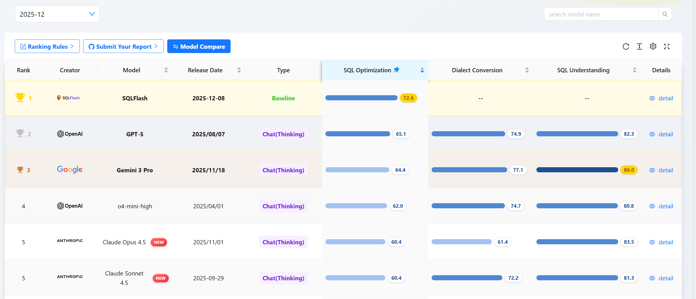

**Data Interpretation**: In long-text and complex business SQL scenarios, https://sqlflash.ai/ "SQLFlash" establishes a baseline advantage with a high score of 82.5, demonstrating high stability. Among conversational models, _DeepSeek-R1 (70.1)_ and _Gemini 3 Pro (68.0)_ perform closely, leading the pack.

**Evaluation**: This dimension assesses "**whether the rewritten SQL is logically consistent with the original SQL**". _DeepSeek-R1_ demonstrates superior logical convergence compared to _GPT-5_ when handling complex logical nesting and functions, proving the advantage of its reasoning model architecture in ensuring business logic does not deviate.

#### Optimization Depth

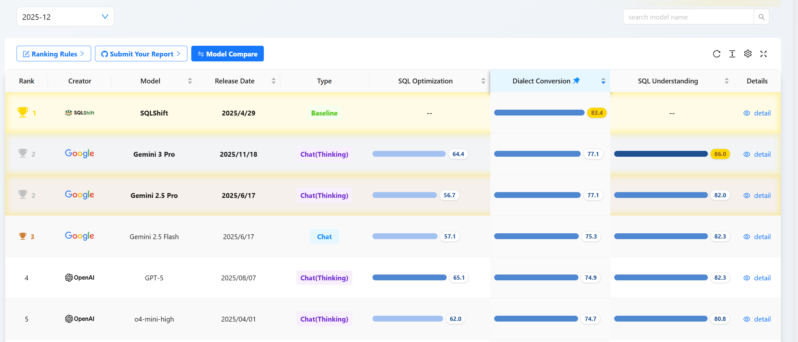

**Data Interpretation**: This is the most challenging dimension. _SQLFlash (57.5)_ still leads. Notably, _OpenAI o4-mini-high (53.3)_ and _GPT-5 (52.1)_ follow closely, surpassing other competitors.

**Evaluation**: This dimension measures whether the model possesses DBA-level physical cost estimation capabilities. The OpenAI series models demonstrate their特质 as "physical execution plan experts," capable of proactively identifying underlying pain points like index inefficiency and performing deep restructuring.

#### Syntax Error Detection

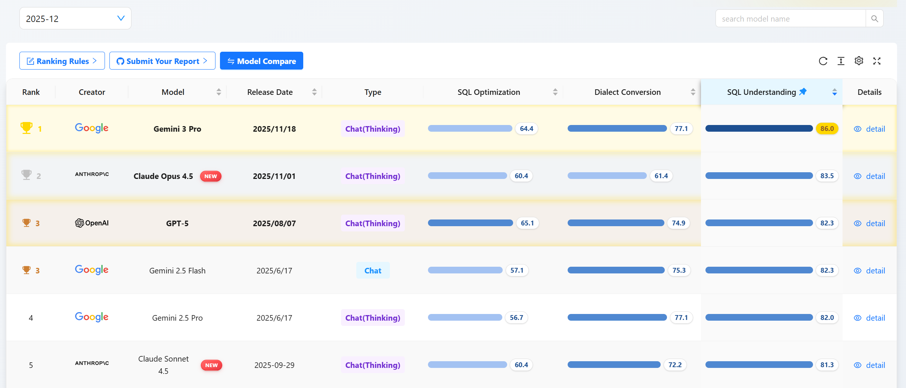

**Data Interpretation**: _OpenAI o4-mini-high_ tops the list with a relatively high score of 90.7, followed by _GPT-5.2 (88.7)_ and _SQLFlash (87.6)_.

**Evaluation**: In terms of code compliance and syntactic safety, the OpenAI camp shows dominance. This indicates that _o4-mini-high_ is currently the most cost-effective choice for building automated SQL code validation tools.

#### SQL Optimization Dimension Evaluation Summary

This evaluation is based on a dataset closer to real production environments, with test cases enhanced in both SQL complexity and business scenario coverage. Against this backdrop, the overall scores of all models and baseline applications have decreased compared to previous versions, reflecting the higher demands complex business SQL places on model optimization capabilities.

Meanwhile, _SQLFlash_, as a specialized application focused on SQL optimization, maintains a leading advantage in comprehensive performance. The specific performance of current mainstream models across various metrics in the SQL optimization dimension is shown in the chart below:

## 3. Technical Analysis and Comparison of New Mainstream Models

### OpenAI

**GPT-5.2: High-Precision Syntax Correction and Execution Expert**

- **Core Competency**: SQL Understanding (81.3) remains in the top tier. Its biggest highlight is **Syntax Error Detection** (88.7 in Optimization / 82.9 in Understanding), showing the highest sensitivity to syntax among all models. It also performs well in supporting domestic databases (86.8).
- **Business Value**: An excellent SQL debugging assistant and code quality gatekeeper. Integrating this model in the development phase can effectively intercept most syntax errors, improving code quality before deployment, while ensuring high execution accuracy.

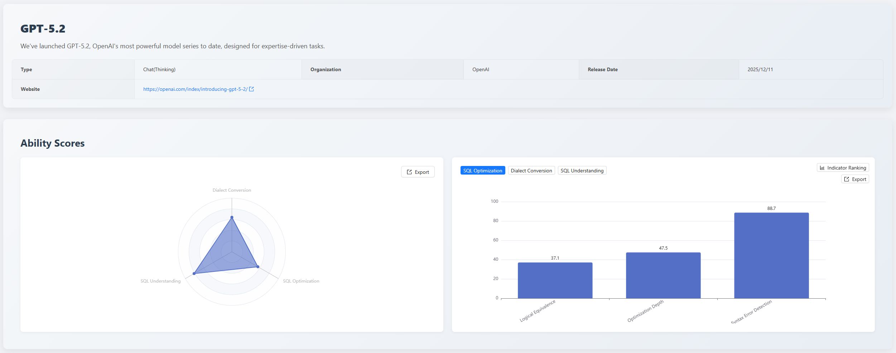

**GPT-5.1: Leader in Domestic Database Adaptation**

- **Core Competency**: Achieved the highest score overall (tied with QwQ) in the specific metric of **Domestic Database Support (94.7)**. Although slightly weaker in optimization depth and large SQL conversion, its adaptability in specific environments is very strong.
- **Business Value**: Highly usable for localized business scenarios, especially database migration and application development in IT innovation environments, accurately handling syntax features specific to domestic databases.

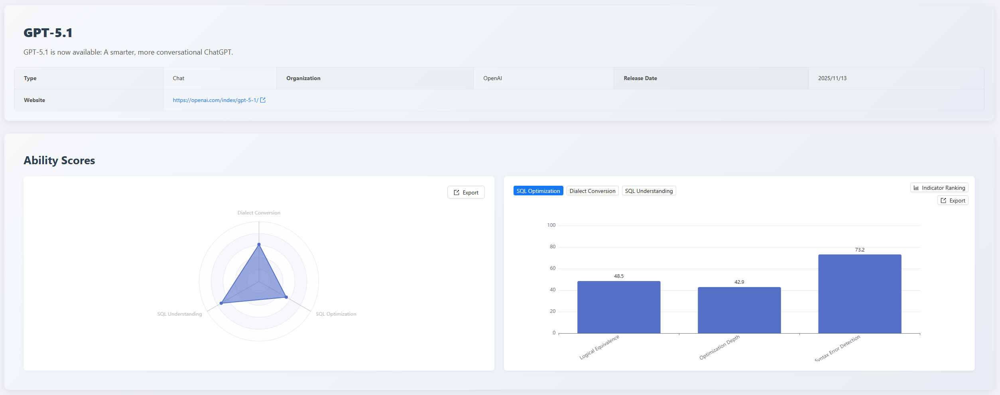

### Anthropic

**Claude Opus 4.5: All-round SQL Architect (Double Champion in Understanding and Optimization)**

- **Core Competency**: This model achieved the highest scores overall in both the critical dimensions of **SQL Understanding (83.5)** and **SQL Optimization (60.4)**. It demonstrates high stability in Execution Plan Detection (87.1) and Logical Equivalence (61.9).
- **Business Value**: Suitable for core business scenarios requiring extremely high accuracy, such as deep tuning of complex queries, automated operational diagnostics, and serving as an advanced expert system for SQL review, significantly reducing database performance risks.

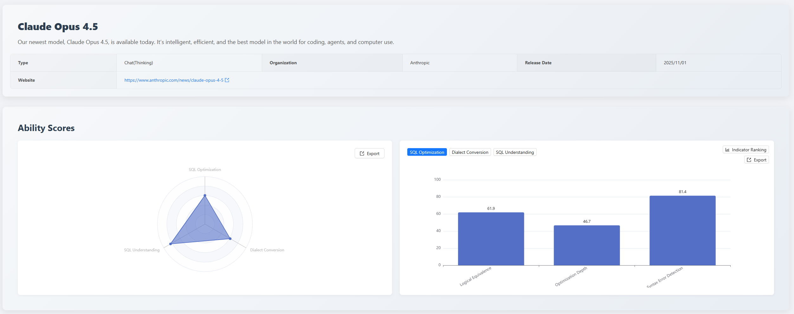

**Claude Sonnet 4.5: Expert in Complex SQL Migration and Refactoring**

- **Core Competency**: Strong comprehensive capabilities, excelling particularly in **Dialect Conversion (72.2)**. The score for **Large SQL Conversion (71.0)** far exceeds other models (others mostly below 40), demonstrating remarkable ability in handling long text and complex logic. It ties for first place with Opus in SQL Optimization.
- **Business Value**: The best choice for migrating from traditional databases to cloud-native databases or for heterogeneous database migration, especially adept at handling ultra-long complex stored procedures and query statements in legacy systems, greatly reducing manual refactoring costs.

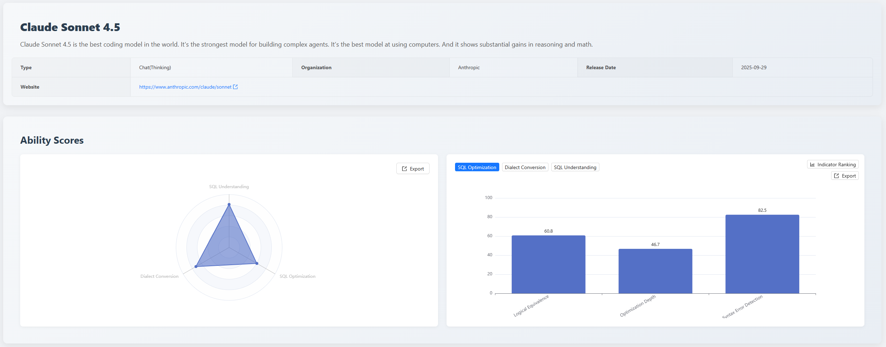

**Claude Haiku 4.5: Efficient Heterogeneous Dialect Converter**

- **Core Competency**: Achieved the highest overall score of 73.3 in the **Dialect Conversion** dimension. Although slightly inferior to Opus and Sonnet in SQL understanding depth, it performs extremely sharply in handling syntax differences between different databases (especially with a Logical Equivalence score of 90.3).
- **Business Value**: Suitable for high-frequency, large-volume multi-database adaptation tasks, such as SQL compatibility conversion tools in multi-cloud environments, enabling fast, low-cost automated translation of cross-platform SQL syntax.

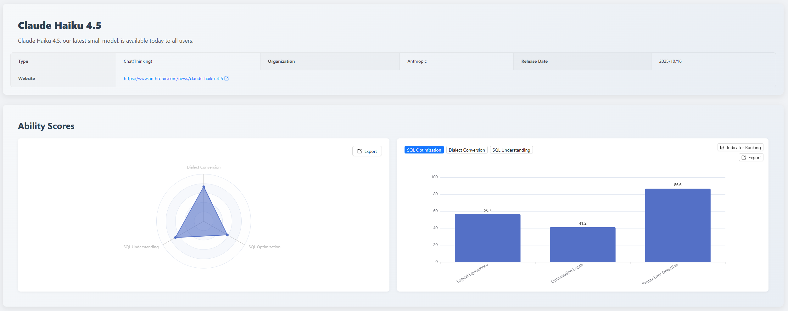

### Ant Group Bailing

**Ling-2.0-Flash: Basic SQL Assistance Tool**

- **Core Competency**: Relatively flat performance across metrics, with weaker dialect conversion ability (43.5), but still competitive in domestic database support (84.2) and basic syntax detection (80.4).
- **Business Value**: Suitable for lightweight application scenarios or as an auxiliary alternative model for handling simple SQL validation and basic domestic database adaptation tasks.

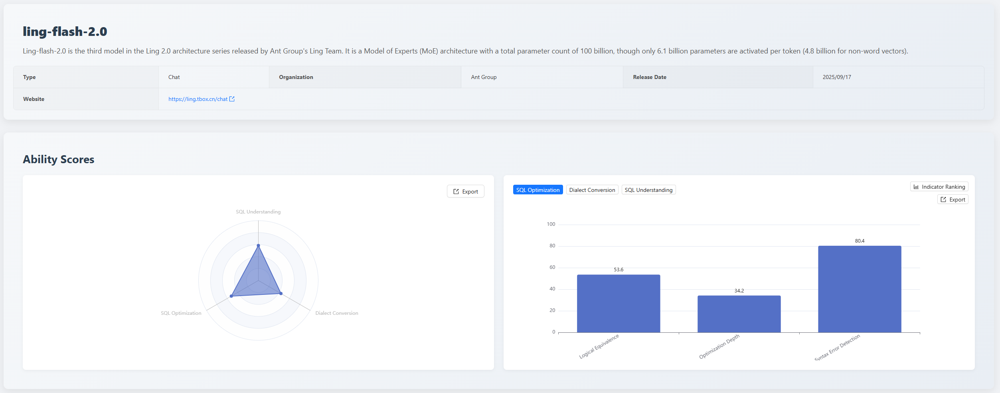

### Qwen

**QwQ-32B: Cost-Effective Solution for Domestic Integration**

- **Core Competency**: Also excels in the **Domestic Database (94.7)** metric. Although relatively weaker in SQL Optimization (51.3) and complex conversion, it maintains usable baseline levels in basic SQL Understanding (75.6) and syntax detection (78.6).
- **Business Value**: As a model with relatively fewer parameters, it is a cost-effective choice for private deployment, especially suitable for handling basic queries and interaction tasks involving Chinese domestic databases.

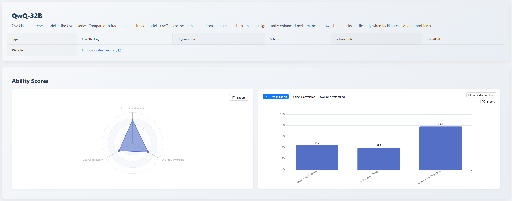

## 4. Evaluation Model Updates

### Newly Added Evaluation Models

- **Claude 4.5 Series**: Opus, Sonnet, Haiku fully integrated into the evaluation matrix.
- **OpenAI Series**: GPT-5.1, GPT-5.2 stable snapshot versions.
- **Ant Group Bailing Series**: Ling-2.0-Flash.
- **Qwen Series**: QWQ-32B.

### Upgrades and Snapshot Updates for Existing Models

- **o4-mini-high**: Replaced the old version, significantly improving logical convergence in multi-table join scenarios.
- **GPT-5 Unified Snapshot**: All experimental branches updated to the latest Snapshot version, ensuring consistency in future evaluations.
- **DeepSeek-V3.2 Official Version**: Switched from experimental (Exp) to stable version, focusing on targeted fixes for hallucination issues under Oracle syntax.

## 5. Comprehensive Leaderboard Across Three Core Dimensions

Based on the **SQL Optimization Dataset 2.0 Evaluation Standard**, the performance ranking of models across dimensions this month is as follows:

### SQL Optimization Capability Ranking

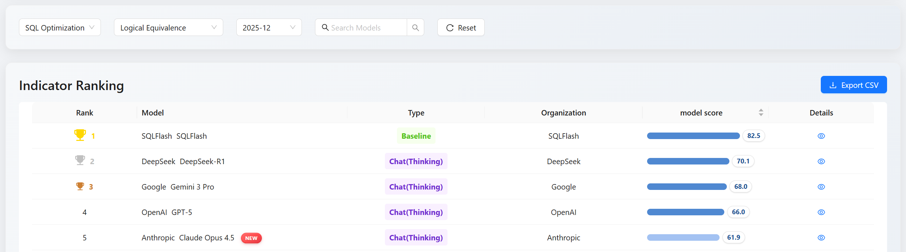

**Leaderboard Commentary**: _SQLFlash (72.6)_ continues to dominate as the vertical domain baseline model. Among general-purpose large models, _GPT-5 (65.1)_ ranks first leveraging its accumulated depth in optimization, followed closely by _Gemini 3 Pro (64.4)_. This indicates that _GPT-5_ remains the optimal solution among general models for handling high-performance requirements.

### SQL Dialect Conversion Ranking

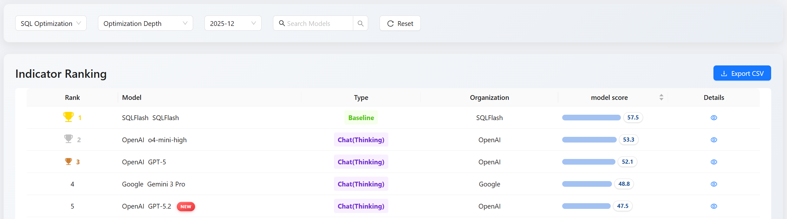

**Leaderboard Commentary**: _SQLShift (83.4)_ demonstrates the advantage of specialized models. Among general models, _Gemini 3 Pro (77.1)_ and _Gemini 2.5 Pro (77.1)_ tie for second place, showing Google models' profound expertise in cross-platform language understanding, particularly demonstrating stability in heterogeneous database migration scenarios.

### SQL Understanding Capability Ranking

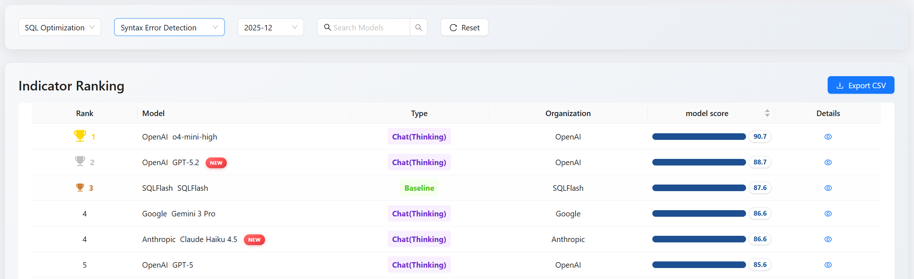

**Leaderboard Commentary**: _Gemini 3 Pro (86.0)_ performs excellently in this dimension, surpassing _Claude Opus 4.5 (83.5)_. This means that in code review and execution plan analysis tasks, _Gemini 3 Pro_ possesses the strongest contextual understanding and potential risk identification capabilities.

## 6. Conclusion and Recommended Deployment Matrix

Based on the practical evaluation scores from the **SQL Optimization Dataset 2.0**, we recommend users choose deployment solutions according to their needs:

- **Performance Tuning for Slow SQL in Production**: Prioritize the specialized SQL tuning application _SQLFlash_; model option: _GPT-5.2_, utilizing its deep optimization capability at the physical execution path level.
- **High-Fidelity SQL Rewriting/Standardization**: Prioritize _SQLFlash_, ensuring zero deviation in business logic after rewriting, suitable for code standardization in core transaction pathways.
- **Complex Business Logic Migration and Domestic Database Support**: Prioritize the specialized SQL dialect conversion application https://sqlshift.cn/ "SQLShift"; model option: _Claude Opus 4.5_, ensuring ultimate logical consistency in cross-database migration.
- **High-Frequency Real-time SQL Auditing and Validation**: Prioritize _Claude Haiku 4.5_ or _Ling-2.0-Flash_, providing highly reliable syntax diagnosis with extremely low latency.

> View the complete leaderboard and contact us to submit your product for evaluation. [https://sql-llm-leaderboard.com/](https://sql-llm-leaderboard.com/)

**SCALE: Choose the Professional AI Model for Professional SQL Tasks.**
