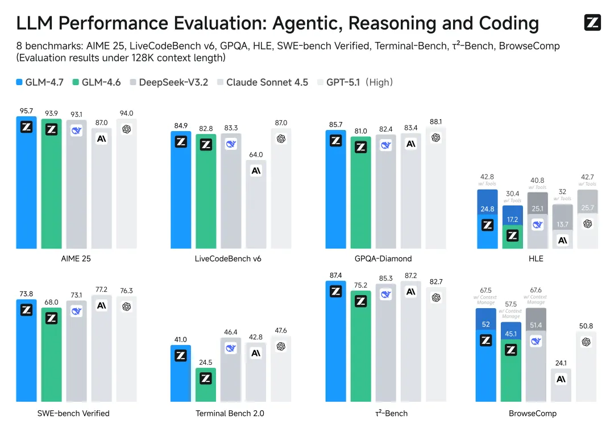
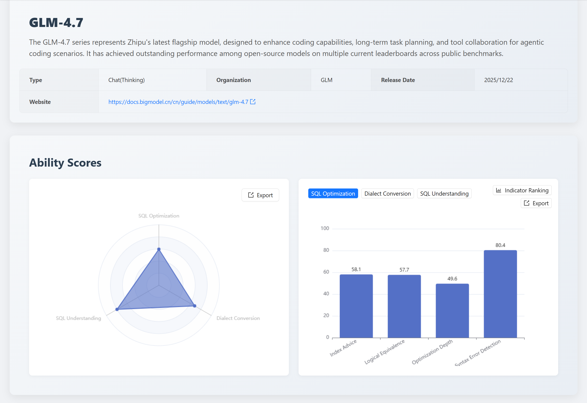
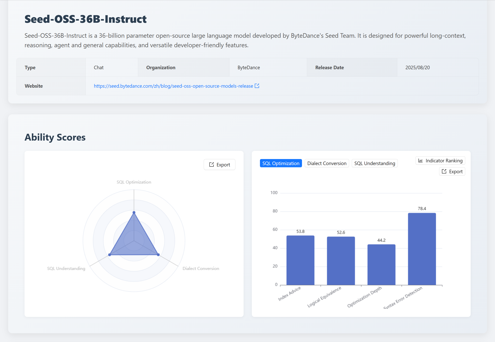

## I. Monthly Summary

The https://sql-llm-leaderboard.com/ranking/2026-01 "2026 January Leaderboard" evaluation framework has undergone significant evolution in January 2026. This month, we welcomed the entry of _Zhipu GLM-4.7_ and _ByteDance Seed-OSS-36B-Instruct_, while also introducing a breakthrough in evaluation depth by formally incorporating the **"index suggestions"** metric into the **SQL Optimization** dimension.
_This means the evaluation criteria for SQL optimization have advanced from mere syntactic refactoring to a comprehensive assessment of both syntactic optimization and execution cost optimization, reflecting whether models can propose optimizations that deliver real-world performance benefits and align with production scenarios._

---

## II. Evaluation Benchmark System Upgrade

SCALE is committed to quantifying the true value of large language models in professional database tasks through multi-dimensional stress tests. We strictly adhere to the three core dimensions and unified datasets established since the framework's inception to ensure fairness and reproducibility.

### SCALE's Three Evaluation Dimensions

| Evaluation Dimension   | Assessment Target                                                                               | Core Application Scenarios                                     |
| ---------------------- | ----------------------------------------------------------------------------------------------- | -------------------------------------------------------------- |
| **SQL Understanding**  | Analyzing logic, intent, and execution plans of existing SQL code.                              | Data analysis, production fault diagnosis, code review.        |
| **SQL Optimization**   | Refactoring inefficient SQL into high-performance queries while preserving logic equivalence.   | Database tuning, legacy code restructuring.                    |
| **Dialect Conversion** | Migrating syntax and restructuring complex procedural logic across different database dialects. | Database migration, cross-platform data platform construction. |

### New Metric Added This Month: Index Suggestions

Index optimization is critical for improving query performance by reducing data reads and computational overhead. We have introduced **index suggestion evaluation** under the **SQL Optimization** dimension:

- **Evaluation Focus**: Tests models' ability to provide actionable, cost-effective, and risk-controlled optimization strategies beyond syntactic changes.
- **Ranking Results**: Scores for mainstream models in index suggestion evaluation are shown below:

---

## III. Special Evaluation: Zhipu GLM-4.7

https://z.ai/blog/glm-4.7 "GLM-4.7" was released and open-sourced by Zhipu AI on December 23, 2025. It quickly topped the global trends chart on https://huggingface.co/zai-org/GLM-4.7 "GLM-4.7" and was a focal point of AI innovation in 2025. Zhipu AI debuted on the Hong Kong Stock Exchange on January 8, 2026.

### 1. Capability Positioning

**GLM-4.7 demonstrates exceptional logical rigor and adaptability**, acting as an entry-level "junior DBA" capable of handling complex business logic and domestic database migration tasks with first-tier stability.

### 2. Core Dimension Analysis

#### SQL Understanding: 79.8 Points

**_GLM-4.7_ exhibits strong logical consistency**, scoring highly in execution accuracy (82.9) and syntax error detection (82.9). However, its execution plan analysis capabilities lag, with only a 55% pass rate for complex queries involving `LEFT JOIN`, `GROUP BY`, and `ORDER BY`. The model misidentifies key execution metrics like temporary tables and file sorting (`Using temporary; Using filesort`) and underestimates row counts, revealing gaps in its understanding of aggregation operations and multi-table correlation logic.

#### SQL Optimization: 59.6 Points

In index suggestions, GLM-4.7 scores 58.1 points, demonstrating foundational capabilities to propose physical optimizations based on execution plans. However, it struggles with advanced scenarios like redundant index detection and balancing low-selectivity columns against maintenance costs, indicating inconsistent decision-making in complex optimization contexts.

#### Dialect Conversion: 68.2 Points

**GLM-4.7 excels in converting domestic databases** (89.5 points), showcasing maturity in this domain. However, its syntax accuracy score (50 points) reveals gaps in nuanced dialect knowledge, particularly for specific database versions (e.g., OceanBase 4.2.5, GaussDB-v2.0_3.x).

### 3. Practical Recommendations

- **Recommended Scenarios**: Legacy system refactoring, complex SQL development support, domestic database migration.
- **Operational Tips**: Use GLM-4.7-generated migration scripts as drafts but validate index suggestions with `EXPLAIN PLAN` before production deployment.

---

## IV. Special Evaluation: ByteDance Seed-OSS-36B

https://huggingface.co/ByteDance-Seed/Seed-OSS-36B-Base "Seed-OSS-36B Huggingface" is a 36-billion-parameter open-source model released by ByteDance's Seed team on August 21, 2025. It supports 155k vocabularies and 512k-token context lengths via 64 layers and RoPE encoding, excelling in document analysis, reasoning chains, and agent interactions.

### 1. Capability Positioning

_Seed-OSS-36B is a polarized model_: Exceptionally strong in standardization ("gatekeeper" for code quality) but weaker in long-text processing and deep execution reasoning.

### 2. Core Dimension Analysis

#### SQL Understanding: 55.2 Points

Seed-OSS-36B scores 88.6 in syntax detection but underperforms in execution accuracy (48.6). For example, it misclassifies `SELECT` queries as `table_state` instead of `select`, revealing flaws in semantic categorization and structural consistency.

#### SQL Optimization: 55.3 Points

Its index suggestions (53.8 points) focus on simplistic single-table indexes, failing to address redundancy, implicit type conversions, or global optimization contexts.

#### Dialect Conversion: 55.0 Points

Seed-OSS-36B struggles with lengthy SQL migrations. For instance:

- _Oracle → PostgreSQL_: Incorrectly maps `GET DIAGNOSTICS` and mixes PL/SQL-specific syntax.
- _SQL Server → GaussDB_: Retains `+` string concatenation and omits join conditions in `UPDATE ... FROM`, causing Cartesian products.

### 3. Practical Recommendations

- **Recommended Scenarios**: Code auditing, lightweight SQL linting, routine database maintenance.
- **Operational Tips**: Integrate into IDE plugins for real-time syntax correction; decompose complex stored procedures before processing.

> _SCALE will continue monitoring updates from ByteDance's Seed team._

---

## V. SCALE Website Updates

New features added this month:

1. **News Module**: Explore historical analyses and track SCALE's evolution.
2. **Blog Module**: Learn from community experts' case studies on selecting optimal models.

---

## VI. Summary & Recommendations

**Two core trends emerge from this month's results**:

1. **Shift from "Correct Syntax" to "Faster Execution"**
2. **Rapid Maturation of Domestic Migration Capabilities**

### Strategic Advice for Complex Scenarios

- **Large SQL Processing**: Adopt a "divide-and-conquer" approach for complex logic to mitigate model drift.
- **Validation Necessity**: Models with high syntax scores but low execution accuracy (e.g., <50%) require rigorous post-processing.

### Leveraging Models for Domestic Migration

- **Automation Foundation**: General-purpose models can serve as initial automation tools for schema mapping.
- **Proactive Optimization**: Use index suggestions during migration to optimize schemas preemptively.

---

**Explore the latest model capabilities now!** Visit the https://sql-llm-leaderboard.com/ for full rankings and comparisons.

> View the complete leaderboard and contact us to submit your product for evaluation. https://sql-llm-leaderboard.com/

**SCALE: Choose the Professional AI Model for Professional SQL Tasks.**

_Data cutoff: January 5, 2026_
