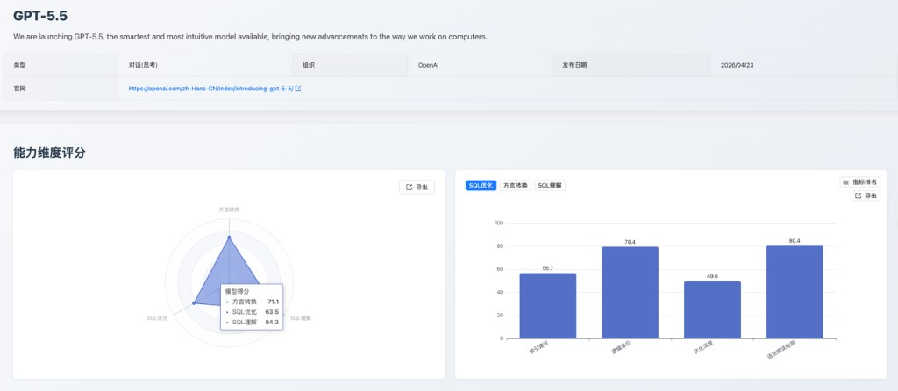
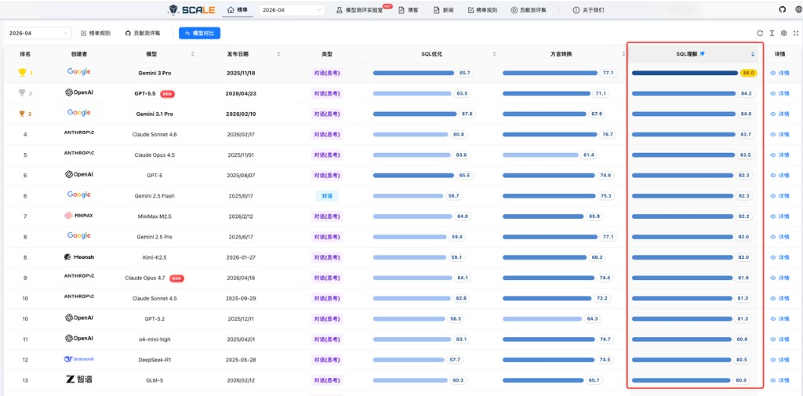
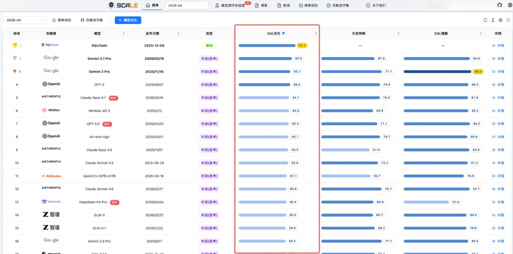
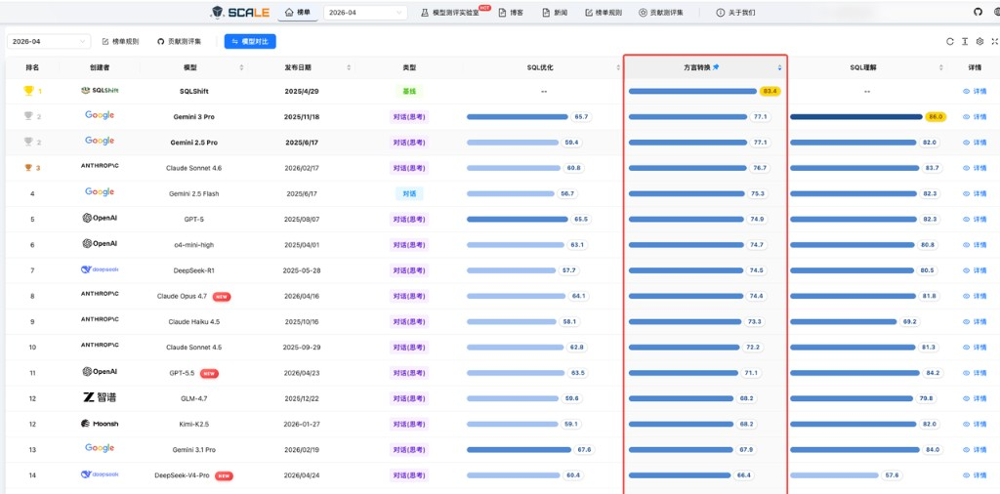

## I. Release Summary and Core Value

This month, the [April 2026 Leaderboard](https://sql-llm-leaderboard.com/ranking/2026-04) added **DeepSeek-V4-Pro**, **DeepSeek-V4-Flash**, **GPT-5.5**, and **Claude Opus 4.7**. The evaluation continues to focus on SQL understanding, SQL optimization, and dialect conversion, presenting the latest models' enterprise SQL capabilities and selection value through unified rankings and sub-metric data.

Among the newly added models, **GPT-5.5** leads in SQL understanding, while **Claude Opus 4.7** offers the most balanced overall profile. The two DeepSeek models stand out on domestic database conversion, but still have room to improve on complex SQL understanding, deep optimization, and large-SQL conversion.

**Key highlights:**

- **GPT-5.5** ranks near the top in SQL understanding, with strong execution accuracy, making it suitable for complex SQL semantic analysis and high-quality development assistance
- **Claude Opus 4.7** ranks in the top 10 for both SQL optimization and dialect conversion, with 88.7 points in SQL optimization syntax error detection and 100.0 points in domestic database conversion
- **DeepSeek-V4-Pro / DeepSeek-V4-Flash** are both reasoning-oriented dialogue models with strong domestic database conversion, but weaker optimization depth and large-SQL conversion sub-metrics

## II. Evaluation Methodology

This evaluation strictly follows SCALE's three core dimensions and unified datasets, ensuring all models are assessed under the same standards for fairness and reproducibility:

1. **SQL Understanding**: Evaluates a model's ability to analyze the logic, intent, and execution plans of existing SQL code. Metrics include execution accuracy, execution plan detection, and syntax error detection.
2. **SQL Optimization**: Evaluates whether a model can rewrite inefficient SQL into higher-performance queries while preserving logical equivalence and syntactic correctness, and whether it can recommend indexes. Metrics include logical equivalence, optimization depth, syntax error detection, and index suggestions.
3. **Dialect Conversion**: Evaluates the accuracy and reliability of syntax migration and complex procedural logic refactoring across database dialects. Metrics include large-SQL conversion, domestic database conversion, logical equivalence, and syntax error detection.

## III. In-Depth Model Evaluations

### 3.1 Special Evaluation: GPT-5.5 (OpenAI)

**1. Capability Positioning**

GPT-5.5 is the strongest new entrant in SQL understanding and ranks near the top of the overall leaderboard in that dimension. Its strengths concentrate in execution accuracy and syntax error detection, while SQL optimization and dialect conversion remain usable. Overall, it is well suited as a general-purpose SQL development assistant. Its scores across the three core dimensions are shown in Figure 1.

_Figure 1: GPT-5.5 capability scores_

**2. Core Dimension Analysis**

- **SQL Understanding**: Execution accuracy is a clear strength, indicating solid command of SQL semantics, query results, and syntax rules. Execution plan detection trails the broader understanding score, leaving room to improve on complex execution-path reasoning.
- **SQL Optimization**: Logical equivalence is the core strength in optimization, showing stable preservation of SQL semantics. By contrast, optimization depth scores **49.6 points**, so deep rewrite strategies and physical index design are not its strongest areas.

  Evaluation cases show two recurring issues in optimization depth and index suggestions:

  (1) **Over-simplification of multi-level subqueries**: In a projection pushdown case for `SELECT student_name FROM students WHERE student_id IN (...)`, the expected behavior was only to remove the unused inner `gender` column. Instead, the model returned `SELECT student_name FROM students;`, dropping the `IN` filter and showing a risk of over-rewriting during optimization.

  (2) **Unstable composite index column ordering**: In `SELECT * FROM products WHERE category_id = 5 AND is_imported = 1 AND stock < 10`, the expected index order was `category_id, is_imported, stock`, but the model proposed `is_imported, category_id, stock`, failing to place equality columns by selectivity and range columns last.

- **Dialect Conversion**: Domestic database conversion scores **97.4 points**, while large-SQL conversion scores only **45.2 points**, indicating that very long scripts and complex procedural SQL still require human review.

  In the Oracle → PostgreSQL conversion of `SP_BULK_UPDATE_INVENTORY`, the source procedure includes record types, bulk collections, cursor loops, and transaction control. The model rewrote it into a `RETURNS void` function with inconsistent candidate forms for default timestamps, `record` types, and bulk-processing structure, showing that long procedural SQL conversion still needs segmented validation.

**3. Practical Recommendations**

- **Recommended Scenarios**: Complex SQL semantic understanding, execution-result judgment, SQL development assistance, and first-draft cross-database migration.
- **Operational Tips**: Prioritize GPT-5.5 as a general SQL assistant, but pair it with `EXPLAIN PLAN`, DBA review, or segmented conversion workflows for deep performance optimization, index design, and large-SQL migration.

### 3.2 Special Evaluation: Claude Opus 4.7 (Anthropic)

**1. Capability Positioning**

Claude Opus 4.7 is the most balanced new entrant, ranking near the top in both SQL optimization and dialect conversion. Compared with models that excel in a single area, it is better suited to composite scenarios that need stable SQL review, optimization suggestions, and migration assistance. Its scores across the three core dimensions are shown in Figure 2.

_Figure 2: Claude Opus 4.7 capability scores_

**2. Core Dimension Analysis**

- **SQL Understanding**: Foundational SQL understanding and syntax judgment are reliable, but execution plan detection remains a relative weakness and complex execution-plan reasoning still needs improvement.
- **SQL Optimization**: Syntax error detection scores **88.7 points**, a standout among new models and useful for readable, lower-risk optimization suggestions. Optimization depth scores only **43.3 points**, limiting multi-rule joint rewrites and deep query restructuring.

  Typical failures concentrate in multi-level nested query restructuring: the model simplified a query containing `IN (SELECT student_id FROM (...))` directly to `SELECT student_name FROM students;`, when the expected behavior was only projection pushdown and redundant-column removal. This suggests a tendency to pursue simpler forms in complex rewrites and a continued need for logical-equivalence checks.

- **Dialect Conversion**: Domestic database conversion reaches **100.0 points**, the highest among new models, with balanced performance across other conversion metrics. It is well suited as a candidate conversion engine in database migration.

  In the Oracle → OceanBase Oracle conversion of the long procedure `LFBB_BVC_VHG_CHECK`, the output showed inconsistent procedure names and `END` labels, and oscillated between `TO_CHAR(SYSDATE, ...)` and `TO_CHAR(SYSDATE(), ...)`. In the SQL Server → GaussDB case `sp_GetCustomerOrders @CustomerID nchar(5)`, parameter binding was incorrectly rewritten as `CustomerID = CustomerID`, creating semantic distortion.

**3. Practical Recommendations**

- **Recommended Scenarios**: SQL code review, optimization suggestion generation, domestic database migration assistance, and long-context SQL script understanding.
- **Operational Tips**: Prioritize it where output syntax stability matters most, but add rule checks and performance regression validation for deep optimization rewrites.

### 3.3 Special Evaluation: DeepSeek-V4-Pro (DeepSeek)

**1. Capability Positioning**

DeepSeek-V4-Pro is DeepSeek's new reasoning-oriented dialogue model, described as **1.6T total / 49B active params**. Its SQL optimization and dialect conversion scores are clearly stronger than its SQL understanding score, making it better suited as an optimization and migration assistant than as a primary model for complex SQL understanding. Its scores across the three core dimensions are shown in Figure 3.

_Figure 3: DeepSeek-V4-Pro capability scores_

**2. Core Dimension Analysis**

- **SQL Understanding**: Syntax error detection is reasonably reliable, but execution plan detection scores only **46.4 points**, leaving clear room to improve on complex SQL result inference and execution-plan judgment.

  For example, in `SELECT task_name, due_date FROM tasks WHERE completed = FALSE AND due_date < '2024-06-07'`, the expected result type was `select`, but the model labeled it `table_state`. In the execution-plan case for `INSERT INTO products (...) VALUES (...)`, the expected `type` was `ALL`, but the model left `type` empty, showing unstable modeling of execution-plan fields for non-`SELECT` statements.

- **SQL Optimization**: Syntax error detection is relatively strong and helps keep rewritten SQL syntactically stable, but optimization depth scores only **42.1 points**, indicating limited ability to combine deep optimization rules.

  A typical failure appears in multi-level nested subqueries: for `SELECT student_name FROM students WHERE student_id IN (...)`, the expected behavior was projection pushdown and removal of the redundant inner `gender` column, but the model returned `SELECT student_name FROM students;`, showing a risk of filter loss in complex rule-combination scenarios.

- **Dialect Conversion**: Domestic database conversion is the main highlight, but large-SQL conversion scores only **35.5 points**, so complex long scripts and procedural code still require caution.

  In the Oracle → PostgreSQL conversion of the dynamic deletion procedure `bulk_delete_by_ids`, the source procedure builds `DELETE FROM logs WHERE log_id IN (...)` through `EXECUTE IMMEDIATE` and explicitly `COMMIT`s. The PostgreSQL rewrite lost transaction-commit semantics, showing unstable handling of transaction boundaries in procedural code.

**3. Practical Recommendations**

- **Recommended Scenarios**: First-draft SQL rewriting, syntax correction, domestic database conversion assistance, and conversion tasks with relatively clear logical equivalence.
- **Operational Tips**: Do not rely on it alone for complex SQL understanding, execution-plan analysis, or large-SQL script migration. Use it as an auxiliary candidate in multi-model cross-validation.

### 3.4 Special Evaluation: DeepSeek-V4-Flash (DeepSeek)

**1. Capability Positioning**

DeepSeek-V4-Flash is DeepSeek's new lightweight, efficient reasoning-oriented dialogue model, described as **284B total / 13B active params**. Its SQL understanding score is clearly stronger than its SQL optimization and dialect conversion scores, making it better suited to lightweight SQL understanding and syntax assistance. Its scores across the three core dimensions are shown in Figure 4.

_Figure 4: DeepSeek-V4-Flash capability scores_

**2. Core Dimension Analysis**

- **SQL Understanding**: The model is usable for basic SQL recognition and result judgment, but execution plan detection still needs improvement.

  For example, in `INSERT INTO products (product_id, product_name, price) VALUES (...)`, the expected output was `INSERT` with `type = ALL` and no `Extra`, but the model returned `rows = 0` and `Extra = No tables used`, suggesting it applies ordinary `SELECT` execution-plan habits to non-query SQL.

- **SQL Optimization**: Syntax error detection and index suggestions are acceptable, but optimization depth scores only **30.4 points**, so complex rewrites can produce semantic drift or insufficient optimization.

  Typical failures include joint optimization of multi-table joins and multi-level subqueries where only partial predicate pushdown is completed while projection pruning and `LIKE 'Advanced %'` prefix optimization are missed. In `WHERE CONCAT("id_", student_id) >= "id_1000"`, the model rewrote directly to `student_id >= 1000`, ignoring lexicographic semantics after string concatenation and producing non-equivalent results.

- **Dialect Conversion**: Domestic database conversion scores **97.4 points**, but large-SQL conversion scores only **25.8 points**, making it better suited to simple or fragment-level conversion.

  In the Oracle → PostgreSQL conversion of `SP_BULK_UPDATE_INVENTORY`, the source procedure includes record types, bulk collections, and cursor loops, but the model produced inconsistent versions around `TYPE t_inventory_rec IS RECORD`, `CURRENT_DATE` defaults, and bulk-processing structure. In the SQL Server → GaussDB case `IF NOT EXISTS (...) CREATE TABLE Logs (...)`, the model output incomplete structures such as `SELECT FROM pg_tables`, creating direct execution-failure risk.

**3. Practical Recommendations**

- **Recommended Scenarios**: Low-latency or cost-sensitive SQL syntax checking, simple SQL understanding, lightweight development assistance, and first-pass domestic database conversion screening.
- **Operational Tips**: Do not use it alone for complex SQL optimization, large-SQL conversion, or high-risk migration. Use it for batch preprocessing, then hand off to higher-capability models or human review for final delivery.

## IV. Comprehensive Rankings

This section presents the latest SCALE rankings across SQL understanding, SQL optimization, and SQL dialect conversion. This month's evaluation covers 33 models, including all four newly added models in the unified leaderboard.

**Gemini 3 Pro** leads SQL understanding with 86.0 points, **SQLFlash** leads SQL optimization with 72.1 points, and **SQLShift** leads SQL dialect conversion with 83.4 points.

### SQL Understanding Ranking

The SQL understanding dimension measures a model's overall grasp of SQL semantics, execution plans, and syntax rules. The full ranking is shown in Figure 5.

_Figure 5: SQL understanding ranking_

### SQL Optimization Ranking

The SQL optimization dimension measures logical-equivalence rewriting, deep optimization strategies, index suggestions, and syntax correction. The full ranking is shown in Figure 6.

_Figure 6: SQL optimization ranking_

### SQL Dialect Conversion Ranking

The dialect conversion dimension measures the accuracy of syntax migration and logical restructuring across database dialects. The full ranking is shown in Figure 7.

_Figure 7: SQL dialect conversion ranking_

## V. Conclusions and Deployment Matrix

The four newly added models form a clear capability ladder: GPT-5.5 leans toward strong SQL understanding, Claude Opus 4.7 toward balanced stability, DeepSeek-V4-Pro toward optimization and migration assistance, and DeepSeek-V4-Flash toward lightweight, low-cost scenarios.

- **For complex SQL understanding and execution-result judgment**: Prefer **GPT-5.5**, whose SQL understanding and execution accuracy are strong for complex query analysis and development assistance.
- **For SQL optimization suggestions and stable output**: Recommend **Claude Opus 4.7**, whose syntax error detection is a standout and makes it suitable as an optimization-suggestion and code-review engine.
- **For database migration and dialect conversion**: Prioritize **Claude Opus 4.7**, whose domestic database conversion reaches **100.0 points**, with GPT-5.5 as a second candidate.
- **For low-latency or cost-sensitive batch SQL processing**: Consider **DeepSeek-V4-Flash** as a lightweight screening model for syntax checking, simple understanding, and fragment-level conversion, but pair it with higher-capability models or human review for complex optimization and large-SQL migration.

SCALE will continue tracking large-model development and refining the evaluation framework to provide objective, comprehensive capability assessments.

Visit the **SCALE platform** for detailed evaluation data and reports, or try the Model Evaluation Lab for customized assessments.

---

**Explore the latest model capabilities now!** Visit the [SCALE website](https://sql-llm-leaderboard.com/) for full rankings and comparisons.

> View the complete leaderboard and contact us to submit your product for evaluation: [sql-llm-leaderboard.com](https://sql-llm-leaderboard.com/).

**SCALE: Choose the Professional AI Model for Professional SQL Tasks.**

_Data cutoff: April 30, 2026_
