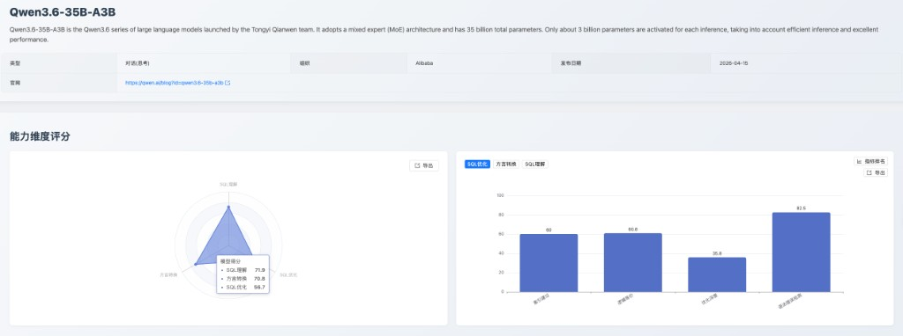
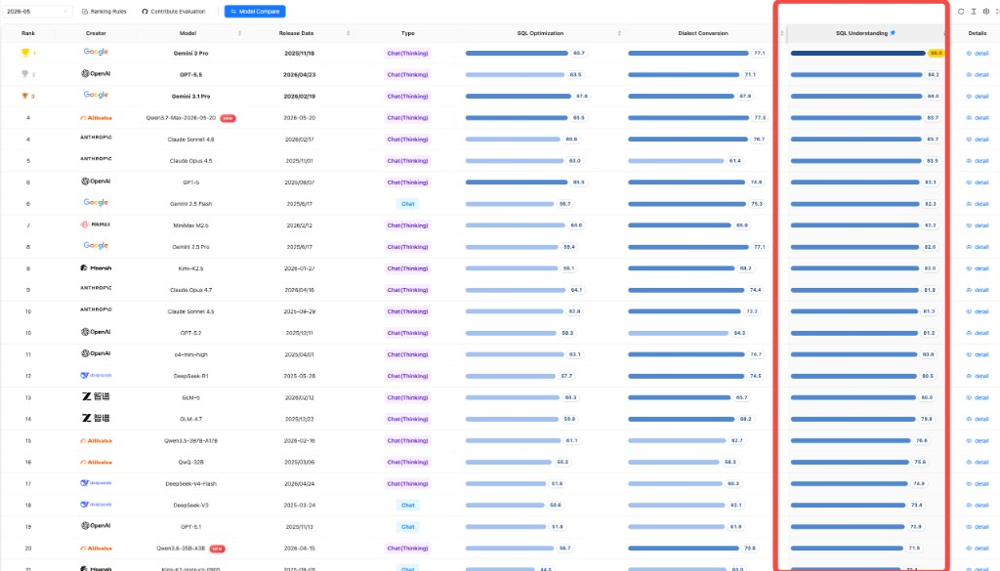
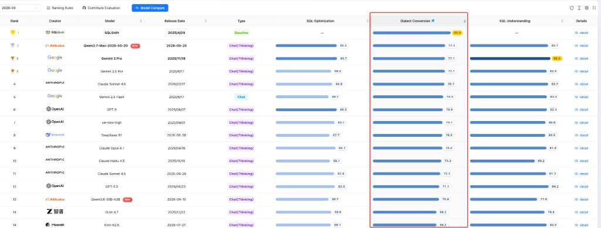

## I. Release Summary and Core Value

This month, the [May 2026 Leaderboard](https://sql-llm-leaderboard.com/ranking/2026-05) added Alibaba's **Qwen3.7-Max-2026-05-20** and **Qwen3.6-35B-A3B** models. The evaluation continues to focus on SQL understanding, SQL optimization, and dialect conversion, combining unified rankings, sub-metric scores, and case-level error analysis to present the capability positioning and boundaries of these two models in enterprise SQL scenarios.

Among the newly added models, **Qwen3.7-Max-2026-05-20** has entered the first tier of SCALE SQL capabilities: it ranks 2nd overall in dialect conversion, and its SQL understanding and SQL optimization both entered the top 4. **Qwen3.6-35B-A3B** is more suitable for cost-sensitive, lightweight auxiliary scenarios; it excels in domestic database conversion, but execution plan detection, large-SQL conversion, and optimization depth remain key areas for improvement.

**Key highlights:**

- **Qwen3.7-Max-2026-05-20** ranks 2nd overall in dialect conversion and entered the top 4 in both SQL understanding and SQL optimization, joining the first tier in comprehensive capabilities.
- **Qwen3.6-35B-A3B** excels in the domestic database conversion sub-metric, making it suitable for short SQL and domestic database-focused lightweight conversion and syntax assistance.
- A shared weakness of both models lies in deep optimization and complex procedural SQL, where human review and segmented validation are still recommended.

## II. Evaluation Methodology

This evaluation strictly follows SCALE's three core dimensions and unified datasets, ensuring all models are assessed under the same standards for fairness and reproducibility:

1. **SQL Understanding**: Evaluates a model's ability to analyze the logic, intent, and execution plans of existing SQL code. Metrics include execution accuracy, execution plan detection, and syntax error detection.
2. **SQL Optimization**: Evaluates whether a model can rewrite inefficient SQL into higher-performance queries while preserving logical equivalence and syntactic correctness, and whether it can recommend indexes. Metrics include logical equivalence, optimization depth, syntax error detection, and index suggestions.
3. **Dialect Conversion**: Evaluates the accuracy and reliability of syntax migration and complex procedural logic refactoring across database dialects. Metrics include large-SQL conversion, domestic database conversion, logical equivalence, and syntax error detection.

## III. In-Depth Model Evaluations

### 3.1 Special Evaluation: Qwen3.7-Max-2026-05-20 (Alibaba)

**1. Model Overview**

Qwen3.7-Max (qwen3.7-max) is the largest and most capable flagship model in Alibaba Cloud's Qwen3.7 series. Designed for the agent era, it excels in programming, office productivity, and long-horizon autonomous execution. It currently offers pure text capabilities, supporting deep reasoning and text generation. Core parameters include: 1M context, 991K max input, 64K max output, and 256K max chain of thought. It supports function calling, web search, prefix completion, and caching with batch inference; structured output and fine-tuning are not supported.

**2. Capability Positioning**

Qwen3.7-Max-2026-05-20 is the most outstanding new model this month, characterized by "strong understanding, high dialect conversion, and usable optimization suggestions." It scored **83.7 points** in SQL understanding, **65.5 points** in SQL optimization, and **77.3 points** in dialect conversion, achieving high levels across all three dimensions. Overall, it is a priority candidate for general-purpose SQL assistants, database migration assistance, and SQL development review scenarios.

*Figure 1: Qwen3.7-Max-2026-05-20 model details and capability scores*

**3. Core Dimension Analysis**

- **SQL Understanding**: It scored **83.7 points** in SQL understanding, with **87.1 points** in execution accuracy and **82.9 points** in syntax error detection, indicating strong mastery of routine SQL semantics, query result deduction, and syntax rules. Execution plan detection scored **67.9 points**, relatively lower than other understanding sub-dimensions; when facing complex execution paths, verification against actual database plans is still recommended.

- **SQL Optimization**: It scored **65.5 points** in SQL optimization. Its **89.7 points** in syntax error detection and **74.8 points** in index suggestions are strong, making it a good first-draft generator for optimization and index suggestions. Logical equivalence is usable at **69.1 points**, but optimization depth is a clear weakness at **40.4 points**, carrying a risk of over-simplification under complex rule combinations.

  Evaluation cases show the model is stable on simple optimization suggestions, but with multi-level nested SQL, it tends to misinterpret "simplify SQL" as "delete filtering logic," causing the optimized SQL to differ from original query results. It is thus suited for optimization first drafts but not unattended deep rewriting.

- **Dialect Conversion**: Dialect conversion is Qwen3.7-Max-2026-05-20's core highlight, scoring **77.3 points**. Domestic database conversion (**92.1 points**), logical equivalence (**80.6 points**), and syntax error detection (**85.7 points**) all performed exceptionally well, showing high usability for routine cross-database syntax migration and domestic database adaptation. However, large-SQL conversion scored lower at **54.8 points**, meaning long scripts and complex procedural SQL still require human review.

  Case performance shows it handles short SQL and routine dialect differences reliably, but when faced with long SQL containing extensive procedural logic, exception handling, and transaction control, it can miss key semantics. It is a high-quality candidate for migration outputs but should be validated in segments.

**4. Practical Recommendations**

- **Recommended Scenarios**: Complex SQL semantic understanding, SQL code review, first drafts of index suggestions, domestic database migration assistance, and cross-dialect conversion candidate generation.
- **Operational Tips**: Can be prioritized as an SQL assistant model; for execution plan analysis, deep SQL optimization, and long stored procedure migration, pair it with database testing, logical equivalence checks, DBA review, and segmented conversion workflows.

### 3.2 Special Evaluation: Qwen3.6-35B-A3B (Alibaba)

**1. Model Overview**

Qwen3.6-35B-A3B is the first open-weight model in the Qwen3.6 series. It uses a sparse MoE architecture with about **35B** total parameters and **3B** activated parameters per token. The model natively supports text, image, and video inputs, and offers dual reasoning/non-reasoning modes for agent programming and complex task execution. Its native context length is **262K tokens**, extendable to about **1.01 million tokens** via YaRN. Open-sourced under the Apache 2.0 license, it can be deployed on Hugging Face or ModelScope and is compatible with inference frameworks like vLLM and SGLang.

**2. Capability Positioning**

Evaluation results show Qwen3.6-35B-A3B is better suited for high-concurrency, cost-sensitive, lightweight SQL auxiliary scenarios: dialect conversion scored **70.8 points**, with domestic database conversion reaching **100.0 points**; SQL understanding sits mid-tier at **71.9 points**; SQL optimization is relatively weak at **56.7 points**, meaning complex optimizations and index suggestions should not be used directly for production decisions.

*Figure 2: Qwen3.6-35B-A3B model details and capability scores*

**3. Core Dimension Analysis**

- **SQL Understanding**: Scored **71.9 points**, with syntax error detection at **82.9 points** and execution accuracy at **75.7 points**, sufficient for basic SQL understanding and result judgment. Execution plan detection is a primary weakness at **39.3 points**, showing unstable judgment of SQL execution paths and plan details.

  Case performance shows the model handles basic query result judgments well, but when encountering non-query SQL (like inserts or updates), it often applies standard query explanations, leading to inaccurate execution plan types and scan methods. Thus, it is better for basic SQL understanding rather than acting as a primary execution plan analyzer.

- **SQL Optimization**: Scored **56.7 points**, with syntax error detection at **82.5 points**, meaning it can output readable optimization suggestions with low syntax risk. However, logical equivalence (**60.8 points**) and index suggestions (**60.0 points**) are mid-tier, and optimization depth is low at **35.8 points**, requiring strict review for complex optimization results.

- **Dialect Conversion**: Dialect conversion scored **70.8 points**, making it the relatively strongest of Qwen3.6-35B-A3B's three dimensions. Domestic database conversion is the major highlight at **100.0 points**, and logical equivalence (**80.6 points**) is somewhat reliable. However, large-SQL conversion is significantly lower at **35.5 points**, and standalone use is not recommended for complex procedural code migration.

  It handles short SQL and domestic database conversion with clear syntax rules very well, but often misses context or produces incomplete conversions for long stored procedures, complex transactions, and cross-database scripts. It is better suited as a batch screening or fragment-level conversion tool rather than a complete migration engine.

**4. Practical Recommendations**

- **Recommended Scenarios**: Basic SQL syntax checking, short SQL understanding, first drafts of domestic database conversion, and cost-sensitive batch SQL pre-screening.
- **Operational Tips**: Deploy as a lightweight SQL assistant or low-cost screening model; leave execution plan analysis, deep optimization, production index suggestions, and long stored procedure migration to higher-capability models, specialized tools, or human review.

## IV. Comprehensive Rankings

This section presents the May 2026 SCALE comprehensive rankings across SQL understanding, SQL optimization, and SQL dialect conversion. This month's evaluation covers **35 models**, including the two newly added Qwen models in the unified leaderboard.

**Gemini 3 Pro** leads SQL understanding, **SQLFlash** leads SQL optimization, and **SQLShift** leads SQL dialect conversion.

### SQL Understanding Ranking

The SQL understanding dimension measures a model's overall grasp of SQL semantics, execution plans, and syntax rules. **Gemini 3 Pro** currently holds the top spot. The newly added Qwen3.7-Max-2026-05-20 performed outstandingly in this dimension, while Qwen3.6-35B-A3B leaned toward basic SQL understanding and lightweight assistance.

*Figure 3: SQL understanding ranking*

### SQL Optimization Ranking

The SQL optimization dimension measures logical-equivalence rewriting, deep optimization strategies, index suggestions, and syntax correction. **SQLFlash** currently holds the top spot. Qwen3.7-Max-2026-05-20 offers good optimization suggestions but still requires verification for deep optimization; Qwen3.6-35B-A3B is better suited for lightweight first-draft generation.

*Figure 4: SQL optimization ranking*

### SQL Dialect Conversion Ranking

The dialect conversion dimension measures the accuracy of syntax migration and logical restructuring across database dialects. **SQLShift** currently holds the top spot. Qwen3.7-Max-2026-05-20 is the most prominent dialect conversion candidate among this month's new models; Qwen3.6-35B-A3B excels in domestic database conversion, but long procedural SQL migration still demands caution.

*Figure 5: SQL dialect conversion ranking*

## V. Conclusions and Deployment Matrix

The two newly added Qwen models form a clear tier separation: Qwen3.7-Max-2026-05-20 has reached first-tier comprehensive SQL capabilities and is suited for core model roles in enterprise SQL assistants; Qwen3.6-35B-A3B is better suited for lightweight, high-concurrency, cost-sensitive auxiliary scenarios, especially short SQL conversion for domestic databases and basic syntax pre-screening.

- **For scenarios needing comprehensive SQL understanding, optimization suggestions, and dialect conversion**: Prefer **Qwen3.7-Max-2026-05-20**. It reaches the priority deployment range across all three dimensions, with dialect conversion ranking particularly high.
- **For database migration and domestic database conversion scenarios**: Prioritize **Qwen3.7-Max-2026-05-20**; if the task mainly involves short SQL or simple syntax conversion, **Qwen3.6-35B-A3B** can serve as a low-cost batch screening model.
- **For deep SQL optimization, index design, and execution plan analysis**: Both models should be used alongside SQLFlash, actual database EXPLAIN plans, logical equivalence checks, and DBA review. Unattended production deployment is not recommended.
- **For long stored procedures and large-SQL cross-dialect migration**: A segmented conversion process is recommended, verifying declarations, cursors, exception handling, transaction boundaries, and target database version compatibility piece by piece.

SCALE will continue tracking large-model development and refining the evaluation framework to provide objective, comprehensive capability assessments.

Visit the **SCALE platform** for detailed evaluation data and reports, or try the Model Evaluation Lab for customized assessments.

---

**Explore the latest model capabilities now!** Visit the [SCALE website](https://sql-llm-leaderboard.com/) for full rankings and comparisons.

> View the complete leaderboard and contact us to submit your product for evaluation: [sql-llm-leaderboard.com](https://sql-llm-leaderboard.com/).

**SCALE: Choose the Professional AI Model for Professional SQL Tasks.**

_Data cutoff: May 31, 2026_
