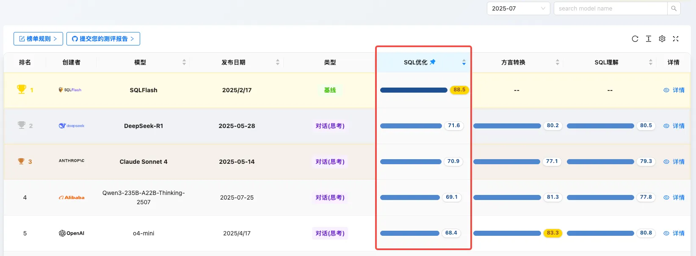
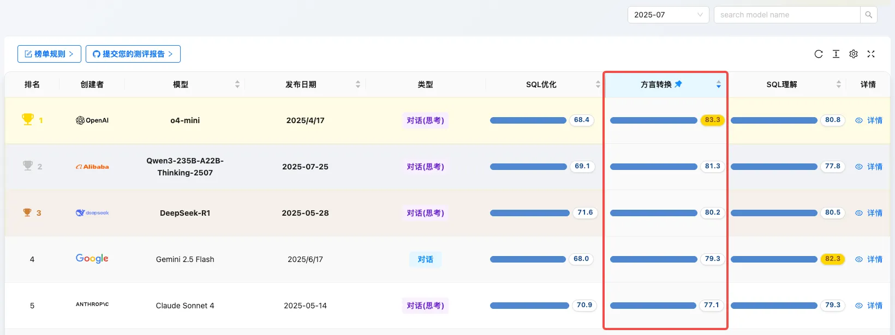
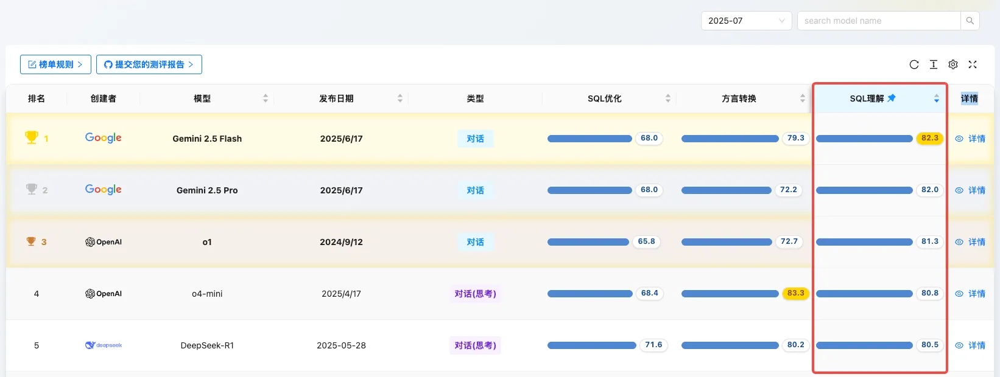
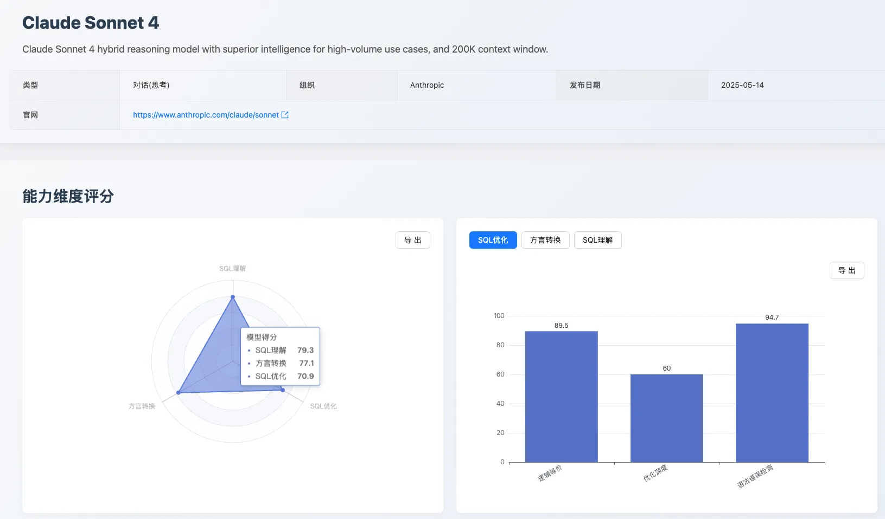
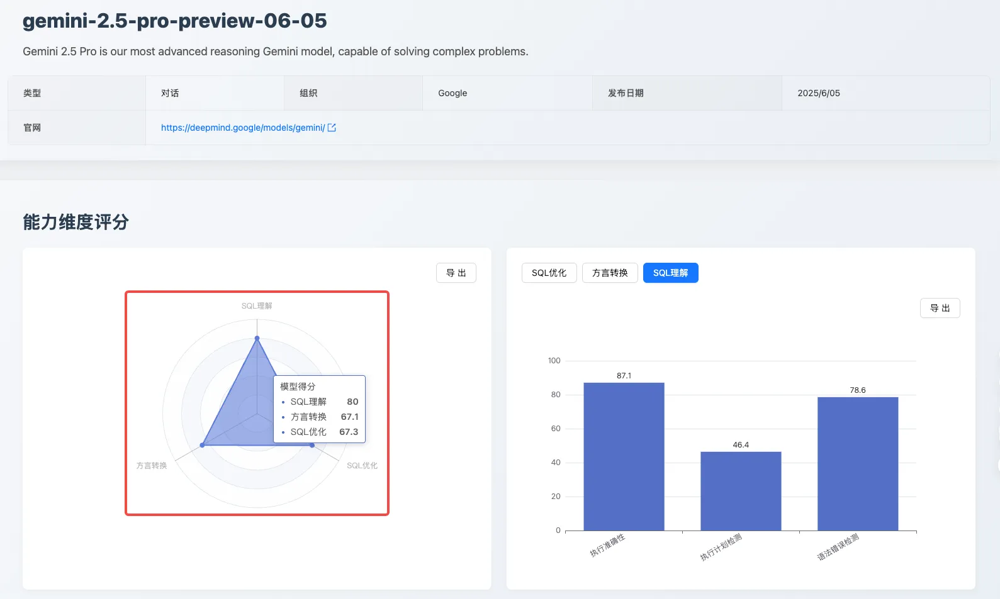
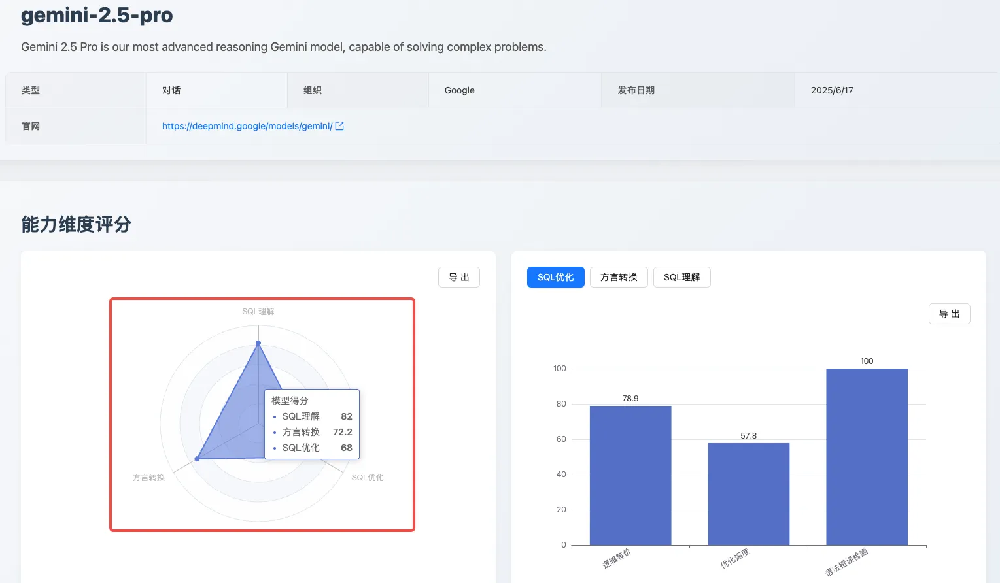
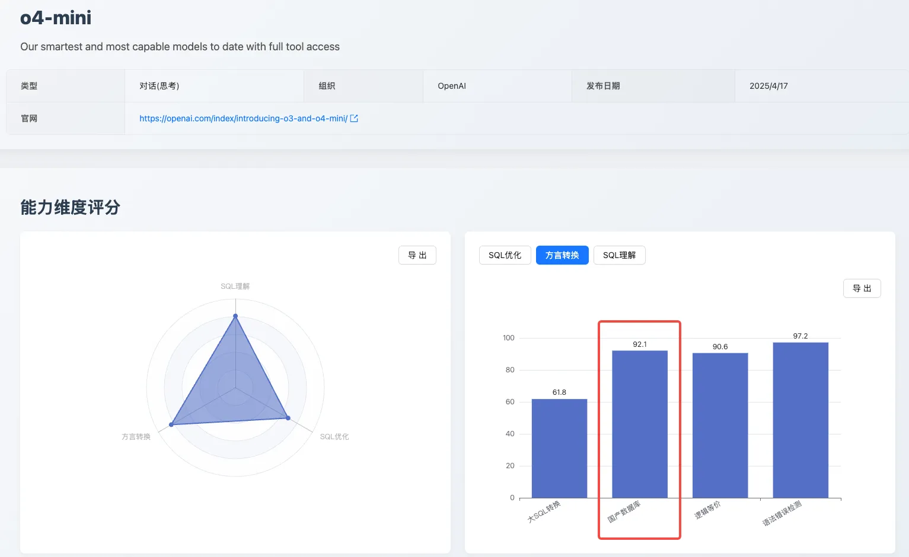

## 1. 摘要
2025 年 7 月，AI 大模型在代码生成与理解领域，特别是数据库 SQL 能力上的竞争日趋白热化。

本期 [SCALE](https://sql-llm-leaderboard.com/ranking/2025-07 "SCALE 202507 测评") 评测我们迎来了备受瞩目的 **Claude 3.5 Sonnet**、**Claude Sonnet 4** 首次参评，同时 **Gemini 2.5** 系列也正式迈入稳定版。更重要的是，我们针对数据库现代化迁移的真实痛点，对评测基准进行了重要升级，旨在更深度地考验模型在复杂、真实场景下的 SQL 处理能力。

本期核心看点：

- **新王登基还是实力搅局？**
      
    新晋选手 **Claude 3.5 Sonnet**、**Claude Sonnet 4** 首次参评，它在 SQL 优化、方言转换与理解三大维度的综合表现如何？能否撼动现有第一梯队的格局？

- **方言转换测评基准升级**
 
   我们首次引入 **大 SQL 转换** 与 **国产数据库转换** 两大评测指标，全面考验模型在处理超长、复杂逻辑及存储过程、函数等高级数据库对象时的能力。
   
- **正式版实力验证**
  
    **Gemini 2.5 Pro** 与 **Gemini 2.5 Flash** 迎来正式版，相较于预览版，其性能与稳定性是否得到全面提升？
    
## 2. 评测基准及更新
为更精准地评估 AI 模型在企业级复杂数据库场景下的实用性，本月我们对 **SQL 方言转换** 维度的评测数据集进行了扩充和深化。

### 2.1 新增指标：大 SQL 转换

在数据库迁移的实际项目中，处理历史遗留的 **大 SQL**（通常指行数超百行、逻辑复杂的单条 SQL 语句）是一个常见且棘手的难题。我们发现，许多模型在面对此类长文本、高复杂度的转换任务时，容易出现上下文丢失、逻辑错乱、语法错误等问题。

**评测目的**：检验模型在处理超长、包含多层嵌套查询、复杂 JOIN 和临时表的 SQL 脚本时的转换准确性和逻辑保持能力。

### 2.2 新增指标：国产数据库转换

在国产化替代和信创背景下，企业核心业务系统正加速从传统商业数据库向国产数据库迁移。此过程中，深度依赖于数据库过程化编程能力（如存储过程、函数）的复杂应用，其迁移的准确性和效率成为关键瓶颈。

**评测目的**：评测模型将传统商业数据库向国产数据库进行自动化转换的能力。这不仅是 SQL 的翻译，更涉及到变量声明、流程控制、异常处理等编程逻辑的跨方言迁移。

### 2.3 本期支持的转换路径

从 Oracle 到 OceanBase（Oracle 模式）4.2.5。

基于以上更新的评测基准，本月的榜单呈现出一些值得关注的新变化。接下来，我们来揭晓本期榜单详细的评测结果与深度分析。

## 3. 本月榜单与焦点分析

### 3.1 分项能力榜单
**SQL 优化能力 Top 5**

1. SQLFlash：88.5
2. DeepSeek-R1：71.6
3. Claude Sonnet 4：70.9
4. Qwen3-235B-A22B：69.1
5. GPT-o4-mini：68.4

**SQL 方言转换 Top 5**

1. GPT-o4-mini：83.3
2. Qwen3-235B-A22B：81.3
3. DeepSeek-R1：80.2
4. Gemini 2.5 Flash：79.3
5. Claude Sonnet 4：77.1

**SQL 理解能力 Top 5**

1. Gemini 2.5 Flash：82.3
2. Gemini 2.5 Pro：82.0
3. GPT-o1：81.3
4. GPT-o4-mini：80.8
5. DeepSeek-R1：80.5

### 3.2 专题 1：Claude Sonnet 4 首秀评测

作为 Anthropic 的最新力作，**Claude Sonnet 4** 在本月的评测中展现了均衡但尚未登顶的实力。其在 SQL 优化、方言转换、SQL 理解 三大维度的得分分别为 70.9、77.1、79.3，位列总榜中上游。

- **SQL 优化能力分析**：总分 70.9，排名第三。优势在于其出色的「逻辑等价」保证（89.5 分）和对语法及最佳实践的遵循（94.7 分），能生成高质量、规范的 SQL。然而，其在「优化深度」方面仅得到 60 分，说明在提供更深层次的 SQL 优化上仍有较大提升空间。

- **方言转换与 SQL 理解表现**： 分别以 77.1 分和 79.3 分位列第五和第六。在方言转换的细分项中，其 **国产数据库转换能力**（97.4 分）表现亮眼，几乎达到顶尖水平。但在 **大 SQL 转换** 上仅得到 41.2 分，暴露了其在处理超长上下文时的明显短板。在 SQL 理解方面，其执行准确性（87.1 分）和语法及最佳实践（74.3 分）表现稳健，但在执行计划分析上仅有 46.4 分，说明其对 SQL 底层执行逻辑的理解能力有待加强。

总体来看，**Claude Sonnet 4** 是一位表现全面的均衡型选手，在 SQL 程式码的规范性和正确性上表现出色，但在性能优化的深度和处理极端复杂问题的能力上，与第一梯队模型相比仍存在一定差距。

### 3.3 专题 2：Gemini 2.5 正式版 vs 预览版

本次评测中，Gemini 2.5 Pro 正式版相较于其 06-05 预览版，展现了全面的能力提升，模型综合得分从 80 分提升至 82 分。这表明其在稳定性和综合 SQL 处理能力上都进行了有效优化。具体来看：

- **语法错误检测能力显著增强**：从 89.5 提升至 100 分。这意味着正式版模型不仅能生成更高效的 SQL，也更符合标准的开发规范。
- **方言转换能力稳中有升**：分数从 67.1 提升至 72.2，保持了稳定的转换水准。

总体而言，**Gemini 2.5 Pro 正式版** 兑现了其从预览到稳定的承诺，特别是在 SQL 优化的深度和规范性上取得了突破性进展，使其成为一个更可靠、更高效的数据库开发辅助工具。

### 3.4 专题 3：国产数据库转换能力大揭秘

在 Oracle 到 OceanBase（Oracle 模式）4.2.5 这条关键迁移路径上，各模型表现分化明显，评测揭示了当前 AI 在处理真实世界复杂迁移场景时的核心挑战：

- **挑战**：复杂函数语法理解能力薄弱，易产生“事实性幻觉”。
- **评测表现**：在一个关键的复杂函数转换测试中，整体题目的正确率仅为 25%，仅有 DeepSeek-R1、Claude Sonnet 4、Gemini 2.5 Flash 三个模型给出了正确答案。
- **问题根因**： 模型在进行方言转换时，容易对某些运算符的兼容性产生“幻觉”。例如，在处理 Oracle 的 `CAST ({ expr | MULTISET (subquery) } AS type_name )` 语法时，大多数模型会想当然地认为目标端 OceanBase（Oracle 模式）不支持 MULTISET 运算符，从而错误地将其替换为 COLLECT 聚合函数。但事实恰恰相反：OceanBase 的 Oracle 模式支持 MULTISET，却不支持 COLLECT，[详细参考](https://www.oceanbase.com/docs/common-oceanbase-database-cn-1000000001504555 "OceanBase 的 MULTISET 支持详情")。

**这种基于不准确 “知识” 的推理，导致了转换逻辑的根本性错误，是 AI 辅助代码迁移走向生产可用必须攻克的障碍。**

## 4. 本期评测模型变更日志
为确保 SCALE 评测的及时性和前沿性，本月我们新增并升级了以下模型：

### 4.1 新增评测模型

| 模型名称 | 备注 |
|:--- | :--- |
|Claude 3.5 Sonnet |Anthropic 公司于 2024 年 6 月发布的最新模型|
|Claude Sonnet 4 thinking|Anthropic 公司于 2025 年 5 月发布的最新模型|

### 4.2 升级评测模型

| 模型名称 | 旧版本 | 新版本（本次测评使用）|
|:--- | :--- | :--- |
|Qwen3-235B-A22B-Thinking|2024-04-29|Qwen3-235B-A22B-Thinking-2507|
|Qwen3-235B-A22B-Instruct|2024-04-29|Qwen3-235B-A22B-Instruct-2507|
|Gemini 2.5 Pro|gemini-2.5-pro-preview-06-05|gemini-2.5-pro（稳定版）||
|Gemini 2.5 Flash|gemini-2.5-pro-preview-06-05|gemini-2.5-flash（稳定版）|

## 5. 专家点评

>**韩锋**，CCIA（中国计算机协会）常务理事，前 Oracle ACE，腾讯 TVP，阿里云MVP，dbaplus 等多家社群联合创始人或专家团成员。著有《SQL优化最佳实践》、《数据库高效优化》、【韩锋频道】公众号主理人。

SCALE 榜单的发布，旨在建立起 **“AI for SQL**” 领域的标准化评测体系，这对于数据库行业具有非常正向意义。

通过科学测评维度（SQL 优化、方言翻译、深度理解）和严谨的加权评分（高难度、高价值任务权重更大），为市场提供了权威、客观的基准 “**标尺**”，使开发者、DBA 和技术决策者能清晰了解各模型的真实水平与相对优势，从而指导技术选型并消除市场混乱。

同时，公开透明的排行榜有力驱动模型提供商针对核心短板进行优化，尤其在高权重的复杂任务上持续投入，加速了关键技术的突破与模型能力的整体提升。对企业用户而言，标准评测显著降低了引入 AI 处理 SQL 的技术选型风险和试错成本，为项目落地提供了可靠决策依据。相信，这种标准化引领了整个 “**AI for DB**” 生态的发展方向，引导资源聚焦和工具开发，促进良性循环，加速 AI 与数据库的深度融合，释放智能化数据管理的巨大潜力。

## 6. 总结
本月评测结果显示，随着评测维度的深化，模型之间的能力差异被进一步放大。特别是在新增的 **大 SQL 转换** 评测中，仅有少数顶级模型能较好地完成任务，这为后续模型迭代指明了关键方向。**Claude Sonnet 4** 的加入为市场带来了新的活力，而 **Gemini 2.5系列（稳定版）** 的表现也验证了其持续优化的成果。

## 7. 未来展望
SCALE 评测体系将持续跟踪各大厂商的最新模型动态和迭代进展。我们致力于通过公正、透明的评测数据，与社区共同推动大语言模型在数据库领域的应用和实践走向更深层次。

**即刻探索新一代模型的专业能力！** 欢迎您登陆 SCALE 官方平台，查看完整的最新榜单和模型对比详情，共同把握 AI 技术的前沿脉搏。 

> 查看完整榜单并联系我们提交您的产品进行测评。*https://sql-llm-leaderboard.com/* 

**SCALE：为专业 SQL 任务，选专业 AI 模型。**
