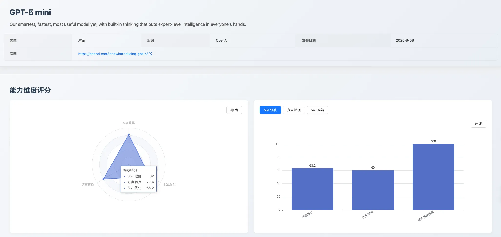
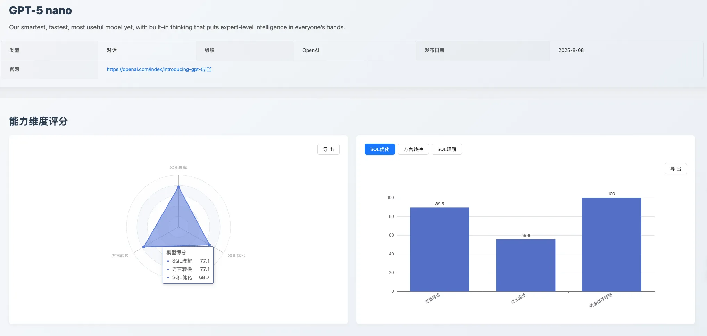
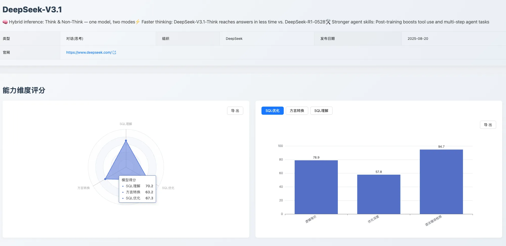
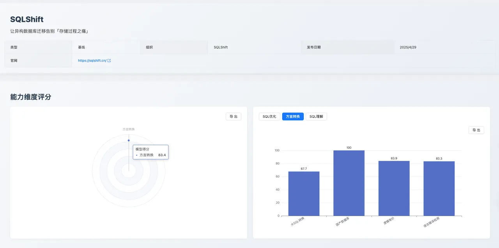
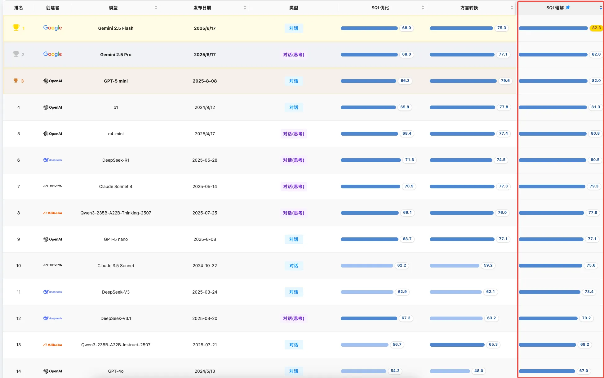
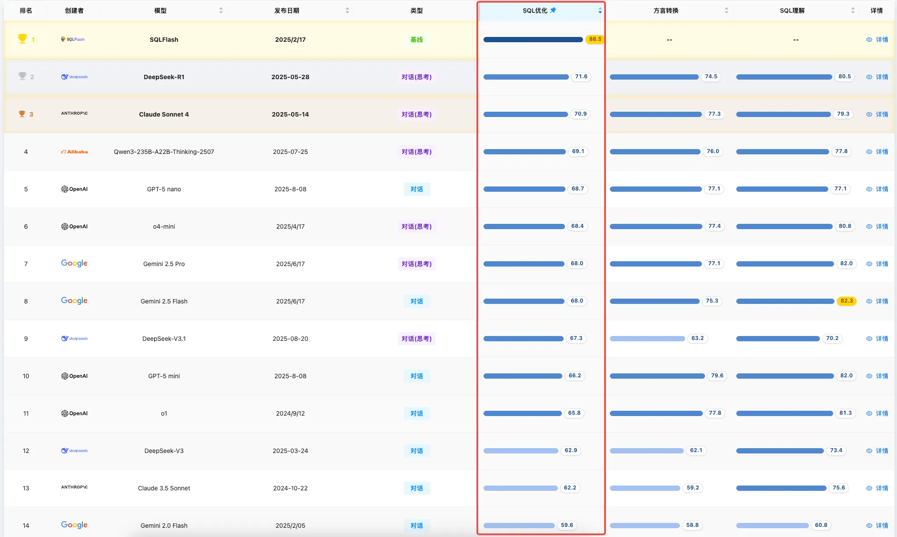
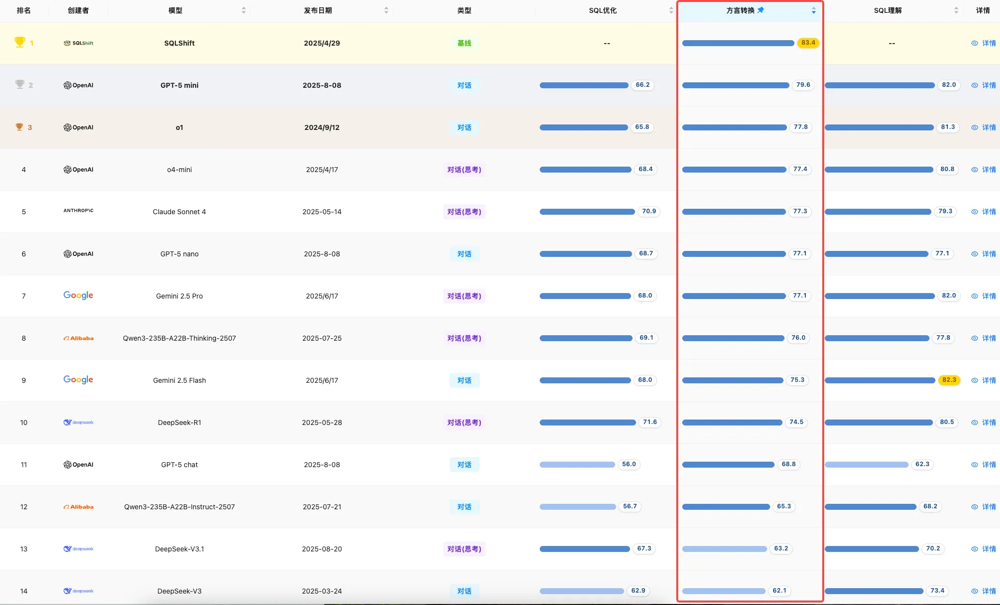

## 1. 摘要

2025 年 8 月，[SCALE](https://sql-llm-leaderboard.com/ranking/2025-08 'SCALE 202508') 评测基准持续追踪 AI 技术前沿，本期我们迎来了多个备受瞩目的新模型，并首次将专业的方言转换应用 —— [SQLShift](https://sqlshift.cn/) 作为基线纳入评测范围，旨在为开发者和决策者提供更全面、更具实践指导意义的参考。

本期核心看点：

- **GPT-5 系列能力分化显著**

  新一代 **GPT-5 家族** 内部表现出鲜明的特点。**gpt-5-mini** 在准确性、可靠性和复杂任务处理上表现均衡，综合实力领跑；**gpt-5-nano** 凭借极高的语法正确性成为可靠的“代码生成器”；而旗舰模型 **gpt-5-chat** 理论知识丰富，但在基础执行的准确性上存在明显不足，评测结果再次印证了“**场景定义模型价值**”的核心观点。

- **国产新锐模型表现均衡**

  **DeepSeek-V3.1** 在 _SQL 理解_、_优化_ 和*方言转换* 三大维度上展现了较为均衡的实力，在特定场景如 _国产数据库转换_ 中表现完美，但在处理超长复杂查询和深度优化方面仍有提升空间。

- **专业工具首次参评**

  本月首次引入专用“方言转换应用” [SQLShift](https://sqlshift.cn/) 进行评测，其在核心领域展现了强大性能，开启了通用大模型与专业工具在特定场景下性能对决的序幕。

## 2. 评测基准

为确保本次评测的公正性、深度与可复现性，我们沿用并在此阐明 SCALE 的三维评测体系。所有模型及工具均在标准化环境下进行测试，以保证结果的公平可比。

- **SQL 理解**：考察模型是否能精准解析复杂的查询逻辑与用户意图。
- **SQL 优化**：考察模型提升查询效率与性能的意识和能力。
- **方言转换**：考察模型在主流数据库之间进行语法迁移的准确性。

## 3. 本期新增评测模型与应用

为确保评测的及时性和前沿性，本月我们新增了以下模型及应用：

| 名称/版本     | 出品方   | 发布日期  |
| ------------- | -------- | --------- |
| GPT-5 chat    | OpenAI   | 2025/8/8  |
| GPT-5 mini    | OpenAI   | 2025/8/8  |
| GPT-5 nano    | OpenAI   | 2025/8/8  |
| DeepSeek-V3.1 | 深度求索 | 2025/8/20 |
| SQLShift      | SQLShift | 2025/2/28 |

## 3. 焦点分析

### 3.1 专题 1：GPT-5 系列模型首次评测

作为业界期待已久的新一代模型，GPT-5 系列在本月的评测中展现了其在 SQL 处理能力上的初步表现。

#### 3.1.1 GPT-5 mini：综合能力均衡的领先者

- **综合评价**: **gpt-5-mini** 在本次评测中 **综合表现领先**，各维度能力均衡且突出，是追求稳定输出和综合性能的企业级应用首选。
- **能力优势**：执行准确性高，可靠性强（_SQL 理解_ 维度 82.0 分）；基础能力扎实（_方言转换_ 中的语法错误检测 92.9 分）。
- **能力短板**：常规优化能力并非顶级（_SQL 优化_ 66.2 分）；长文本处理能力有限（_大 SQL 转换_ 58.1 分）。在 Oracle 到 Postgresql-9.2 转换时，对于存储过程的异常处理出现逻辑不等价问题，甚至丢失了错误处理机制，可以看出，**gpt-5-mini** 缺乏对某些场景下“编程范式”的深层理解。

#### 3.1.2 GPT-5 nano：高精度的代码生成器

- **综合评价**：**gpt-5-nano** 是一个出色的“SQL 代码生成器”，适合嵌入自动化工作流，处理标准化的“文本到 SQL”和简单的方言转换任务。
- **能力优势**：语法正确性极高（_语法错误检测_ 子项均获 100 分满分）；逻辑转换能力扎实。
- **能力短板**：缺乏对 SQL 执行效率的深层理解（_执行计划检测_ 35.7 分）， 从 **gpt-5-nano** 执行计划测评可以发现：模型过于依赖于模式匹配和概率预测，对 UPDATE 语句的执行计划理解不准确，EXPLAIN 结果字段的含义理解不全面， 特别是 `type`、`key` 和 `filtered` 字段，混淆了 WHERE 条件的过滤率和 UPDATE 操作的实际处理逻辑。同时，模型也难以应对复杂冗长的查询迁移（_大 SQL 转换_ 58.1 分）。

#### 3.1.3 GPT-5 chat：能力特点分化

- **综合评价**：**gpt-5-chat** 的综合表现不如预期，它在高级理论知识上表现出色，但在基础执行的准确性上存在明显不足。
- **能力优势**：理论知识储备丰富（_SQL 优化_ 的 _语法错误检测_ 94.7 分）。
- **能力短板**：
  - 基础执行的准确性堪忧（_SQL 理解_ 的 _执行准确性_ 仅 57.1 分）。在进行 _执行准确性_ 数据集测评时，**gpt-5-chat** 不能准确的判断出返回结果类型，无法准确的识别出 SQL 语句的返回结果类型为 `select` 还是 `table_state`。
  - 此外，处理复杂大型的查询迁移也较弱（_大 SQL 转换_ 仅 51.6 分），目标端 SQL 与原 SQL 出现逻辑不等价，无法精准失败语法适用版本问题，如 `ON CONFLICT` 只在 Postgresql-9.5 以上可用，但是 **gpt-5-chat** 在生成 Postgresql-9.2 时出现了该语法。

### 3.2 专题 2：DeepSeek-V3.1 评测分析

- **综合评价**：**DeepSeek-V3.1** 表现出较为均衡的综合实力，在三个维度上没有明显短板，但在性能表现上仍有提升空间。
- **能力优势**: 模型在*语法错误检测* 和遵循 _语法及最佳实践_ 方面表现稳健，能保证生成代码的基本可用性。在处理 _国产数据库转换_ 的特定场景下也表现准确。
- **能力短板**: 其核心短板在于处理超长、**复杂的 _大 SQL 转换_ 时，存在逻辑遗漏的风险（25.8 分）。同时，在 SQL 深层性能和执行逻辑的理解** 上（即 _执行计划检测_），以及 _优化深度_ 方面，倾向于提供普适性方案，缺乏深度见解。

### 3.3 专题 3：方言转换应用 SQLShift 首次评测

本月，我们拓展了专用工具方面的测评。**SQLShift** 作为一个专注于 SQL 方言转换的应用，其评测结果旨在为有高精度、高复杂度数据库迁移需求的团队提供决策依据。

- **评测维度**：本次评测聚焦于其核心的 **方言转换能力**。
- **评测表现分析**：作为一款专业工具，**SQLShift** 在其核心领域展现了强大的性能。
  - **国产数据库转换**：**SQLShift** 在此项获得 100 分满分，展现了对国内数据库生态的高度适配和深度理解。
  - **大 SQL 转换**： 在通用大模型普遍表现不佳的复杂 SQL 转换任务中，**SQLShift** 获得 67.7 分的高分，高于位列第二的 **o4-mini**（61.3 分），是目前首个能在此场景下保证高逻辑一致性和准确性的工具。

## 4. 本月榜单回顾

随着新模型的加入，本月各维度能力榜单的头部排名发生了显著变化，凸显了 AI 在 SQL 领域专业化与场景化的发展趋势。

### 4.1 SQL 理解

**简评：**本月该维度的榜首位置由 Google 的 **Gemini 系列** 模型占据，其中 **Gemini 2.5 Flash** 以 82.3 分位列第一。新发布的 **GPT-5 mini** 表现出色，以 82.0 分进入前三，其在执行准确性子项上得分较高，显示出较强的综合实力。

### 4.2 SQL 优化

**简评：**专用优化模型 **SQLFlash** 以 88.5 分的显著高分继续保持该维度榜首，与其他模型拉开较大差距。新模型中，**gpt-5-nano** 以其在语法可靠性上的高分进入前五。评测结果显示，通用大模型在深度优化能力上与专用模型相比仍存在明显差距。

#### 4.3 方言转换

**简评：** 本月首次参评的专用应用 [SQLShift](https://sqlshift.cn/) 以 83.4 分位列榜首，尤其在 _大 SQL 转换_ 等子项中表现突出，这反映了专业工具在特定领域的优势。通用模型中，**gpt-5-mini** 以 72.4 分位列第二，显示出其在语法迁移方面的较强能力。

## 5. 专家点评

> **尹海文**，数据库专家，Oracle ACE、PostgreSQL ACE，公众号 “胖头鱼的鱼缸” 主理人，圈内拥有 “总监” 称号。

相较于上一期也就是第一期 SCALE 榜单，本期最大的变化则是 8 月新发布的几个模型，来自 OpenAI 的 GPT-5 家族 和深度求索的 DeepSeek-V3.1，虽然新的模型在通用领域展现出了不小的进步，但是 SQL 理解能力和 SQL 优化能力专项领域中并没有对上一期榜单上的领跑集团形成反超，可见在特定领域中，一些模型还是有其深耕出来的优势；另一个比较让人惊讶的是 DeepSeek-V3.1 也没有对 DeepSeek-R1 形成反超，可见模型的新旧与其能力不一定存在必然关系，其设计、算法、数据质量与规模、训练过程、微调对齐、任务特性等因素带来的影响会更大。而在 SQL 方言转换能力上，本期新加入排行第二的 GPT-5 mini，超越了上期榜单的参与者，可见模型的进步对语言类的处理能力提升较大；同样新入榜单的 SQLShift 则以 83.4 的高分一骑绝尘，作为一款专门用于 SQL 方言改写的工具，其在该专项领域展现出了的统治力也展现出针对特定任务专门设计的工具也能在一众优秀的 AI 模型中闯出一片天地。

## 6. 总结

本月评测引入了 **GPT-5系列新模型**、**Deepseek-V3.1** 和专业级应用 [SQLShift](https://sqlshift.cn/)，进一步丰富了 SCALE 榜单的深度和广度。评测结果再次表明，在专业级 SQL 任务中，不同模型和工具呈现出显著的能力分化。通用大模型在持续进步，展现了强大的通用问题解决能力。然而，**本次评测也清晰地揭示了，当面临如高要求的数据库方言转换等具体场景时，专业工具（如 [SQLShift](https://sqlshift.cn/)）的核心优势无可替代。它们通过深度的领域知识优化、对复杂边缘案例的精准处理以及更稳定可靠的输出，展现了超过通用模型的准确性和适配性**。 这再次验证了，对于追求性能和可靠性的企业级应用而言，选择适配具体场景的专业工具依然是当前的最优策略。

## 7. 未来展望

SCALE 评测体系将持续跟踪各大厂商的最新模型动态和迭代进展。我们致力于通过公正、透明的评测数据，与社区共同推动大语言模型在数据库领域的应用和实践走向更深层次。

**即刻探索新一代模型的专业能力！** 欢迎您登陆 SCALE 官方平台，查看完整的最新榜单和模型对比详情，共同把握 AI 技术的前沿脉搏。

> 查看完整榜单并联系我们提交您的产品进行测评。*https://sql-llm-leaderboard.com/*

**SCALE：为专业 SQL 任务，选专业 AI 模型。**
