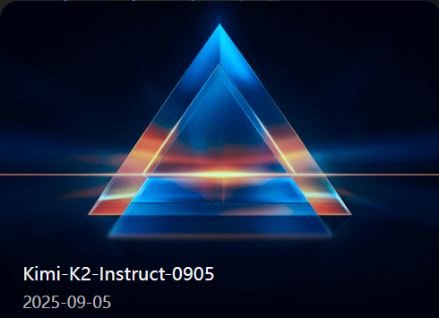
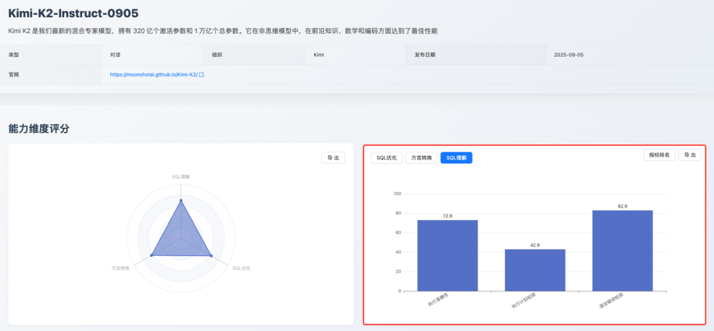
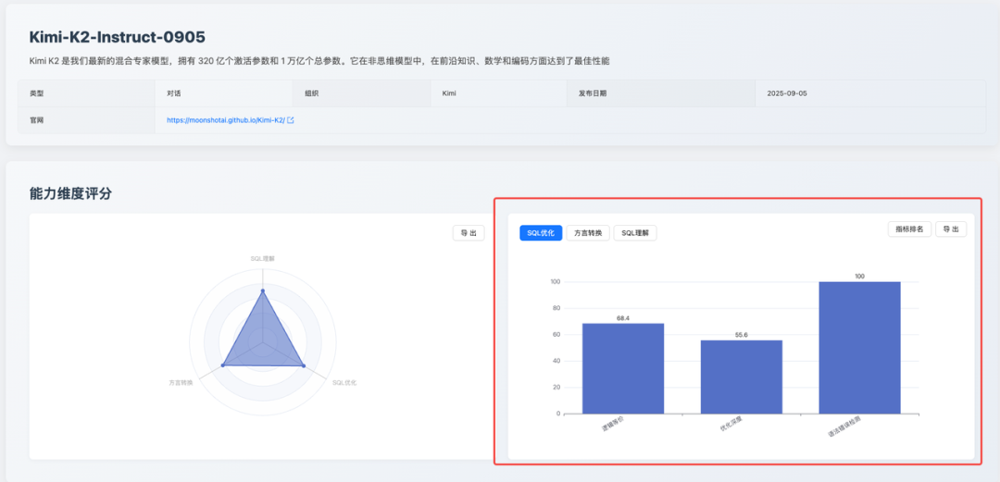
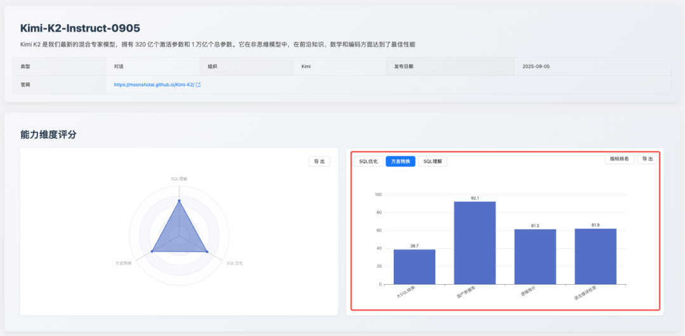
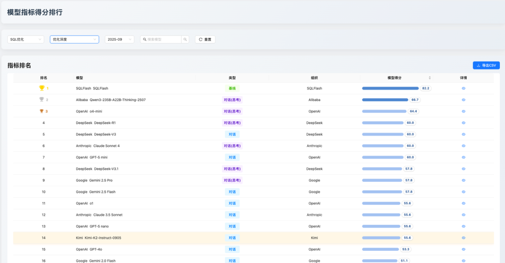
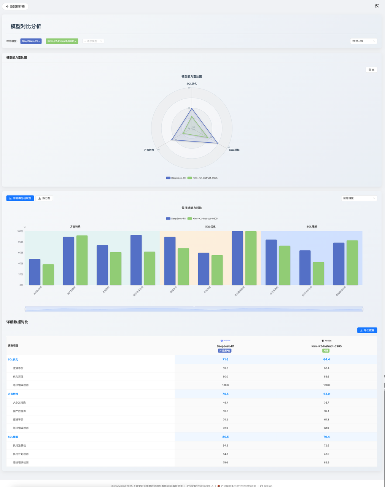

## 1. 摘要
2025 年 9 月，[SCALE](https://sql-llm-leaderboard.com/ranking/2025-09 "SCALE 202509") 评测基准持续聚焦 AI 在 SQL 领域的应用前沿。

本月，榜单新增了 [Moonshot AI（月之暗面）](https://www.moonshot.cn/ "月之暗面") 发布的最新模型 —— **Kimi-K2-Instruct-0905**，还在平台功能上进行了升级，旨在为开发者、研究者和企业决策者提供更精细、更具洞察力的技术参考。

本期核心看点：

- **新增模型评测**：新增的 Kimi K2 模型在「**SQL 理解**」维度获得 70.4 分，「**SQL 优化**」维度获得 64.4 分，「**方言转换**」维度获得 63.0分。评测结果显示，**该模型在国产数据库适配和基础语法处理方面表现突出**，但在处理超长复杂查询和深度优化方面与领先模型存在差距。
- **平台功能升级**：新增 **模型细分指标排名** 与 **模型对比** 功能。用户现可查看各模型在 「**逻辑等价**」、「**执行准确性**」 等细分能力上的排名，并支持对多个模型进行多维度的可视化对比分析，进一步提升了评测数据的透明度与实用性。

## 2. 评测基准
为保证评测结果的长期可比性和权威性，本月我们的核心评测基准与算法保持不变。我们继续沿用 SCALE 自创立之初便确立的三维评测体系，确保所有模型与工具在统一、标准的测试环境下进行评估，以提供公正、可复现的评测结果。

- **SQL 理解**：考察模型是否能精准解析复杂的查询逻辑与用户意图。
- **SQL 优化**：考察模型提升查询效率与性能的意识和能力。
- **方言转换**：考察模型在主流数据库之间进行语法迁移的准确性。

我们认为，稳定的评测体系是追踪模型能力演进、洞察技术发展趋势的基石。

## 3. 焦点分析

### 3.1 专题：国产新锐 Kimi K2 首次评测

作为本月新增的焦点模型，Kimi K2 在其首次评测中，各维度得分分别为：
- **SQL 理解**：70.4
- **SQL 优化**：64.4
- **方言转换**：63.0

这些分数背后揭示了其作为一个通用大模型在 SQL 领域的具体能力分布。

#### 3.1.1 SQL 理解能力：70.4
这是一个稳健的分数，表明 **Kimi K2 具备可靠的 Text-to-SQL 基础能力。**

该分数主要得益于其在「**执行准确性**」（72.9）和「**语法错误检测**」（82.9）上的良好表现。然而，其在「**执行计划检测**」子项上得分仅为 42.9，这反映出模型能够准确生成符合用户意图的 SQL 代码，但是在评测中发现，Kimi K2 将 SQL 语句类型误认为执行计划访问类型，在访问类型上填写为 INSERT、UPDATE 等 SQL 语句类型，表现出过度依赖表面语法特征而非深层语义理解的问题，**Kimi K2 在 SQL 执行计划理解能力上还有待加强。**

#### 3.1.2 SQL 优化能力：64.4
该分数体现了模型在 **SQL 优化** 方面的能力特点：**侧重于保证语法的正确性，但在深度优化上表现不足。**

具体来看，其「**语法错误检测**」获得 100 分满分，保证了优化后代码的可用性；「**逻辑等价**」（68.4），表现尚可。但其核心短板在于「**优化深度**」（55.6），该项得分仅排名第 14，说明其优化策略倾向于保守和普适，在投影下推和 LIKE 前缀优化测评时表现不佳，**Kimi K2 未能使用到这些查询优化技术，缺乏对复杂查询进行深度重构以提升性能的能力。**

#### 3.1.3 方言转换能力：63.0

此维度的得分呈现出典型的能力分化。模型的优势在于对国内数据库生态的适配性，其「**国产数据库**」转换子项得分高达 92.1。然而，其在处理「**大 SQL 转换**」时表现非常挣扎，得分仅为 38.7，这是该模型最主要的短板之一。

这表明，Kimi K2 在处理标准化的、具有明确国产化需求的迁移任务时表现出色，在 SQL Server 到 GaussDB 的大 SQL 转换时出现了逻辑不等价问题，如在原始 SQL 中 `WHERE ProductID = @ProductID` Kimi K2 将其错误的改写为 `WHERE ProductID = ProductID`，原始 SQL 使用参数变量而改写后使用自身比较恒为真，这将导致更新整个 Products 表，而不是只更新当前游标指向的那一行，表现出 **Kimi K2 难以应对包含超长、复杂逻辑的异构数据库迁移场景。**

## 4. 平台升级：更深入、更直观的对比分析

为了帮助用户将评测数据转化为实际的选型决策，SCALE 平台本月正式上线了两项核心功能。其核心价值在于，推动用户从 “**看总分排名**” 的宏观浏览，转向“**为特定场景找最优解**”的深度分析。

### 4.1 模型细分指标排名
*超越总分，洞察模型的“偏科”特性。*

此功能支持用户下钻到 12 个细分指标，查看模型在特定子任务上的排名，以评估模型是否满足特定场景需求。

**应用举例**：以 Kimi K2 为例，其「**SQL 优化**」总分排名第 12，仅看总分可能会在初步筛选中被忽略。但通过细分指标排名，我们发现其 「**语法错误检测**」排名第 9，「**逻辑等价**」排名第 10。这揭示了该模型在保证代码基础可用性方面是可靠的，只是在深度优化上存在短板。对于那些优先保障代码正确性而非极致性能的团队，Kimi K2 将是一个更优的选项。

### 4.2 模型对比分析
*告别盲选，直观定位场景最优解。*

该功能支持用户选择多个模型，进行多维度可视化对比，直观地进行选型权衡。

**应用举例**：假设一个团队需要在“**支持国产数据库**”和“**处理复杂查询迁移**”两个能力中做出选择。通过模型对比功能，将 Kimi K2 与 DeepSeek-R1 并列比较，数据将清晰呈现：Kimi K2 在「**国产数据库**」转换上优势明显，但在「**大 SQL 转换**」上远逊于 DeepSeek-R1。这一可视化结果使得决策路径变得清晰：如果核心任务是适配国产数据库，Kimi K2 是更优选择；反之，则应选择后者。该功能将复杂的选型评估，转变为直观的数据比较，极大提升了决策的效率和准确性。

## 5. 专家点评

> **薛晓刚**，数据库专家，CCF 数据库专委会执行委员、Oracle ACE(Oracle 和 MySQL 方向)、PostgreSQL ACE。公众号 “四海内皆兄弟” 主理人，圈内拥有 “首席” 称号。

SCALE 最新发布的 9 月评测榜单，在“评测基准与算法更新说明”这段中可以看到三个关键字：SQL 理解、SQL 优化和方言专访。在我看来，清晰地指向了一个关键趋势：在 AI 与数据库技术深度融合的当下，我们正从追求“全能冠军”转向识别“场景专家”。这份榜单及其功能升级，为行业提供了前所未有的精细化选型视角。

首先，本月新晋的焦点模型 Moonshot 的 Kimi K2 的评测总体结果显示：SQL 理解(70.4)、SQL 优化(64.4)、方言转换(63.0)。不过在细分小项上比较亮眼，比如在国产数据库适配（方言转换子项 92.1 分）和基础语法正确性（优化项语法错误检测100分）上表现突出，这精准地切中了当前国产化替代浪潮中对“可用、可靠”的核心诉求。然而，其在“大 SQL 转换”（38.7分）和“优化深度”（55.6分）上的明显短板，也同样坦诚地揭示了其边界。

其次，本次榜单还有一个亮点在于其平台功能的战略升级。未来帮助用户进行技术选型。其中深化场景是特别提到的。通用大模型不能解决具体的企业自身遇到的问题。如果要精准的满意的效果，那么就要贴合企业做垂直领域的工作。这背后反映的正是数据库应用的复杂现实——企业场景千差万别。SCALE 此举，将评测从学术性的能力竞赛，提升到了工程化的选型工具层面，极大地提升了其实用价值。

综上所述，作为行业从业者，我认为未来的重点不在于争论哪个模型“最强”，而在于如何利用 SCALE 这样精细化的“能力地图”，快速定位到最适合当前技术栈与业务场景的 AI 助手。我期待 SCALE 继续深化企业级真实场景的构建，并呼吁更多厂商参与评测，共同推动 AI 在数据库领域从“可用”到“好用”的实质性飞跃。

## 6. 总结

随着 Kimi K2 等新模型的加入，SCALE 评测榜单已累计收录超过 19 款业界主流 AI 模型及专业工具。本月的功能升级是提升平台价值的重要举措，更透明、更易用的数据将有助于社区进行审慎的技术选型。

## 7. 未来展望
SCALE 评测体系将持续跟踪各大厂商的最新模型动态和迭代进展。我们致力于通过公正、透明的评测数据，与社区共同推动大语言模型在数据库领域的应用和实践走向更深层次。

**即刻探索新一代模型的专业能力！** 欢迎您登陆 SCALE 官方平台，查看完整的最新榜单和模型对比详情，共同把握 AI 技术的前沿脉搏。 

> 查看完整榜单并联系我们提交您的产品进行测评。*https://sql-llm-leaderboard.com/* 

**SCALE：为专业 SQL 任务，选专业 AI 模型。**
