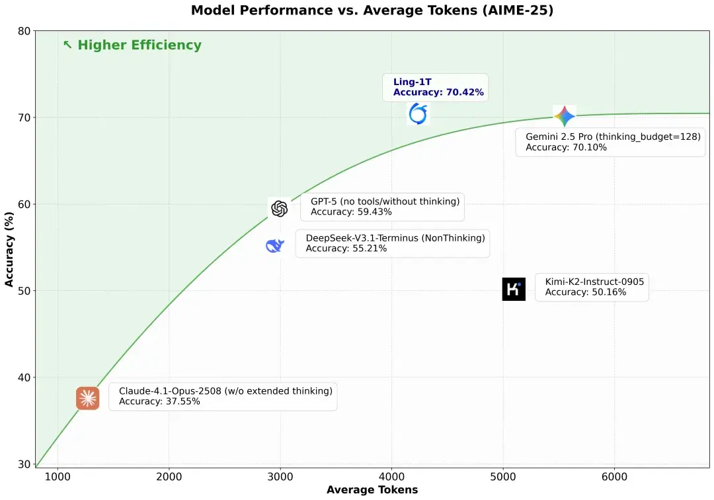
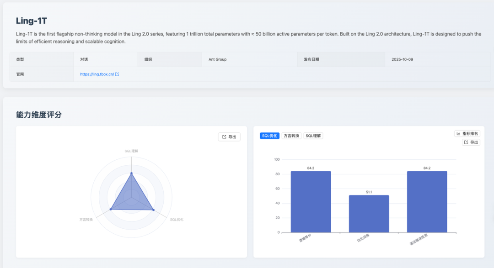
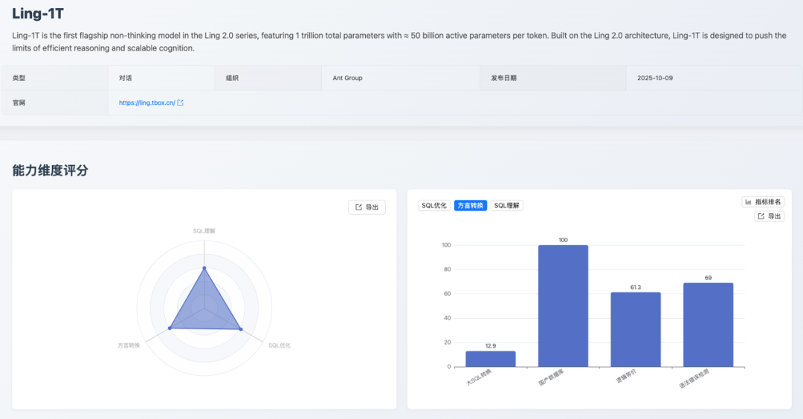
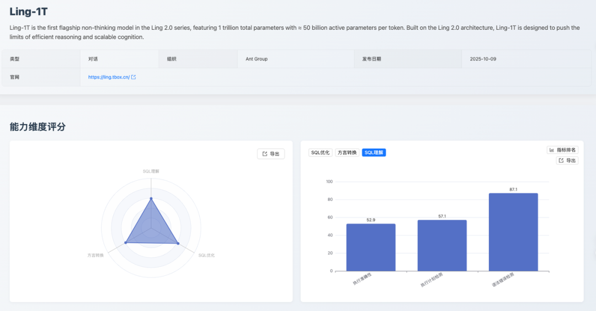
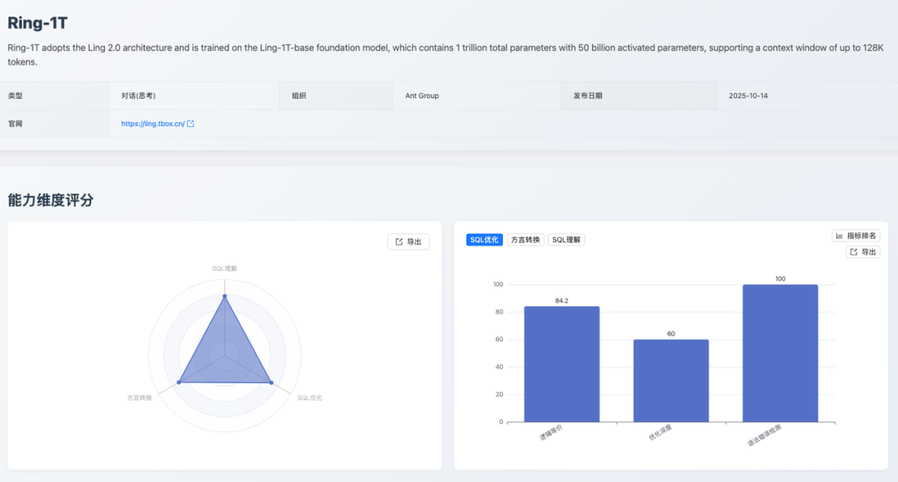
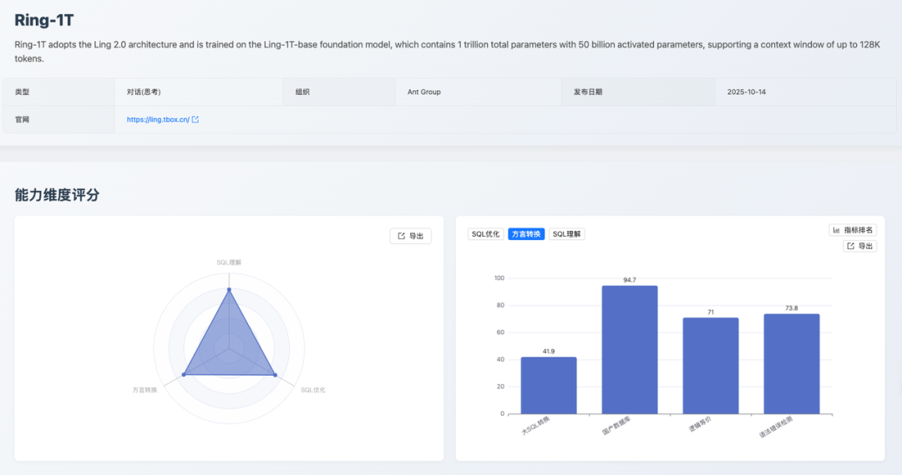
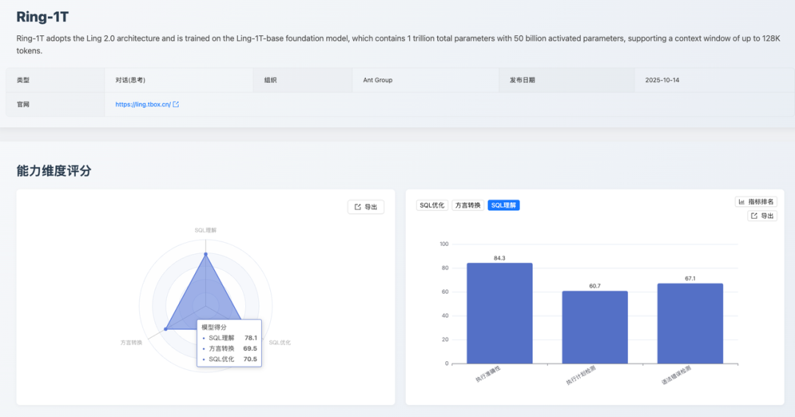

## 1. 摘要

2025 年 10 月，[SCALE](https://sql-llm-leaderboard.com/ranking/2025-10 "SCALE 202510") 评测基准持续追踪 AI 在专业 SQL 领域的最新进展。

本月，榜单迎来了蚂蚁百灵大模型团队发布的两大 万亿级 参数的模型：[Ling-1T](https://huggingface.co/inclusionAI/Ling-1T) 和 [Ring-1T](https://huggingface.co/inclusionAI/Ring-1T)。

* **Ling-1T** ：蚂蚁百灵大模型 **Ling 2.0** 系列的第一款旗舰模型。
* **Ring-1T** ：一款基于 **Ling 2.0** 架构的思考模型，也是全球首个开源万亿参数思考模型。

本期核心看点：

* **新增模型评测** ：首次引入蚂蚁 *Ling-1T* 与 *Ring-1T* 模型。评测数据显示，两款模型呈现出清晰的能力分化：
  * Ling-1T 在「**国产数据库**」转换场景中表现突出，获得满分！
  * Ring-1T 在「**SQL 优化** 」和「**SQL 理解** 」维度展现了 **更为均衡和稳健的综合能力**，总分均进入榜单上游。

## 2. 评测基准

为保证评测结果的长期可比性和权威性，本月我们的核心评测基准与算法保持不变，继续沿用 **SCALE** 自创立之初便确立的三维评测体系，确保所有模型与工具在统一、标准的测试环境下进行评估，以提供公正、可复现的评测结果。

* **SQL 优化**：考察模型提升查询效率与性能的意识和能力。
* **方言转换**：考察模型在主流数据库之间进行语法迁移的准确性。
* **SQL 理解**：考察模型是否能精准解析复杂的查询逻辑与用户意图的能力。

本月所有新增模型均在此标准体系下进行评估。

## 3. 焦点分析

### 3.1 专题一：Ling-1T 首次评测

*Ling-1T* 作为 **Ling 2.0** 系列的首款旗舰非思考模型，在本月首次参评。其各维度总分分别为：

* **SQL 优化**：62.5
* **方言转换**：59.2
* **SQL 理解**：59.4

评测结果显示，该模型能力特点鲜明，在特定场景表现优异，但在复杂任务处理上仍存在明显短板。

#### 3.1.1 SQL 优化能力：62.5

*Ling-1T* 在 **SQL 优化** 维度获得 62.5 分。根据细分指标数据显示，该模型在「**逻辑等价**」方面表现出色，以 84.2 分位列该项第 5 名。

然而，其在「**优化深度** 」上表现不足，得分仅为 51.1 分（排名第 17），同时「**语法错误检测** 」得分也偏低（84.2分）（排名第 18），分析测评报告可见，模型将符合 MySQL 宽松模式的 `GROUP BY` 查询误判为有语法错误；对 `UNION` 查询中 `ORDER BY/LIMIT` 的语法规则理解不准确。

**核心缺陷** ：模型缺乏对数据库特定模式（如 MySQL 的 `ONLY_FULL_GROUP_BY`）和 **SQL 标准/方言差异** 的上下文感知能力，过度依赖教条式语法规则，无法根据数据库配置灵活判断语法正确性，导致在边界情况下的误判。这一系列分数表明，模型具备保障逻辑一致性的能力，但在应用深度优化策略和保障语法规范性方面仍有较大提升空间。

#### 3.1.2 方言转换能力：59.2

此维度得分呈现出显著的能力分化（总分 59.2，排名第 17）。**其最大亮点在于对国内数据库生态的适配性** ，其「**国产数据库** 」转换子项获得 100 分满分（与 [SQLShift](https://sqlshift.cn/) 并列），展现了其在该特定场景下的卓越能力。

然而，模型在处理复杂迁移任务时表现挣扎。「**大 SQL 转换** 」得分仅为 12.9分（排名第 20）。测评报告显示，在复杂 SQL 方言转换中，模型误用不兼容语法（如保留 `SET NOCOUNT ON`、混用 `DBMS_OUTPUT` 等），且对控制流、游标、异常处理等结构的语义理解不足，导致转换后语法不兼容或逻辑不等价，这体现出模型对复杂结构化代码的全局理解能力，以及对多方言语义差异的精确把握能力还有待提升。同时，其「**逻辑等价** 」（61.3分）和「**语法错误检测**」（69.0分）得分中等，表明其在处理非国产数据库的复杂转换时，难以保证代码的规范性。

#### 3.1.3 SQL 理解能力：59.4

该分数表明 *Ling-1T* 具备基础的 SQL 解析能力。数据细分显示，其在「**语法错误检测** 」上表现突出，以 87.1 分的成绩与 *Claude 3.5 Sonnet* 并列该指标测评的第 1 名。

然而，其在「**执行准确性** 」方面表现不佳，得分仅为 52.9 分（排名第 19），分析测评报告可见，模型在日期条件测评中易出错，如 `due_date < '2025-06-07'` 的查询中返回了 `due_date='2025-06-10'` 的记录，明显违反了条件。这类错误反映了模型在执行 SQL 查询时，对日期比较的语义理解与严谨性不足。这是其主要短板之一。

此外，其「**执行计划检测** 」得分为 57.1 分，模型在执行计划预测时，对 DDL 中未定义索引的字段错误预测了 `key` 和 `possible_keys`。例如查询 `WHERE fruit_name = 'Banana'` 时，模型预测 `key: "fruit_name"` 和 `possible_keys: "fruit_name"`，但 DDL 中 `fruit_name` 字段没有索引，反映出模型过于基于查询模式推测出现误判，在约束验证能力和结构化解析与推理上仍有较大提升空间。

### 3.2 专题二：Ring-1T 首次评测

*Ring-1T* 作为基于 **Ling 2.0** 架构的万亿级参数思考模型，展现了比 *Ling-1T* 更强的综合实力。其各维度总分分别为：

* **SQL 优化**：70.5
* **方言转换**：69.5
* **SQL 理解**：78.1

能力表现更为均衡。

#### 3.2.1 SQL 优化能力：70.5

该分数体现了模型在 SQL 优化方面的均衡能力。其「**语法错误检测** 」获得 100 分满分（与 [SQLFlash](https://sqlflash.ai/) 并列），保证了优化后代码的规范性与可用性。「**逻辑等价** 」得分为 84.2 分（排名第 6），表现优异。「**优化深度**」得分为 60.0 分（排名第 4），表明模型能够应用常规的优化策略，但在处理复杂的查询、进行深度重构以追求极致性能方面，仍有进步空间。

#### 3.2.2 方言转换能力：69.5

*Ring-1T* 在方言转换维度获得 69.5 分（排名第 11）。细分数据显示，其在「**国产数据库** 」转换（94.7分）、「**语法错误检测** 」（73.8 分，排名第 9）和「**逻辑等价**」（71.0 分）上均表现稳健。

其短板在于「**大 SQL 转换** 」，得分仅为 41.9 分（排名第 12），模型在处理跨数据库访问（如 SQL Server 的 `[server].database.schema.table`）、控制流（如 GOTO 标签跳转）、错误处理机制（如 `@@ERROR` 检查、`BEGIN TRY/CATCH`）、动态 SQL 执行（如 `sp_executesql` 参数绑定）等复杂结构时，存在语法混用、语义不等价、结构转换不完整等问题。

**核心缺陷** ：缺乏对复杂结构化代码的全局理解能力，以及对多方言语义差异的精确映射能力，导致转换后的 SQL 在语法正确性或逻辑等价性上存在缺陷。相较于 *Ling-1T* 的 12.9 分，该分数有了显著提升，表明其在处理「**大 SQL 转换**」和保证代码规范性方面具备更强的能力，使其成为一个更可靠的数据库迁移工具。

#### 3.2.3 SQL 理解能力：78.1

得分 78.1 分，这是一个稳健的分数。其在「**执行准确性** 」上表现稳定（84.3分）。但其「**执行计划检测** 」（60.7分）和「**语法错误检测**」（67.1分）得分偏低。

模型混淆了标准 SQL 语法与数据库特定规则，将正确的标准语法误判为错误（如 GROUP BY 中使用别名 `category_prefix`、`INSERT` 子查询 `INSERT INTO table (SELECT ...)`、`CREATE VIEW` 中使用 `HAVING` 等），同时对复杂结构理解不准确，导致误判和漏判并存，反映了模型对标准 SQL 规范的准确理解不足，以及对语法规则判断的机械性。

## 4. 专家点评

> **林春**，中国太平洋保险数智研究院首席数据库专家，OceanBase 客户专家委员会（OBCE）专家委员，获得 OBCE 认证。获得 Oracle OCM、PostgreSQL PCM、MySQL OCP 认证。墨天轮 MVP，中国数据库技术大会（DTCC）演讲嘉宾。

SCALE 2025 年 10 月《大模型 SQL 能力排行榜》的发布，堪称 AI 与数据库协同领域的关键行业参照。其依托"**SQL优化+方言兼容+SQL理解** "的三维测评框架，将大模型在数据库场景的落地能力进行了体系化量化，尤其在 Ling-1T、Ring-1T 等模型的分项表现中，清晰呈现了自然语言与数据库操作的适配差异，**为企业级 AI+ 数据库的技术选型提供了精准的能力标尺**。

这个榜单通过月度迭代的动态测评范式，既强化了对大模型数据库能力演进的追踪性，又以"细分场景得分+综合能力排名"的形式，缓解了企业对大模型"泛能力强、垂直场景弱"的选型焦虑，这与当前数据库向智能化、场景化演进的趋势高度契合。**它不仅为中小企业提供了低成本评估 AI 数据库工具的参照标准，更倒逼大模型行业加速垂直能力优化 ------ 在 SQL 复杂查询适配、多数据库方言兼容等领域形成技术迭代**。

SCALE 榜单的价值在于以标准化测评姿态打通了大模型能力与数据库需求的匹配链路，推动"**模型能力评估-场景技术选型-落地效果验证**"全流程的理性化重构，为下一代智能数据系统的技术适配提供了极具实践意义的行业范本。

我们可以看到，Ring-1T 模型在数据库场景中的核心优势场景包括：

* **复杂 SQL 查询生成**：在多表关联、嵌套子查询等复杂 SQL 构建任务中表现突出（SQL 优化能力得分 70.5），可高效将自然语言需求转化为高性能 SQL 语句。

* **多数据库方言兼容**：适配 MySQL、Oracle 等主流数据库的语法差异（方言兼容能力得分 69.5），能自动生成符合不同数据库语法规范的操作语句。

* **SQL 语义理解与纠错**：对模糊需求、表述不规范的查询指令，具备较强的语义解析与纠错能力（SQL 理解能力得分 78.1），降低自然语言交互的精准度门槛。

* **批量数据操作适配**：在批量插入、更新等数据操作场景中，可生成高效且符合数据库性能要求的 SQL 脚本，适配企业级数据批量处理需求。

## 5. 总结

随着蚂蚁百灵 *Ling-1T* 和 *Ring-1T* 两款新模型的加入，**SCALE** 评测榜单已累计收录超过 20 款业界主流 AI 模型及专业工具。本月评测清晰地展示了 **Ling 2.0** 系列两款模型的特点：

* **Ling-1T** 在国产数据库适配上表现出众，但在复杂任务处理上存在短板
* **Ring-1T** 则展现了更均衡、更强大的综合 SQL 处理能力，特别是在 SQL 理解和优化方面表现稳健

## 6. 未来展望
SCALE 评测体系将持续跟踪各大厂商的最新模型动态和迭代进展。我们致力于通过公正、透明的评测数据，与社区共同推动大语言模型在数据库领域的应用和实践走向更深层次。

**即刻探索新一代模型的专业能力！** 欢迎您登陆 SCALE 官方平台，查看完整的最新榜单和模型对比详情，共同把握 AI 技术的前沿脉搏。

> 查看完整榜单并联系我们提交您的产品进行测评。*https://sql-llm-leaderboard.com/* 

**SCALE：为专业 SQL 任务，选专业 AI 模型。**
