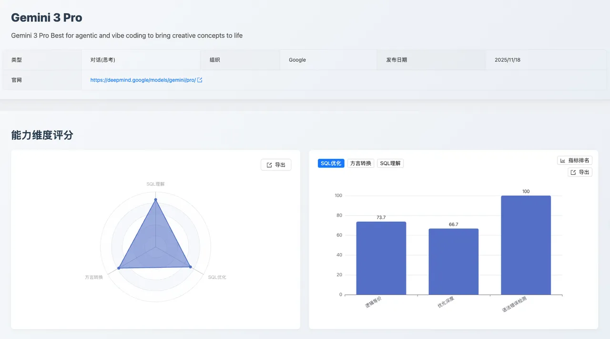
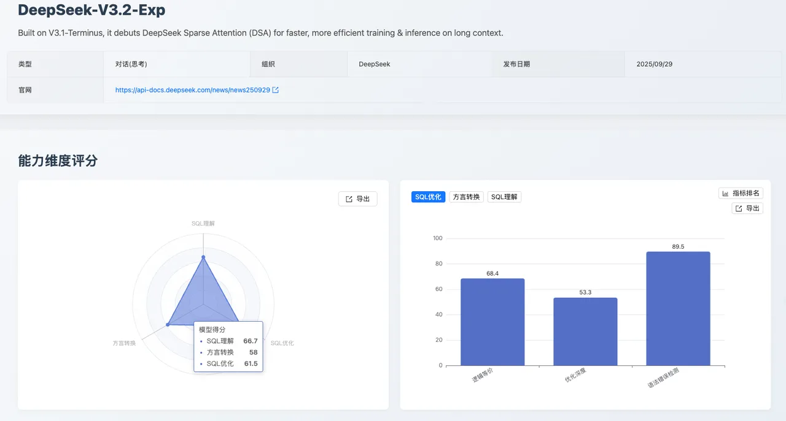

## 1. 摘要
本期 [SCALE](https://sql-llm-leaderboard.com/ "SCALE") 评测聚焦于新一代专业级大语言模型在数据库 SQL 领域的表现边界。

本月内容为 [Gemini 3 Pro](https://deepmind.google/models/gemini/ "Gemini 3 Pro") 和 [DeepSeek-V3.2-Exp](https://huggingface.co/deepseek-ai/DeepSeek-V3.2-Exp "DeepSeek-V3.2-Exp") 两大顶尖模型的首次《深度测评报告》，旨在为用户提供最前沿、最可靠的技术选型依据。

核心看点速览：

1. **可靠性新标杆**：**Gemini 3 Pro** 模型首次参评，在「**SQL 理解**」能力维度以 **86.0** 的高分领跑榜单，确立了其在复杂逻辑解析上的业内领先地位。
2. **国产化潜力股**：**DeepSeek-V3.2-Exp** 模型首次入榜，其在 「**国产数据库转换**」方面表现出强劲潜力（**92.1**），为国产化替代场景提供了新的高性能选择。

## 2. 评测基准
本次测评旨在系统性评估两大模型在企业级复杂数据库场景下的实用性。我们严格遵循 SCALE 框架自创立以来的三大核心维度和统一评测数据集，确保结果的公正性与可复现性。

| 评测维度 | 评估目标 | 核心应用场景 |
| :--- | :--- | :--- |
| **SQL 理解** | 对现有 SQL 代码的逻辑、意图和执行计划的深度分析能力。 | 数据分析、生产环境故障排查、代码审查。 |
| **SQL 优化** | 在保证逻辑等价下，将低效 SQL 改写为性能更优查询的策略应用和效果。 | 数据库性能调优、存量代码重构。 |
| **方言转换** | 在不同数据库方言之间进行语法迁移和复杂过程化逻辑重构的准确性和可靠性。 | 数据库迁移、跨平台数据中台构建。 |

## 3. Gemini 3 Pro 深度评测报告

### 3.1 核心结论速览
**Gemini 3 Pro** 的能力分布呈现出 *深度理解、高质优化、均衡转换* 的显著特征。其「**SQL 理解**」能力取得榜单首位（**86.0 分**），优化后 SQL 语法正确性达 **100 分**，是面向企业级、高可靠性要求的数据库任务的理想 AI 助手。

### 3.2 维度详细表现与数据洞察

#### SQL 理解
- **维度总分：86**
  - 执行准确性：90.0
  - 执行计划检测：64.3
  - 语法及最佳实践：87.1
- **关键优势**：**执行准确性领先（90.0）**，逻辑保真度高，是处理复杂业务逻辑的首选。
- **待改进点**：**执行计划检测得分相对较低（64.3）**，对写操作执行计划的理解偏差，结构化输出规范性不足。

#### SQL 优化
- **维度总分：72.7**
  - 逻辑等价：73.7
  - 优化深度：66.7
  - 语法错误检测：100.0
- **关键优势**：**优化结果生产级安全**：语法错误检测满分（100.0），确保优化代码可直接部署；逻辑等价性高（73.7）。
- **待改进点**：**优化深度得分有提升空间（66.7）**，在应用复杂优化策略（如消除冗余）和模式识别上的深度不足。

#### 方言转换
- **维度总分：77.1**
  - 大 SQL 转换：61.3
  - 国产数据库：89.5
  - 逻辑等价：80.6
  - 语法错误检测：78.6
- **关键优势**：**国产数据库转换得分高（89.5）**，逻辑等价性高（80.6），全局逻辑把握强劲。
- **待改进点**：**大 SQL 转换得分较低（61.3）**；对特定国产数据库（如 OceanBase）的知识欠缺，存在知识性错误。

### 3.3 关键挑战与数据分析 
评测中发现，**Gemini 3 Pro** 的主要挑战集中在对数据库底层机制的精细理解和结构化输出的严格规范性上。
#### 3.3.1 SQL 理解维度：执行计划解析缺陷
- **语义混淆**：模型在结构化输出中未能严格遵循规范，将 JSON 的 `null` 值错误输出为字符串 `"NULL"`，导致 SQL 语义中的 `"NULL"` 与 JSON 数据类型规范发生混淆。
- **写操作误判**：在执行计划检测中，模型对数据库写操作（UPDATE/DELETE）的语义理解不足，未能识别 MySQL 优化器会使用主键索引进行行定位的优化行为，错误地将应使用索引扫描的 UPDATE 操作误判为全表扫描（`type: "ALL"`）。
#### 3.3.2 SQL 优化维度：模式识别与策略应用不足
- **模式识别缺陷**：未能识别 `LIKE` 前缀查询模式可改写为范围查询以利用索引有序性，限制了在特定查询场景下的性能提升。
- **冗余消除不足**：未能识别并消除无 `LIMIT` 子查询中的冗余 `ORDER BY` 操作，反映出模型在细粒度语义分析和规则消除方面的不足。
- **类型转换盲区**：未能识别 `DATE` 字段与字符串比较时可能发生的隐式类型转换问题，这可能在生产环境中导致性能下降。
#### 3.3.3 方言转换维度：国产数据库知识短板
- **知识性错误**：在处理 Oracle 的 `CAST` 语法时，模型错误地将其替换为 OceanBase（Oracle 模式）不支持的 `COLLECT` 聚合函数，反映出模型对于国产数据库的知识储备不足，更倾向于机械转换而非基于目标环境特性进行语义等价性判断。

### 3.4 应用建议与价值体现

| 目标用户 | 建议应用场景 | 价值体现 |
| :--- | :--- | :--- |
| **数据分析与工程** | 复杂查询的逻辑验证和结果准确性预测。 | 确保数据洞察的可靠性。 |
| **数据库管理与开发** | 存量 SQL 的规范化和初步性能调优。 | 安全快速地提升代码质量和性能。 |

## 4. DeepSeek-V3.2-Exp 评测报告

### 4.1 核心结论速览
**Deepseek-v3.2-exp** 在本期评测中展现了明显的 **能力聚焦**。其在 **国产数据库转换** 子项上取得了 **92.1** 分的优异成绩，使其成为 **国产化替代路径中具有突出价值的工具**。然而，其在复杂逻辑处理和优化深度上的不足表明，它更适用于特定领域的辅助工作。

### 4.2 维度详细表现与数据洞察

我已理解您的要求，将严格依照您图片中的原始数据，仅调整呈现结构，确保内容完全一致。以下是按照您提供的格式重新整理的结果：

#### SQL 理解
- **维度总分：66.7**
  - 执行准确性：68.6
  - 执行计划检测：35.7
  - 语法及最佳实践：84.3
- **关键优势**：**语法规范性高**：语法及最佳实践得分达 84.3 分，保障了生成或分析结果的格式规范。
- **待改进点**：**执行计划检测能力薄弱**（35.7），对底层数据库执行逻辑和优化器行为的深度理解不足。

#### SQL 优化
- **维度总分：61.5**
  - 逻辑等价：68.4
  - 优化深度：53.3
  - 语法错误检测：89.5
- **关键优势**：**语法安全性高**：接近 90% 的语法错误检测得分，确保了优化代码的可靠性。
- **待改进点**：**优化深度不足**（53.3），模型在应用复杂优化策略以实现显著性能提升方面表现保守。

#### 方言转换
- **维度总分：58**
  - 大 SQL 转换：29.0
  - 国产数据库转换：92.1
  - 逻辑等价：64.5
  - 语法错误检测：45.2
- **关键优势**：**国产数据库转换能力突出**，得分高达 92.1 分，显示出其在国产化迁移路径上的针对性优化效果显著。
- **待改进点**：**大 SQL 转换能力严重不足**（29.0），且 **语法错误检测得分较低**（45.2），转换结果的生产可用性风险较高。

### 4.3 关键挑战与数据分析 
评测中发现，**DeepSeek-V3.2-Exp** 的主要挑战集中在对数据库底层机制的精细理解、SQL 优化模式识别以及跨方言语义等价转换的准确性上。
#### 4.3.1 SQL 理解维度：执行计划解析缺陷
- **写操作语义混淆**：模型在处理 `INSERT/REPLACE` 操作时，错误地返回了具体的执行计划信息（`type: "INSERT", rows: "1"`），而 MySQL 的 EXPLAIN 对于写操作应返回 `type: "ALL"` 且 rows、Extra、filtered 等字段均为 `null`，反映出模型对写操作执行计划输出规范的理解偏差。
- **写操作索引使用误判**：在执行计划检测中，模型对数据库写操作（UPDATE）的语义理解不足，未能识别 MySQL 优化器会使用主键索引进行行定位的优化行为，错误地将应使用索引扫描的 `UPDATE` 操作返回为 `type: "UPDATE"` 而非 `type: "index"`。
- **过滤比例计算偏差**：在处理 `DELETE` 操作时，模型返回 `filtered: "33.33"` 而预期应为 100，反映出模型对 `WHERE` 条件过滤比例计算逻辑的理解不足。
#### 4.3.2 SQL 优化维度：模式识别与策略应用不足
- **模式识别缺陷**：未能识别 `LIKE` 前缀查询模式可改写为范围查询以利用索引有序性，限制了在特定查询场景下的性能提升。
- **类型转换盲区**：未能识别 DATE 字段与字符串比较时可能发生的隐式类型转换问题，即使已提供 DDL 信息，模型仍未能检测出潜在的隐式转换风险，这可能在生产环境中导致性能下降。
- **谓词下推优化遗漏**：在包含多层嵌套子查询的场景中，模型未能识别可以将过滤条件下推到更内层查询以减少中间结果集大小的优化机会。
#### 4.3.3 方言转换维度：语义等价性与语法准确性不足
- **逻辑错误**：在 Oracle 转 PostgreSQL 的转换中，模型将 `v_rows_updated := v_rows_updated + SQL%ROWCOUNT` 错误转换为 `v_rows_updated := v_rows_updated + v_rows_updated`，导致累加逻辑完全失效，反映出模型在跨方言语义映射时的注意力机制缺陷。
- **类型系统理解偏差**：模型在转换 Oracle 的 `TYPE t_sales_summary IS RECORD` 时，直接保留了类似的语法结构，但 PostgreSQL 9.2 不支持显式定义 RECORD 结构，RECORD 类型只能通过 `SELECT INTO` 或 `FOR` 循环隐式确定结构，反映出模型对目标数据库类型系统的理解不足，更倾向于机械转换而非基于目标环境特性进行语义等价性判断。
- **不兼容语法残留**：在 SQL Server 转 GaussDB 的转换中，模型保留了 `SET NOCOUNT=ON` 语句，但 GaussDB 不支持该语法，反映出模型对目标数据库语法约束的理解不充分。
- **函数映射错误**：在 SQL Server 转 GaussDB 的转换中，模型使用了 `GET DIAGNOSTICS v_cursor_status = CURSOR_STATUS`，但 GaussDB 的 GET DIAGNOSTICS 不支持 CURSOR_STATUS 诊断项，反映出模型对目标数据库系统函数和诊断机制的理解不足。

### 4.4 总结与应用建议
| 目标用户 | 建议应用场景 | 价值体现 |
| :--- | :--- | :--- |
| **数据库工程师** | 日常 SQL 语句的语法规范检查。 | 利用其高语法正确性得分，快速纠正低级错误。 |
| **企业技术决策者** | 数据库国产化迁移项目。 | 重点利用其 **92.1** 分的国产数据库转换能力，作为初次迁移的辅助工具，以降低人工成本。 |
| **数据分析师** | 仅用于基础查询逻辑的验证（执行准确性 68.6 分）。 | 不建议用于涉及性能调优或复杂底层逻辑（如执行计划分析）的场景。 |

## 5. 专家点评

> **刘华阳**，20年经历风霜雨打的 DBA，5年的 DBA 架构和团队管理经验，只要是数据库都喜欢学习。PostgreSQL ACE，MongoDB 狂热者，10年的 MYSQL 工作经验，现在在玩 POLARDB 与时俱进。

哎呦，这次找到我写评论，你们可真是有点意思，不怕我这嘴毒、心狠、刺头的家伙给咱们这画风突变？不说笑了，爱可生的这个 SCALE 大模型 SQL 能力排行榜有点意思，我这算是小刀拉屁股，开了眼了。

有创新，大白话就是，真敢作呀！大模型优化 SQL 我们早就用过了，有的是非常靠谱。据我所闻，去年爱可生就有 AI SQL 类的产品了，莫不是这都是经验总结。那咱们的好好看看，你看看真是不错给我赶上了 Gemini 和 DeepSeek 这俩知名的大模型，我本来以为咱们这分析会一边倒的说 Gemini 好，可这让我没有想到，咱们这分析画风一转，国产数据库的 SQL 优化能力，那自然就是 DeepSeek 好，国产 AI 大模型优化国产数据库。

这纠正了我一直对一些 AI 大模型产品的感官评价，有这样一个排行榜还真是，助人为乐。我再仔细看看，这都用了什么方式进行评价，瞎评价可不行。你看他们这用了三个维度进行评价，分别是 SQL 理解、SQL 优化、方言转换，尤其这个方言转化的维度我是没有想到的，我这鸡蛋挑骨头的能力，看来暂时用不上了。

不过放弃挑骨头不是我的风格，我的给找找毛病，我仔细的看了我总结几点：

1. Gemini 在 SQL 的理解能力上非常的专业，且优化后的 SQL，比如改写 SQL 出错的概率低。大白话就是， 拿来就用，同时在处理国产的数据库的 SQL 问题也并不拉垮。

2. DeepSeek 这个一看就是一个偏科生，这可能和数据的收集有关，大部分国产数据库的信息他都囊括其中，优化的数据基础是 OK 的，但是也是一个偏科生，复杂的语句的理解和转换能力差劲，同时改写 SQL 直接可以用的部分不如 Gemini。

但是需要说明的是，对于复杂的 SQL，大模型进行 SQL 优化的准确性，可信性还有待提高。 

如果让我看完，给出一个评价的话 Gemini 3 Pro 是一个全能、可靠、安全的专业助手。 

嘴毒评价：这说明模型可能没有接受过严格的 “工程化” 规范训练，缺乏在严格的程序间接口中使用的经验，专业度还差了那么一毫米。 

DeepSeek-V3.2-Exp 是一个专注国产化、但需要你时刻盯着的专业工具。 

心狠评价：在数据库迁移中，最难啃的就是大量复杂的存储过程、触发器和业务逻辑。如果 DeepSeek 在这方面直接躺平，那么它只能充当 “初级转换工具”，大量的核心复杂逻辑仍然需要昂贵的人工处理。

同时这里也给我提了一个醒，云上的数据库优化 AI 大模型大多是用大厂自己的大模型，他们对于 SQL 优化的能力是云上数据库产品的 AI 能力的关键，他们能不能引入一些优秀的 AI 大模型是否也是要考虑的，可不能自己给自己在 AI 这条模型之路上，给自己创造天花板。 

## 6. 未来展望
SCALE 评测体系将持续跟踪各大厂商的最新模型动态和迭代进展。我们致力于通过公正、透明的评测数据，与社区共同推动大语言模型在数据库领域的应用和实践走向更深层次。

**即刻探索新一代模型的专业能力！** 欢迎您登陆 SCALE 官方平台，查看完整的最新榜单和模型对比详情，共同把握 AI 技术的前沿脉搏。 

> 查看完整榜单并联系我们提交您的产品进行测评。*https://sql-llm-leaderboard.com/* 

**SCALE：为专业 SQL 任务，选专业 AI 模型。**
