## 一、本月榜单导览

2025 年 12 月，[SCALE](https://sql-llm-leaderboard.com/ranking/2025-12 "SCALE 2025 年 12 月榜单") 完成了核心数据集和榜单模型的迭代。本月更新的核心价值在于：**SQL 调优维度测评数据集 2.0 正式上线**。该版本标志着评测基准从学术化 SQL 调优，全面转向对“**生产级复杂性**”场景的真实模拟。

与此同时，本月完成了针对 *GPT-5 系列*、*Claude 4.5 系列* 及 *蚂蚁百灵 Ling-2.0-Flash* 等新一代模型的首发评测。我们旨在通过严苛的基准数据集，为企业技术决策者提供模型 SQL 能力具备落地价值的参考。

## 二、测评基准升级

为系统化评估大语言模型（LLM）在真实生产环境复杂业务逻辑处理中的实战能力，本次我们对 SQL 优化维度的评测数据集进行了大幅度的体量扩充和难度升级。

**需要特别说明的是，由于新版测试用例在 SQL 复杂度和业务场景覆盖上均显著提升，本次测评中各模型与基线应用的整体得分相较此前出现了一定程度的回落。** 

其中 *DeepSeek V3.1*、*Kimi-K2* 和 *DeepSeek R1* 的得分降幅相对明显，较上一期分别下降了 22.7、18.0 和 14.1 分。这一现象客观反映了复杂业务 SQL 对模型的优化能力提出了远高于常规语法改写的挑战。

以下将详细介绍本次数据集升级的核心特征及各模型的具体表现。

### SQL 层面的核心设计特征
新版数据集摒弃了理想化的语法改写，覆盖 MySQL、Oracle、Postgres 与 SQL Server 多种方言，聚焦于解决生产环境中的真实性能瓶颈：
- **丰富的语法覆盖**：包含 CTE、嵌套子查询、窗口函数、聚合、复杂表达式与多种内置函数，能够考察模型对复杂 SQL 语义的理解与改写能力。
- **接近真实业务的复杂查询**：多表 JOIN、长链式子查询与多层嵌套、混合聚合与过滤等写法模拟生产场景，能暴露模型在实际工程中遇到的难点。
- **方言与索引敏感写法并存**：同时包含 MySQL/Oracle/Postgres/SQL Server 的方言特性与易让索引失效的写法（隐式类型转换、LIKE、字符串/时间处理），用于检测模型的方言适配与索引意识。
- **明确且可判定的优化目标**：每条 SQL 都有对应的“期望触发规则”（如谓词下推、投影下推、LEFT→INNER、子查询扁平化等），便于判定模型输出是否实现了具体且可验证的改写。
- **强调语义等价与可执行性**：要求优化保持语义等价和语法正确，既检验模型的改写能力，也保证输出在实际数据库上具有可验证性。

### 涵盖的典型优化规则
数据集里的规则以“**可被模型发现并通过改写实现的语义等价优化**”为主，其中常见但不限于包括以下规则族：

- **投影下推 / 删除冗余投影**（Projection pushdown）
  - 说明：移除子查询返回但外层未使用的列，或在更内层就只保留外层需要的列，减少 IO 和网络传输。
  - 示例场景：多层嵌套子查询中，内层 gender 列没有被外层使用，应该移除。
- **谓词下推**（包括将外层 WHERE 下推到内层）**与 LIKE 前缀改写为范围查询**
  - 说明：把过滤条件尽早在数据源处执行；对 `LIKE 'prefix%'` 的前缀匹配可改写为范围比较（`col >= 'prefix' AND col < 'prefix{next_char}'`）以利用索引。
  - 示例场景：外层 `WHERE teacher_name LIKE 'Dr.%'` 可以下推并改写成范围条件以走索引。
- **子查询折叠 / 子查询扁平化**（subquery folding / flattening）
  - 说明：将不必要的嵌套子查询合并到一个查询块，减少临时中间结果。
  - 示例场景：多个层级的 SELECT/ FROM 包装可以合并，消除中间表别名产生的冗余。
- **无输出 JOIN 转 EXISTS / LEFT JOIN 转 INNER JOIN**
  - 说明：当外连接实际不会产生 NULL 扩展或存在等价约束时，用更高效的 JOIN/EXISTS 语义替换，或者消除没有输出贡献的表。
  - 示例场景：子查询语义保证某一列有值，则 `LEFT JOIN` 可安全变为 `INNER JOIN`。
- **消除隐式类型转换 / 时间条件优化**
  - 说明：避免字符串与日期/时间之间的隐式转换，改用一致的类型或显式函数以避免索引失效。
  - 示例场景：日期字符串比较应改为使用标准时间戳或使用 `TO_DATE` 后与索引列比较。
  
### SQL 优化分项指标表现
基于强化后的数据集，我们通过逻辑等价性、语法正确性、优化深度三个核心技术子维度评估模型在数据升级后的真实表现：

#### 逻辑等价

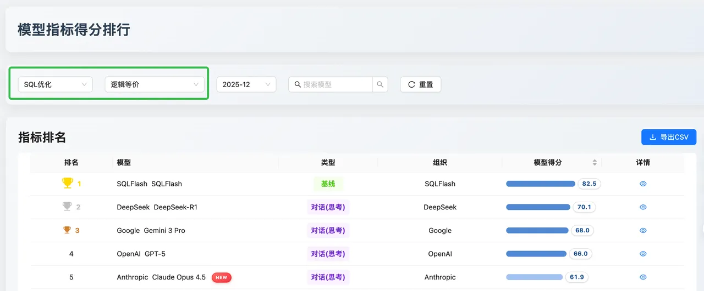

**数据解读**：在长文本和复杂业务SQL场景下，[SQLFlash](https://sqlflash.ai/ "SQLFlash") 以 82.5 的高分确立了基线优势，展现了极高的稳定性。在对话类模型中，*DeepSeek-R1（70.1）* 与 *Gemini 3 Pro（68.0）* 表现接近，位居前列。

**评价**：这一维度考察的是“**改写后 SQL 是否与原始 SQL 逻辑一致**”。*DeepSeek-R1* 在处理复杂逻辑嵌套和函数时表现出优于 *GPT-5* 的逻辑收敛性，证明了其推理模型架构在保证业务逻辑不偏离方面的优势。

#### 优化深度

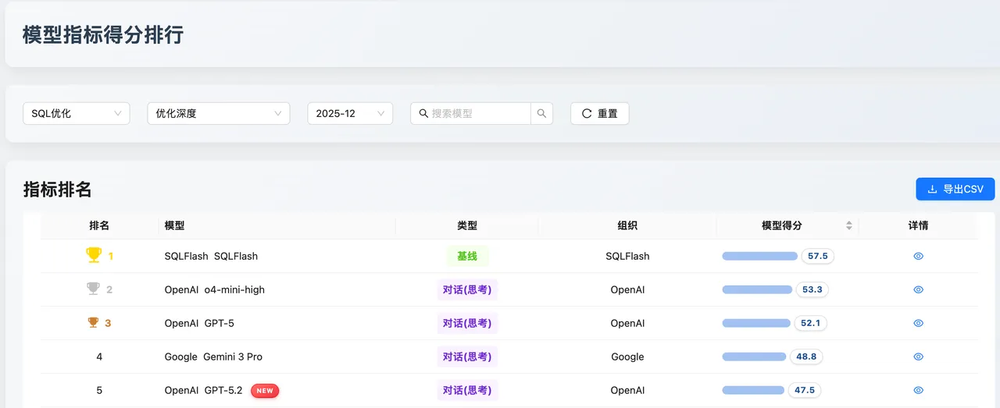

**数据解读**：这是难度最高的维度。*SQLFlash（57.5）* 依然领跑。值得注意的是，*OpenAI o4-mini-high（53.3）* 和 *GPT-5（52.1）* 紧随其后，反超了其他竞争对手 。

**评价**：该维度衡量模型是否具备 DBA 级别的物理代价评估能力。OpenAI 系列模型在此展现了其“物理执行计划专家”的特质，能够主动识别索引失效等底层痛点并进行深层重构。

#### 语法错误检测

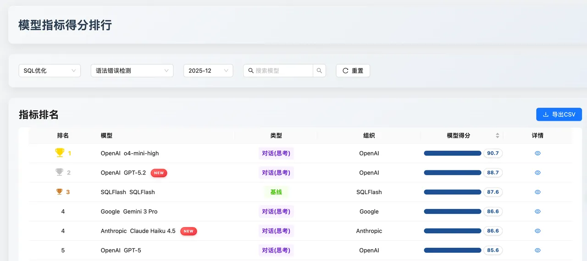

**数据解读**：*OpenAI o4-mini-high* 以 90.7 的相对高分位居榜首，*GPT-5.2（88.7）* 和 *SQLFlash（87.6）* 紧随其后。

**评价**：在代码合规性和语法安全性方面，OpenAI 阵营展现了统治力。这表明在构建自动化 SQL 代码校验工具时，*o4-mini-high* 是当前最具性价比的选择。

#### SQL 优化维度测评总结
本次测评基于更贴近真实生产环境的数据集展开，测试用例在 SQL 复杂度和业务场景覆盖上均有所提升。在这一背景下，各模型与基线应用的整体得分相较此前出现一定回落，反映出复杂业务 SQL 对模型优化能力提出了更高要求。

与此同时，*SQLFlash* 作为专注于 SQL 优化的专业应用，在综合表现上仍保持领先优势。当前主流模型在 SQL 优化维度各项指标上的具体表现如下图所示：

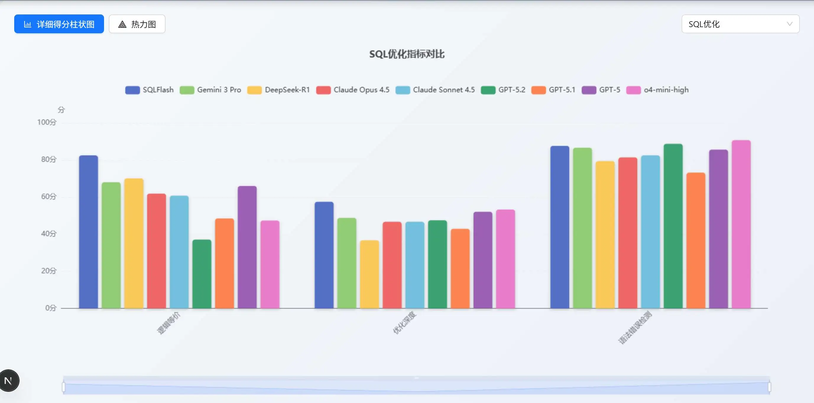

## 三、新增的主流模型技术解析与对比

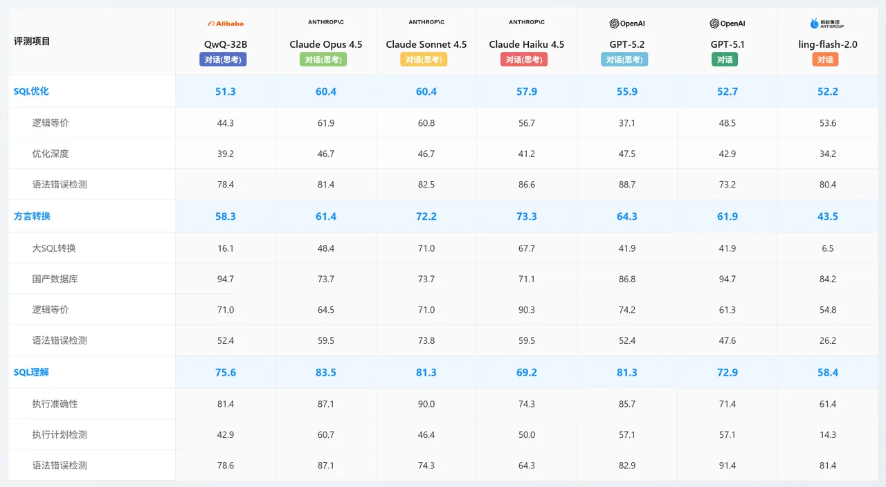

### OpenAI
**GPT-5.2：高精度语法纠错与执行专家**
- **能力核心**： SQL 理解（81.3）能力稳居第一梯队。其最大的亮点在于 **语法错误检测**（优化维度 88.7 / 理解维度 82.9），是所有模型中对语法最敏感的。同时在国产数据库支持上也表现不俗（86.8）。
- **业务价值**：极佳的 SQL 调试助手和代码质量守门员。在开发阶段集成该模型，可以有效拦截绝大多数语法错误，提升代码上线质量；同时保证了较高的执行准确性。

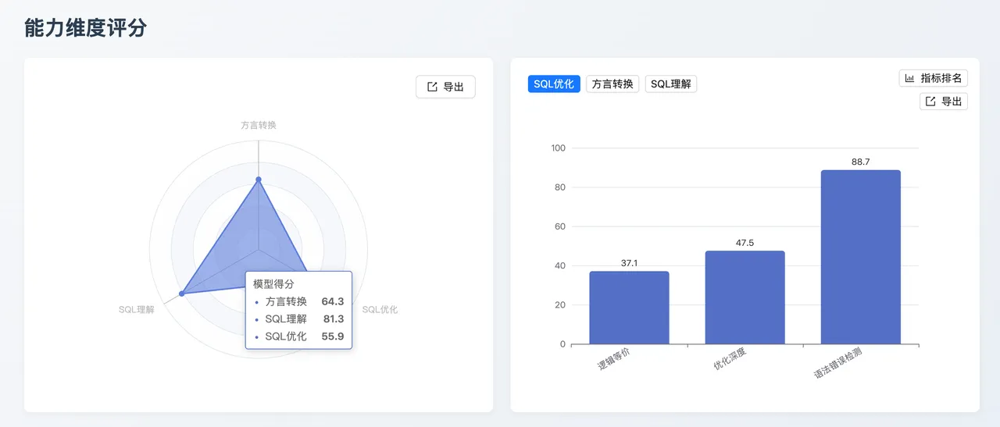

**GPT-5.1：国产数据库适配领航者**
- **能力核心**： 在 **国产数据库（94.7）** 这一细分指标上取得了全场最高分（与 QwQ 并列）。虽然在优化深度和大 SQL 转换上稍弱，但在特定环境下的适应性极强。
- **业务价值**：针对本土化业务场景，尤其是信创环境下的数据库迁移和应用开发具有极高的可用性，能准确处理国产数据库特有的语法特性。

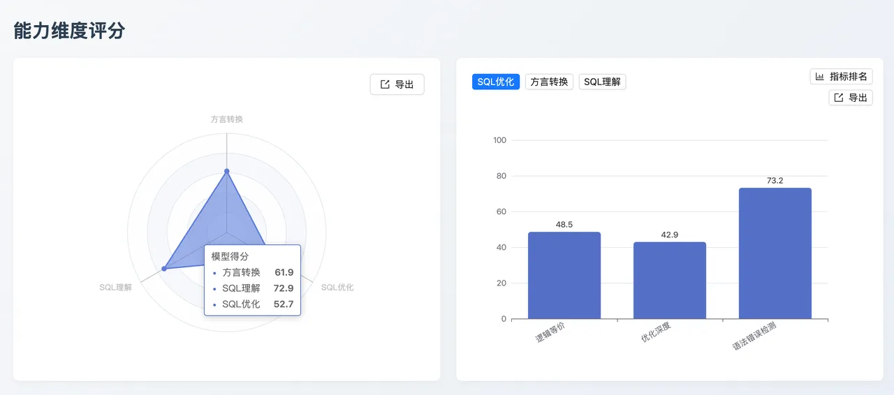

### Anthropic
**Claude Opus 4.5：全能型 SQL 架构师（理解与优化双料冠军）**
- **能力核心**：该模型在 **SQL 理解（83.5）** 和 **SQL 优化 （60.4）** 两个最关键的维度均取得了全场最高分。它在执行计划检测（87.1） 和逻辑等价性（61.9）方面表现出极高的稳定性。
- **业务价值**：适用于对准确性要求极高的核心业务场景，如复杂查询的深度调优、自动化运维诊断以及作为 SQL 审核的高级专家系统，能够显著降低数据库性能风险。

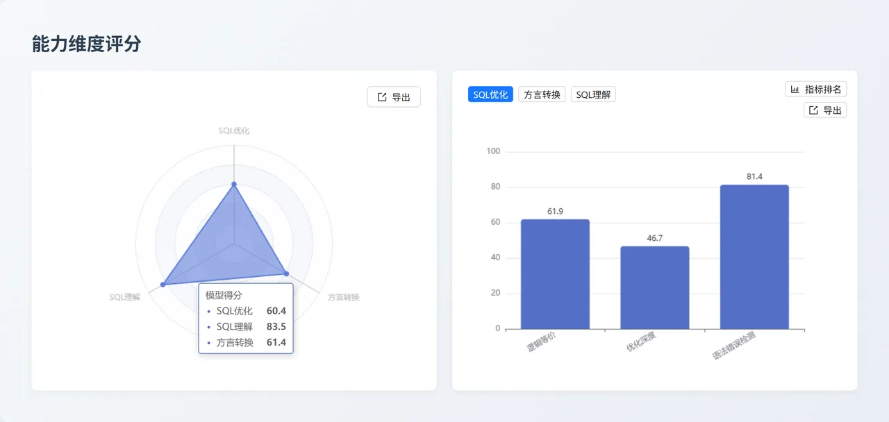

**Claude Sonnet 4.5：复杂 SQL 迁移与重构专家**
- **能力核心**：综合能力极强，并在 **方言转换（72.2）** 维度表现出色。特别是 **大 SQL 转换（71.0）** 分数远超其他模型（其他多在 40 分以下），展现了惊人的长文本和复杂逻辑处理能力。同时在 SQL 优化方面与 Opus 并列第一。

- **业务价值**：是传统数据库向云原生数据库迁移、或异构数据库迁移的最佳选择，尤其擅长处理遗留系统中的超长复杂存储过程和查询语句，大幅降低人工重构成本。

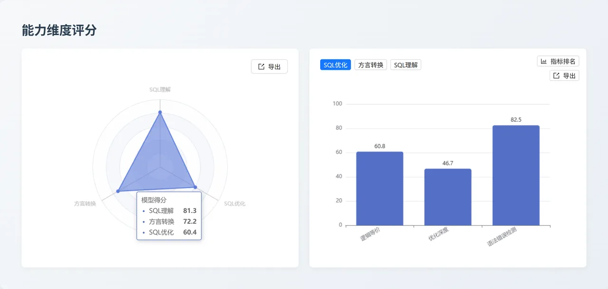

**Claude Haiku 4.5：高效异构方言转换器**
  - 能力核心：以 73.3 的高分拿下了 方言转换 维度的全场第一。虽然在 SQL 理解深度上略逊于 Opus 和 Sonnet，但在处理不同数据库语法差异（尤其是逻辑等价性高达 90.3）方面表现极其敏锐。
  - 业务价值： 适合高频、大批量的多数据库适配任务，如多云环境下的 SQL 兼容性转换工具，能够快速、低成本地实现跨平台 SQL 语法的自动化翻译。

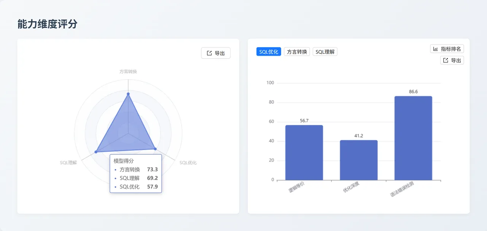

### 蚂蚁百灵
**Ling-2.0-Flash：基础 SQL 辅助工具**
- **能力核心**：各项指标表现相对平缓，方言转换能力 (43.5) 较弱，但在国产数据库支持 (84.2) 和基础语法检测 (80.4) 上仍有一战之力。

- **业务价值**：适用于轻量级应用场景或作为辅助性的备选模型，用于处理简单的 SQL 校验和基础国产库适配任务。

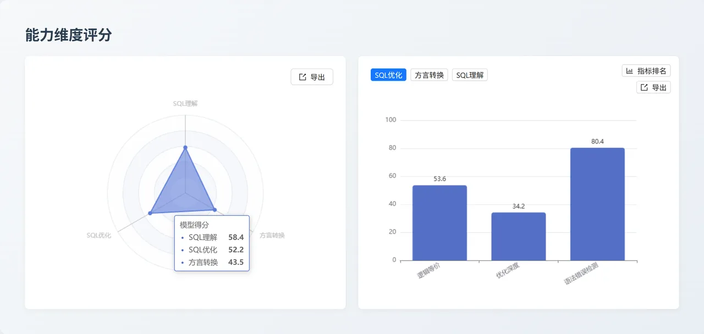

### 千问
**QwQ-32B：高性价比国产化集成方案**
- **能力核心**：同样在 国产数据库 (94.7) 指标上表现卓越。虽然在 SQL 优化 (51.3) 和复杂转换上相对较弱，但在基础的 SQL 理解 (75.6) 和语法检测 (78.6) 上保持了可用的基准水平。

- **业务价值**：作为参数量相对较小的模型，它是私有化部署和国产化替代的高性价比选择，特别适合处理涉及国产数据库的基础查询和交互任务。

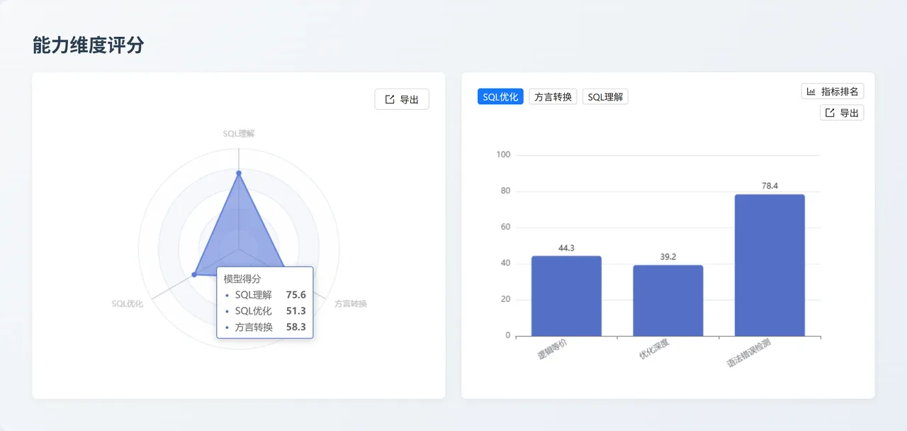

## 四、评测模型升级更新

### 新增评测模型
- **Claude 4.5 系列**：Opus、Sonnet、Haiku 全量进入评测矩阵。
- **OpenAI 系列**：GPT-5.1、GPT-5.2 快照稳定版本。
- **蚂蚁百灵系列**：Ling-2.0-Flash。
- **千问系列**：QWQ-32B。

### 存量模型升级与快照更新
- **o4-mini-high**：替换旧版版本，显著提升了多表关联场景下的逻辑收敛性。
- **GPT-5 统一快照**：将所有实验分支统一更新为最新的 Snapshot 版本，确保后期评测的一致性。
- **DeepSeek-V3.2 正式版**：由实验版 (Exp) 切换至稳定版，重点针对 Oracle 语法下的幻觉问题进行了针对性修复。

## 五、三大核心维度综合榜单
基于 **SQL 优化数据集 2.0 评测标准**，本月模型在各维度的性能排布如下：

### SQL 优化能力榜
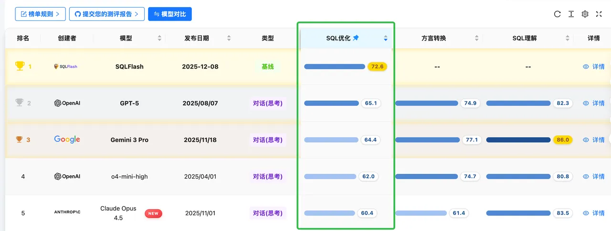

**榜单点评**：*SQLFlash（72.6）* 作为垂直领域基线模型继续霸榜。在通用大模型中，*GPT-5（65.1）* 凭借其在优化深度上的积累位居第一，*Gemini 3 Pro（64.4）* 紧随其后。这表明在处理高性能需求时，*GPT-5* 仍是通用模型中的最优解 。

### SQL 方言转换榜

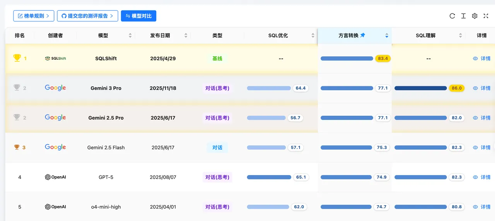

**榜单点评**：*SQLShift（83.4）* 展现了专有模型的优势。通用模型方面，*Gemini 3 Pro（77.1）* 与 *Gemini 2.5 Pro（77.1）* 并列第二，显示了 Google 模型在跨平台语言理解上的深厚功底，尤其是在异构数据库迁移场景下表现稳健。

### SQL 理解能力榜

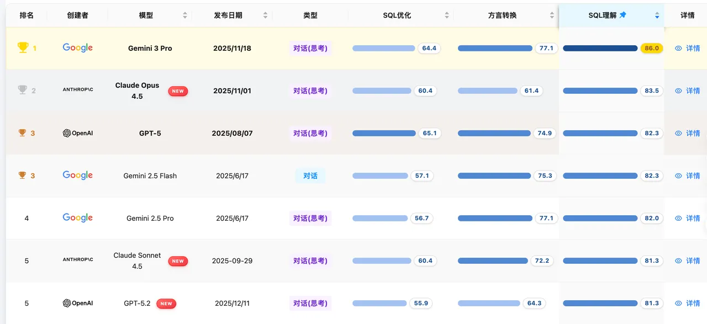

**榜单点评**：*Gemini 3 Pro（86.0）* 在此维度表现卓越，超越了 *Claude Opus 4.5（83.5）*。这意味着在代码审查和执行计划分析任务中，*Gemini 3 Pro* 拥有最强的上下文理解与潜在风险识别能力。

## 六、 结论与推荐部署矩阵 
根据 **SQL 优化数据集 2.0** 的实战评测得分，我们建议用户按需选择部署方案：
- **生产环境慢 SQL 性能调优**：首选 *SQLFlash* 专业的SQL调优应用， 模型可选 *GPT-5.2*，利用其在物理层执行路径的深度优化能力。
- **高保真 SQL 重写/规整**：首选 *SQLFlash*，确保改写后业务逻辑零偏差，适合核心交易链路代码规整。 
- **复杂业务逻辑迁移和国产化信创支持**：首选 [SQLShift](https://sqlshift.cn/ "SQLShift") 专业的 SQL 方言转换应用，模型可选 *Claude Opus 4.5*，确保在跨库迁移中的极致逻辑一致性。
- **高频实时 SQL 审计与校验**：首选 *Claude Haiku 4.5* 或 *Ling-2.0-Flash*，在极低时延下提供高可靠的语法诊断。

## 七、专家点评

> **吴炳锡**，Databend Labs 联合创始人， 腾讯 TVP 成员， 中国数据库大会顾问团成员。

**点评内容：**

*SCALE 是可以让每个人轻松的关注大模型的 SQL 排行榜。SCALE 站在开源角度公开测试的数据和脚本，持续对比，每个月一更新用于展示每个大模型在 SQL 领域的真实水平。同时 SCALE 保持社区共建，测试及过程公开，鼓励提交测试用例，鼓励团队一同参与。*

***整体来讲 SCALE 对于 DBA 或是开发人员快速了解大模型在 SQL 方面的能力用于 SQL 性能方面的优化，同时对于模型团队，也可以快速的了解模型在 SQL 方面的短板，利于后期的优化。*** 

*目前来看 SCALE 的 SQL 能力还是主要以 MySQL 类的 SQL 为主，希望后期也引入分析类湖仓产品，如 Databend , 可以支持更复杂的 SQL，也可以进一步看看大模型的能力。最后建议从月更到周更，大模型行业进化太快，感觉周更可以更好的看到模型的进展。*

> 查看完整榜单并联系我们提交您的产品进行测评。https://sql-llm-leaderboard.com/

**SCALE：为专业 SQL 任务，选专业 AI 模型。**
