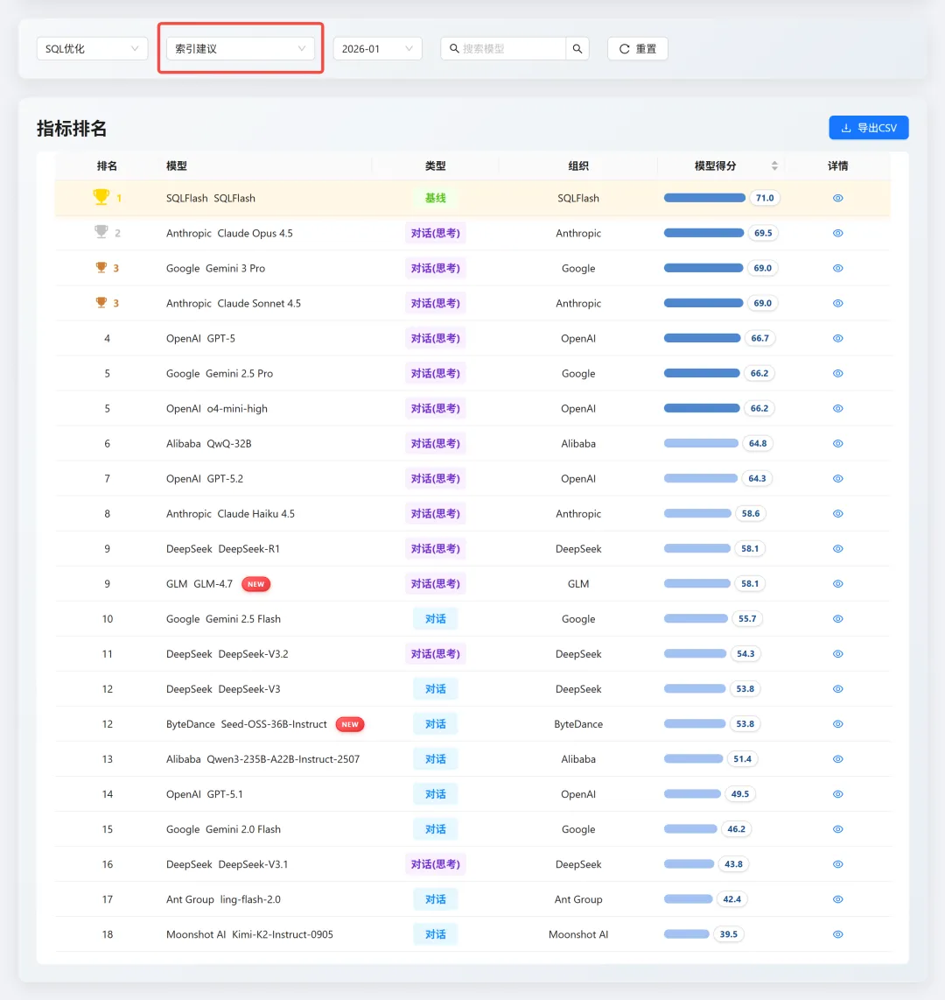
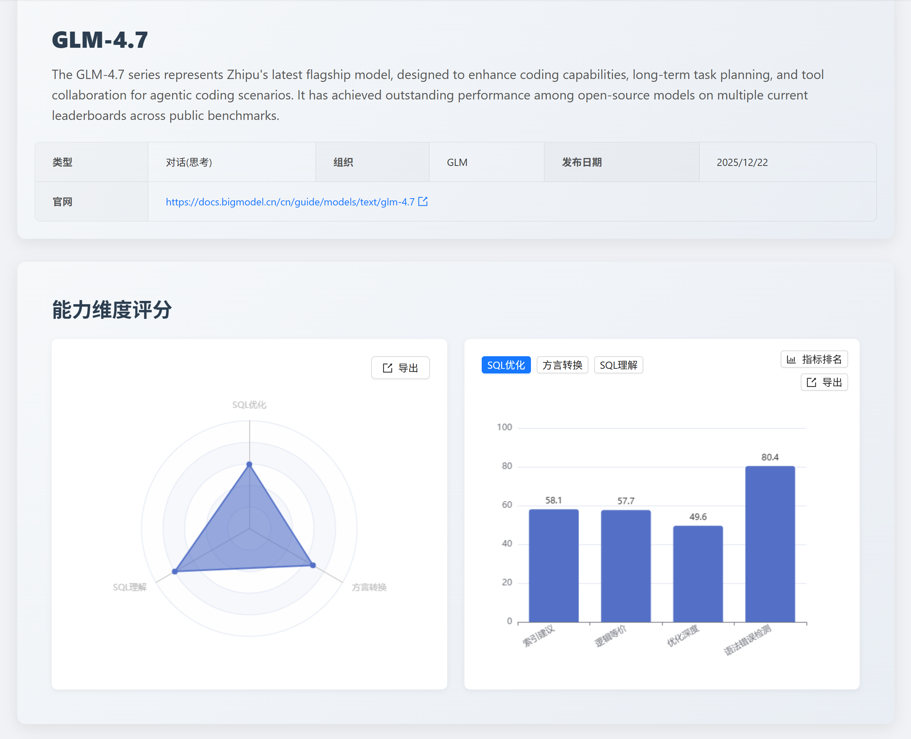
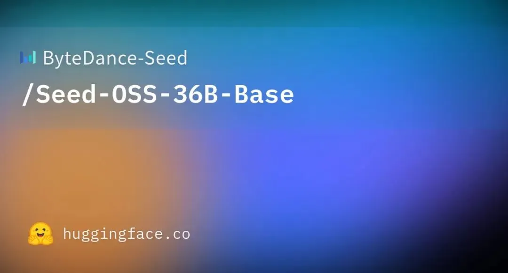
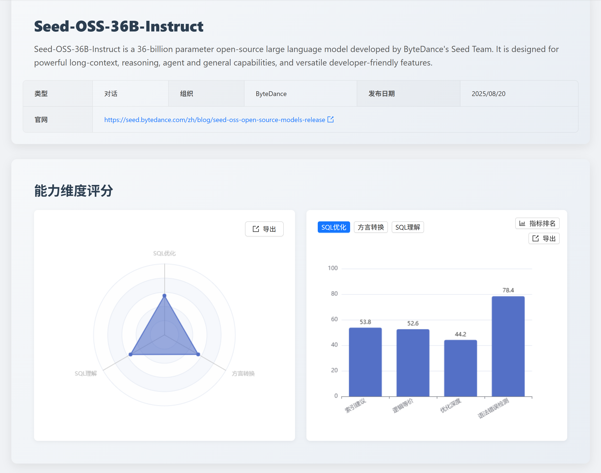

## 一、 本月榜单摘要
2026 年伊始，[SCALE](https://sql-llm-leaderboard.com/ranking/2026-01 "2026 年 1 月榜单") 评测框架迎来了重要进化。本月，我们不仅迎来了 *智谱 GLM-4.7* 与 *字节跳动 Seed-OSS-36B-Instruct* 的入场，更在评测深度上实现了突破 —— 在 **SQL 优化** 维度中正式引入**“索引建议”**指标。

*这意味着 SQL 优化能力的测评标准已从单一的**“语法层面的改写”**迈向了**“语法优化 + 执行成本优化”**的综合评估，更体现了模型是否真正站在数据库执行与资源消耗的角度思考问题，能否给出具备实际性能收益、符合真实生产场景的优化建议。*

## 二、 评测基准体系升级
SCALE 致力于通过多维度的压力测试，量化大语言模型在专业数据库任务中的真实价值。我们严格遵循 SCALE 框架自创立以来的三大核心维度和统一评测数据集，确保结果的公正性与可复现性。

### SCALE 三大评测维度

|评测维度|评估目标|核心应用场景|
| ---- | ---- | ---- |
|**SQL 理解**|对现有 SQL 代码的逻辑、意图和执行计划的深度分析能力。|数据分析、生产环境故障排查、代码审查。|
|**SQL 优化**|在保证逻辑等价下，将低效 SQL 改写为性能更优查询的策略应用和效果。|数据库调优、存量代码重构。|
|**方言转换**|在不同数据库方言之间进行语法迁移和复杂过程化逻辑重构的准确性和可靠性。|数据库迁移、跨平台数据中台构建。|

### 本月新增指标：索引建议

在日常 **SQL 优化** 时，**索引优化非常重要的一个手段**，索引能让数据库尽量少读数据、少做计算，从而用更低的成本更快地返回结果。为此我们在 **SQL 优化** 维度新增了对 **索引建议** 的测评。

- **评测定位**：索引优化是 SQL 性能提升的核心。该指标检验模型能否给出可落地、性价比合理、风险可控的优化方案，而非仅停留在语法层面的改写。
- **指标排名**：根据最新测评结果，各主流模型在索引建议测评的表现如下：

## 三、专项测评：智谱 GLM-4.7

[GLM-4.7](https://z.ai/blog/glm-4.7 "GLM-4.7") 是智谱 AI 于 2025 年 12 月 23 日发布并开源的大语言模型，该模型针对编码场景在相关能力方面进行了强化。模型发布后，曾在开源社区 [Hugging Face](https://huggingface.co/zai-org/GLM-4.7 "GLM-4.7 ") 的全球趋势榜上位列榜首。2026 年 1 月 8 日，智谱 AI 在港交所挂牌上市。（信息来源：百度百科）

### 1. 能力定位判断

**智谱 GLM-4.7 在本次测评中表现出极高的逻辑严谨性与场景适应性。**

它不仅仅是一个 SQL 生成器，更像是一个具备初步工程思维的 **“初级 DBA”**，在处理复杂业务逻辑与国产化迁移时展现了第一梯队的稳定性。

### 2. 核心维度分析
#### SQL 理解：79.8 分
***GLM-4.7* 表现出较强的逻辑一致性。**其执行准确性（82.9）与语法错误检测（82.9）得分较高，意味着模型能够准确理解复杂的业务意图。

在执行计划检测中，测试案例通过率相对较低，仅有 55%，模型对包含 `LEFT JOIN`、`GROUP BY` 和 `ORDER BY` 的复杂查询，错误地输出了连接缓冲和嵌套循环（`Using join buffer (Block Nested Loop)`），却遗漏了关键的临时表和文件排序标识（`Using temporary; Using filesort`），且行数估算错误，暴露出其对聚合排序操作的执行机制理解不足，以及在多表关联场景下对驱动表和执行步骤的推理能力欠缺。

#### SQL 优化：59.6 分
在新增的索引建议指标中，模型取得了 58.1 分的成绩。整体来看，模型已能够结合查询条件给出符合索引设计基本原理的优化建议，**初步具备了基于执行计划进行分析并提出物理结构优化方案的能力。**

在更复杂的场景下，尤其是涉及索引冗余判断以及低选择性列与索引维护成本之间权衡的问题时，模型的表现仍不稳定，难以持续给出有效且合理的索引建议。

#### 方言转换：68.2 分
**国产数据库转换得分高达 89.5 分，这是 GLM-4.7 的传统强项，表现出较高的成熟度。**

但是在语法正确性检测测评上得分为 50 分，处于较低水平，反映出模型在细粒度方言知识掌握上的显著不足，特别是对特定数据库版本（如 OceanBase 4.2.5、GaussDB-v2.0_3.x）的语法约束、数据类型支持范围缺乏准确认知。

### 3. 应用价值建议
- **推荐场景**：适用于企业级遗留系统重构、复杂业务 SQL 开发辅助、数据库国产化迁移专项。
- **实战建议**：可用于生成迁移脚本的参考初稿，但在索引建议方面，建议作为 DBA 审查的“第一道参考”，在生产环境部署前仍需配合 Explain Plan 进行微调。

## 四、专项测评：字节 Seed-OSS-36B

[Seed-OSS-36B](https://huggingface.co/ByteDance-Seed/Seed-OSS-36B-Base "Seed-OSS-36B Huggingface") 是由字节跳动旗下 Seed 团队于 2025 年 8 月 21 日 在 Hugging Face 平台发布的开源大型语言模型。

该模型采用因果语言建模、分组查询注意力和 RoPE 位置编码等技术，包含 360 亿参数并支持 15.5 万词表规模。通过 64 层网络结构实现 512k tokens 的长上下文处理能力，适用于文档分析、推理链、Agent 交互及通用场景。（信息来源：百度百科）

### 1. 能力定位判断
*字节 Seed-OSS-36B* 是一个性格鲜明的模型：**在标准规范性上达到了极高水准，但在长文本处理与深层执行推理上仍有待突破。** 它非常适合作为代码规范的**“守门员”**，但在面对重度复杂的工业级任务时表现出一定的波动。

### 2. 核心维度分析
#### SQL 理解：55.2 分

*字节 Seed-OSS-36B* 展现了**“偏科”** 的特性。其语法检测得分高达 88.6，能够识别出极其隐蔽的方言冲突和拼写错误；但执行准确性（48.6）偏低，模型在分析 `SELECT` 查询时，虽然正确计算出了查询结果（列名和数据行均准确），但将 `result_type` 错误标识为 `table_state` 而非 `select`，混淆了查询操作 `SELECT` 与表状态修改操作 `INSERT/UPDATE/DELETE` 的语义分类，反映出其对 SQL 语句类型的理解和分类能力存在缺陷，以及在结构化输出的语义一致性把控上不够严谨。

#### SQL 优化：55.3 分

其优化策略相对保守。索引建议（53.8 分）多集中在单表简单索引，模型暴露出三个核关键问题：推荐索引时添加了非必要的 ID 列、未能识别与现有索引的冗余关系、以及无法检测隐式类型转换导致的索引失效问题，综合反映出其在索引列选择精准度、已有索引上下文分析能力以及索引生效机制的深层理解上均存在不足，缺乏全局优化视角。

#### 方言转换：55.0 分

模型存在较明显的“长度天花板”。在标准短 SQL 转换中表现优异，但在 “大 SQL 转换” 测试项中仅得 19.4 分，模型暴露出对过程语言和复杂 DML 转换的系统性缺陷：*Oracle 转 PostgreSQL* 时，错误地将表达式用于 `GET DIAGNOSTICS` 目标位置、混用 PL/SQL 特有的 `TYPE ... IS RECORD` 和游标属性语法（%NOTFOUND、SQL%ROWCOUNT），未能正确映射到 PL/pgSQL 规范；*SQL Server 转 GaussDB* 时，保留了 `+` 字符串拼接运算符而非使用 `||`，且在多表 `UPDATE ... FROM` 语句中错误地将目标表纳入 `FROM` 列表却缺失关联条件，导致笛卡尔积和逻辑错误。这些问题反映出模型在过程语言方言差异、运算符映射规则以及复杂 DML 语义等价转换上的理解深度不足，尤其缺乏对目标方言隐含规则和语法约束的精准把握。

### 3. 应用价值建议
- **推荐场景**：适用于代码审计、日常 SQL 规范性校验、轻量级数据库日常维护。
- **实战建议**：推荐将其集成在 IDE 插件中进行实时的语法纠错；对于涉及数百行、跨多层嵌套的复杂存储过程，建议拆解后再交给模型处理。

> 该模型的发布时间较早，SCALE 将持续关注字节跳动 Seed 团队的发布计划，第一时间带来测评分析。

## 五、SCALE 网站更新
为了增强 SCALE 的技术沉淀，本月我们上线了以下功能：
1. **新闻模块**：查看往期发版深度分析，追踪 SCALE 评测标准的演进历程。
2. **博客模块**：沉淀社区专家的实战案例，手把手教您如何基于测评数据选择最适合的大模型方案。

## 六、总结与建议
**本月的测评结果不仅是模型分数的更新，更揭示了通用大语言模型在专业数据库领域发展的两个核心趋势：**
- 从“写对语法”向“跑得更快”转变
- 国产化迁移能力的快速成熟

### 关注模型在复杂场景下的“能力阶梯”
根据本次 **“大 SQL 转换”** 专项测试，国产大模型在长文本逻辑处理上仍面临挑战（如 Seed 模型在长 SQL 任务中得分排名较为落后）。
- **开发策略建议**：对于业务逻辑极度复杂的 SQL 或存储过程，建议采用**“逻辑分块”**的协作方式，即由人工明确核心逻辑单元，再由大模型进行分块实现或转换，以抵消大模型的长距离逻辑漂移。
- **校验必要性**：鉴于部分模型存在 **“高语法分、低执行准确性”** 的现象（如执行准确率低于 50% 的情况），生产环境的 SQL 必须经过严格的逻辑验证与性能压测。

### 利用大模型加速国产化迁移的“黄金期”
评测数据显示，国产模型在 **“国产数据库转换”** 维度已表现出极高的适配性（如 GLM-4.7 达到 89.5 分）。
- **架构演进建议**：面对企业级国产化迁移趋势，通用大模型已具备处理绝大部分标准函数与语法映射的能力，可以作为迁移工程初期的自动化底座。
- **索引优化前置**：随着 **“索引建议”** 能力的引入，大模型开始能够提供初步的物理结构参考。企业在进行数据库迁移时，可以同步利用大模型的建议进行 Schema 的初步调优，而非仅仅是原样搬迁。

## 七、专家点评

> 白鳝（徐戟），佰晟智算 CEO。著有《DBA 的思想天空》《实战国产数据库》等技术专著。担任多家国产数据库厂商的技术顾问。Oracle ACE、PostgreSQL ACE Director。

*国产开源大模型在 SQL 编程能力上的进步是令人兴奋的，这使得 AIOPS 有了十分有力的支撑，让 SQL 审计、SQL 优化这些涉密的任务可以在内网安全环境中实现。*

*SCALE 榜单的出现让 AI 应用开发者有了一个十分权威的参考，本次模型 SQL 能力榜单与我们的实际应用感受相当一致，为爱可生开源社区点个赞。*

---------------------------------------------------------

SCALE 评测体系将持续跟踪各大厂商的最新模型动态和迭代进展。我们致力于通过公正、透明的评测数据，与社区共同推动大语言模型在数据库领域的应用和实践走向更深层次。

**即刻探索新一代模型的专业能力！** 欢迎您访问 SCALE 官方网站，查看完整的最新榜单和模型对比详情，共同把握 AI 技术的前沿脉搏。

> 查看完整榜单并联系我们提交您的产品进行测评。https://sql-llm-leaderboard.com/

**SCALE：为专业 SQL 任务，选专业 AI 模型。**

*数据截止时间：2026/1/5*
