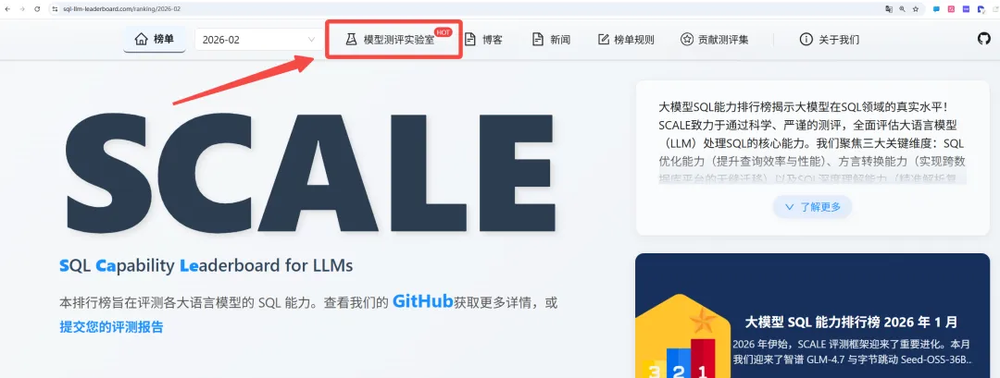
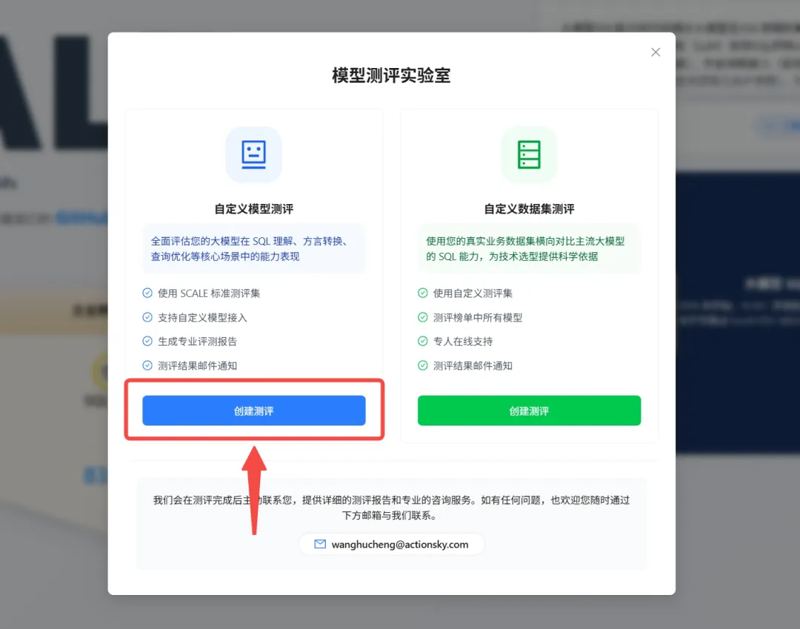
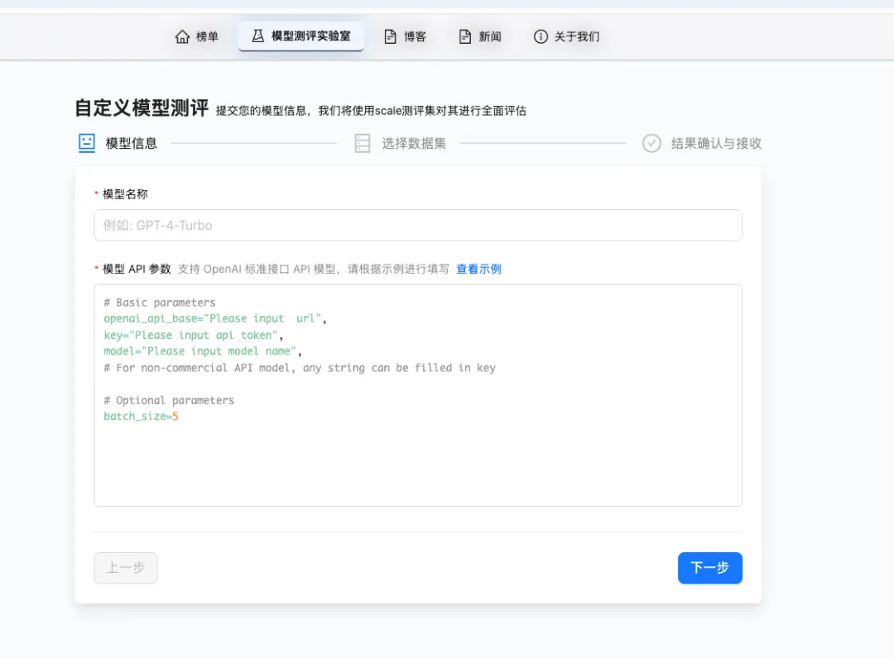
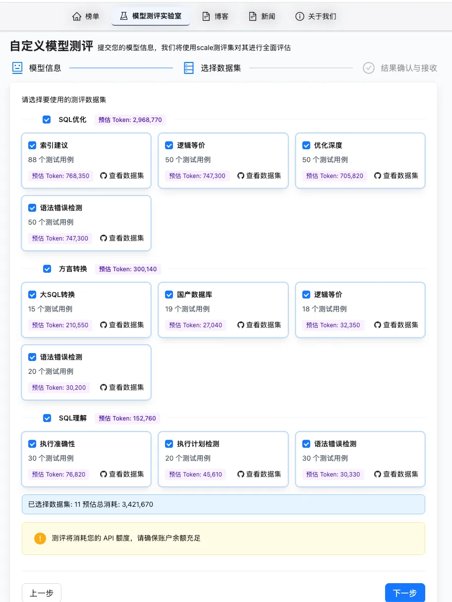
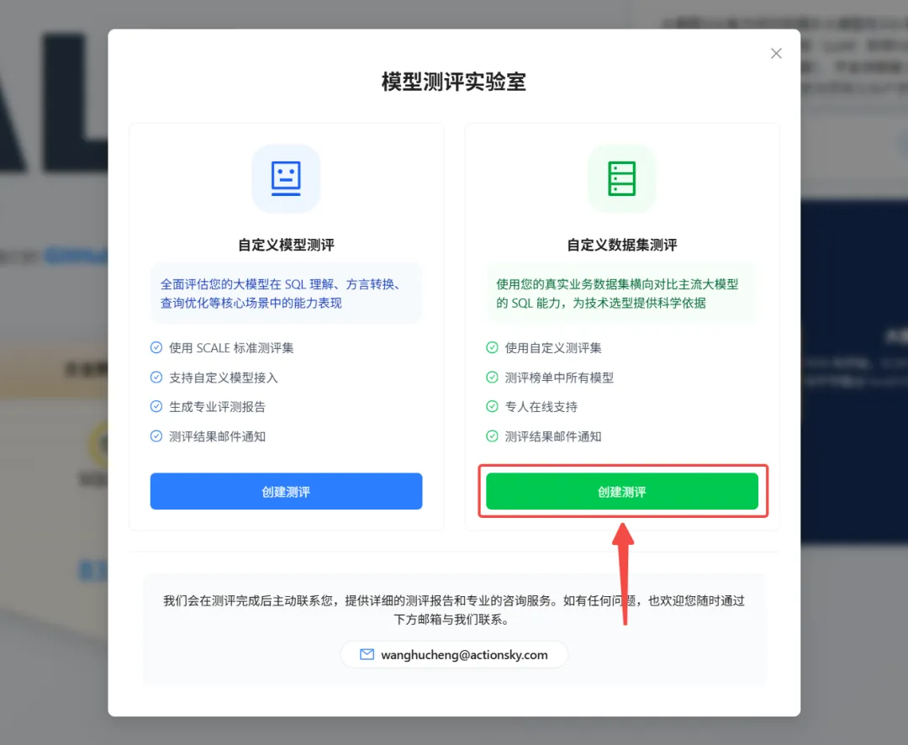
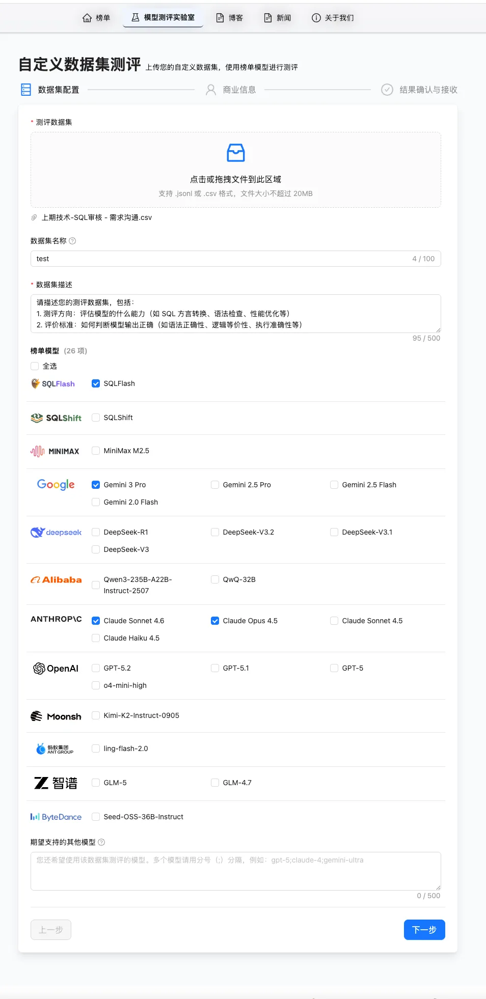

## 👋 SCALE 用户们的心声

在社区与用户的持续交流中，我们发现有两类高频需求始终未被充分满足。

> ​**需求一**​：我想知道某些榜单上没有的模型，或者我们团队微调/私有部署的模型，它的 SQL 能力是什么水平，缺少标准化的评测基准和工具。

> ​**需求二**​：榜单上的模型很多，但我们的业务场景比较特殊，榜单分数不能直接指导选型，需要用自己的数据跑一遍才放心。

现在，SCALE 正式推出 ​*模型测评实验室*​，直接回应这两个核心诉求。

- ​**自定义模型测评**​：接入模型 API，选择关注的测评维度，即可获得与 SCALE 榜单同标准的能力评估报告。
- ​**自定义数据集测评**​：上传业务数据集，勾选候选模型，即可获得贴合真实场景的模型对比结果。

简而言之 — ​**用户定义 “测什么” 和 “测谁”**​，SCALE 负责给出专业、可信的答案。

## 👉️ 你来决定测什么模型

在 _模型测评实验室_ 界面中的 **自定义模型测评** 部分点击创建测评。用户只需三步，即可验证自有模型在 SQL 赛道上的真实段位。

### 第一步：接入模型

填写模型名称和 API 参数。支持 OpenAI 标准接口格式，兼容该接口的模型只需填入 `openai_api_base`、`key`、`model` 即可完成接入。

### 第二步：选择关注的测评维度

不需要跑完所有测试 —— 根据实际关注点，自由勾选需要评测的维度和子维度即可。例如：

- **模型主要用于查询性能调优？**

  只勾选 _SQL 优化_ 下的相关子维度

- **关注跨数据库迁移能力？**

  只勾选 _方言转换_

- **想做一次全面体检？**

  全部选择

选择后，页面会实时显示预估 Token 消耗，便于提前评估成本。每个子维度还支持查看数据集详情，测评前即可了解 “考题”。

### 第三步：确认并等待报告

确认模型参数和测评范围后，填写接收邮箱即可提交。测评完成后，《评测报告》将直接发送至邮箱。

### 适用场景

- ​**企业技术选型**​：正在评估某个榜单目前没有模型能否胜任内部 SQL 相关任务，需要一份客观的能力报告。
- ​**模型研发团队**​：微调或训练了面向 SQL 场景的模型，需要用权威基准验证能力水平、找到短板方向。
- ​**模型服务商**​：希望了解自家模型在 SCALE 标准下的表现，为产品迭代和市场定位提供数据支撑。

### 获得的价值

接入模型 API 后，将获得一份与 SCALE 榜单模型同数据集、同维度、同标准的专业评测报告。这意味着可以直接将自有模型的表现与 GPT、Claude、Gemini、DeepSeek、MiniMax 等主流模型进行横向对标，清晰定位能力梯队和提升方向。

## 👉️ 你来决定测什么数据

在 _模型测评实验室_ 界面中的 **自定义数据集测评** 部分点击创建测评。用户可以在真实业务数据中测试出哪款模型最适合。

### 第一步：上传数据集，选择候选模型

上传测评数据集（支持 jsonl 或 csv 格式），描述测评方向和评价标准。随后从 SCALE 榜单中 **勾选想对比的模型** —— 可以只选 2-3 个最终候选做精准对比，也可以选更多做全面摸底，完全按需决定。

当前模型覆盖国内外主流厂商，如果关注的模型不在列表中，也可以提交扩展请求。

### 第二步：填写联系方式

留下姓名、手机号和企业名称，便于测评完成后联系交付报告。商业信息严格保密。

### 适用场景

- ​**技术选型决策者**​：团队正在为某个 SQL 相关项目选择大模型，榜单排名是参考，但真正的决策依据应该来自自己的业务数据
- ​**DBA/数据工程团队**​：手头有一批典型的业务 SQL（慢查询、迁移脚本、复杂报表等），想看看不同模型处理这些 SQL 的实际效果
- ​**产品经理/架构师**​：需要为管理层提供一份基于真实场景的模型对比报告，支撑采购或集成决策

### 获得的价值

上传业务数据后，SCALE 会用勾选的模型逐一运行测评，输出一份 ​**基于真实业务场景的模型对比报告**​。不同于通用榜单分数，这份报告直接回答 ​**哪个模型最适合你的业务**​。

## 🤔 哪种测评模式更合适你？

### 验证自有模型的 SQL 能力水平

- 推荐模式：自定义模型测评
- 需要准备：模型 API 相关参数
- 将获得：《模型 SQL 能力评估报告》

### 用业务数据对比不同模型的实际表现

- 推荐模式：自定义数据集测评
- 需要准备：业务数据集（jsonl/csv）
- 将获得：基于真实场景的《模型对比报告》& 专业咨询

## 🤔 为什么要推出此功能？

_模型测评实验室_ 解决的核心问题是：​**让评测回归真实需求**​。

每个团队的模型不同、业务不同、关注点不同 —— 通用榜单排名是重要参考，但无法替代针对性的评估。_模型测评实验室_ 正是为此而生：用户决定测评的维度和对象，SCALE 确保评测过程的专业性和结果的可信度。

欢迎访问 SCALE 官方平台，进入「​*模型测评实验室*​」开启专属测评。测评完成后我们会主动联系，提供详细的测评报告和专业的咨询服务。如有任何问题，欢迎随时与我们联系。
