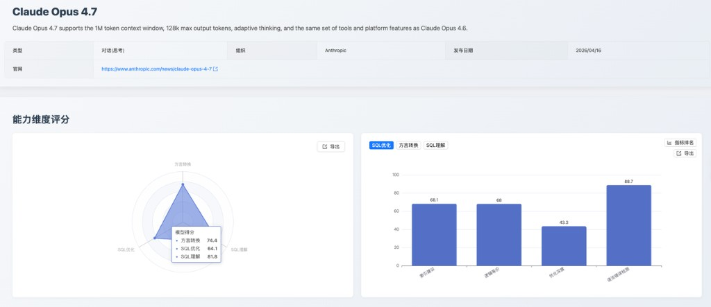
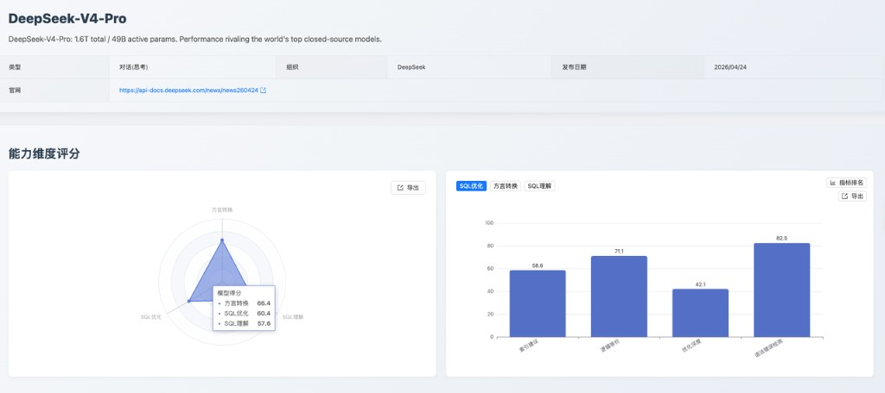
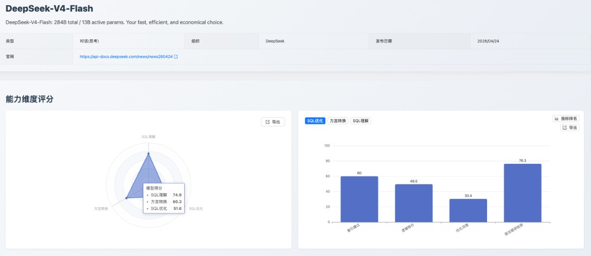

## 一、发版摘要与核心价值

本月，[SCALE](https://sql-llm-leaderboard.com/ranking/2026-04 '2026 年 4 月榜单') 测评榜单新增纳入 **DeepSeek-V4-Pro**、**DeepSeek-V4-Flash**、**GPT-5.5** 和 **Claude Opus 4.7** 四款最新模型。本次评测继续聚焦 SQL 理解、SQL 优化和方言转换三大核心维度，通过统一榜单和子指标数据，呈现最新模型在企业级 SQL 场景中的能力表现与选型价值。

从本期新增模型看，**GPT-5.5** 在 SQL 理解维度表现最突出，**Claude Opus 4.7** 综合能力更均衡；DeepSeek 系列两款模型在国产数据库转换子指标上表现亮眼，但复杂 SQL 理解、深度优化和大 SQL 转换仍有提升空间。

**核心看点速览：**

- **GPT-5.5** SQL 理解能力进入总榜前列，执行准确性突出，适合复杂 SQL 语义分析和高质量开发辅助
- **Claude Opus 4.7** 在 SQL 优化和方言转换两个维度均进入前 10，SQL 优化语法错误检测 88.7 分，国产数据库转换达到 100.0 分
- **DeepSeek-V4-Pro / DeepSeek-V4-Flash** 均为思考型对话模型，国产数据库转换表现突出，但优化深度与大 SQL 转换子指标偏弱

## 二、评测方法论

本次评测严格遵循 SCALE 框架的三大核心维度和统一评测数据集，确保所有模型均在同等标准下进行评估，保障评测结果的公正性和可复现性：

1. **SQL 理解 (SQL Understanding)**：评估模型对现有 SQL 代码的逻辑、意图和执行计划的深度分析能力。测评指标包括执行准确性、执行计划检测、语法错误检测。
2. **SQL 优化 (SQL Optimization)**：评估模型在保证逻辑等价和语法正确的前提下，将低效 SQL 改写为性能更优查询的策略应用和效果，以及对 SQL 推荐索引的能力。测评指标包括逻辑等价、优化深度、语法错误检测、索引建议。
3. **方言转换 (Dialect Conversion)**：评估模型在不同数据库方言之间进行语法迁移和复杂过程化逻辑重构的准确性和可靠性。测评指标包括大SQL转换、国产数据库、逻辑等价、语法错误检测。

## 三、专题深度测评

### 3.1 专项测评：GPT-5.5 (OpenAI)

**1. 能力定位判断**

GPT-5.5 是本期新增模型中 SQL 理解能力最突出的模型，SQL 理解维度进入总榜前列。其优势集中在执行准确性和语法错误检测，SQL 优化和方言转换也保持在可用区间，整体适合作为综合型 SQL 开发辅助模型。其三大能力维度得分见图 1。

_图 1：GPT-5.5 能力维度评分_

**2. 核心维度分析**

- **SQL 理解**：执行准确性表现突出，说明模型对 SQL 语义、查询结果和语法规范具备较强把握；执行计划检测低于整体理解表现，复杂执行路径判断仍有提升空间。
- **SQL 优化**：逻辑等价是优化维度中的核心优势，说明模型在保持 SQL 语义一致方面表现稳健；相对而言，优化深度 **49.6 分**，深层改写策略和物理索引设计能力仍不是最强项。

  从评测案例看，GPT-5.5 在优化深度和索引建议上主要暴露两类问题：

  （1）**多层子查询过度简化**：在 `SELECT student_name FROM students WHERE student_id IN (...)` 的投影下推案例中，期望仅移除内层未使用的 `gender` 列，模型却输出 `SELECT student_name FROM students;`，直接丢失 `IN` 过滤条件，说明其在执行优化规则时存在“改写过头”的风险。

  （2）**联合索引字段顺序判断不稳定**：在 `SELECT * FROM products WHERE category_id = 5 AND is_imported = 1 AND stock < 10` 案例中，期望索引顺序为 `category_id, is_imported, stock`，模型给出 `is_imported, category_id, stock`，未严格遵循等值列按选择性排序、范围列后置的要求。

- **方言转换**：国产数据库转换 **97.4 分** 表现突出，语法错误检测和逻辑等价较为均衡；大SQL转换 **45.2 分** 相对偏低，说明超长脚本或复杂过程化 SQL 转换仍需要人工复核。

  在 Oracle → PostgreSQL 的 `SP_BULK_UPDATE_INVENTORY` 存储过程转换中，源过程包含记录类型、批量集合、游标循环和事务控制逻辑，模型将其改写为 `RETURNS void` 的函数版本，并在默认时间、`record` 类型和批量处理结构上出现多种候选写法不一致，说明长过程化 SQL 转换仍需要分段验证。

**3. 应用价值建议**

- **推荐场景**：适用于复杂 SQL 语义理解、执行结果判断、SQL 开发辅助和跨数据库迁移初稿生成。
- **实战建议**：可作为综合型 SQL 助手优先接入；在深度性能优化、索引设计和大 SQL 迁移场景中，建议与 Explain Plan、DBA 审核或分段转换流程配合使用。

### 3.2 专项测评：Claude Opus 4.7 (Anthropic)

**1. 能力定位判断**

Claude Opus 4.7 是本期新增模型中综合表现最均衡的一款，SQL 优化和方言转换均进入总榜前列。相较于单点能力突出的模型，它更适合需要稳定覆盖 SQL 审查、优化建议和迁移辅助的复合型场景。其三大能力维度得分见图 2。

_图 2：Claude Opus 4.7 能力维度评分_

**2. 核心维度分析**

- **SQL 理解**：基础 SQL 理解与语法判断可靠；执行计划检测仍是相对弱项，复杂执行计划推理需要进一步增强。
- **SQL 优化**：语法错误检测 **88.7 分**，是新增模型中的突出优势，适合输出可读且语法风险较低的优化建议；优化深度 **43.3 分** 偏低，多规则联合改写和深层查询重构能力仍有限。

  典型失败集中在多层嵌套查询重构：模型将包含 `IN (SELECT student_id FROM (...))` 的查询直接简化为 `SELECT student_name FROM students;`，期望行为只是下推投影、去除冗余列，而不是删除过滤条件。这类问题说明模型在复杂查询重构中更容易追求简洁形式，仍需用逻辑等价校验兜底。

- **方言转换**：国产数据库转换达到 **100.0 分**，是本期新增模型中的最高值；其他转换指标整体均衡，适合承担数据库迁移中的候选转换引擎角色。

  在 Oracle → OceanBase Oracle 模式的 `LFBB_BVC_VHG_CHECK` 长存储过程转换中，模型输出出现过程名与 `END` 标识不一致、`TO_CHAR(SYSDATE, ...)` 与 `TO_CHAR(SYSDATE(), ...)` 写法摇摆的问题；SQLServer → GaussDB 的 `sp_GetCustomerOrders @CustomerID nchar(5)` 案例中，模型一度将参数绑定错误改写为 `CustomerID = CustomerID`，容易造成语义失真。

**3. 应用价值建议**

- **推荐场景**：适用于 SQL 代码审查、优化建议生成、国产数据库迁移辅助和长上下文 SQL 脚本理解。
- **实战建议**：可优先用于对输出语法稳定性要求较高的场景；面对深度优化改写时，仍建议补充规则校验和性能回归验证。

### 3.3 专项测评：DeepSeek-V4-Pro (DeepSeek)

**1. 能力定位判断**

DeepSeek-V4-Pro 是 DeepSeek 本期新增的思考型对话模型，模型介绍为 **1.6T total / 49B active params**。从评测结果看，其 SQL 优化和方言转换表现明显好于 SQL 理解，更适合作为优化和迁移场景的辅助模型，而非复杂 SQL 理解主力。其三大能力维度得分见图 3。

_图 3：DeepSeek-V4-Pro 能力维度评分_

**2. 核心维度分析**

- **SQL 理解**：语法错误检测具备一定基础可靠性，但执行计划检测 **46.4 分** 偏低，说明模型在复杂 SQL 结果推断和执行计划判断方面存在明显待提升空间。

  例如 `SELECT task_name, due_date FROM tasks WHERE completed = FALSE AND due_date < '2024-06-07'` 案例中，期望返回 `select` 结果集，模型将结果类型标为 `table_state`；在 `INSERT INTO products (...) VALUES (...)` 的执行计划案例中，期望 `type = ALL`，模型将 `type` 留空，反映出对非 SELECT 语句执行计划字段的建模不稳定。

- **SQL 优化**：语法错误检测表现较好，能够在一定程度上保证改写后的语法稳定性；优化深度 **42.1 分** 相对偏弱，说明深层规则组合优化能力不足。

  典型案例集中在多层嵌套子查询：对 `SELECT student_name FROM students WHERE student_id IN (...)`，期望只是下推投影、移除内层冗余 `gender` 列，模型输出 `SELECT student_name FROM students;`，说明复杂规则组合场景中存在过滤条件丢失风险。

- **方言转换**：国产数据库转换是主要亮点；但大SQL转换 **35.5 分** 偏低，说明复杂长脚本和过程化代码转换仍需谨慎使用。

  Oracle → PostgreSQL 的 `bulk_delete_by_ids` 动态删除过程转换中，源过程通过 `EXECUTE IMMEDIATE` 拼接 `DELETE FROM logs WHERE log_id IN (...)` 并显式 `COMMIT`，模型改写为 PostgreSQL 函数后丢失事务提交语义，说明对过程化代码中的事务边界处理不够稳定。

**3. 应用价值建议**

- **推荐场景**：适用于 SQL 改写初稿生成、语法纠错、国产数据库转换辅助和逻辑等价性较明确的转换任务。
- **实战建议**：不建议单独承担复杂 SQL 理解、执行计划分析或大 SQL 脚本迁移；可作为辅助候选模型参与多模型交叉验证。

### 3.4 专项测评：DeepSeek-V4-Flash (DeepSeek)

**1. 能力定位判断**

DeepSeek-V4-Flash 是 DeepSeek 本期新增的轻量高效思考型对话模型，模型介绍为 **284B total / 13B active params**。其 SQL 理解表现明显优于 SQL 优化和方言转换，更适合轻量 SQL 理解和语法辅助场景。其三大能力维度得分见图 4。

_图 4：DeepSeek-V4-Flash 能力维度评分_

**2. 核心维度分析**

- **SQL 理解**：模型在基础 SQL 识别和结果判断方面具备可用性；执行计划检测仍有提升空间。

  例如 `INSERT INTO products (product_id, product_name, price) VALUES (...)` 案例中，期望识别为 `INSERT` 且 `type = ALL`、无 `Extra`，模型却输出 `rows = 0`、`Extra = No tables used`，说明其对非查询类 SQL 的执行计划字段容易套用普通 SELECT 的解释习惯。

- **SQL 优化**：语法错误检测和索引建议尚可，但优化深度 **30.4 分** 偏低，复杂改写时容易出现语义偏差或优化不足。

  典型失败包括对多表 JOIN 与多层子查询的联合优化，只完成部分谓词下推，却遗漏投影裁剪和 `LIKE 'Advanced %'` 前缀优化；在 `WHERE CONCAT("id_", student_id) >= "id_1000"` 案例中，模型直接改写为 `student_id >= 1000`，忽略字符串拼接后的字典序语义，导致结果不等价。

- **方言转换**：国产数据库转换 **97.4 分** 表现突出，但大SQL转换 **25.8 分** 明显偏低，更适合作为简单转换或片段级转换工具。

  Oracle → PostgreSQL 的 `SP_BULK_UPDATE_INVENTORY` 转换中，源过程包含记录类型、批量集合和游标循环，模型在 `TYPE t_inventory_rec IS RECORD`、`CURRENT_DATE` 默认值和批量处理结构上生成不一致版本；SQLServer → GaussDB 的 `IF NOT EXISTS (...) CREATE TABLE Logs (...)` 案例中，模型输出 `SELECT FROM pg_tables` 这类不完整查询结构，存在直接执行失败风险。

**3. 应用价值建议**

- **推荐场景**：适用于低延迟或成本敏感的 SQL 语法检查、简单 SQL 理解、轻量级开发辅助和国产数据库转换初筛。
- **实战建议**：复杂 SQL 优化、大 SQL 转换和高风险迁移场景不建议单独使用；可用于批量预处理，再由高能力模型或人工审核完成最终交付。

## 四、综合榜单

本章节呈现 SCALE 测评框架在 SQL 理解、SQL 优化和 SQL 方言转换三大核心维度上的最新综合榜单数据。本月评测数据覆盖 33 款模型，其中新增的四款模型均已纳入统一榜单。

当前榜单中，**Gemini 3 Pro** 以 86.0 分位列 SQL 理解能力榜首，**SQLFlash** 以 72.1 分位列 SQL 优化能力榜首，**SQLShift** 以 83.4 分位列 SQL 方言转换榜首。

### SQL 理解能力榜

SQL 理解维度衡量模型对 SQL 语义、执行计划和语法规范的综合理解深度，具体榜单见图 5。

_图 5：SQL 理解能力榜_

### SQL 优化能力榜

SQL 优化维度考察模型在逻辑等价改写、深度优化策略、索引建议和语法纠错方面的综合能力，具体榜单见图 6。

_图 6：SQL 优化能力榜_

### SQL 方言转换榜

方言转换维度评估模型在不同数据库方言间进行语法迁移和逻辑重构的准确性，具体榜单见图 7。

_图 7：SQL 方言转换榜_

## 五、结论与推荐部署矩阵

本月新增的四款模型在 SQL 能力上呈现出清晰分层：GPT-5.5 更偏向强 SQL 理解，Claude Opus 4.7 更偏向综合稳定，DeepSeek-V4-Pro 适合优化和迁移辅助，DeepSeek-V4-Flash 则更适合轻量低成本场景。

- **对于需要复杂 SQL 理解与执行结果判断的场景**：首选 **GPT-5.5**，其 SQL 理解和执行准确性表现突出，适合复杂查询分析和开发辅助。
- **对于需要 SQL 优化建议与稳定输出的场景**：推荐 **Claude Opus 4.7**，其语法错误检测表现突出，适合作为优化建议和代码审查引擎。
- **对于数据库迁移与方言转换的场景**：优先考虑 **Claude Opus 4.7**，其国产数据库转换达到 **100.0 分**；GPT-5.5 可作为第二候选。
- **对于低延迟或成本敏感的批量 SQL 处理场景**：可选 **DeepSeek-V4-Flash** 作为轻量初筛模型，适合语法检查、简单理解和片段级转换，但复杂优化和大 SQL 迁移需配合高能力模型或人工审核。

SCALE 将持续关注大模型技术发展，不断优化评测体系，为用户提供客观、全面的模型能力评估参考。

欢迎访问 **SCALE 官方平台**，查看更详细的评测数据和报告，或体验模型测评实验室，进行专属定制化测评。

---

**即刻探索新一代模型的专业能力！** 欢迎您访问 SCALE 官方网站，查看完整的最新榜单和模型对比详情，共同把握 AI 技术的前沿脉搏。

> 查看完整榜单并联系我们提交您的产品进行测评。https://sql-llm-leaderboard.com/

**SCALE：为专业 SQL 任务，选专业 AI 模型。**

_数据截止时间：2026/4/30_
