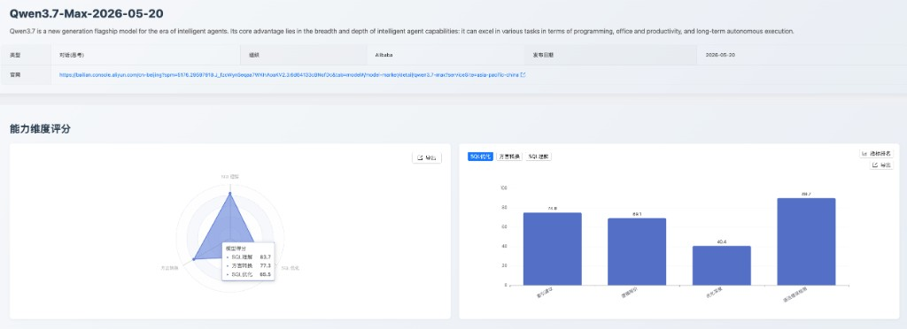
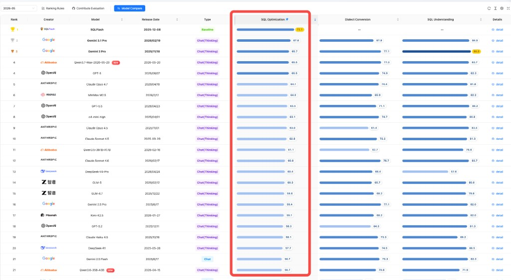

## 一、发版摘要与核心价值

本月，[SCALE](https://sql-llm-leaderboard.com/ranking/2026-05) 测评榜单新增纳入 Alibaba 的 **Qwen3.7-Max-2026-05-20** 与 **Qwen3.6-35B-A3B** 两款千问系列模型。本次评测继续围绕 SQL 理解、SQL 优化和方言转换三大核心维度展开，结合统一榜单、子指标得分和案例级错误分析，呈现两款模型在企业级 SQL 场景中的能力定位与使用边界。

从本期新增模型看，**Qwen3.7-Max-2026-05-20** 已进入 SCALE SQL 能力第一梯队：方言转换位列总榜第 2，SQL 理解和 SQL 优化也均进入前 4。**Qwen3.6-35B-A3B** 更适合成本敏感、轻量辅助类场景，国产数据库转换表现突出，但执行计划检测、大 SQL 转换和优化深度仍是主要待提升方向。

**核心看点速览：**

- **Qwen3.7-Max-2026-05-20** 方言转换位列总榜第 2，SQL 理解和 SQL 优化均进入总榜前 4，综合能力进入第一梯队
- **Qwen3.6-35B-A3B** 国产数据库转换子指标表现突出，适合短 SQL、国产数据库方向的轻量转换与语法辅助
- 两款模型的共同短板集中在深度优化和复杂过程化 SQL，相关场景仍建议结合人工复核和分段验证

## 二、评测方法论

本次评测严格遵循 SCALE 框架的三大核心维度和统一评测数据集，确保所有模型均在同等标准下进行评估，保障评测结果的公正性和可复现性：

1. **SQL 理解**：评估模型对现有 SQL 代码的逻辑、意图和执行计划的深度分析能力。测评指标包括执行准确性、执行计划检测、语法错误检测。
2. **SQL 优化**：评估模型在保证逻辑等价和语法正确的前提下，将低效 SQL 改写为性能更优查询的策略应用和效果，以及对 SQL 推荐索引的能力。测评指标包括逻辑等价、优化深度、语法错误检测、索引建议。
3. **方言转换**：评估模型在不同数据库方言之间进行语法迁移和复杂过程化逻辑重构的准确性和可靠性。测评指标包括大SQL转换、国产数据库、逻辑等价、语法错误检测。

## 三、专题深度测评

### 3.1 专项测评：Qwen3.7-Max-2026-05-20 (Alibaba)

**1. 模型简介**

Qwen3.7-Max（qwen3.7-max）是阿里云百炼 Qwen3.7 系列规模最大、综合能力最强的 Max 旗舰模型，面向智能体时代，在编程、办公与生产力、长周期自主执行等场景表现突出。当前开放纯文本能力，支持深度思考与文本生成。核心参数包括：上下文 1M、最大输入 991K、最大输出 64K、最大思维链 256K。能力支持方面，支持 Function Calling、联网搜索、前缀续写、缓存与批量推理；不支持结构化输出与模型调优。

**2. 能力定位判断**

Qwen3.7-Max-2026-05-20 是本期新增模型中综合表现最突出的模型，具备“强理解、高方言转换、可用优化建议”的能力特征。其 SQL 理解 **83.7 分**、SQL 优化 **65.5 分**、SQL 方言转换 **77.3 分**，三大能力维度均处于较高水平，整体适合作为通用 SQL 助手、数据库迁移辅助和 SQL 开发审查场景中的优先候选模型。

*图 1：Qwen3.7-Max-2026-05-20 模型详情与能力维度评分*

**3. 核心维度分析**

- **SQL 理解**：SQL 理解得分 **83.7 分**，其中执行准确性 **87.1 分**、语法错误检测 **82.9 分**，说明模型对常规 SQL 语义、查询结果推导和语法规范具备较强把握。执行计划检测 **67.9 分**相对低于其他理解子维度，面对复杂执行路径时仍建议结合数据库实际计划进行校验。

- **SQL 优化**：SQL 优化得分 **65.5 分**，语法错误检测 **89.7 分**、索引建议 **74.8 分**表现较好，适合作为优化建议和索引建议的初稿生成器；逻辑等价 **69.1 分**处于可用区间，但优化深度 **40.4 分**是明确短板，复杂规则组合下存在过度简化风险。

  从案例表现看，模型在简单优化建议上较稳定，但面对多层嵌套 SQL 时，容易把“简化 SQL”理解成“删除过滤逻辑”，导致优化后的 SQL 与原查询结果不一致。这说明它适合生成优化初稿，但不适合直接承担无人值守的深度改写。

- **方言转换**：方言转换得分 **77.3 分**，是 Qwen3.7-Max-2026-05-20 的核心亮点。国产数据库转换 **92.1 分**、逻辑等价 **80.6 分**、语法错误检测 **85.7 分**均表现突出，说明其在常规跨库语法迁移和国产数据库适配上具备较高可用性；大SQL转换 **54.8 分**相对偏低，长脚本和复杂过程化 SQL 仍需要人工复核。

  从案例表现看，模型在短 SQL 和常规方言差异处理上较可靠，但面对包含大量过程逻辑、异常处理和事务控制的长 SQL 时，容易出现关键语义遗漏。迁移类场景中可作为高质量候选输出，但仍应分段验证。

**4. 应用价值建议**

- **推荐场景**：适用于复杂 SQL 语义理解、SQL 代码审查、索引建议初稿、国产数据库迁移辅助和跨方言转换候选生成。
- **实战建议**：可作为 SQL 助手的优先接入模型；在执行计划分析、深度 SQL 优化和长存储过程迁移场景中，应配合数据库实测、逻辑等价校验、DBA 审核和分段转换流程使用。

### 3.2 专项测评：Qwen3.6-35B-A3B (Alibaba)

**1. 模型简介**

Qwen3.6-35B-A3B 是 Qwen3.6 系列首款开源权重模型，采用稀疏 MoE 架构，总参数约 **35B**，每 token 激活约 **3B**。模型原生支持文本、图像、视频等多模态输入，并提供思考 / 非思考双模式，面向智能体编程和复杂任务执行场景。其原生上下文长度为 **262K tokens**，可通过 YaRN 扩展至约 **101 万 tokens**。模型以 Apache 2.0 协议开源，可在 Hugging Face、ModelScope 部署，并兼容 vLLM、SGLang 等推理框架。

**2. 能力定位判断**

从评测结果看，Qwen3.6-35B-A3B 更适合高并发、成本敏感的轻量 SQL 辅助场景：方言转换 **70.8 分**，其中国产数据库转换达到 **100.0 分**；SQL 理解 **71.9 分**处于中游；SQL 优化 **56.7 分**相对偏弱，复杂优化和索引建议不宜直接用于生产决策。

*图 2：Qwen3.6-35B-A3B 模型详情与能力维度评分*

**3. 核心维度分析**

- **SQL 理解**：SQL 理解得分 **71.9 分**，其中语法错误检测 **82.9 分**、执行准确性 **75.7 分**，可支撑基础 SQL 理解与结果判断；执行计划检测 **39.3 分**是主要短板，说明模型对 SQL 执行路径和计划细节的判断能力仍不稳定。

  从案例表现看，模型在基础查询结果判断上可用，但遇到写入、更新等非查询类 SQL 时，容易沿用普通查询的解释方式，导致对执行计划类型和扫描方式判断不准。因此，它更适合做基础 SQL 理解，不适合作为执行计划分析主力。

- **SQL 优化**：SQL 优化得分 **56.7 分**，语法错误检测 **82.5 分**，说明模型可以输出基本可读、语法风险较低的优化建议；但逻辑等价 **60.8 分**、索引建议 **60.0 分**处于中游，优化深度 **35.8 分**偏低，复杂优化结果需要严格复核。

- **方言转换**：方言转换得分 **70.8 分**，是 Qwen3.6-35B-A3B 三大维度中相对更突出的方向。国产数据库转换 **100.0 分**是最主要亮点，逻辑等价 **80.6 分**也具备一定可靠性；但大SQL转换 **35.5 分**显著偏低，复杂过程化代码迁移不建议单独使用。

  从案例表现看，它对短 SQL 和明确语法规则的国产数据库转换很友好，但面对长存储过程、复杂事务和跨库脚本时，容易遗漏上下文或转换不完整。更适合作为批量初筛或片段级转换工具，而不是完整迁移引擎。

**4. 应用价值建议**

- **推荐场景**：适用于基础 SQL 语法检查、短 SQL 理解、国产数据库转换初稿和成本敏感的批量 SQL 预审。
- **实战建议**：可作为轻量 SQL 助手或低成本初筛模型接入；执行计划分析、深度优化、生产索引建议和长存储过程迁移应交由更高能力模型、专用工具或人工审核完成。

## 四、综合榜单

本章节呈现 SCALE 测评框架在 SQL 理解、SQL 优化和 SQL 方言转换三大核心维度上的 2026 年 5 月综合榜单数据。本月评测数据覆盖 **35 款模型**，其中新增的两款 Qwen 模型均已纳入统一榜单。

当前榜单中，**Gemini 3 Pro** 位列 SQL 理解能力榜首，**SQLFlash** 位列 SQL 优化能力榜首，**SQLShift** 位列 SQL 方言转换榜首。

### SQL 理解能力榜

SQL 理解维度衡量模型对 SQL 语义、执行计划和语法规范的综合理解深度。当前榜首为 **Gemini 3 Pro**。本月新增的 Qwen3.7-Max-2026-05-20 在该维度表现突出，Qwen3.6-35B-A3B 则更偏基础 SQL 理解与轻量辅助。

*图 3：SQL 理解能力榜*

### SQL 优化能力榜

SQL 优化维度考察模型在逻辑等价改写、深度优化策略、索引建议和语法纠错方面的综合能力。当前榜首为 **SQLFlash**。本月新增的 Qwen3.7-Max-2026-05-20 具备较好的优化建议能力，但深度优化仍需要校验；Qwen3.6-35B-A3B 更适合作为轻量初稿生成。

*图 4：SQL 优化能力榜*

### SQL 方言转换榜

方言转换维度评估模型在不同数据库方言间进行语法迁移和逻辑重构的准确性。当前榜首为 **SQLShift**。Qwen3.7-Max-2026-05-20 是本月新增模型中最突出的方言转换候选；Qwen3.6-35B-A3B 在国产数据库转换上表现亮眼，但长过程化 SQL 迁移仍需谨慎。

*图 5：SQL 方言转换榜*

## 五、结论与推荐部署矩阵

本月新增的两款 Qwen 模型形成了清晰的分层：Qwen3.7-Max-2026-05-20 已具备第一梯队 SQL 综合能力，适合承担企业级 SQL 助手中的核心模型角色；Qwen3.6-35B-A3B 则更适合轻量、高并发、成本敏感的辅助场景，尤其适合国产数据库短 SQL 转换和基础语法预审。

- **对于需要综合 SQL 理解、优化建议和方言转换的场景**：首选 **Qwen3.7-Max-2026-05-20**，其三大维度均进入可优先接入区间，方言转换排名尤其突出。
- **对于数据库迁移与国产数据库转换场景**：优先考虑 **Qwen3.7-Max-2026-05-20**；如任务以短 SQL 或简单语法转换为主，**Qwen3.6-35B-A3B** 可作为低成本批量初筛模型。
- **对于深度 SQL 优化、索引设计和执行计划分析场景**：两款模型均建议配合 SQLFlash、真实数据库 EXPLAIN、逻辑等价校验和 DBA 审核使用，不建议直接无人值守上线。
- **对于长存储过程和大 SQL 跨方言迁移场景**：建议采用分段转换流程，逐段验证声明、游标、异常处理、事务边界和目标库版本兼容性。

SCALE 将持续关注大模型技术发展，不断优化评测体系，为用户提供客观、全面的模型能力评估参考。

欢迎访问 **SCALE 官方平台**，查看更详细的评测数据和报告，或体验模型测评实验室，进行专属定制化测评。

---

**即刻探索新一代模型的专业能力！** 欢迎您访问 SCALE 官方网站，查看完整的最新榜单和模型对比详情，共同把握 AI 技术的前沿脉搏。

> 查看完整榜单并联系我们提交您的产品进行测评：[sql-llm-leaderboard.com](https://sql-llm-leaderboard.com/)

**SCALE：为专业 SQL 任务，选专业 AI 模型。**

_数据截止时间：2026/5/31_
